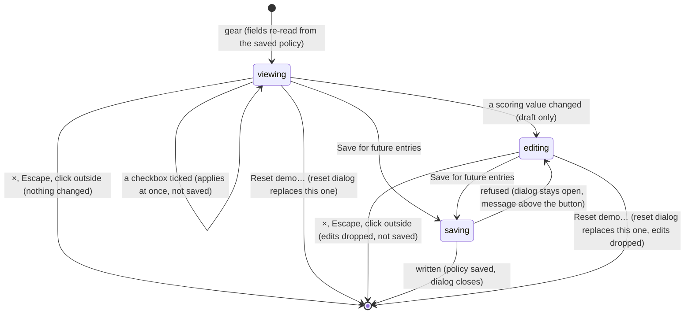

# Arena settings

## Summary

Arena settings is the page's one settings dialog. It holds two kinds of setting that behave very differently:
- **Two presentation switches**, **Reduced motion** and **Lower graphics quality**, which apply the moment they are ticked and are never saved.
- **The host's scoring policy** for counted entries, which is edited as a draft and written to this browser's save only by **Save for future entries**. Each opening starts the draft from the saved policy.

It also offers **Export local save**, the way into [Reset demo](reset-demo.md), and, once the Watch stage has measured itself, a **Performance snapshot**.

The dialog opens from the gear button at the right of the header, named "Arena settings" for screen readers, on any main tab. Its title reads **Arena settings**, shown in capitals, and its description reads **Prototype defaults. Changes apply to future entries.** It cannot be reached from the clean spectator view, which hides the header, or while the setup dialog or **Install character** covers the gear.

This document owns the dialog. What the policy's values mean for club points, the allowance and the schedule belongs to [points and entries](points-and-entries.md). What the two switches do on each stage belongs to [the stage](../foundations/stage.md#reduced-motion-and-lower-graphics-quality). What an export contains belongs to [this browser's save](../foundations/saved-data.md#exports).

## The simple case

The host wants a win to be worth 5 points. They click the gear. The dialog shows:
- **Reduced motion**, ticked only if the operating system asks for reduced motion
- **Lower graphics quality**, unticked
- **Host · prototype scoring**, with four number fields: **Win** 3, **Draw** 1, **Loss** 0 and **Entries / User** 4
- **Counted entries enabled**, ticked

They change **Win** to 5 and press **Save for future entries**. The dialog closes, and nothing else visibly changes; the Watch stage is not rebuilt. Points already awarded stay as they were, and a contest already locked keeps the policy it was locked under. The next counted entry to be locked awards 5 for a win, and **House rules** now reads "Win 5, draw 1, loss 0." with a new policy name at the end.

If a value is refused, for example a **Win** of 101, the dialog stays open and shows the reason above **Save for future entries**: "Use whole numbers from 0 to 100."

Ticking **Reduced motion** or **Lower graphics quality** needs no save. The change applies at once and lasts until the page is reloaded.

## The dialog, top to bottom

| Control | What it does | Saved |
| --- | --- | --- |
| **Reduced motion** | Removes contact effects and camera punch and shake in Watch. In Play it removes camera punches and shakes, impact effects, and squash and stretch, applied to a running match at once without restarting it. The collection uses reduced clips ([the stage](../foundations/stage.md#reduced-motion-and-lower-graphics-quality)). | No. Each visit starts from the operating system's setting. |
| **Lower graphics quality** | Rebuilds the Watch stage and removes its contact effects and camera punch and shake. It also rebuilds The collection's preview, which has no such effects, so the rebuild is all that shows there. Play ignores it. | No. Each visit starts unticked. |
| **Win**, **Draw**, **Loss**, **Entries / User** | Number fields holding the draft points for a win, a draw and a loss, and the allowance. **Entries / User** allows at most 4. | Only by **Save for future entries**. |
| **Counted entries enabled** | Part of the draft. When saved unticked, no counted entry can be started, and **entries left** reads 0. | Only by **Save for future entries**. |
| The note | "Ownership, scheduled opponents, and supported assets are required. Historical points retain their saved policy. Existing playback stays unchanged." | Not applicable: text only. |
| The error line | Appears only after a refused save, just above **Save for future entries**, with the reason in plain words. | Not applicable: text only. |
| **Save for future entries** | Checks the draft and writes it as the scoring policy, then closes the dialog. | Yes. |
| **Export local save** | Downloads `clubhouse-save.json`, the whole stored save. If the save cannot be read, downloads its stored text as `clubhouse-save-unreadable.json`. The dialog stays open. | Not applicable: it reads the save. |
| **Reset demo…** | Replaces this dialog with **Reset the local demo?** in the same window. | Not applicable. |
| **Performance snapshot** | A collapsed section with the Watch stage's last measured figures. Present only once the Watch stage has reported. | Not applicable. |

## The interaction, event by event

The action narrated here is changing the host scoring policy and saving it. The two checkboxes are separate one-click actions: each applies at once and completes on the spot, and neither touches the draft.

### Starting

The gear opens the dialog over whatever view is showing. Nothing behind it pauses: Watch playback and a Play match keep running ([the app shell](../foundations/app-shell.md#dialogs)).

Each time the dialog opens, the scoring fields re-read this browser's save. The four numbers and **Counted entries enabled** start from the saved policy, including one another tab saved moments ago. Edits left unsaved at an earlier visit are gone. If the save cannot be read, the fields keep what they last showed in this visit: the default policy unless something was typed.

The checkboxes show the current state of the two switches. An error line from a refused save is cleared when the dialog is closed, so a later visit shows none (see [edge cases](#edge-cases)). The **Performance snapshot** is there only if the Watch stage has reported at least once since the page loaded.

### Backing out at once

Closing with ×, Escape or a click outside before touching the scoring section changes nothing. A ticked checkbox is not undone by closing, because it has already applied. **Export local save** and opening the snapshot leave nothing to undo either.

### Committing

The dialog is committed from the first edit that makes the draft differ from the saved policy: typing in a field, using a field's arrows, or toggling **Counted entries enabled**. From then on:
- **Only the draft changes.** The club points chip, **House rules**, the setup dialog and every contest keep using the saved policy.
- **Nothing is checked yet.** A field takes any number while typing; the check happens on save.
- **Nothing marks the dialog as unsaved.** There is no indicator and no warning on closing, and closing drops the edits.

The dialog always opens uncommitted, because it starts from the saved policy. While it stays open, though, another tab can save a different policy, and the open fields do not follow it. They then differ from the save without saying so.

### While committed

Each keystroke or arrow click updates the draft:
- **The arrows** step by 1 and stop at 0 and 100, or at 0 and 4 for **Entries / User**.
- **Typing** can go beyond these limits, or include a decimal.
- **Clearing a field** makes it 0 at once, because an empty field is read as zero.

The two checkboxes still apply at once. **Export local save** exports the *saved* policy, not the draft. **Reset demo…** is still available; it drops the unsaved edits.

### Resolving

**Save for future entries** sends the whole draft, all five values:

- **The check.** Each of the four numbers must be a whole number from 0 to 100, and **Entries / User** can be at most 4. Nothing else is checked: a loss may be worth more than a win, and an allowance of 0 is accepted.
- **Written.** The draft becomes the scoring policy in one protected write ([this browser's save](../foundations/saved-data.md#committing)). If the values are the same as the saved policy's, the policy keeps its name. New values give the name "club-points-" followed by eight characters worked out from the values, which **House rules** shows. The dialog closes, and the draft now equals the saved policy.
- **Refused.** The dialog stays open with the draft untouched. The reason appears inside the dialog, just above **Save for future entries**, as an alert, with no "Error:" prefix, and the number fields are marked invalid. The messages are:
  - **Use whole numbers from 0 to 100.**
  - **Entries / user can be at most 4, one for each scheduled pairing.**
  - the save's own reason when it cannot be read, such as **The local save did not pass its integrity check.**
  - the browser's own message when storage refuses the write

  The message clears when the next save is tried. Closing the dialog also clears it.

After a successful save:
- **Counted entries locked from now on** award the new points and are checked against the new allowance and switch.
- **The chip's entries left** is recomputed at once from the new allowance and switch.
- **Awards already written** keep the policy they were locked under. That includes a counted entry loaded behind the dialog and not yet revealed.
- **House rules** shows the new values and name. Standings quotes no values, so it does not change.
- **The stage is left alone.** Neither the Watch stage nor the collection preview rebuilds.

What each value means is in [points and entries](points-and-entries.md).

> Technical note: the name is a hash of the five values alone. The same values always give the same name, but the default policy's name, `club-points-v1`, is kept only until its values first change. Changing **Win** to 5 and later back to 3 leaves a hashed name, not `club-points-v1`.

## The performance snapshot

**Performance snapshot** is a collapsed section at the bottom of the dialog. It exists only after the Watch stage has reported its figures, which it does about every three seconds while it is drawing. The page opens on Watch, so it is normally present within a few seconds of arriving. Opened, it shows:

- "{N} fps · {N} ms mean frame interval"
- "{N} draw calls · {N} ms arena asset load"
- "Graphics memory estimate: {N} MB. Frame interval measured in this browser."

| Figure | What it measures |
| --- | --- |
| fps and mean frame interval | Frames drawn by the Watch stage since its previous report, about three seconds |
| draw calls | Graphics draw calls in the most recent frame |
| arena asset load | Milliseconds from the Watch stage starting to build until it was ready |
| graphics memory estimate | Every loaded image counted at four bytes per pixel, in megabytes |

Only the Watch stage reports. The Play stage and The collection's preview never do. Leaving Watch keeps the last figures, unchanged and with no sign of their age, until Watch reports again. With the dialog open over Watch, the figures refresh in place. The section is closed again every time the dialog reopens.

> Technical note: each rebuild of the Watch stage restarts the measurement, and its first report usually covers only the first frame after loading. If the draw-call counter cannot be installed, draw calls read 0.

## Modifiers

| Modifier | Set at the start | Changed while committed |
| --- | --- | --- |
| Input device | A mouse, touch or the keyboard. Every control is reachable with Tab. Space toggles a checkbox, and the Up and Down arrow keys step a field. Enter in a field does nothing; only the button saves. Play's game keys and controllers do nothing in the dialog. | No effect. The draft is the same however it was edited. |
| Event and action combinations | One policy covers all four Watch sports, and the allowance counts counted entries across all of them. The selected Watch event and Play event make no difference to the dialog. | No effect. |
| Contest kind | The policy applies only to counted entries locked after it is saved. Exhibitions never use it, and Play never reads it. A counted entry already locked, including one playing behind the dialog, keeps the policy it was locked under. | Not applicable: editing the draft changes no contest. |
| Character card | No effect. Every card, built-in or installed, is scored under the same policy. | No effect. |
| Presentation settings | The dialog holds **Reduced motion** and **Lower graphics quality**; their effects are in [the stage](../foundations/stage.md#reduced-motion-and-lower-graphics-quality). The clean spectator view hides the gear. The two sound switches are not here. | Toggling either checkbox never touches the draft, and saving the draft never touches them. |
| Screen size and orientation | The dialog is 650 px wide, or the window width minus 36 px if that is less, and at most 92% of the window height; taller content scrolls. At 600 px wide and below, the four fields sit in two columns and the title is smaller. | Resizing reflows the dialog. The draft and the checkboxes are kept. |
| Saved state | On a **fresh save** the fields show 3, 1, 0 and 4 with **Counted entries enabled** ticked. Otherwise they show the saved policy. A contest waiting to resume and the entries left make no difference. With an **unreadable save** the fields show the defaults, **Save for future entries** is refused with the save's own reason, and **Export local save** downloads the stored text as `clubhouse-save-unreadable.json`. A character library that will not open makes no difference here. | Another tab's policy saved while the dialog is open does not reach the open fields, and saving here then overwrites it. Reopening the dialog shows it. |

## Cancel and interrupt

| Event | Before committing | While committed |
| --- | --- | --- |
| Escape or click outside | Closes the dialog. Nothing changes; a ticked checkbox stays applied. | Closes the dialog and drops the unsaved edits. Reopening shows the saved policy. If a save is already under way, it still finishes. |
| Pause or resume | Not applicable: the dialog has no pause, and the pause controls behind it are covered. Watch playback and a Play match keep running, and a controller's Menu or Options button can still pause Play. | Not applicable, as before committing. The draft is unaffected. |
| Repeated or rapid input | Ticking **Lower graphics quality** repeatedly rebuilds the Watch stage each time. Ticking **Reduced motion** repeatedly switches a running Play match's effects each time, without restarting it. Each **Export local save** click downloads another copy. | A second click on **Save for future entries** before the dialog has closed writes the same values again, under the same name. Mashing a field's arrows stops at 0 or 100, or at 4 for **Entries / User**. |
| A panel opens on top | Only **Reset demo…** can replace this dialog; the gear, footer and tabs are covered. | The same. The unsaved edits are dropped; reopening Arena settings shows the saved policy, which is the default one if the reset went ahead. |
| Navigating away | The tabs and logo are covered, so the player must close the dialog first. A browser agent's `configure_arena_event` can switch the view to Watch behind it when no recording is loaded and Play is not showing. | The open fields keep their edits while the agent tool changes the view behind them. Closing the dialog to use the tabs or the logo drops them. |
| Forced finish | Not applicable: nothing in the dialog is timed. A Watch contest can reach its result behind it. | Not applicable. |
| Focus leaves the game | No effect on the dialog. Hiding the browser tab stops the Watch clock and pauses a Play match behind it, and the snapshot stops refreshing. | No effect. The draft is kept. |
| Reload, close, or back/forward cache | The dialog is gone and the page reopens on the Watch lobby. **Reduced motion** returns to the operating system's setting and **Lower graphics quality** to off. | The unsaved draft is lost; the dialog next shows the saved policy. A save caught mid-write is either fully written or not at all ([this browser's save](../foundations/saved-data.md#committing)). |
| Settings or saved data change underneath | Another tab's policy save or reset reaches the chip, **House rules** and the setup dialog here. It reaches the fields the next time the dialog opens, but not while it is open. A reset in this tab replaces the policy with the default one. | The same. Saving from this tab afterwards puts this tab's values back; the last save wins. |
| Graphics or storage failure | A lost graphics context pauses Watch behind the dialog and shows the error box there; the dialog is unaffected. | If storage refuses the write, or the save cannot be read, the dialog stays open with the draft and shows the reason above **Save for future entries**. |
| Input device changes | No effect. A controller disconnecting pauses a Play match behind the dialog. | No effect. |

After any interrupt, the next opening shows the saved policy, not the unsaved edits.

## Interactions with other systems

**Points and the ledger.** The policy decides what future counted entries award and how many each demo user may play. Past awards keep the policy they were locked under, so a save never rewrites the ledger. The chip's **entries left** follows the new allowance at once, and reads 0 when counted entries are switched off ([points and entries](points-and-entries.md)).

**Saved data and recovery.** The policy is part of the Arena save and is written in one protected write, serialized with other tabs. The two checkboxes and the draft are never saved. **Export local save** downloads the whole stored save, with every recording and award and the contest waiting to resume, whatever is loaded. An unreadable save downloads as its stored text, `clubhouse-save-unreadable.json`, and **Reset demo…** here is one of the two ways into the reset that repairs it ([this browser's save](../foundations/saved-data.md#exports)).

**Watch and Play separation.** The policy is Watch-only; Play never reads it. **Reduced motion** is shared by Watch, Play and The collection. **Lower graphics quality** applies to Watch and The collection only.

**Devices and players.** No interaction. Opening the dialog over a Play match takes focus from keyboard players; controller, touch and AI players carry on ([the input model](../foundations/input-model.md)).

**Sound.** The dialog has no sound setting, and Watch sound keeps playing behind it. Toggling **Reduced motion** during a Play match does not restart the match, so Play sound and its button are unaffected ([the match shell](../play/match-shell.md)).

**Reduced motion and graphics quality.** This dialog is where both are set. What they change is owned by [the stage](../foundations/stage.md#reduced-motion-and-lower-graphics-quality).

**Accessibility.** The gear is a button named "Arena settings". The dialog has a title and description, and takes focus when it opens. The checkboxes are named by their labels. The fields are named by their label text, which is lowercase in the page ("win", "draw", "loss", "Entries / user") and only looks capitalized. A refused save's message is inside the dialog with `role="alert"`, so it is announced, and all four number fields are marked invalid (`aria-invalid`) while it shows. The snapshot is a standard disclosure (see [accessibility](../cross-cutting/accessibility.md)).

**Installed characters.** No interaction. Installed cards play counted entries under the same policy.

**Multiple tabs.** Each tab has its own checkboxes and its own draft. A policy saved in one tab reaches the others within moments: their chip, **House rules** and setup dialog follow it, and their Arena settings fields show it the next time the dialog opens. Only a dialog that was already open keeps its old values, and a save from it puts them back. Another tab's save does not rebuild this tab's Watch stage.

**Agent tools.** Neither tool reads or changes these settings. `read_arena` reports the revealed leaderboard, which a policy change does not alter. `configure_arena_event` can change the view behind the open dialog without touching the draft, except while Play is showing, when it refuses ([agent tools](../cross-cutting/agent-tools.md)).

## Edge cases

- **The field labels** read **Win**, **Draw**, **Loss** and **Entries / User**, with a capital U, because the page capitalizes every word of them.
- **The description** "Changes apply to future entries" is true only of the scoring section. The two checkboxes apply at once, to everything on screen.
- **Unchanged values.** Pressing **Save for future entries** without changing anything still writes, but the policy keeps its name.
- **Lowering the allowance** below the entries a demo user has already used shows **0 entries left**. Nothing already played is taken back.
- **An allowance above 4** is refused with "Entries / user can be at most 4, one for each scheduled pairing." Each demo user has only four scheduled pairings.
- **A lingering error.** A refused save's message stays in the dialog until the next save is tried or the dialog is closed. Pressing **Reset demo data** or **Validate & attach** also clears it.
- **Saving leaves the stage alone.** A save does not rebuild the Watch stage or the collection preview, in this tab or in others, because the shown cards' mappings did not change ([the stage](../foundations/stage.md#loading-and-rebuilding)).
- **Reduced motion follows the operating system only at load.** Changing the system preference during a visit does not tick or untick the box.
- **The export is the whole stored save.** `clubhouse-save.json` holds every recording and every award, including a contest loaded and not yet complete or waiting to resume, and names the contest waiting to resume. It is the save's parsed contents, with no checksum, and cannot be imported ([this browser's save](../foundations/saved-data.md#exports)).
- **An unreadable save.** **Save for future entries** is refused with the save's own reason, shown in the dialog, such as **The local save did not pass its integrity check.** **Export local save** downloads the stored text unchanged as `clubhouse-save-unreadable.json`. The recovery box under the header and **Reset demo…** here lead to the reset that replaces it.
- **A blocked character library** no longer stops the Arena save loading, so the fields show the real policy and saving works as usual.
- **Opened from Play.** Ticking **Lower graphics quality** has no visible effect until the player returns to Watch or The collection. Ticking **Reduced motion** changes the running match's effects at once, without restarting it.

## Open questions and verification

- Read from `components/arena/Panels.tsx` (the settings panel), `components/arena/Game.tsx` (`readSave`, `exportSave`, the settings-opening effect), `lib/arena/persistence.ts` (`updatePolicy`, `MAX_ALLOWANCE`), `components/arena/ArenaStage.tsx` and `lib/arena/engine/scenes/ArenaScene.ts` (lines 606–632). `scripts/production-smoke.mjs` opens the dialog by the name "Arena settings" and checks that **Export local save** downloads a save with no waiting contest after **Skip to result**. The fixed behaviour below is read from the code; the scripted pass of 2026-09-24 ran before these fixes.
- **Fixed: a refused save was invisible (B-09).** The message now shows inside the dialog, above **Save for future entries**, with no "Error:" prefix.
- **Fixed: a stale draft could undo another tab's policy (B-21).** Each opening now re-reads the saved policy. A dialog left open while another tab saves can still put its older values back.
- **Fixed: every save re-read rebuilt the Watch stage (B-12).** The stage now rebuilds only when the shown cards' mappings change.
- **Fixed: the policy name changed on every save (B-21).** The name now follows the values. Whether returning to the default values should restore `club-points-v1` is a product call.
- **Fixed: the export left out unfinished contests (B-11)**, and an unreadable save now exports as its stored text (B-03).
- **Fixed: an allowance above the schedule (B-32).** **Entries / User** is now capped at 4.
- **Fixed: the lingering error line (B-09).** The settings message now clears when the dialog is closed, so it does not reappear when the dialog is reopened.
- **An empty field showing 0** is how the page reads an empty number field. It has not been tried in each browser.
- **The first snapshot after a rebuild** covering a single frame, and whether the figures keep changing after a lost graphics context, have not been measured.

Verified against Will-You-Be-My-Hero-Arena commit `364e3c1`
