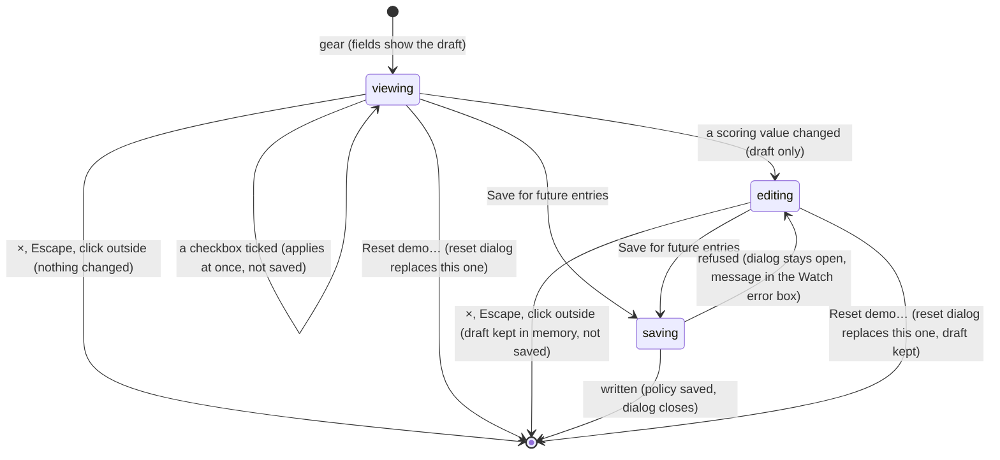

# Arena settings

## Summary

Arena settings is the page's one settings dialog. It holds two kinds of setting that behave very differently:
- **Two presentation switches**, **Reduced motion** and **Lower graphics quality**, which apply the moment they are ticked and are never saved.
- **The host's scoring policy** for counted entries, which is edited as a draft and written to this browser's save only by **Save for future entries**.

It also offers **Export local save**, the way into [Reset demo](reset-demo.md), and, once the Watch stage has measured itself, a **Performance snapshot**.

The dialog opens from the gear button at the right of the header, named "Arena settings" for screen readers, on any main tab. Its title reads **Arena settings**, shown in capitals, and its description reads **Prototype defaults. Changes apply to future entries.** It cannot be reached from the clean spectator view, which hides the header, or while the setup dialog or **Install character** covers the gear.

This document owns the dialog. What the policy's values mean for club points, the allowance and the schedule belongs to [points and entries](points-and-entries.md). What the two switches do on each stage belongs to [the stage](../foundations/stage.md#reduced-motion-and-lower-graphics-quality). What an export contains belongs to [this browser's save](../foundations/saved-data.md#exports).

## The simple case

The host wants a win to be worth 5 points. They click the gear. The dialog shows:
- **Reduced motion**, ticked only if the operating system asks for reduced motion
- **Lower graphics quality**, unticked
- **Host · prototype scoring**, with four number fields: **Win** 3, **Draw** 1, **Loss** 0 and **Entries / User** 4
- **Counted entries enabled**, ticked

They change **Win** to 5 and press **Save for future entries**. The dialog closes. Nothing else visibly changes: points already awarded stay as they were, and a contest already locked keeps the policy it was locked under. The next counted entry to be locked awards 5 for a win, and **House rules** now reads "Win 5, draw 1, loss 0." with a new policy name at the end.

Ticking **Reduced motion** or **Lower graphics quality** needs no save. The change applies at once and lasts until the page is reloaded.

## The dialog, top to bottom

| Control | What it does | Saved |
| --- | --- | --- |
| **Reduced motion** | Calmer stage effects in Watch, Play and The collection. Restarts a running Play match. | No. Each visit starts from the operating system's setting. |
| **Lower graphics quality** | Rebuilds the Watch stage and removes its contact effects and camera punch and shake. It also rebuilds The collection's preview, which has no such effects, so the rebuild is all that shows there. Play ignores it. | No. Each visit starts unticked. |
| **Win**, **Draw**, **Loss**, **Entries / User** | Number fields holding the draft points for a win, a draw and a loss, and the allowance. | Only by **Save for future entries**. |
| **Counted entries enabled** | Part of the draft. When saved unticked, no counted entry can be started. | Only by **Save for future entries**. |
| The note | "Ownership, scheduled opponents, and supported assets are required. Historical points retain their saved policy. Existing playback stays unchanged." | Not applicable: text only. |
| **Save for future entries** | Checks the draft and writes it as the scoring policy, then closes the dialog. | Yes. |
| **Export local save** | Downloads `clubhouse-save.json`. The dialog stays open. | Not applicable: it reads the save. |
| **Reset demo…** | Replaces this dialog with **Reset the local demo?** in the same window. | Not applicable. |
| **Performance snapshot** | A collapsed section with the Watch stage's last measured figures. Present only once the Watch stage has reported. | Not applicable. |

## The interaction, event by event

The action narrated here is changing the host scoring policy and saving it. The two checkboxes are separate one-click actions: each applies at once and completes on the spot, and neither touches the draft.

### Starting

The gear opens the dialog over whatever view is showing. Nothing behind it pauses: Watch playback and a Play match keep running ([the app shell](../foundations/app-shell.md#dialogs)).

The scoring fields do not re-read the save when the dialog opens. They show the *draft*, which:
- starts as the saved policy when the page first loads this browser's save
- becomes the saved policy again after **Save for future entries** succeeds, and the default policy after a reset in this tab
- otherwise keeps whatever was last entered, even after the dialog was closed without saving, until the page is reloaded

On a first opening the fields match the save. The checkboxes show the current state of the two switches. The **Performance snapshot** is there only if the Watch stage has reported at least once since the page loaded.

### Backing out at once

Closing with ×, Escape or a click outside before touching the scoring section changes nothing. A ticked checkbox is not undone by closing, because it has already applied. **Export local save** and opening the snapshot leave nothing to undo either.

### Committing

The dialog is committed from the first edit that makes the draft differ from the saved policy: typing in a field, using a field's arrows, or toggling **Counted entries enabled**. From then on:
- **Only the draft changes.** The club points chip, **House rules**, the setup dialog and every contest keep using the saved policy.
- **Nothing is checked yet.** A field takes any number while typing; the check happens on save.
- **Nothing marks the dialog as unsaved.** There is no indicator and no warning on closing.

The dialog can open already committed. That happens when an earlier visit left unsaved edits, or when another tab has since saved a different policy. Either way the fields show the draft, not the saved policy, and say nothing about the difference.

### While committed

Each keystroke or arrow click updates the draft:
- **The arrows** step by 1 and stop at 0 and 100.
- **Typing** can go beyond both, or include a decimal.
- **Clearing a field** makes it 0 at once, because an empty field is read as zero.

The two checkboxes still apply at once. **Export local save** exports the *saved* policy, not the draft. **Reset demo…** is still available; the draft survives it unless the reset goes ahead.

### Resolving

**Save for future entries** sends the whole draft, all five values:

- **The check.** Each of the four numbers must be a whole number from 0 to 100. Nothing else is checked: a loss may be worth more than a win, and an allowance of 0 is accepted.
- **Written.** The draft becomes the scoring policy in one protected write ([this browser's save](../foundations/saved-data.md#committing)). The policy gets a new name, "club-points-" followed by eight characters, which **House rules** shows. The dialog closes, and the draft now equals the saved policy.
- **Refused.** The dialog stays open with the draft untouched, and nothing inside it changes, so the button appears to do nothing. The reason goes to the error box under the Watch stage, prefixed with "Error:", for example **Error: Use whole numbers from 0 to 100.** A refused write to storage shows the browser's own message instead. That box is drawn only while the Watch tab is showing, and even then it is often below the visible part of the page, behind the dialog's backdrop. On any other tab the player sees the message only on returning to Watch.

After a successful save:
- **Counted entries locked from now on** award the new points and are checked against the new allowance and switch.
- **The chip's entries left** is recomputed at once from the new allowance.
- **Awards already written** keep the policy they were locked under. That includes a counted entry loaded behind the dialog and not yet revealed.
- **House rules** shows the new values and name. Standings' line "Counted wins earn {N} points." shows the new win value.

What each value means is in [points and entries](points-and-entries.md).

> Technical note: the new name is a hash of the draft *including the previous name*. Saving the same numbers twice therefore still gives the policy a new name each time.

## The performance snapshot

**Performance snapshot** is a collapsed section at the bottom of the dialog. It exists only after the Watch stage has reported its figures, which it does about every three seconds while it is drawing. The page opens on Watch, so it is normally present within a few seconds of arriving. Opened, it shows:

- "{N} fps · {N} ms mean frame interval"
- "{N} draw calls · {N} ms arena asset load"
- "Graphics memory estimate: {N} MB. Frame interval measured in this browser."

| Figure | What it measures |
| --- | --- |
| fps and mean frame interval | Frames drawn by the Watch stage since its previous report, about three seconds |
| draw calls | Graphics draw calls in the most recent frame |
| arena asset load | Milliseconds from the Watch stage starting to build until it was ready |
| graphics memory estimate | Every loaded image counted at four bytes per pixel, in megabytes |

Only the Watch stage reports. The Play stage and The collection's preview never do. Leaving Watch keeps the last figures, unchanged and with no sign of their age, until Watch reports again. With the dialog open over Watch, the figures refresh in place. The section is closed again every time the dialog reopens.

> Technical note: each rebuild of the Watch stage restarts the measurement, and its first report usually covers only the first frame after loading. If the draw-call counter cannot be installed, draw calls read 0.

## Modifiers

| Modifier | Set at the start | Changed while committed |
| --- | --- | --- |
| Input device | A mouse, touch or the keyboard. Every control is reachable with Tab. Space toggles a checkbox, and the Up and Down arrow keys step a field. Enter in a field does nothing; only the button saves. Play's game keys and controllers do nothing in the dialog. | No effect. The draft is the same however it was edited. |
| Event and action combinations | One policy covers all four Watch sports, and the allowance counts counted entries across all of them. The selected Watch event and Play event make no difference to the dialog. | No effect. |
| Contest kind | The policy applies only to counted entries locked after it is saved. Exhibitions never use it, and Play never reads it. A counted entry already locked, including one playing behind the dialog, keeps the policy it was locked under. | Not applicable: editing the draft changes no contest. |
| Character card | No effect. Every card, built-in or installed, is scored under the same policy. | No effect. |
| Presentation settings | The dialog holds **Reduced motion** and **Lower graphics quality**; their effects are in [the stage](../foundations/stage.md#reduced-motion-and-lower-graphics-quality). The clean spectator view hides the gear. The two sound switches are not here. | Toggling either checkbox never touches the draft, and saving the draft never touches them. |
| Screen size and orientation | The dialog is 650 px wide, or the window width minus 36 px if that is less, and at most 92% of the window height; taller content scrolls. At 600 px wide and below, the four fields sit in two columns and the title is smaller. | Resizing reflows the dialog. The draft and the checkboxes are kept. |
| Saved state | On a **fresh save** the fields show 3, 1, 0 and 4 with **Counted entries enabled** ticked. A contest waiting to resume and the entries left make no difference. With a **corrupt save** or a character library that will not open, the save never loads: the fields show those defaults, and **Export local save** downloads a file containing only `null`. | Another tab's saved policy does not reach the fields. They keep this tab's draft, and saving here overwrites the other tab's policy. |

## Cancel and interrupt

| Event | Before committing | While committed |
| --- | --- | --- |
| Escape or click outside | Closes the dialog. Nothing changes; a ticked checkbox stays applied. | Closes the dialog and keeps the draft in memory, unsaved. Reopening shows the edited values. If a save is already under way, it still finishes. |
| Pause or resume | Not applicable: the dialog has no pause, and the pause controls behind it are covered. Watch playback and a Play match keep running, and a controller's Menu or Options button can still pause Play. | Not applicable, as before committing. The draft is unaffected. |
| Repeated or rapid input | Ticking **Lower graphics quality** repeatedly rebuilds the Watch stage each time. Ticking **Reduced motion** repeatedly restarts a Play match each time. Each **Export local save** click downloads another copy. | A second click on **Save for future entries** before the dialog has closed writes the same policy again, under the same name. Mashing a field's arrows stops at 0 or 100. |
| A panel opens on top | Only **Reset demo…** can replace this dialog; the gear, footer and tabs are covered. | The same. The draft survives the switch and is replaced by the default policy only if the reset goes ahead. |
| Navigating away | The tabs and logo are covered, so the player must close the dialog first. A browser agent's `configure_arena_event` can switch the view to Watch behind it when no recording is loaded. | The draft survives tab switches, the logo and the agent tool. Only a reload, a successful save or a reset replaces it. |
| Forced finish | Not applicable: nothing in the dialog is timed. A Watch contest can reach its result behind it. | Not applicable. |
| Focus leaves the game | No effect on the dialog. Hiding the browser tab stops the Watch clock and pauses a Play match behind it, and the snapshot stops refreshing. | No effect. The draft is kept. |
| Reload, close, or back/forward cache | The dialog is gone and the page reopens on the Watch lobby. **Reduced motion** returns to the operating system's setting and **Lower graphics quality** to off. | The unsaved draft is lost; the dialog next shows the saved policy. A save caught mid-write is either fully written or not at all ([this browser's save](../foundations/saved-data.md#committing)). |
| Settings or saved data change underneath | Another tab's policy save or reset reaches the chip, **House rules** and the setup dialog here, but not the fields, which now differ from the save. A reset in this tab replaces the draft with the default policy. | The same. Saving from this tab afterwards puts this tab's values back; the last save wins. |
| Graphics or storage failure | A lost graphics context pauses Watch behind the dialog and shows the error box there; the dialog is unaffected. | If storage refuses the write, the dialog stays open with the draft, and the browser's reason goes to the Watch error box. |
| Input device changes | No effect. A controller disconnecting pauses a Play match behind the dialog. | No effect. |

After any interrupt except a reload, the draft is still in memory and the next opening shows it.

## Interactions with other systems

**Points and the ledger.** The policy decides what future counted entries award and how many each demo user may play. Past awards keep the policy they were locked under, so a save never rewrites the ledger. The chip's **entries left** follows the new allowance at once, and keeps showing a number even when counted entries are switched off ([points and entries](points-and-entries.md)).

**Saved data and recovery.** The policy is part of the Arena save and is written in one protected write, serialized with other tabs. The two checkboxes and the draft are never saved. **Export local save** downloads the save as this tab shows it ([this browser's save](../foundations/saved-data.md#exports)).

**Watch and Play separation.** The policy is Watch-only; Play never reads it. **Reduced motion** is shared by Watch, Play and The collection. **Lower graphics quality** applies to Watch and The collection only.

**Devices and players.** No interaction. Opening the dialog over a Play match takes focus from keyboard players; controller, touch and AI players carry on ([the input model](../foundations/input-model.md)).

**Sound.** The dialog has no sound setting, and Watch sound keeps playing behind it. Toggling **Reduced motion** during a Play match restarts the match with Play sound off, although its button still reads **Mute** ([the match shell](../play/match-shell.md)).

**Reduced motion and graphics quality.** This dialog is where both are set. What they change is owned by [the stage](../foundations/stage.md#reduced-motion-and-lower-graphics-quality).

**Accessibility.** The gear is a button named "Arena settings". The dialog has a title and description, and takes focus when it opens. The checkboxes are named by their labels. The fields are named by their label text, which is lowercase in the page ("win", "draw", "loss", "Entries / user") and only looks capitalized. A refused save gives no feedback inside the dialog. The error box has `role="alert"`, but while a dialog is open the rest of the page is hidden from assistive technology, so it is unlikely to be announced. The snapshot is a standard disclosure (see [accessibility](../cross-cutting/accessibility.md)).

**Installed characters.** No interaction. Installed cards play counted entries under the same policy.

**Multiple tabs.** Each tab has its own checkboxes and its own draft. A policy saved in one tab reaches the others within moments: their chip, **House rules** and setup dialog follow it, but their Arena settings fields keep their old draft. A later save from such a tab quietly puts its older values back.

**Agent tools.** Neither tool reads or changes these settings. `read_arena` reports the revealed leaderboard, which a policy change does not alter. `configure_arena_event` can change the view behind the open dialog without touching the draft ([agent tools](../cross-cutting/agent-tools.md)).

## Edge cases

- **The field labels** read **Win**, **Draw**, **Loss** and **Entries / User**, with a capital U, because the page capitalizes every word of them.
- **The description** "Changes apply to future entries" is true only of the scoring section. The two checkboxes apply at once, to everything on screen.
- **Unchanged values.** Pressing **Save for future entries** without changing anything still writes, and still gives the policy a new name.
- **Lowering the allowance** below the entries a demo user has already used shows **0 entries left**. Nothing already played is taken back.
- **A stale error.** A refused save's message stays in the error box after a later successful save, until **Restore arena** or **Start showdown** clears it. With no recording loaded, **Restore arena** also toggles **Lower graphics quality** ([the stage](../foundations/stage.md#graphics-context-loss-and-the-error-box)).
- **Saving rebuilds the Watch stage.** A save made while the Watch tab is showing rebuilds the Watch stage behind the closing dialog, with **UNFOLDING THE ARENA…**, although nothing visual changed. A contest playing behind it carries on once the stage is ready. The same happens in other tabs that are showing Watch when they pick up the save. Every re-read of the save rebuilds the Watch stage ([the stage](../foundations/stage.md#loading-and-rebuilding)).
- **Reduced motion follows the operating system only at load.** Changing the system preference during a visit does not tick or untick the box.
- **The export is not the whole save.** Any contest loaded and not yet complete, or waiting to resume, is missing from `clubhouse-save.json` together with its awards, whether it is a counted entry or an exhibition. The file still names it as the contest waiting to resume. It has no checksum and cannot be imported ([this browser's save](../foundations/saved-data.md#exports)).
- **A save that never loaded.** With a corrupt save, **Save for future entries** is refused with the save's own error, such as **Error: The local save did not pass its integrity check.** If instead only the character library failed and the Arena save is intact, saving goes through. It writes the draft, which is the default policy unless edited, over the real policy. As a side effect the page then loads the save, and Standings, the chip and **Set up showdown** start working.
- **Opened from Play.** Ticking **Lower graphics quality** has no visible effect until the player returns to Watch or The collection. Ticking **Reduced motion** restarts the match behind the dialog.

## Open questions and verification

- Read from `components/arena/Panels.tsx` (lines 8 and 10), `components/arena/Game.tsx` (lines 22, 25, 31, 38, 42 and 55), `lib/arena/persistence.ts` (line 29), `components/arena/ArenaStage.tsx` and `lib/arena/engine/scenes/ArenaScene.ts` (lines 606–632). `scripts/production-smoke.mjs` opens the dialog by the name "Arena settings" and checks that **Export local save** downloads a save with no waiting contest after **Skip to result**. Nothing else here has been checked on the production page.
- **A refused save is invisible.** `Panels.tsx` line 10 sends the error to the page's error box (`Game.tsx` line 55), which is drawn only on the Watch tab and sits behind the dialog. The dialog itself shows nothing. This may be worth treating as a bug.
- **The draft is never refreshed from another tab.** Only this tab's own load, save and reset set it (`Game.tsx` line 25, `Panels.tsx` lines 10–11). A stale draft can silently undo another tab's policy. This may be worth treating as a bug.
- **Every save reload rebuilds the Watch stage.** `ArenaStage.tsx` lines 60–66 rebuild when `imported` changes by reference, and `Game.tsx` line 51 passes a freshly loaded list each time. This also applies to other tabs' writes, including the playback position that a playing tab writes every 2 s. That would rebuild an idle tab's Watch stage every 2 s. This looks like a bug and has not been tried.
- **The policy name changes on every save** (`persistence.ts` line 29 hashes the draft with its old name). Whether a name should identify the values is a product call.
- **An empty field showing 0** is how the page reads an empty number field. It has not been tried in each browser.
- **The error's "Error:" prefix** differs from the setup dialog's messages, which leave it off.
- **The first snapshot after a rebuild** covering a single frame, and whether the figures keep changing after a lost graphics context, have not been measured.
- **Saving with a blocked character library** overwriting the real policy with the defaults has not been tried.

Verified against Will-You-Be-My-Hero-Arena commit `3b4ec62`
