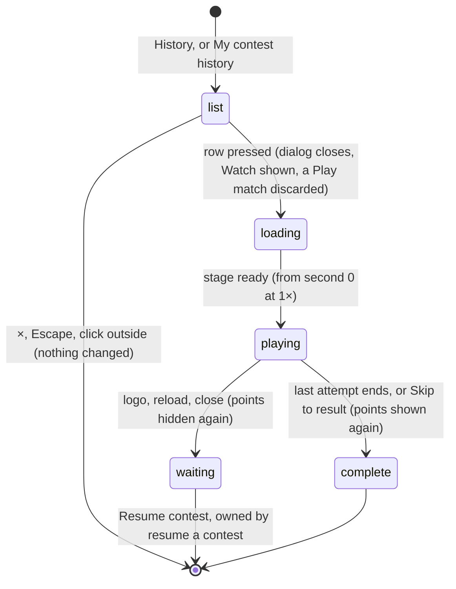

# History and member record

## Summary

Two dialogs list past Watch contests and let the player watch any of them again. **Your contest history** lists every contest your demo user took part in, newest first, with what each one earned you. **Club member record** shows one demo user's club points, wins, draws and losses, and lists that user's contests. Every row in either list is a button. Pressing it closes the dialog, switches to Watch and plays that recording again from the start. A replay never awards anything.

- **History** opens from **History** in the footer, on any tab, or from **My contest history** in [Standings](standings.md).
- **The member record** opens from the club points chip in Watch, for your own demo user, or from any name or arrow button in Standings.

Both dialogs only show what the page has revealed. A contest that is loaded and not yet complete, or that is waiting to resume, is missing from both ([written and revealed](../foundations/contests-and-recordings.md#written-and-revealed)).

## The simple case

On a fresh save, the player clicks **History** in the footer. The dialog **Your contest history** has one row:
- **Basketball**
- "Dan Weidensaul vs Doug Weidensaul · ranked"
- "2 — 0"
- "+3 points · Replay"

They click it. The dialog closes, the page shows Watch, and the stage rebuilds as a basketball court. The recording plays from the entrances, and the scoreboard reads **COUNTED ENTRY**. When the last shot ends, the result panel shows **COUNTED RESULT / POINTS POSTED** and Doug **+3 PTS**, exactly as the first time. Nothing new is awarded.

## The two dialogs

| | Your contest history | Club member record |
|---|---|---|
| Whose contests | Your demo user's: the one last chosen as **Your demo user** in [the setup dialog](../watch/setup-dialog.md) | The user whose chip, name or arrow was clicked |
| Heading | The title only; it does not name the user | The title, then the user's name |
| Totals | None | **points**, **wins**, **draws**, **losses**: that user's revealed totals across all sports |
| Order | Newest first | Oldest first: the order the contests were locked, starting with the fresh save's basketball fixture |
| Each row | The sport; the two cards, in throwing order, and the mode; the score; "+{N} points · Replay" | The sport; the mode; the score |
| With nothing to list | "No contests yet. Your first result will appear here." | The numbers read 0 and the list is empty |

Each row has a play icon at its end. The mode shows as "ranked" for a counted entry and "exhibition" for an exhibition. The score is in throwing order. "+{N} points" is your award for that contest. It is "+0 points" for an exhibition and for a counted loss worth 0.

## The interaction, event by event

The action narrated here is opening History and replaying a contest. Replaying from a member record works exactly the same way.

### Starting

History opens over the current view: Watch, Play, Standings or The collection. It does not pause Watch playback or a Play match behind it. Over Play, it takes keyboard focus off the stage, so keyboard players stop responding while it is open.

The list is built from this browser's save as the page is showing it. It updates in place if the save changes while it is open.

### Backing out at once

The ×, Escape or a click outside closes the dialog. Nothing changes, and the view underneath is exactly as it was.

### Committing

Pressing a row commits. At that instant:
1. **Watch sound stops**, if any is playing. The sound switch keeps its setting.
2. **The dialog closes.** Its rows disappear at once, while the frame fades.
3. **The page switches to Watch.** A running Play match, and Play setup, are discarded without warning. A recording already loaded in Watch is replaced.
4. **The lobby's event changes** to the recording's sport. It stays selected after **Next showdown**.
5. **The recording loads** at second 0 and **1×**. The stage rebuilds, showing **UNFOLDING THE ARENA…**, and the recording plays by itself once the stage is ready.

If the row is the recording already loaded, the clock restarts at once from second 0, like **Replay same recording**. That can only happen once that recording is complete, because until then it is not in either list.

From this moment the page treats the recording as unfinished:
- **It is hidden again.** It leaves History and every member record. For a counted entry, its points leave the chip, Standings and member records until the replay completes. This is a known bug; see [open questions](#open-questions-and-verification).
- **It takes over the waiting slot** as soon as it writes its first playback position ([resume a contest](../watch/resume-a-contest.md)). If another contest was waiting to resume, it stops waiting. If that was a counted entry, its points appear at once, although nobody watched it.

### While committed

The replay is an ordinary Watch playback, and every control in [playback controls](../watch/playback-controls.md) works. It shows exactly the same attempts as the first time, because it is the same recording.

### Resolving

When playback completes, the result panel appears ([result and replay](../watch/result-and-replay.md)). It shows the **+N PTS** the contest was locked under, the waiting slot is cleared, and the contest's points are shown again everywhere.

If the viewer leaves mid-replay by the logo, a reload or closing the tab, the replay is left waiting to resume. The lobby then shows "Saved at N seconds. Your result is waiting." for a result already seen, and a counted entry's points stay hidden until it is watched or skipped to the end.

## Modifiers

| Modifier | Set at the start | Changed while committed |
| --- | --- | --- |
| Input device | Both dialogs are ordinary buttons, reached with Tab; each row is one button. Game keys do nothing. Over Play, keyboard players lose stage focus; controller, touch and AI players carry on. | No effect. |
| Event and action combinations | Both lists mix all four sports, with no filter. **Replay** selects the recording's sport in the Watch lobby. | Not applicable: a replay's sport is the recording's. |
| Contest kind | Exhibitions and counted entries are both listed. A replay adds no new row. Play practice never appears. | A replay awards nothing. A replayed counted entry's points are hidden until the replay completes. |
| Character card | History names the two cards; the member record names none. Installed cards appear by name. **Replay** loads the recording's own cards, whatever the lobby had selected. | Not applicable: the cards are the recording's. |
| Presentation settings | The clean spectator view hides the footer, the chip and the header, so neither dialog can be opened until it is turned off. Reduced motion and lower graphics apply to the replay's stage. | Toggling them during the replay changes only how it is shown. |
| Screen size and orientation | Each dialog is at most 650 px wide and the window width minus 36 px, and at most 92% of the window height. A long list scrolls inside it. At 600 px and below, the padding and title shrink. | Reflows at once. |
| Saved state | A fresh save gives every user one row: their basketball fixture. A contest waiting to resume is left out. A save that failed to load shows History's empty text and a member record of zeros. | Another tab's write updates an open list in place. **Reset demo** in this tab unloads the replay. |

## Cancel and interrupt

| Event | Before committing | While committed |
| --- | --- | --- |
| Escape or click outside | Closes the dialog. Nothing changes. | Closes any dialog opened during the replay; the replay keeps playing. |
| Pause or resume | Not applicable: the dialogs have no pause, and opening one pauses neither Watch playback nor a Play match. | **Pause playback** and **Resume playback** work as in [playback controls](../watch/playback-controls.md). |
| Repeated or rapid input | The first press empties and closes the dialog, so a second click cannot land on the same row. | Replaying again from History, a member record or the result panel restarts from second 0 each time. |
| A panel opens on top | Not applicable: nothing inside these dialogs opens another, and the dialog covers the page. | History, a member record or **Attempt history** can open during the replay, which keeps playing behind. The replayed contest is missing from History and member records until it completes. |
| Navigating away | The dialog covers the header and footer, so it must be closed first. `configure_arena_event` can switch the view to Watch under it; the dialog stays open. | A main-tab switch pauses the replay. The logo leaves it waiting to resume. Another **Replay** replaces it. |
| Forced finish | Not applicable. | **Skip to result** completes the replay at once, clears the waiting slot and shows its points again. |
| Focus leaves the game | No effect on the dialog. A Play match behind it still pauses when the window loses focus. | Hiding the browser tab stops the replay's clock until the tab is visible again. |
| Reload, close, or back/forward cache | The dialog is forgotten; the page reopens on the Watch lobby. | The position is written. The lobby offers **Resume contest** with "Your result is waiting." for a finished contest, and a counted entry's points stay hidden. |
| Settings or saved data change underneath | Another tab's write updates the lists and totals in place. A policy change leaves every "+N points" as it was. A reset leaves only the fresh save's contests. | **Reset demo** in this tab unloads the replay, and Watch shows the lobby. After a reset in another tab, the replay keeps playing here, but its position is no longer saved unless it is a fresh-save fixture. |
| Graphics or storage failure | If the save could not be read, the lists are empty and there is nothing to replay. | WebGL loss pauses the replay and shows the error box; **Restore arena** reloads it paused at the same second. A failed position write shows **Playback could not be saved. Keep this tab open and export your recording.** |
| Input device changes | No effect. | No effect. |

## Interactions with other systems

**Points and the ledger.** History shows your award for each contest, and the member record a user's revealed totals, counted as [points and entries](points-and-entries.md#totals-and-ranks) describes. Neither writes anything. A replay never awards points.

**Saved data and recovery.** Both lists are read from this browser's save as the page shows it. A replay writes only its playback position, which takes over the waiting slot ([resume a contest](../watch/resume-a-contest.md)).

**Watch and Play separation.** Only Watch contests are listed. **Replay** always lands in Watch; from Play it discards the match without warning ([the app shell](../foundations/app-shell.md)).

**Devices and players.** No interaction, except that a dialog over Play keeps keyboard presses from reaching the stage.

**Sound.** **Replay** stops any Watch sound that is playing. The replay's cues play if Watch sound is on. A discarded Play match's sound stops with it ([sound](../cross-cutting/sound.md)).

**Reduced motion and graphics quality.** They apply to the replay as to any Watch playback ([the stage](../foundations/stage.md)).

**Accessibility.** Both dialogs take focus, and have a title and the description "Will You Be My Hero? — Arena / local demo". Each row is one button named by its text. A member record row's name, for example "Basketball ranked 2 — 0", does not say that pressing it replays the contest. The record's numbers are read before their labels: "3 points" ([accessibility](../cross-cutting/accessibility.md)).

**Installed characters.** Installed card names appear in History's rows, and **Replay** loads those characters. What happens to a recording whose installed character is no longer in the library is an open question ([Install character](../collection/install-character.md)).

**Multiple tabs.** The lists follow the shared save. A contest another tab is still playing is missing here while this tab has no recording loaded, because it is the save's waiting contest. With a recording loaded here, it is listed with its points. If two tabs replay at once, the last position written holds the waiting slot.

**Agent tools.** No tool opens these dialogs or starts a replay. `configure_arena_event` refuses while a replay is loaded ([agent tools](../cross-cutting/agent-tools.md)).

## Edge cases

- **History names cards, not users.** The fresh save's Doug–Dan row reads "Dan Weidensaul vs Doug Weidensaul", because Doug threw first with the Dan card.
- **The mode uses internal words.** Rows say "ranked" and "exhibition", while the rest of the page says **Counted entry · points** and **Exhibition · no points**.
- **A loss looks like an exhibition.** Both read "+0 points · Replay". A draw reads "+1 points".
- **History does not say whose it is.** After **Your demo user** is changed to Sam in the setup dialog, History lists Sam's contests under the same title.
- **The two lists run in opposite orders.** History is newest first; the member record is oldest first.
- **Replaying your only contest empties History.** While the fresh save's fixture is replaying, or waiting to resume after one, a user with no other contests sees "No contests yet. Your first result will appear here."
- **The contest waiting to resume** is in neither list. **Resume contest** in the lobby is the only way to reach it.
- **Replaying the loaded recording from another view.** If a completed recording is still loaded and its row is pressed from Standings or Play, the clock restarts at once while the Watch stage is still rebuilding.
- **Showcase duplicates.** Every exhibition started with **Replayable showcase seed** adds its own identical-looking row.

## Open questions and verification

- Read from `components/arena/Panels.tsx` (the history and user panels, lines 12 and 14), `Game.tsx` (`replay`, `displayState`, the clock subscription), `SecondaryViews.tsx` and `app/globals.css`. No test opens either dialog, and `scripts/production-smoke.mjs` does not use them. Not yet checked on the production page.
- **Replays hide revealed points.** A replayed counted entry's points disappear until the replay completes. An abandoned replay leaves the resume banner "Your result is waiting." for a result already seen (`Game.tsx`, lines 25–26; `persistence.ts`, line 28). This is a known bug.
- **A waiting counted entry revealed unwatched.** Replaying any recording while a counted entry waits to resume reveals that entry's points without playback (`Game.tsx`, lines 25–26 and 33). This is a product call.
- **Internal mode words.** "ranked" and "exhibition" in both lists (`Panels.tsx`, lines 12 and 14) look like a cosmetic bug.
- **Empty text when the save failed to load.** History says "No contests yet." when the save could not be read at all (`Panels.tsx`, line 12). This is misleading.
- **A missing installed character.** History looks up each card by ID, and that lookup fails for a card that is no longer installed (`model.ts`, line 43; `Panels.tsx`, line 12). It may break the page as History opens. The member record does not look up cards. Not tried.
- **Replaying the loaded recording from another view** starts the clock before the Watch stage is ready (`Game.tsx`, line 33). Whether the start of the entrances is lost has not been seen.
- **Focus after Replay.** Where keyboard focus lands after the dialog closes and the view switches has not been checked.

Verified against Will-You-Be-My-Hero-Arena commit `3b4ec62`
