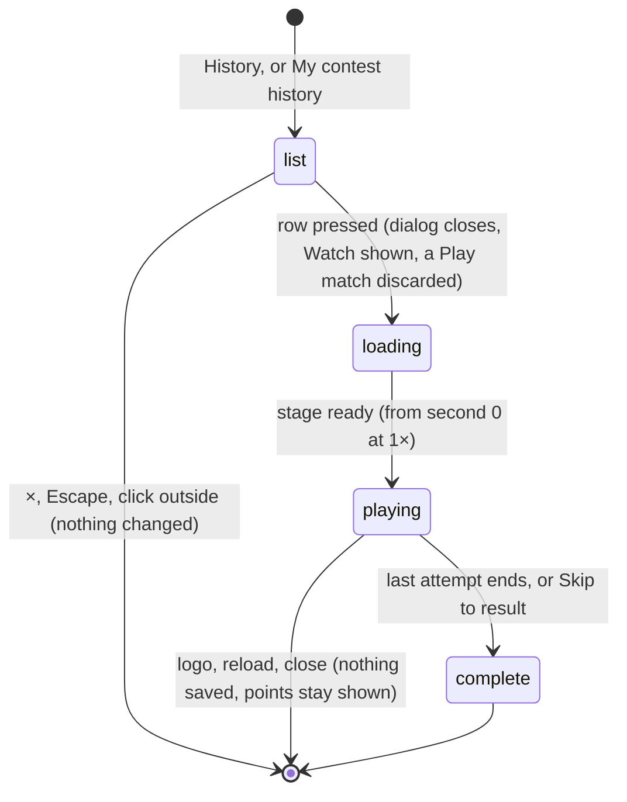

# History and member record

## Summary

Two dialogs list past Watch contests and let the player watch any of them again. **Your contest history** lists every contest your demo user took part in, newest first, with what each one earned you. **Club member record** shows one demo user's club points, wins, draws and losses, and lists that user's contests. Every row in either list is a button. Pressing it closes the dialog, switches to Watch and plays that recording again from the start. A replay never awards anything, and never hides points already shown. A row whose recording uses a character that is no longer installed is disabled.

- **History** opens from **History** in the footer, on any tab, or from **My contest history** in [Standings](standings.md).
- **The member record** opens from the club points chip in Watch, for your own demo user, or from any name or arrow button in Standings.

Both dialogs only show what the page has revealed. The one contest waiting for its first viewing is missing from both, whether it is playing, paused or waiting to resume ([written and revealed](../foundations/contests-and-recordings.md#written-and-revealed)). A replay of a revealed contest stays listed.

## The simple case

On a fresh save, the player clicks **History** in the footer. The dialog **Your contest history** has one row:
- **Basketball**
- "Dan Weidensaul vs Doug Weidensaul · Counted entry"
- "2 — 0"
- "+3 points · Replay"

They click it. The dialog closes, the page shows Watch, and the stage rebuilds as a basketball court. The recording plays from the entrances, and the side station's note reads "Points post once. Replay as often as you like." When the last shot ends, the result panel shows **COUNTED RESULT / POINTS POSTED** and Doug **+3 PTS**, exactly as the first time. Nothing new is awarded.

## The two dialogs

| | Your contest history | Club member record |
|---|---|---|
| Whose contests | Your demo user's: the one last chosen as **Your demo user** in [the setup dialog](../watch/setup-dialog.md) | The user whose chip, name or arrow was clicked |
| Heading | The title only; it does not name the user | The title, then the user's name |
| Totals | None | **points**, **wins**, **draws**, **losses**: that user's revealed totals across all sports |
| Order | Newest first | Oldest first: the order the contests were locked, starting with the fresh save's basketball fixture |
| Each row | The sport; the two cards, in throwing order, and the mode; the score; "+{N} points · Replay" | The sport; the mode; the score |
| With nothing to list | "No contests yet. Your first result will appear here." | The numbers read 0 and the list is empty |
| When the save cannot be read | "The Arena save could not be read." | The numbers read 0 and the list is empty |

Each row has a play icon at its end. The mode shows as "Counted entry" or "Exhibition", the same words as the setup dialog. The score is in throwing order. "+{N} points" is your award for that contest, always shown with its sign. It is "+0 points" for an exhibition and for a counted loss worth 0. Policy values cannot be negative, so History never shows a minus sign today.

**A recording whose character is gone.** If a recording uses an installed card that is no longer in this browser's character library, History names that card **Unknown card**, and both lists disable the row, so it cannot be replayed. In History the right-hand line reads "+{N} points · This recording uses a character that is no longer installed." instead of "… · Replay". In the member record the row reads "{mode} · This recording uses a character that is no longer installed." The row's points still count.

## The interaction, event by event

The action narrated here is opening History and replaying a contest. Replaying from a member record works exactly the same way.

### Starting

History opens over the current view: Watch, Play, Standings or The collection. It does not pause Watch playback or a Play match behind it. Over Play, it takes keyboard focus off the stage, so keyboard players stop responding while it is open.

The list is built from this browser's save as the page is showing it. It updates in place if the save changes while it is open.

### Backing out at once

The ×, Escape or a click outside closes the dialog. Nothing changes, and the view underneath is exactly as it was.

### Committing

Pressing a row commits. At that instant:
1. **Watch sound stops**, if any is playing. The sound switch keeps its setting.
2. **The dialog closes.** Its rows disappear at once, while the frame fades.
3. **The page switches to Watch.** A running Play match, and Play setup, are discarded without warning. A recording already loaded in Watch is replaced.
4. **The lobby's event changes** to the recording's sport. It stays selected after **Next showdown**.
5. **The recording loads** at second 0 and **1×**. The stage rebuilds, showing **UNFOLDING THE ARENA…**, and the recording plays by itself once the stage is ready.

If the row is the recording already loaded and the dialog was opened over Watch, the clock restarts at once from second 0, like **Replay same recording**. Opened from another view, the replay waits for the Watch stage to be ready before playing, so the entrances are not lost.

A replay of a revealed contest stays revealed:
- **Its points stay shown.** It stays in History and every member record, and a counted entry's points stay in the chip, Standings and member records for the whole replay.
- **It never becomes the contest waiting to resume.** It writes no playback position ([resume a contest](../watch/resume-a-contest.md)). If another contest is waiting to resume, it stays waiting, with its points still hidden, and the lobby offers it again after the replay.

### While committed

The replay is an ordinary Watch playback, and every control in [playback controls](../watch/playback-controls.md) works. It shows exactly the same attempts as the first time, because it is the same recording.

### Resolving

When playback completes, the result panel appears ([result and replay](../watch/result-and-replay.md)). It shows the **+N PTS** the contest was locked under. Nothing is written.

If the viewer leaves mid-replay by the logo, a reload or closing the tab, nothing is saved. The lobby offers no resume banner for the replay, and its points stay shown.

## Modifiers

| Modifier | Set at the start | Changed while committed |
| --- | --- | --- |
| Input device | Both dialogs are ordinary buttons, reached with Tab; each row is one button. Game keys do nothing. Over Play, keyboard players lose stage focus; controller, touch and AI players carry on. | No effect. |
| Event and action combinations | Both lists mix all four sports, with no filter. **Replay** selects the recording's sport in the Watch lobby. | Not applicable: a replay's sport is the recording's. |
| Contest kind | Exhibitions and counted entries are both listed, as "Exhibition" and "Counted entry". A replay adds no new row. Play practice never appears. | A replay awards nothing and never hides a replayed counted entry's points. |
| Character card | History names the two cards; the member record names none. Installed cards appear by name. A card no longer installed reads **Unknown card** in History, and its row is disabled in both lists. **Replay** loads the recording's own cards, whatever the lobby had selected. | Not applicable: the cards are the recording's. |
| Presentation settings | The clean spectator view hides the footer, the chip and the header, so neither dialog can be opened until it is turned off. Reduced motion and lower graphics apply to the replay's stage. | Toggling them during the replay changes only how it is shown. |
| Screen size and orientation | Each dialog is at most 650 px wide and the window width minus 36 px, and at most 92% of the window height. A long list scrolls inside it. At 600 px and below, the padding and title shrink. | Reflows at once. |
| Saved state | A fresh save gives every user one row: their basketball fixture. The contest waiting for its first viewing is left out. A save that cannot be read shows "The Arena save could not be read." in History and a member record of zeros. | Another tab's write updates an open list in place. **Reset demo** in this tab unloads the replay. |

## Cancel and interrupt

| Event | Before committing | While committed |
| --- | --- | --- |
| Escape or click outside | Closes the dialog. Nothing changes. | Closes any dialog opened during the replay; the replay keeps playing. |
| Pause or resume | Not applicable: the dialogs have no pause, and opening one pauses neither Watch playback nor a Play match. | **Pause playback** and **Resume playback** work as in [playback controls](../watch/playback-controls.md). |
| Repeated or rapid input | The first press empties and closes the dialog, so a second click cannot land on the same row. | Replaying again from History, a member record or the result panel restarts from second 0 each time. |
| A panel opens on top | Not applicable: nothing inside these dialogs opens another, and the dialog covers the page. | History, a member record or **Attempt history** can open during the replay, which keeps playing behind. The replayed contest stays listed, with its points. |
| Navigating away | The dialog covers the header and footer, so it must be closed first. `configure_arena_event` can switch the view to Watch under it; the dialog stays open. | A main-tab switch pauses the replay. The logo returns to the lobby and saves nothing, so the replay is not offered for resuming. Another **Replay** replaces it. |
| Forced finish | Not applicable. | **Skip to result** completes the replay at once. Nothing is written; its points were never hidden. |
| Focus leaves the game | No effect on the dialog. A Play match behind it still pauses when the window loses focus. | Hiding the browser tab stops the replay's clock until the tab is visible again. |
| Reload, close, or back/forward cache | The dialog is forgotten; the page reopens on the Watch lobby. | No position is written. The page reopens on the Watch lobby with no resume banner for the replay, and its points stay shown. A contest that was already waiting is still offered. |
| Settings or saved data change underneath | Another tab's write updates the lists and totals in place. A policy change leaves every "+{N} points" as it was. A reset leaves only the fresh save's contests. | **Reset demo** in this tab unloads the replay, and Watch shows the lobby. A reset that fails shows **The demo could not be reset: {reason}** in the reset dialog, and the replay keeps playing. After a reset in another tab, the replay keeps playing here without the stage reloading. |
| Graphics or storage failure | If the save could not be read, History says "The Arena save could not be read.", the member record is empty, and there is nothing to replay. | WebGL loss pauses the replay and shows the error box; **Reload the arena** rebuilds the stage paused at the same second, and the pause button then reads **Resume playback**. A replay writes no playback position, so it cannot fail to save one. |
| Input device changes | No effect. | No effect. |

## Interactions with other systems

**Points and the ledger.** History shows your award for each contest, and the member record a user's revealed totals, counted as [points and entries](points-and-entries.md#totals-and-ranks) describes. Neither writes anything. A replay never awards points.

**Saved data and recovery.** Both lists are read from this browser's save as the page shows it. A replay writes nothing, not even a playback position, and leaves any contest waiting to resume as it was ([resume a contest](../watch/resume-a-contest.md)). If the save cannot be read, History says so, and the recovery box under the header offers **Export unreadable save** and **Reset demo…** ([this browser's save](../foundations/saved-data.md)).

**Watch and Play separation.** Only Watch contests are listed. **Replay** always lands in Watch; from Play it discards the match without warning ([the app shell](../foundations/app-shell.md)).

**Devices and players.** No interaction, except that a dialog over Play keeps keyboard presses from reaching the stage.

**Sound.** **Replay** stops any Watch sound that is playing. The replay's cues play if Watch sound is on. A discarded Play match's sound stops with it ([sound](../cross-cutting/sound.md)).

**Reduced motion and graphics quality.** They apply to the replay as to any Watch playback ([the stage](../foundations/stage.md)).

**Accessibility.** Both dialogs take focus, and have a title and the description "Will You Be My Hero? — Arena / local demo". Each row is one button named by its text. A member record row's name, for example "Basketball Counted entry 2 — 0", does not say that pressing it replays the contest. A disabled row is skipped by Tab, but its text, including the "no longer installed" sentence, stays in the dialog for screen readers to read. The record's numbers are read before their labels: "3 points" ([accessibility](../cross-cutting/accessibility.md)).

**Installed characters.** Installed card names appear in History's rows, and **Replay** loads those characters. A recording whose installed character is no longer in the library shows **Unknown card** in History, and its row is disabled in both lists with "This recording uses a character that is no longer installed." ([Install character](../collection/install-character.md)). If the character library cannot be opened at all, every installed card is missing in this way, and a notice under the header says so.

**Multiple tabs.** The lists follow the shared save. A contest another tab is playing for the first time is missing here, because it is the save's waiting contest, until that tab's playback completes or is skipped. Replays in any tab write nothing, so two tabs can replay at once without affecting each other.

**Agent tools.** No tool opens these dialogs or starts a replay. `configure_arena_event` refuses while a replay is loaded ([agent tools](../cross-cutting/agent-tools.md)).

## Edge cases

- **History names cards, not users.** The fresh save's Doug–Dan row reads "Dan Weidensaul vs Doug Weidensaul", because Doug threw first with the Dan card.
- **A loss looks like an exhibition.** Both read "+0 points · Replay", although the mode beside the cards tells them apart. A draw reads "+1 points".
- **The same signed style in Attempt history.** During playback, **Attempt history** shows each attempt's score signed, "+3", "+1", "−1" or "+0", and names a card no longer installed **Unknown card** ([playback controls](../watch/playback-controls.md)).
- **History does not say whose it is.** After **Your demo user** is changed to Sam in the setup dialog, History lists Sam's contests under the same title.
- **The two lists run in opposite orders.** History is newest first; the member record is oldest first.
- **The contest waiting to resume** is in neither list. **Resume contest** in the lobby is the only way to reach it. Once it is watched to the end or skipped, it joins both lists.
- **Replaying the loaded recording from another view.** If a recording is still loaded and its row is pressed from Standings or Play, the replay waits for the Watch stage to be rebuilt and ready, then plays from second 0.
- **A disabled row.** A row for a recording whose character is no longer installed cannot be pressed, but its points still count in the totals and in Standings.
- **Showcase duplicates.** Every exhibition started with **Replayable showcase seed** adds its own identical-looking row.

## Open questions and verification

- Read from `components/arena/Panels.tsx` (the history and user panels), `Game.tsx` (`replay`, `displayState`, the clock subscription), `SecondaryViews.tsx` and `app/globals.css`. `scripts/production-smoke.mjs` opens History only to reload a recording, and no test checks what either dialog shows. The fixed behaviour below is read from the code; the scripted pass of 2026-09-24 ran before these fixes.
- **Fixed: replays hid revealed points (B-01).** A replay of a revealed contest now keeps its points and rows, writes no playback position, and never leaves a resume banner.
- **Fixed: a waiting counted entry revealed by a replay (B-05).** Replaying another recording now leaves the waiting entry waiting.
- **Fixed: internal mode words (B-36).** Rows now say "Counted entry" and "Exhibition", and points are signed.
- **Fixed: empty text for an unreadable save (B-03).** History now says "The Arena save could not be read."
- **Fixed: a missing installed character (B-23).** History now names such a card **Unknown card**, and both lists disable the row with "This recording uses a character that is no longer installed."
- **Fixed: replaying the loaded recording from another view (B-35).** The replay now waits for the Watch stage to be ready.
- **Reinstalling a missing character.** Whether reinstalling the same pack enables its disabled rows again has not been tried.
- **Focus after Replay.** Where keyboard focus lands after the dialog closes and the view switches has not been checked.

Verified against Will-You-Be-My-Hero-Arena commit `364e3c1`
