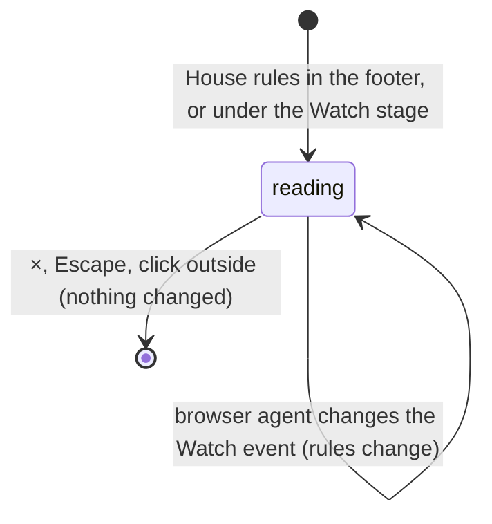

# House rules

## Summary

House rules is a read-only dialog that explains, in a few short paragraphs, how a Watch contest is decided and how club points work. It shows the rules of the selected Watch sport, how ties are settled, the current scoring policy's points and allowance (or that counted entries are switched off), a note on Heat check, and the name of the policy in force. Opened from Play, it first says that these are the Watch rules.

It opens from **House rules** in the footer, on every main tab, and from **House rules** with an info icon at the right of the floor caption under the Watch stage. Its title reads **House rules**, shown in capitals, over the line "Will You Be My Hero? — Arena / local demo". It changes nothing. What the policy means belongs to [points and entries](points-and-entries.md), and how each sport plays belongs to [the four sports](../watch/the-four-sports.md).

## The simple case

A first-time visitor on the Watch lobby clicks **House rules** under the stage. The dialog shows the general paragraph, a **CORNHOLE** heading with three rules, and the tie paragraph. Under a **CLUB POINTS** heading it reads "Win 3, draw 1, loss 0. … Each user has an equal 4-entry allowance. …". It ends with the Heat check paragraph and, in small print, "Proposed arcade rules, not official league rules. Scoring policy: club-points-v1." The visitor closes it with ×, Escape or a click outside. Nothing has changed.

## What the dialog says

In order:

1. Only when opened from Play, in small print: "These are the Watch rules. Play practice never awards points."
2. "Choose a sport and competing cards, review the setup, and press **Start showdown**. The entire contest is automatic. Viewing controls never change the result."
3. The sport's name as a heading, with its three rules as a bulleted list (see the table below).
4. "Default ties are draws. With **Up to 3 extra equal pairs**, a tie is followed by at most three extra pairs of attempts; both players always receive an attempt. A remaining tie is recorded as a draw."
5. A **Club points** heading, then one of two paragraphs:
   - With counted entries on: "Win {W}, draw {D}, loss {L}. Sports scores stay separate. Each user has an equal {A}-entry allowance. Scheduled opponent, order, and seed lock before **Start showdown**. Exhibition is unlimited and earns no points." The numbers come from the saved scoring policy. {A} is the allowance capped at 4.
   - With counted entries switched off: "Counted entries are switched off, so no contest earns points. Exhibitions are unlimited."
6. "Heat check is a cosmetic round label on round three, for exhibitions only. It never adds points, and rarity gives no power bonus."
7. In small print: "Proposed arcade rules, not official league rules. Scoring policy: {name}."

| Sport | Rules shown |
| --- | --- |
| **Cornhole** | "Quick arcade preset: four alternating throws each. Gross scoring, without cancellation." "Hole = 3, bag resting on the board = 1, floor = 0. Most board shots can push earlier bags, a cut kicks one aside, a roll curls around them, and an airmail or collect bag that drops in can carry bags into the hole with it." "Separate identical boards. Board contacts and displacements are recorded before playback. Starting order is locked." |
| **Football** | "Five alternating throws each at identical target walls." "Concentric targets score 3, 2, or 1. Outside the outer circle = 0. A boundary belongs to its inner, higher-value zone." "The ball spirals to its recorded impact. There are no catches or bonus points." |
| **Beer pong** | "Six alternating direct shots each, with a separate six-cup water rack. One point per cup made." "Made cups leave that player’s rack. The controller targets only remaining cups." "Direct shots only. A center crossing inside the cup opening scores; bounce shots and rim-outs score zero." |
| **Basketball** | "Five alternating shots from identical marked positions. Every make is one point." "A descending ball clearing the inner hoop opening scores. Rim-outs, backboard misses, and airballs score zero." "The hoop and shooting distance are the same for both competitors." |

The dialog uses the page's own labels. **Start showdown** is the setup dialog's button. **Up to 3 extra equal pairs** is one of its two tie options; the other, **Finish as a draw**, is the default the paragraph opens with ([contests and recordings](../foundations/contests-and-recordings.md#kinds-of-play)). Heat check is the exhibition-only **Heat check · cosmetic round label** checkbox in [the setup dialog](../watch/setup-dialog.md).

## The interaction, event by event

The action narrated here is opening House rules, reading it and closing it.

### Starting

Either link opens the dialog over the current view, and it takes focus. What it shows depends on two things:
- **The sport** is the Watch sport: the event selected in the Watch lobby, or the sport of the recording loaded in Watch. Opened from Play, it still shows the Watch sport, not the Play event, under the line "These are the Watch rules. Play practice never awards points."
- **The policy** is the scoring policy saved in this browser, not an unsaved draft in [Arena settings](arena-settings.md).

Nothing pauses. Watch playback and a Play match continue behind the dialog.

### Backing out at once

×, Escape or a click outside closes the dialog and returns to the view exactly as it was. This is the only way out.

### Committing

Never commits. The dialog has nothing to change and nothing to press except ×.

### While committed

Not applicable: House rules never commits. While it is open, it keeps following the save and the Watch sport. Another tab's policy save or reset updates the club points paragraph and the policy name in place, and a browser agent changing the Watch event swaps the sport's heading and rules.

### Resolving

Closing leaves everything as it was. Nothing is saved, and the dialog opens the same way next time, with whatever sport and policy are current then.

## Modifiers

| Modifier | Set at the start | Changed while committed |
| --- | --- | --- |
| Input device | A mouse, touch or the keyboard. Both links are ordinary buttons. Inside the dialog the only control is ×; long content scrolls. Game keys do nothing. | Not applicable: House rules never commits. |
| Event and action combinations | The heading and rules follow the Watch sport: **Cornhole**, **Football**, **Beer pong** or **Basketball**. Play's events have no rules here; opened from Play, the dialog says "These are the Watch rules. Play practice never awards points." and shows whichever Watch sport was last selected. | Not applicable: House rules never commits. |
| Contest kind | The same text with or without a loaded contest, of any kind. It describes counted entries and exhibitions together. It mentions Play practice only when opened from Play. It does not show the policy a loaded counted entry was locked under. | Not applicable: House rules never commits. |
| Character card | No effect. No rule depends on the card, and installed characters are not mentioned. | Not applicable: House rules never commits. |
| Presentation settings | No effect on the text. The clean spectator view hides both links, so the dialog cannot be opened from it. | Not applicable: House rules never commits. |
| Screen size and orientation | 650 px wide, or the window width minus 36 px, and at most 92% of the window height; the text scrolls when taller. At 600 px wide and below the title is smaller. | Not applicable: House rules never commits. |
| Saved state | The club points paragraph shows the saved policy's points and allowance, the allowance capped at 4. The small print shows its name: `club-points-v1` on a fresh save and until the values first change, then "club-points-" and eight characters worked out from the values. With counted entries switched off, the paragraph reads "Counted entries are switched off, so no contest earns points. Exhibitions are unlimited." With a save that cannot be read, the values fall back to 3, 1, 0 and 4, and the small print leaves out the policy name. | Not applicable: House rules never commits. |

## Cancel and interrupt

| Event | Before committing | While committed |
| --- | --- | --- |
| Escape or click outside | Closes the dialog. Nothing changes. | Not applicable: House rules never commits. |
| Pause or resume | No effect on the dialog. Watch playback and a Play match keep running behind it. The pause controls are covered, but a controller's Menu or Options button can still pause Play. | Not applicable: House rules never commits. |
| Repeated or rapid input | A double-click on a link opens the dialog once. While it is open, the dialog covers both links. | Not applicable: House rules never commits. |
| A panel opens on top | Not applicable: nothing inside the dialog opens another, and the gear and footer are covered. | Not applicable: House rules never commits. |
| Navigating away | The tabs and logo are covered, so the player must close the dialog first. A browser agent's `configure_arena_event` can change the Watch event and switch to the Watch tab behind it, unless a recording is loaded or Play is showing. The rules change to that sport at once. | Not applicable: House rules never commits. |
| Forced finish | Not applicable: nothing in the dialog is timed. A Watch contest can reach its result behind it without changing the dialog. | Not applicable: House rules never commits. |
| Focus leaves the game | No effect on the dialog. | Not applicable: House rules never commits. |
| Reload, close, or back/forward cache | The dialog is gone, and the page reopens on the Watch lobby. | Not applicable: House rules never commits. |
| Settings or saved data change underneath | Another tab's policy save or reset updates the values and the name while the dialog is open, and switching counted entries off swaps the club points paragraph. This tab's Arena settings cannot be open at the same time. | Not applicable: House rules never commits. |
| Graphics or storage failure | No effect on the dialog. A lost graphics context behind it pauses Watch and shows the error box there. | Not applicable: House rules never commits. |
| Input device changes | No effect on the dialog. A controller disconnecting pauses a Play match behind it. | Not applicable: House rules never commits. |

## Interactions with other systems

**Points and the ledger.** The dialog shows the current policy's points and allowance, or that counted entries are switched off, not anyone's points. A counted entry is scored under the policy it was locked under, which may differ from what the dialog shows, and the dialog does not say so ([points and entries](points-and-entries.md)).

**Saved data and recovery.** Reads the saved scoring policy. Writes nothing. If the save cannot be read, it shows the default values without a policy name ([this browser's save](../foundations/saved-data.md)).

**Watch and Play separation.** Describes Watch only, and says so when opened from Play: "These are the Watch rules. Play practice never awards points." Play's rules are in each Play event's document, and Play Cornhole differs from Watch Cornhole ([the cornhole throw](../play/cornhole.md)).

**Devices and players.** No interaction.

**Sound.** No interaction. Watch sound continues behind the dialog.

**Reduced motion and graphics quality.** No effect on the content.

**Accessibility.** The dialog has a title and a description, and takes focus when it opens. The sport and **Club points** are headings, and the rules are a real list. Both links are named "House rules"; the one under the stage also carries an info icon ([accessibility](../cross-cutting/accessibility.md)).

**Installed characters.** No interaction.

**Multiple tabs.** The policy values follow the shared save, so another tab's policy save or reset updates them in place. The sport is this tab's own.

**Agent tools.** `configure_arena_event` changes the sport shown, if no recording is loaded and Play is not showing. `read_arena` does not read the dialog ([agent tools](../cross-cutting/agent-tools.md)).

## Edge cases

- **Opened from Play.** If Play is set to Cornhole and the Watch lobby to Football, the dialog says "These are the Watch rules. Play practice never awards points." and shows Football's rules.
- **A loaded recording's sport.** **Replay** from History selects the recording's sport in Watch. House rules then shows that sport, and keeps showing it after the player returns to the lobby.
- **An allowance of 0** reads "Each user has an equal 0-entry allowance."
- **An allowance above 4**, left in a save from before the cap, reads "Each user has an equal 4-entry allowance."
- **An unsaved draft** in Arena settings is never shown here.
- **The policy name** changes only when a saved policy has different values. Saving the same values keeps it ([Arena settings](arena-settings.md#resolving)).

## Open questions and verification

- Read from `components/arena/Panels.tsx` (the rules panel), `lib/arena/model.ts` (`EVENTS` and `DEFAULT_POLICY`) and `components/arena/Game.tsx`. The fixed behaviour below is read from the code; the scripted pass of 2026-09-24 ran before these fixes.
- **Fixed: wording (B-36).** The dialog now says **Start showdown** and **Up to 3 extra equal pairs**, describes Heat check as a cosmetic round label for exhibitions only, and no longer mentions "sudden death", "ranked entries" or "Secret effects".
- **Fixed: the Watch sport shown from Play (B-36).** Opened from Play, the dialog now says first that these are the Watch rules.
- **Fixed: counted entries switched off (B-32, B-36).** The club points paragraph now says that no contest earns points, and the allowance shown is capped at 4.
- **Fixed: the blank policy name (B-03).** With a save that cannot be read, the small print now leaves out "Scoring policy:" altogether.

Verified against Will-You-Be-My-Hero-Arena commit `364e3c1`
