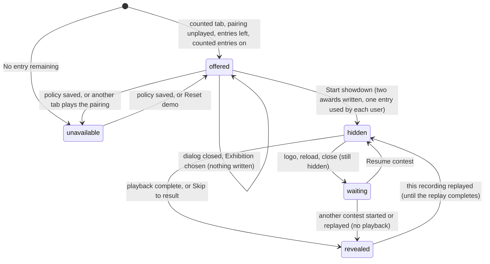

# Points and entries

## Summary

Club points are how the Arena keeps score between the four demo users. Only a *counted entry* earns them. Each counted entry is one of eight fixed pairings in the *schedule*, and each demo user may take part in a limited number of them, the *allowance*. When a counted entry is locked, the Arena writes one *award* per user to the *ledger*, worth the win, draw or loss value of the *scoring policy* in force at that moment. Club points, ranks and records are always added up from the ledger, never stored.

This document owns the scoring policy, the schedule, when a counted entry is offered, how awards are worked out and why one can never post twice, how totals and ranks are counted, and the fresh save's two basketball fixtures. When awards are *written* and when they are *revealed* belongs to [contests and recordings](../foundations/contests-and-recordings.md#written-and-revealed). Where the numbers are shown belongs to [the lobby](../watch/lobby.md#the-club-points-chip), [Standings](standings.md), [history and member record](history-and-member-record.md) and [result and replay](../watch/result-and-replay.md).

## The simple case

On a fresh save, Doug has 3 club points and is ranked first, and the chip reads "Doug · Rank 1 · 3 entries left". The player selects **01 Cornhole**, opens **Set up showdown** and chooses **Counted entry · points**. The dialog shows **Scheduled opponent** Dan, **3 counted entries left**, and "Win +3 · Draw +1 · Loss +0. Both users receive their result once."

The player presses **Start showdown**. At that instant both Doug and Dan get an award, and both have one entry fewer: the chip now reads "2 entries left". The points and rank beside it do not change yet. When playback is complete, the result panel shows **+3 PTS** for the winner and **+0 PTS** for the loser, and the chip, Standings and History include the new points. Counted cornhole is now **No entry remaining** for both Doug and Dan until the demo is reset.

## The interaction, event by event

The action narrated here is one counted entry's points, from the moment the pairing is offered until they are revealed.

### Starting

The pairing is looked up whenever the setup dialog is on **Counted entry · points**. It is worked out afresh every time something it depends on changes: **Your demo user**, the lobby's sport, and this browser's save. The dialog then shows either **Scheduled opponent** with a name, or **No entry remaining**, along with **{N} counted entries left** for your demo user. The rules for which it shows are in [when an entry is offered](#when-an-entry-is-offered).

Nothing is captured yet. The policy's point values shown in the review strip are the ones saved now, but they are only fixed when **Start showdown** is pressed.

### Backing out at once

Closing the setup dialog, switching to **Exhibition · no points**, or choosing another demo user writes nothing. No entry is used, and the pairing stays offered. Changing **Your demo user** changes whose entries the chip and the dialog show, even if no contest is started.

### Committing

**Start showdown** locks the contest ([contests and recordings](../foundations/contests-and-recordings.md#committing)). For a counted entry, that single write also:
- **Writes two awards**, one for each user, worked out as in [awards](#awards).
- **Uses the pairing.** It is now played for both users, whichever of them started it.
- **Uses one entry of each user.** Both users' **entries left** drop by one at once. The chip shows yours.

If the lock is refused, nothing is written and no entry is used. The reasons are listed in [contests and recordings](../foundations/contests-and-recordings.md#backing-out-at-once).

### While committed

The awards are written but hidden, as [written and revealed](../foundations/contests-and-recordings.md#written-and-revealed) describes. What the player notices:
- The chip's **entries left** has already dropped, while its points and rank have not moved.
- Standings shows the same points and **Played** as before the lock.
- The scoreboard reads **COUNTED ENTRY**, and the side note reads "Points post once. Replay as often as you like."

Nothing the viewer does during playback changes the awards. Pausing, speed, leaving, resuming and skipping only change when they are revealed.

### Resolving

When playback is complete, the awards are revealed. The result panel shows **COUNTED RESULT / POINTS POSTED** and each user's **+N PTS** ([result and replay](../watch/result-and-replay.md)). The chip, Standings, member records and History include the contest from then on. The pairing stays used until **Reset demo**.

## The scoring policy

The scoring policy has five settings, edited under **Host · prototype scoring** in [Arena settings](arena-settings.md):

| Setting | On screen | Default | What it decides |
|---|---|---|---|
| Win | **Win** | 3 | Points for the winner of a counted entry |
| Draw | **Draw** | 1 | Points for each user when a counted entry is drawn, including an unresolved draw after three extra pairs |
| Loss | **Loss** | 0 | Points for the loser |
| Allowance | **Entries / User** | 4 | How many counted entries each demo user may take part in, across all sports |
| Enabled | **Counted entries enabled** | On | Whether any counted entry is offered at all |

Each value must be a whole number from 0 to 100. Nothing checks that a win is worth more than a loss. **Save for future entries** saves all five at once and gives the policy a new name, even when nothing changed. [House rules](house-rules.md) ends with the name: "Scoring policy: club-points-v1" by default.

The two halves of the policy apply at different times:
- **The point values** are copied into a contest when **Start showdown** is pressed. A saved change affects only contests locked afterwards. The dialog says "Historical points retain their saved policy."
- **The allowance and the enabled switch** are read live, every time availability is worked out and again at the lock. A saved change affects availability at once, including for pairings that were already offered.

The policy is shown in several places. The counted review strip shows "Win +{win} · Draw +{draw} · Loss +{loss}." House rules shows "Win 3, draw 1, loss 0" and "Each user has an equal 4-entry allowance". Standings shows "Counted wins earn 3 points." All three show the *current* policy. The result panel shows the points the contest was locked under.

## The schedule

The schedule is eight pairings, always in this order:

| Order | Sport | Throws first | Throws second | Fresh save |
|---|---|---|---|---|
| 1 | Cornhole | Doug | Dan | Open |
| 2 | Cornhole | Sam | Riley | Open |
| 3 | Football | Doug | Dan | Open |
| 4 | Football | Sam | Riley | Open |
| 5 | Beer pong | Doug | Dan | Open |
| 6 | Beer pong | Sam | Riley | Open |
| 7 | Basketball | Doug | Dan | Played |
| 8 | Basketball | Sam | Riley | Played |

Each pairing has its own fixed random seed. Doug only ever meets Dan in a counted entry, and Sam only ever meets Riley. Each demo user therefore has exactly one pairing per sport, four in all.

In every counted entry:
- **The throwing order** is the schedule's, whoever started it.
- **Your card** is your choice. The opponent always plays the Doug card, with the Steady strategy.
- **The seed** is the pairing's own, so the same cards, strategy and tie rule always produce the same result.

A pairing belongs to both of its users. When Dan plays counted football, Doug's counted football is played too.

## When an entry is offered

A counted entry is offered to your demo user for the selected sport when all of these are true:
1. **Counted entries enabled** is on.
2. You have taken part in fewer counted entries than the allowance.
3. Your pairing for that sport has not been played, by you or by your scheduled opponent.
4. Your scheduled opponent has also taken part in fewer counted entries than the allowance.

Otherwise the dialog shows **No entry remaining** and disables **Start showdown**. It does not say which rule failed.

**Entries left** is the allowance minus the counted entries you have taken part in, and never less than 0. The chip shows "{k} entries left" and the dialog "{k} counted entries left". Both count every locked counted entry, including one still hidden and the fresh save's fixture. Neither looks at **Counted entries enabled** or at how many pairings remain, so **entries left** can promise more than the dialog will offer (see [edge cases](#edge-cases)).

## Awards

At the lock, each user of a counted entry gets one award:
- **The outcome** comes from the recording: win or loss, or a draw when nobody won.
- **The points** are that outcome's value in the policy copied at **Start showdown**. A loss worth 0 is still an award, which is why a loss counts as played.
- **Each award is tagged** with its contest, its user, its sport, the name of the policy it was locked under and the time the contest was set up.

Awards never change after they are written. A later policy change, a replay or **Skip to result** leaves them as they are. **Reset demo** is the only thing that removes them, and it removes all of them except the fresh save's ([Reset demo](reset-demo.md)).

**Why an award cannot post twice.** Four separate things prevent it:
1. The setup dialog does not offer a pairing that has been played.
2. At the lock, the Arena re-reads this browser's save while holding a lock that other tabs must wait for. If the pairing already has a recording, that recording is loaded and played instead. No new recording or award is made.
3. A counted entry's contest is named after its pairing, and each award after its contest and user. A save holding two awards with the same name fails to load, with "Duplicate points awards in save."
4. Revealing is only a change in what the page shows. Playing, pausing, skipping, replaying and resuming write no awards.

**Corrections.** The code can add a correction to an award: a new award that points back to the original and adds or removes a whole number of points. The same correction added twice has no effect. A correction would change a user's points without changing their played count, wins, draws or losses. Nothing on the page offers or saves a correction, though. There is no way to adjust, reverse or remove a single award; the only undo is **Reset demo**, which removes all of them.

> Technical note: the correction function is `adjustAward` in `lib/arena/persistence.ts`. Only `tests/run-tests.mjs` calls it, and it returns a changed copy of the save without writing it.

## Totals and ranks

Every number below is added up from the revealed ledger, with any hidden contest left out ([written and revealed](../foundations/contests-and-recordings.md#written-and-revealed)):

| Number | What it counts | Shown in |
|---|---|---|
| Club points | The user's awards, plus any corrections | The chip, Standings, member record, result panel |
| **Played** | The user's counted entries. Exhibitions never count. | Standings |
| Wins, draws, losses | The user's counted entries by outcome | Member record |
| Rank | The user's place by club points among all four demo users | The chip, Standings, result panel |

**Ranks are shared.** Users with equal points share a rank, and the next rank skips the places they took: 1, 2, 2, 4. When all four have the same points, all four are rank 1. Users on equal points are listed in the fixed order Dan, Doug, Riley, Sam. All four demo users are always ranked, including anyone on 0.

**Per sport.** Standings can limit every number to one sport's awards. The chip, the member record and the result panel always use all sports.

## The fresh save

A browser with no save starts with both basketball pairings already played. Both were set up on the fresh save's own date with Steady strategy and **Finish as a draw**, and the default policy:

| Pairing | Cards | Score | Awards |
|---|---|---|---|
| Doug against Dan | Doug plays the Dan card; Dan plays the Doug card | 2–0 | Doug +3 (win), Dan +0 (loss) |
| Sam against Riley | Sam plays the Doug card; Riley plays the Dan card | 1–1 | Sam +1, Riley +1 (draw) |

So a fresh save shows Doug 3 (rank 1), Riley 1 and Sam 1 (both rank 2), and Dan 0 (rank 4). Each user has **Played** 1, **3 entries left**, and **No entry remaining** for counted basketball. **Reset demo** returns to exactly this.

## Modifiers

| Modifier | Set at the start | Changed while committed |
| --- | --- | --- |
| Input device | Counted entries exist only in Watch, which is driven by clicks and keyboard focus. No Play device can start one or earn points. | No effect. |
| Event and action combinations | The lobby's sport picks the pairing: one per sport for each pair of users. The point values are the same in every sport. Each award is tagged with its sport, which is what the Standings sport tabs use. | Not applicable: the sport is fixed at the lock. |
| Contest kind | Only a counted entry uses an entry and writes awards. An exhibition uses no entry and writes none. A replay writes nothing. Play practice never touches points. | Not applicable: a locked contest's kind cannot change. Replaying a finished counted entry hides its points again until the replay completes. |
| Character card | Your card changes the outcome, not what the outcome is worth. The opponent always plays the Doug card. An installed card can be your card in a counted entry. Rarity gives no advantage. | Not applicable: the cards are fixed at the lock. |
| Presentation settings | No effect on points or entries. The clean spectator view hides the chip, the header and the footer, so the points are out of sight until it is turned off. | No effect. |
| Screen size and orientation | No effect on points or entries. | No effect. |
| Saved state | A fresh save starts each user with one entry used. Availability and **entries left** come from the save's counted contests, including hidden ones. A save that fails to load offers no contests at all and shows 0 points. | A policy saved after the lock does not change the written awards. **Reset demo** removes them and reopens six pairings. |

## Cancel and interrupt

| Event | Before committing | While committed |
| --- | --- | --- |
| Escape or click outside | Closing the setup dialog writes nothing. The pairing stays offered and no entry is used. | Pressed during **Locking the contest…**, the lock still finishes and the awards are written ([the setup dialog](../watch/setup-dialog.md)). Closing a dialog later has no effect on them. |
| Pause or resume | Not applicable: nothing plays before the lock. | Pausing keeps the awards hidden. Nothing is written or revealed until playback is complete. |
| Repeated or rapid input | A double-click on **Start showdown** locks one contest and writes two awards. | The pairing is no longer offered. Repeated **Skip to result** or **Replay same recording** writes nothing. |
| A panel opens on top | Arena settings cannot open over the setup dialog, so this tab cannot change the policy under it. | The chip's member record, History and Standings all leave the contest out until it is complete. |
| Navigating away | Nothing is used. The setup choices stay in memory until reload. | A tab switch pauses playback and keeps the points hidden. The logo, a reload or closing the tab leaves the contest waiting to resume, still hidden. Starting another contest, or replaying another recording, takes over the waiting slot and reveals the points with no playback ([resume a contest](../watch/resume-a-contest.md)). |
| Forced finish | Not applicable. | **Skip to result** reveals the points at once. |
| Focus leaves the game | No effect. | Hiding the browser tab stops the playback clock, so the reveal waits. Window blur has no effect. |
| Reload, close, or back/forward cache | Nothing is written before the lock. | The awards survive. On return the contest waits to resume, and its points stay hidden until it is watched or skipped to the end. |
| Settings or saved data change underneath | A saved policy or another tab's write changes the offered values, **entries left** and the offered pairing at once. Another tab locking this pairing makes it **No entry remaining**. **Reset demo** reopens pairings. | A later policy change never alters written awards. **Reset demo** removes them and unloads the contest. |
| Graphics or storage failure | If the save refuses the lock's write, no award is written and no entry is used. | WebGL loss pauses playback, so the reveal waits. If the playback-position writes fail, the save can still list the contest as waiting after it was watched, and a reload hides its points again. |
| Input device changes | No effect. | No effect. |

## Interactions with other systems

**Points and the ledger.** This document owns the values, the allowance, the schedule and the counting. When awards are written and revealed is owned by [contests and recordings](../foundations/contests-and-recordings.md#written-and-revealed).

**Saved data and recovery.** The ledger, the recordings and the policy are part of the Arena save. A lock is one journaled write, so a crash keeps both awards or neither. **Export local save** leaves out a contest that is still hidden ([this browser's save](../foundations/saved-data.md#exports)).

**Watch and Play separation.** Only Watch counted entries earn points. Play's caption says **Practice / no club points**, and nothing in Play reads the ledger.

**Devices and players.** The competitors are demo users, not devices. There is no sign-in, so anyone at this browser can choose any demo user and play that user's entries.

**Sound.** No interaction.

**Reduced motion and graphics quality.** No interaction.

**Accessibility.** Points, ranks and entries are always text. The chip is a button named by its text. Nothing announces the moment points are revealed; the narration announces the winner ([accessibility](../cross-cutting/accessibility.md)).

**Installed characters.** An installed card can be your card in a counted entry. Installing a character adds no demo users and no pairings ([Install character](../collection/install-character.md)).

**Multiple tabs.** Locks are taken one at a time across tabs, so a pairing is locked once. **Entries left** drops in every tab at once. A tab with no recording of its own loaded hides whichever contest the save says is waiting to resume. So while one tab plays a new counted entry, another tab sitting in the lobby or Standings hides its points too, and reveals them when the first tab's playback completes.

**Agent tools.** `read_arena` returns the overall leaderboard as this tab shows it: each user's points and rank. `configure_arena_event` changes the lobby's sport, and so which pairing the setup dialog offers. It never starts a contest or awards points ([agent tools](../cross-cutting/agent-tools.md)).

## Edge cases

- **Entries left before points.** Between the lock and the reveal, the chip's **entries left** has dropped while its points, the rank, and **Played** in Standings have not.
- **Counted entries switched off.** With **Counted entries enabled** off, every sport shows **No entry remaining**, but the chip and the dialog still show the allowance's **entries left**.
- **An allowance above 4 is never usable.** Each user has only four pairings. With **Entries / User** at 6, a fresh save shows "5 entries left", but only three pairings can ever be played.
- **Lowering the allowance** below what a user has played shows "0 entries left" and closes every pairing. It removes no points. An allowance of 1 closes counted entries for everyone, because the fresh save used one entry each.
- **Doug and Dan always have the same entries left**, and so do Sam and Riley, because every counted entry uses one of each.
- **A loss still counts as played.** It is an award worth the loss value, 0 by default.
- **A policy change between the lock and the reveal.** The contest is revealed with the values it was locked under, while the Standings heading and House rules show the new values.
- **After Reset demo**, a pairing played again with the same card, strategy and tie rule produces the same result as before, because its seed is fixed.
- **Grammar.** One remaining entry reads "1 entries left" and "1 counted entries left".

## Open questions and verification

- Read from `lib/arena/persistence.ts` (`awardsFor`, `standings`, `rankedPlayed`, `availableEntry`, `commit`, `fixtures`, `adjustAward`), `lib/arena/model.ts` (`DEFAULT_POLICY`, `SCHEDULE`, `USERS`), `components/arena/Game.tsx`, `SetupDialog.tsx` and `Panels.tsx`. `tests/run-tests.mjs` checks that a counted entry committed twice, or twice at once, keeps exactly two awards, that a policy change leaves the ledger unchanged, that four users on 0 all rank 1, and that a repeated correction is ignored. It runs against the code directly, not through the page.
- **The fresh save's scores** (2–0 and 1–1) were worked out by running the Arena's own simulation code outside the page. They have not been seen on the production page.
- **Entries left ignores the enabled switch.** The chip (`Game.tsx`, line 47) and the dialog (`SetupDialog.tsx`, line 11) show **entries left** from the allowance alone, while availability (`persistence.ts`, line 11) also needs **Counted entries enabled**. This may be worth treating as a bug.
- **An allowance above the four pairings** promises entries that cannot exist (`model.ts`, line 45). This is a product call.
- **Replaying a finished counted entry hides its points again**, and an abandoned replay leaves a misleading resume banner (`Game.tsx`, lines 25–26; `persistence.ts`, line 28). This is a known bug.
- **Replacing a waiting counted entry reveals it with no playback.** Starting or replaying another contest makes a waiting counted entry's points appear without it ever being watched (`Game.tsx`, lines 25–26 and 33). This is a product call.
- **Corrections have no interface.** `adjustAward` (`persistence.ts`, line 33) is never called by the page. Whether hosts need a way to correct an award, or the function should go, is a product call.
- **The duplicate-award check runs only when the save is read** (`persistence.ts`, lines 14–16), not when it is written. Nothing on the page can write a duplicate, so this has no visible effect today.

Verified against Will-You-Be-My-Hero-Arena commit `3b4ec62`
