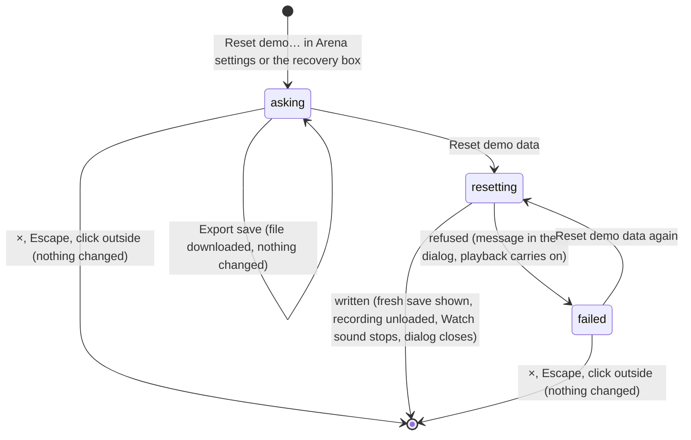

# Reset demo

## Summary

Reset demo puts this browser's Arena save back to a *fresh save*. It removes every contest played in this browser, every award, the scoring policy, the contest waiting to resume and any imported asset mappings. It then brings back the fresh save's two basketball counted contests. It does not touch installed characters, the Play bindings or any presentation setting. There is no undo.

It lives in the **Reset the local demo?** dialog. It is reached from **Reset demo…** at the bottom of [Arena settings](arena-settings.md), which it replaces in the same window, and, when this browser's save cannot be read, from **Reset demo…** in the recovery box under the header. The dialog offers two buttons, **Export save** and **Reset demo data**. A reset also works over a save that cannot be read, and is the way to recover from one. [This browser's save](../foundations/saved-data.md) owns the save itself and what an export contains.

## The simple case

The player opens Arena settings from the gear and clicks **Reset demo…**. The window changes to **Reset the local demo?**, shown in capitals, with the line "Will You Be My Hero? — Arena / local demo" and this warning:

"This restores sample contests and removes locally played contests, awards, and imported mappings from this browser. Export your save first to keep them."

They press **Export save**, which downloads `clubhouse-before-reset.json` and leaves the dialog open. Then they press **Reset demo data**, the dark red button. A moment later the dialog closes.

On the Watch tab, the lobby is now empty: the resume banner is gone, and the chip shows the fresh save's points with **3 entries left**. If a contest was loaded, the stage rebuilds for the lobby. Standings count only the two basketball contests, and History shows your demo user's one basketball contest. The view does not change, and no message confirms the reset.

If the reset cannot be written, the dialog stays open and says **The demo could not be reset: {reason}**. Nothing is changed, and Watch playback carries on.

## What a reset replaces and keeps

| Part | After a reset |
| --- | --- |
| Recordings | Only the fresh save's two basketball counted contests: Doug against Dan, and Sam against Riley. Every other recording is gone, whatever its kind. |
| Ledger | Only those two contests' four awards. |
| Scoring policy | The default: 3 for a win, 1 for a draw, 0 for a loss, an allowance of 4, counted entries on, named `club-points-v1`. |
| Contest waiting to resume | None. The resume banner disappears. |
| Imported asset mappings | None. Cards lose any mapped card image, personality and motion profile. |
| The save's revision number | One more than the highest revision found in the save or its journal, read even from a save that fails its checks. It never goes back to zero. |
| Arena settings' scoring draft | Replaced by the default policy, discarding any unsaved edits. |
| The recovery box for an unreadable save | Gone, because the save can be read again. |
| The notice that installed characters are unavailable | Kept. It is about the character library, which a reset does not touch. |
| Installed characters | Kept, in every demo user's collection. |
| Play bindings | Kept. |
| **Reduced motion**, **Lower graphics quality**, both sound switches | Kept as they are. |
| The Watch event, the setup choices, the current view | Kept. |
| The Watch error box | Kept. Any message already showing stays. |

The warning mentions contests, awards and mappings only. It does not say that the scoring policy and the contest waiting to resume are reset too.

> Technical note: the two basketball contests are simulated again from their fixed seeds, so they are identical to the ones a new browser gets. A new browser's fresh save is not written until its first change; the reset writes this one at once.

## The interaction, event by event

The action narrated here is resetting, from **Reset demo…** until the fresh save is showing.

### Starting

**Reset demo…** in Arena settings swaps that dialog's content for this one in the same window. **Reset demo…** in the recovery box opens it directly. Nothing is captured and nothing pauses. Watch playback, if any, keeps running behind the dialog. Unsaved edits in Arena settings are dropped, because that dialog re-reads the saved policy the next time it opens.

### Backing out at once

×, Escape or a click outside closes the window entirely. Arena settings does not come back; the gear must be clicked again. There is no **Cancel** button.

**Export save** can be pressed any number of times. Each press downloads a copy and changes nothing. The export is the whole stored save: every recording, every award and the contest waiting to resume, whatever is loaded ([exports](../foundations/saved-data.md#exports)). If the save cannot be read, **Export save** downloads its stored text unchanged, as `clubhouse-before-reset-unreadable.json`.

### Committing

**Reset demo data** commits the instant it is pressed. There is no second confirmation. **The reset waits** for any locking write in another tab to finish. Then it replaces the save in one protected write ([this browser's save](../foundations/saved-data.md#committing)). Nothing else changes until that write succeeds: Watch playback and its sound carry on.

The button is not disabled while this happens.

### While committed

The reset usually takes a fraction of a second: it simulates the two basketball contests and writes the save. The dialog stays open and nothing on it changes.

### Resolving

- **Written.** In this tab:
  - Any Watch sound playing stops.
  - The page shows the fresh save everywhere: the chip, Standings, History, member records and **House rules**' policy values. The recovery box, if it was showing, disappears.
  - A recording loaded in Watch is unloaded without its position being written, because the contest no longer exists. On the Watch tab this returns to the empty lobby, and the stage rebuilds with **UNFOLDING THE ARENA…**. The lobby's idle clock starts again.
  - The view stays where it was. A reset opened from Standings stays on Standings.
  - The dialog closes, and Arena settings' draft becomes the default policy.
- **Refused.** If storage refuses the write, the dialog stays open and shows **The demo could not be reset: {reason}** under the buttons, as an alert. The save is unchanged. Watch playback is not stopped: a loaded contest keeps playing, and its sound carries on. **Reset demo data** can be pressed again.

## Modifiers

| Modifier | Set at the start | Changed while committed |
| --- | --- | --- |
| Input device | A mouse, touch or the keyboard. The two buttons and × are reachable with Tab and pressed with Enter or Space. Game keys do nothing in the dialog. | No effect. |
| Event and action combinations | No effect. All four Watch sports are reset together, and the selected Watch event is kept. | No effect. |
| Contest kind | Every exhibition and counted entry recorded in this browser is removed, apart from the two basketball contests. A counted entry locked but not yet revealed disappears with its awards before anyone saw them, and its entry becomes available again. Play practice is untouched. | Not applicable: the reset is a single write. |
| Character card | Installed cards stay installed and selectable, and a card chosen for setup stays chosen. Recordings that used them are removed. | No effect. |
| Presentation settings | None is reset. Watch sound stops playing when the reset is written, but its switch stays as it was, so the next contest plays sound if it was on. The clean spectator view hides the gear, so the dialog cannot be reached from Arena settings there; the recovery box stays visible in it. | No effect. |
| Screen size and orientation | The same window as Arena settings: 650 px wide, or the window width minus 36 px, and scrolling when taller. At 600 px wide and below the title is smaller. | No effect. |
| Saved state | **A fresh save:** the reset writes an identical fresh save. **A contest waiting to resume:** removed. **A changed policy, or counted entries switched off:** back to the default. **Entries used:** back to one per demo user. **A save that cannot be read:** the reset works, replaces it with a fresh save, and clears the recovery box. **A character library that will not open:** no difference; the Arena save loads on its own, so the reset replaces the save the page was showing. | Not applicable: the reset is a single write. |

## Cancel and interrupt

| Event | Before committing | While committed |
| --- | --- | --- |
| Escape or click outside | Closes the window with nothing reset. Arena settings does not reopen. | The reset still finishes; closing only hides the dialog sooner. If it fails after the dialog is closed, its message is not seen until the reset dialog is opened again. |
| Pause or resume | Not applicable: nothing in the dialog pauses, and the pause controls behind it are covered. Watch playback and a Play match keep running. | Watch playback keeps running until the write succeeds; then the loaded contest is unloaded. A failed reset leaves it playing. A Play match keeps running. |
| Repeated or rapid input | Each **Export save** click downloads another copy. | **Reset demo data** is not disabled. A second click runs a second reset, which writes the same fresh save again and raises the revision number by one more. |
| A panel opens on top | Not applicable: nothing can open over this dialog. The gear, footer and tabs are covered. | Not applicable. |
| Navigating away | The tabs and logo are covered. A browser agent's `configure_arena_event` can switch the view to Watch behind the dialog when no recording is loaded and Play is not showing. | The reset finishes wherever the player is. |
| Forced finish | Not applicable: nothing in the dialog is timed. | Not applicable. |
| Focus leaves the game | No effect. Hiding the browser tab stops the Watch clock behind the dialog, as usual. | No effect: the reset does not depend on focus. |
| Reload, close, or back/forward cache | Nothing is reset. The page reopens on the Watch lobby. | The reset is all or nothing. A write cut off between its steps is recovered on the next load. That works because the reset raises the revision number rather than starting again from zero. |
| Settings or saved data change underneath | Another tab's write is picked up here, and **Export save** exports the updated data. The dialog's text never changes. | The reset waits for another tab's locking write, then replaces it too. A contest locked in another tab a moment earlier is erased. |
| Graphics or storage failure | A lost graphics context pauses Watch behind the dialog; the dialog is unaffected. A save that cannot be read does not stop the reset. | If storage refuses the write, the dialog stays open with **The demo could not be reset: {reason}**, the save is unchanged, and Watch playback carries on. |
| Input device changes | No effect. | No effect. |

After a successful reset the player is left on whatever view they were on, with no dialog open. After a failed one, the dialog stays open with its message.

## Interactions with other systems

**Points and the ledger.** Every award earned in this browser is removed, and the fresh save's four basketball awards come back. Club points, ranks and **entries left** return to a fresh save's at once, on the chip, in Standings, in member records and in History ([points and entries](points-and-entries.md)).

**Saved data and recovery.** One protected write under the cross-tab lock, like locking a contest. The only way back is an export taken beforehand, and nothing in the page can import it ([this browser's save](../foundations/saved-data.md#exports)). The reset is also the page's recovery for a save that cannot be read: the recovery box offers **Export unreadable save** to keep the stored text, then **Reset demo…** to replace it.

**Watch and Play separation.** Watch's save is replaced; Play's bindings are not. A Play match running in this tab carries on untouched.

**Devices and players.** No interaction. The Play bindings, saved per slot, are kept.

**Sound.** Watch sound playing at the moment of the reset stops. The Watch and Play sound switches keep their settings ([sound](../cross-cutting/sound.md)).

**Reduced motion and graphics quality.** Neither is reset. The Watch stage rebuilds only if a contest was unloaded or one of the two shown cards lost an imported mapping ([the stage](../foundations/stage.md)).

**Accessibility.** The dialog has a title and the warning as text, and both buttons are named by their text. A failed reset's message is an alert, so it is announced. Nothing announces that the reset succeeded. Where keyboard focus lands when **Reset demo…** swaps the dialog's content is not known ([accessibility](../cross-cutting/accessibility.md)).

**Installed characters.** Not touched. They stay in every demo user's collection, and there is no uninstall ([Install character](../collection/install-character.md)).

**Multiple tabs.** Other tabs pick up the reset within moments and show the fresh save. Their Watch stage reloads only if one of its two cards lost a mapping. A recording loaded in another tab keeps playing from memory, but it is gone from the save:
- if it was a first viewing, its position is no longer written, silently
- it cannot be resumed after a reload
- for a counted entry, its result panel shows **+N PTS** that are missing from the totals beside it

Those tabs' Arena settings show the default policy the next time the dialog opens; one already open keeps its old values.

**Agent tools.** `read_arena` reports the fresh save's leaderboard at once. Once the recording is unloaded, `configure_arena_event` can change the event again ([agent tools](../cross-cutting/agent-tools.md)).

## Edge cases

- **An unreadable save can be reset.** A save that fails its integrity or format check shows the recovery box, which reads, for example, **This browser's Arena save could not be read: This save has an unsupported format. Export it before resetting.** Both steps it advises work:
  - **Export unreadable save** in the box, or **Export save** in this dialog, downloads the stored text exactly as it is, as `clubhouse-save-unreadable.json` or `clubhouse-before-reset-unreadable.json`
  - **Reset demo data** writes a fresh save whose revision is above anything it could read from the old save or its journal, so the old copy can never win back on the next load

  The recovery box then disappears, and **Set up showdown** works again ([this browser's save](../foundations/saved-data.md#edge-cases)).
- **A character library that will not open.** The Arena save loads normally, so **Export save** downloads the real save and a reset behaves as usual. The notice under the header, **Installed characters are unavailable because this browser's character storage could not be opened. The built-in cards still work.**, stays after the reset.
- **A failed reset.** Only a refused write makes a reset fail. The message **The demo could not be reset: {reason}** stays under the buttons until **Reset demo data** is pressed again.
- **An entry given back.** Resetting while a counted entry is loaded but not complete, or waiting to resume, removes it with its unrevealed awards. The entry can be played again.
- **Imported mappings.** A card with an attached mapping loses its mapped card image, personality and motion profile after the reset ([asset mapping](../collection/asset-mapping.md)).
- **A reset from another view.** Opened from Play, Standings or The collection, the reset leaves the player there. The Watch lobby is empty when they return.

## Open questions and verification

- Read from `components/arena/Panels.tsx` (the reset panel), `lib/arena/persistence.ts` (`reset`, `fixtures`, `savePlayback`) and `components/arena/Game.tsx` (`readSave`, `exportSave`, the recovery box). No test resets through the page. The fixed behaviour below is read from the code; the scripted pass of 2026-09-24 ran before these fixes.
- **Fixed: a failed reset was silent and froze Watch (B-35).** The clock and sound now stop only after the write succeeds, and a refused write shows **The demo could not be reset: {reason}**.
- **Fixed: a corrupt save could not be reset (B-03).** The reset now reads the old revision without trusting the save, and both export buttons download the unreadable text.
- **Fixed: a blocked character library hid the save (B-04).** The Arena save now loads without the library, so a reset no longer replaces a save the page never showed.
- **Other tabs after a reset.** A loaded recording playing on from memory, and its result panel's points not matching the totals, are read from `savePlayback` and the result panel's use of the recording. They have not been tried.
- **The warning's scope.** Whether the warning should also mention the scoring policy and the waiting contest is a product call.
- **Focus after the swap.** Where focus goes when **Reset demo…** replaces the dialog's content, and after the dialog closes, is unknown.

Verified against Will-You-Be-My-Hero-Arena commit `364e3c1`
