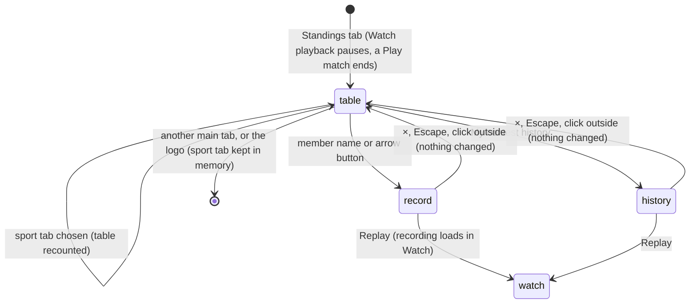

# The Standings tab

## Summary

The Standings tab is the club leaderboard. It ranks the four demo users by their revealed club points, overall or in one sport, and shows how many counted entries each has played. It is read-only: nothing on it changes this browser's save. From it the player can open any user's **Club member record**, and their own contest history.

It is reached from the **Standings** main tab in the header, from any view. It shows, from top to bottom:
- **The heading:** the eyebrow **THE LEADERBOARD**, the title **THE STANDINGS.**, and "Counted wins earn 3 points. Equal totals share a rank."
- **My contest history**, a button on the right of the heading.
- **The sport tabs:** **Overall**, **Cornhole**, **Football**, **Beer pong** and **Basketball**.
- **The table**, with the columns **Rank**, **Club member**, **Points**, **Played** and an unlabelled details column.
- **A note:** "Points reflect results and participation. This local demo leaderboard is saved in this browser."

The counting rules behind every number belong to [points and entries](points-and-entries.md#totals-and-ranks).

## The simple case

On a fresh save, the player clicks **Standings**. **Overall** is selected, and the table reads:

| Rank | Club member | Points | Played |
|---|---|---|---|
| **01** | DG Doug **YOU** | 3 | 1 |
| **02** | RY Riley | 1 | 1 |
| **02** | SM Sam | 1 | 1 |
| **04** | DN Dan | 0 | 1 |

They click **Cornhole**. Nobody has played counted cornhole yet, so all four read **01**, 0 points and 0 played, listed Dan, Doug, Riley, Sam.

They click Doug's name. The **Club member record** opens over the table: "Doug", then 3 **points**, 1 **wins**, 0 **draws**, 0 **losses**, and one row, **Basketball** "ranked" "2 — 0". They press Escape, and Standings is exactly as they left it.

## The interaction, event by event

The action narrated here is opening Standings and inspecting a member, from the tab click until the player leaves.

### Starting

Clicking **Standings** replaces the current view at once:
- **From Watch mid-playback,** the recording pauses first and Watch sound stops. The recording stays loaded, paused where it was.
- **From Play,** the match and Play setup are discarded without warning ([the app shell](../foundations/app-shell.md)).

The table is counted from this browser's save as the page is showing it. A counted entry that is loaded and not yet complete, or that is waiting to resume, is left out ([written and revealed](../foundations/contests-and-recordings.md#written-and-revealed)). The sport tab is whichever was chosen last since the page loaded: **Overall** the first time.

### Backing out at once

Leaving Standings by another main tab or the logo changes nothing. The chosen sport tab is remembered until the page is reloaded.

### Committing

Never commits. Nothing on Standings writes to this browser's save. Choosing a sport tab and opening a member record only change what is shown. The two ways out that do something are **Replay** in a member record or in History, which load a recording in Watch ([history and member record](history-and-member-record.md)).

### While committed

Not applicable: Standings never commits. While it is open, the table still recounts in place whenever this browser's save changes: another tab's write, a policy saved from the gear, or **Reset demo**.

### Resolving

The player leaves by a main tab, the logo, or **Replay**. Nothing is kept except the sport tab, in memory.

## What the table shows

- **Rank.** Two digits: **01**, **02** and so on. Every rank-1 row is drawn in orange, including a tie for first.
- **Club member.** A square avatar with the user's initials on their colour (Doug DG yellow, Dan DN teal, Sam SM orange, Riley RY sand), then the name. The demo user who is "you" has a small **YOU** under their name.
- **Points.** The user's revealed club points, overall or in the selected sport.
- **Played.** The user's revealed counted entries. Exhibitions never count. In a sport tab it is 0 or 1, because each user has one pairing per sport.
- **Details.** An arrow button labelled "View {name} record". It opens the same member record as clicking the name.

**Order and shared ranks.** Rows are sorted by points, highest first. Users with equal points share a rank, and the next rank skips: **01**, **02**, **02**, **04**. Equal users are listed Dan, Doug, Riley, Sam. All four demo users are always listed, including anyone with no counted entries.

**Sport tabs.** **Overall** counts every award. A sport tab counts only that sport's awards, so ranks can differ from tab to tab. The chip and the member record always show overall numbers, whichever tab is selected here.

**"You".** "You" is the demo user last chosen as **Your demo user** in [the setup dialog](../watch/setup-dialog.md): Doug until then. Changing it there moves the **YOU** tag, even if the dialog was closed without starting. There is no sign-in. Being "you" changes nothing in the table but the tag; it also decides whose contests **My contest history** lists.

**The heading's points.** "Counted wins earn N points" shows the *current* policy's win value. Past wins keep the value they were locked under ([points and entries](points-and-entries.md#the-scoring-policy)).

**The member record** opens as the **Club member record** dialog, over the table. Its contents and its replays belong to [history and member record](history-and-member-record.md#the-two-dialogs).

## Modifiers

| Modifier | Set at the start | Changed while committed |
| --- | --- | --- |
| Input device | Mouse or keyboard. The sport tabs are one tab stop: the arrow keys move between them, wrapping at the ends, and Enter or Space selects one. The names and arrow buttons are ordinary buttons. Play devices and game keys do nothing here. | Not applicable: Standings never commits. |
| Event and action combinations | The sport tabs filter the table by sport. The Watch lobby's selected event does not choose a tab, and choosing a tab does not change the lobby's event. | Not applicable: Standings never commits. |
| Contest kind | Only counted entries add points and **Played**. Exhibitions and Play practice never change the table. A replay of a finished counted entry hides that entry's points again until the replay completes (see [edge cases](#edge-cases) and bug-triage B-01). | Not applicable: Standings never commits. |
| Character card | The table lists demo users, not cards. Which card won does not show here. Installed characters add no rows. | Not applicable: Standings never commits. |
| Presentation settings | Reduced motion and lower graphics have no effect: there is no stage. The clean spectator view hides the header, so Standings cannot be reached until it is turned off on the Watch stage. Watch sound is stopped when leaving playback for Standings; the switch stays as it was. | Not applicable: Standings never commits. |
| Screen size and orientation | At 600 px wide and below, **My contest history** moves under the heading text, the sport tabs scroll sideways, and the table's avatars, ranks and padding shrink. | Not applicable: Standings never commits. Resizing reflows the table at once. |
| Saved state | A fresh save shows the table above. A counted entry that is playing or waiting to resume is left out. A save that failed to load shows the headings with no rows. **Counted entries enabled** off changes nothing here; past points stay. | Not applicable: Standings never commits. Another tab's write, a policy change or a reset recounts the table in place. |

## Cancel and interrupt

| Event | Before committing | While committed |
| --- | --- | --- |
| Escape or click outside | With no dialog open, Escape does nothing. With a member record or History open, it closes the dialog and Standings is unchanged. | Not applicable: Standings never commits. |
| Pause or resume | Not applicable: nothing plays in Standings. A Watch recording left for Standings stays paused until **Resume playback** in Watch. | Not applicable: Standings never commits. |
| Repeated or rapid input | Clicking sport tabs quickly recounts for each; the last one stays. Clicking a name twice opens the same record once. | Not applicable: Standings never commits. |
| A panel opens on top | A member record, History, **Arena settings** or **House rules** can open over Standings. The table stays underneath. Saving a policy or resetting the demo there recounts it. | Not applicable: Standings never commits. |
| Navigating away | Another main tab or the logo leaves. **Replay** from a member record or History switches to Watch. The sport tab is kept until reload. | Not applicable: Standings never commits. |
| Forced finish | Not applicable. | Not applicable: Standings never commits. |
| Focus leaves the game | No effect. | Not applicable: Standings never commits. |
| Reload, close, or back/forward cache | The page reopens on the Watch lobby. Standings' sport tab is forgotten and returns to **Overall**. | Not applicable: Standings never commits. |
| Settings or saved data change underneath | Another tab's write recounts the table in place. A policy change updates the heading's win value but no past points. A reset returns the table to the fresh save's. | Not applicable: Standings never commits. |
| Graphics or storage failure | There is no stage here, so WebGL loss has no effect. If the save could not be read, the table has no rows. An error raised from a dialog opened here goes to the Watch error box and is not visible on Standings. | Not applicable: Standings never commits. |
| Input device changes | No effect. | Not applicable: Standings never commits. |

## Interactions with other systems

**Points and the ledger.** Standings shows revealed points only, counted by the rules in [points and entries](points-and-entries.md#totals-and-ranks).

**Saved data and recovery.** Standings reads this browser's save and writes nothing. The note says the leaderboard "is saved in this browser"; it is not shared with any other device ([this browser's save](../foundations/saved-data.md)).

**Watch and Play separation.** Only Watch counted entries appear. Opening Standings pauses Watch playback and ends a Play match.

**Devices and players.** The rows are demo users, not Play players or devices.

**Sound.** Standings makes no sound. Leaving Watch playback for Standings stops Watch sound.

**Reduced motion and graphics quality.** No interaction: Standings has no stage.

**Accessibility.** The sport tabs are a tab list with a selected state. The table has column headers; the details column's header is "Details", read only by screen readers. Each name button is announced with the initials, the name and "YOU" together. Each arrow button is labelled "View {name} record". Recounting after a tab change or another tab's write is not announced ([accessibility](../cross-cutting/accessibility.md)).

**Installed characters.** No interaction. Installed characters are cards, not club members.

**Multiple tabs.** Each tab has its own sport tab. The table follows the shared save. A counted entry another tab is playing is hidden here too, unless this tab has a recording of its own loaded ([points and entries](points-and-entries.md#interactions-with-other-systems)).

**Agent tools.** `read_arena` returns the overall table as this tab shows it: each user's name, points and rank. It does not return **Played** or a sport tab ([agent tools](../cross-cutting/agent-tools.md)).

## Edge cases

- **Played lags entries left.** While a counted entry plays, is paused, or waits to resume, **Played** leaves it out, but the chip's **entries left** already counts it.
- **Replaying a finished counted entry** removes its points from Standings until the replay completes.
- **The Played column in a sport tab** is 0 or 1 for everyone, and at most 4 overall.
- **A four-way tie** shows all four rows as **01** in orange.
- **The member record ignores the sport tab.** Opening Dan's record from the **Cornhole** tab shows his overall points, wins, draws and losses.
- **"Points reflect results and participation"** is only true when the loss value is above 0. With the default policy, a loss earns nothing.
- **A save that failed to load** leaves the table empty, but the heading still reads "Counted wins earn 3 points", the built-in default.
- **The tab is not the lobby's event.** Standings opened from a Beer pong contest still shows **Overall**, or whichever tab was chosen last.

## Open questions and verification

- Read from `components/arena/SecondaryViews.tsx`, `Game.tsx` (`navigate`, `displayState`), `lib/arena/persistence.ts` (`standings`), `components/ui/tabs.tsx` and `app/globals.css`. No test opens Standings; `tests/run-tests.mjs` checks only that four users on 0 all rank 1. Not yet checked on the production page.
- **Tie order.** Equal users are listed in the order of their internal IDs, which happens to be alphabetical. Whether ties should be ordered some other way is a product call.
- **Wins, draws and losses are not in the table.** They are only in the member record. This is a product call.
- **Focus after closing a record.** Where keyboard focus returns after the member record closes has not been checked.
- **The heading's win value** follows the current policy even when the table's points were earned under another. This may confuse players after a policy change.

Verified against Will-You-Be-My-Hero-Arena commit `3b4ec62`
