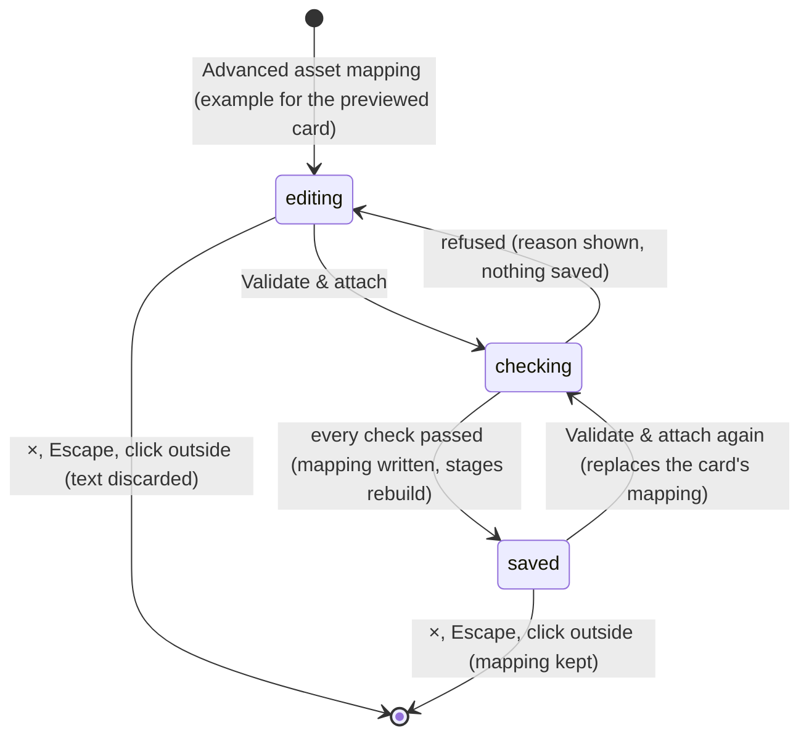

# Asset mapping

## Summary

Asset mapping attaches a hand-written *asset mapping* to an existing card. An asset mapping is a JSON description of how a card's character is drawn: its card image, pose sheet, poses and their foot and hand markers, and optionally its articulated figure, personality and motion profile. Once attached, it replaces the card's own description wherever that card's character is drawn from then on. It changes an existing card; it cannot add one. New cards come from [Install character](install-character.md).

It is the **Advanced asset mapping** link under **Install character** in [the collection's](the-collection.md) heading. It opens the dialog **Card → competitor mapping**, described as "A card image and an animated competitor are two connected assets." The dialog shows:
- the text "Prepare transparent illustrated poses, align the feet, and map each hand position. Attach the finished cutout sequence here. Original card art stays separate."
- a dark text area labelled **Asset manifest JSON**
- **Download example** and **Validate & attach**
- a status line
- the note "Imported mappings remain local. View-angle, animation-state, attachment, and asset checks run before saving."

Attached mappings are kept in the Arena save. There is one per card at most, and only **Reset demo** removes them.

## The simple case

The player previews Dan in The collection and clicks **Advanced asset mapping**. The dialog opens with the text area already holding Dan's own description, as formatted JSON. In its personality they change `"preset"` from `"focused"` to `"cool"`, and press **Validate & attach**.

A moment later the status line reads "Mapping saved. Open the motion preview to review every supported action." The dialog stays open. Behind it, the preview stage rebuilds. When the player closes the dialog, the detail pane names Dan's personality **The ice-cold closer**: "Easy glide · Slow sway · Smooth release · Knowing lean · Small shrug". Every contest locked from now on times Dan's attempts to that personality. His card image and traits are unchanged.

## The interaction, event by event

The action narrated here is attaching a mapping, from opening the dialog until it closes.

### Starting

Clicking **Advanced asset mapping** fills the text area with the *example* for the previewed card, then opens the dialog:
- **For Dan or Doug**, the example is their built-in description, which already passes every check.
- **For an installed character**, it is the description from its pack.

The example is never the card's attached mapping. An attached mapping cannot be viewed from the page.

The status line still shows the last message from earlier in this visit, if there was one.

**Download example** downloads the same example as `character-manifest.json`. It ignores whatever is in the text area.

### Backing out at once

Closing the dialog with ×, Escape or a click outside saves nothing. Edits in the text area are thrown away: the next click on **Advanced asset mapping** fills it with the example again. A press of **Validate & attach** that is refused also saves nothing. The reason is shown and the text is left as it was.

### Committing

**Validate & attach** runs the checks in [what is checked](#what-is-checked), in order, and stops at the first step that fails. When every check passes, the mapping is written to the Arena save and commits. It replaces any earlier mapping for the same card. The write takes the save's cross-tab lock, like locking a contest ([this browser's save](../foundations/saved-data.md#committing)).

There is no busy state. While the images load, the button stays enabled and the dialog can be closed. Pressing it again starts a second check.

### While committed

The status line reads "Mapping saved. Open the motion preview to review every supported action." It is in the same red as the error messages. The dialog stays open with the text as attached. Editing it and pressing **Validate & attach** again replaces the mapping with the new one.

Behind the dialog, the preview stage rebuilds with the mapping. The detail pane's personality follows the mapping's personality, if it has one.

### Resolving

Closing the dialog returns to The collection, with the mapping in force. See [what a mapping changes](#what-a-mapping-changes).

## What is checked

| Step | Refused with |
|---|---|
| The text is JSON | "Invalid JSON: SyntaxError: …", with the browser's own wording |
| It is a well-formed mapping. Every problem is listed, one per line | The messages below |
| Its `cardId` names a card in the collection, built-in or installed | "Add this stable cardId to the CardCatalog adapter before attaching its animation." |
| The card image, the pose sheet, each pose and each part image open in the browser | "Could not load assets:", then each address that failed, one per line |
| The Arena save accepts the write | "Invalid JSON: …" with the storage or save error |

A well-formed mapping:
- is a JSON object ("Paste a JSON character manifest object.")
- has `version` 1, a `cardId`, a `cardImage` and a `sheet`
- has `renderMode` "paper-frames", `family` "human", `facing` "right-three-quarter", `scale` 1, a `frameScale` from 0.1 to 2, and a `groundAnchor` of [0, 0]
- lists all fifteen animation states ("Missing animation state: {state}.") and all four sports ("Map all four supportedEvents before this competitor can enter every event.")
- has, for each of the six poses, an address, a positive width and height, and finite `origin` and `hand` markers
- takes every image from HTTPS, `/assets/` or an embedded PNG or WebP ("Use HTTPS, /assets/, or embedded PNG/WebP for asset URL: {address}")
- has a valid personality, articulated figure and motion profile, if it has them at all. For example, "personality.energy must be between 0.5 and 1.4."

## What a mapping changes

- **The stages.** The collection's preview stage and the Watch lobby's stage rebuild, and draw the card with the mapping wherever it appears ([the stage](../foundations/stage.md#loading-and-rebuilding)).
- **Contests locked afterwards**, exhibitions and counted entries alike. Each copies both cards' current descriptions, mapped or not, into its recording, and is drawn with that copy for good. The recording also takes three things from it: the point where each throw leaves the hand, each attempt's timing from the personality, and in cornhole each bag's shot style from a motion profile. Contests locked earlier, including one waiting to resume, keep what they were locked with.
- **Play.** When **Start {event}** is pressed, each player's card uses its mapping for that match ([Play setup](../play/play-setup.md)).
- **Dan and Doug.** Their body is always drawn from their built-in articulated figure, and on the cornhole court from their cornhole side-view rig. A mapping's poses and sheet are checked but not drawn for them. What changes is the card image on the court, the personality, and the motion profile if the mapping has one.
- **An installed character.** The mapping replaces its pack's figure: the card image on the court, the poses or articulated figure, and their markers. Whether it can then be played in Play depends on the mapping's figure ([Install character](install-character.md#interactions-with-other-systems)).
- **What never changes:** the card images in the grid, the duel cards and the setup dialog, and the card's traits.

> Technical note: the cornhole simulation picks each bag's shot from the card's motion profile, and the shot decides how that bag pushes others on the board. A mapping with a motion profile can therefore change cornhole scores in later contests, including counted entries (`lib/arena/simulation.ts`, lines 66–67).

## Modifiers

| Modifier | Set at the start | Changed while committed |
| --- | --- | --- |
| Input device | A mouse or the keyboard. The text area takes typing and pasting. Tab moves focus out of it rather than typing a tab. Escape closes the dialog even from inside the text area. | No effect. |
| Event and action combinations | A mapping must cover all four sports and all fifteen animation states, so one mapping serves every Watch sport and Play event. | Not applicable: a mapping has no per-sport part. |
| Contest kind | Every contest locked after attaching uses the mapping. Replays and a contest waiting to resume keep the mapping they were locked with. Play practice picks it up at **Start**. | Not applicable: attaching never changes a locked contest. |
| Character card | The example and **Download example** come from the previewed card. The mapping attaches to whichever card its `cardId` names, whatever card is previewed. Dan and Doug take less from a mapping than installed characters do (see above). | Attaching again for the same card replaces its mapping. |
| Presentation settings | No effect on the checks. The rebuilt stages follow **Reduced motion** and **Lower graphics quality** as usual. The clean spectator view cannot be on here. | No effect. |
| Screen size and orientation | The dialog is 850 px wide, or the window width less 36 px, and scrolls within 92% of the window height. The text area is 280 px high. At 600 px wide and below, the two buttons stack. | Reflows at once. |
| Saved state | The mapping is written into the Arena save. A corrupt save refuses it with "Invalid JSON: Error: The local save did not pass its integrity check." | **Reset demo** removes every mapping. Another tab attaching one for the same card replaces this one. |

## Cancel and interrupt

| Event | Before committing | While committed |
| --- | --- | --- |
| Escape or click outside | Closes the dialog; the edits are discarded. If images are still being checked, the check carries on, and a mapping that passes is saved with the dialog closed. The only signs are the stage rebuilding and the status line next time. | Closes the dialog; the mapping stays attached. |
| Pause or resume | Not applicable: nothing plays in the dialog. | Not applicable. |
| Repeated or rapid input | A double-click on **Validate & attach** runs the checks twice and can write the same mapping twice. The result is the same. | Each further **Validate & attach** that passes writes again and rebuilds the stages again. |
| A panel opens on top | Not applicable: the dialog covers the gear and footer. It shares one window with Arena settings, House rules, History and the other panels, so only one of them can be open. | Not applicable. |
| Navigating away | The dialog covers the tabs and logo. If the agent tool switches to Watch, the dialog stays open over the Watch lobby. | The same. |
| Forced finish | Not applicable. | Not applicable. |
| Focus leaves the game | No effect; a check under way carries on. | No effect. |
| Reload, close, or back/forward cache | The text and the status are lost; nothing is saved. | The mapping survives a reload. The write is all or nothing ([this browser's save](../foundations/saved-data.md#committing)). |
| Settings or saved data change underneath | **Reduced motion**, the scoring policy and other tabs' writes do not affect the checks. A reset from another tab does not change the text area. | A reset, here or in another tab, removes the mapping. The last mapping written for a card, from any tab, is the one in force. |
| Graphics or storage failure | An image that fails to load refuses the mapping. A full storage quota is reported as "Invalid JSON: …" with the browser's error. | A stage that later cannot load a mapped image reports it in the Watch error box, which is not visible from The collection. |
| Input device changes | No effect. | No effect. |

## Interactions with other systems

**Points and the ledger.** A mapping awards nothing. It is copied into counted entries locked afterwards, where its motion profile can change cornhole scores (see the technical note above; [points and entries](../club/points-and-entries.md)).

**Saved data and recovery.** Mappings are part of the Arena save and of **Export local save**. **Reset demo** removes all of them together with the played contests and awards; there is no other way to remove one ([Reset demo](../club/reset-demo.md)).

**Watch and Play separation.** Watch takes the mapping when a contest is locked, and Play when a match starts. Neither changes a contest or match already under way.

**Devices and players.** No interaction.

**Sound.** No interaction.

**Reduced motion and graphics quality.** No effect on attaching. Each stage that rebuilds applies them as usual ([the stage](../foundations/stage.md)).

**Accessibility.** The text area is labelled **Asset manifest JSON**. The status line is a status region, so each result is announced, but errors are not marked as alerts. Success and errors are shown in the same red ([accessibility](../cross-cutting/accessibility.md)).

**Installed characters.** A mapping can name an installed card. That card's example, however, cannot be attached unchanged: its images exist only inside the character library, so the load check fails with "Could not load assets:" followed by every one of its addresses.

**Multiple tabs.** Writes are serialized across tabs, and each tab reloads the save and rebuilds its stages when another attaches a mapping.

**Agent tools.** No tool reads or writes mappings. `configure_arena_event` can switch to Watch while the dialog is open ([agent tools](../cross-cutting/agent-tools.md)).

## Edge cases

- **A mapping without a `parts` entry** passes the format checks, then fails with "Invalid JSON: TypeError: …", although the JSON is valid.
- **Attaching the unedited example** for Dan or Doug saves a mapping identical to their built-in description. It looks like no mapping, but it is copied into later contests and removed only by **Reset demo**.
- **The articulated figure's image** is not among the addresses checked. A bad address there passes and fails later on the stage.
- **Remote HTTPS images** only have to display in the dialog's check. The stage loads them differently, and a server that does not allow cross-origin use can make the stage fail after the mapping is saved.
- **With the character library unavailable**, attaching still writes the Arena save, and the page then shows that save for the first time. **Set up showdown** becomes usable although the library error remains.
- **The status line persists** for the rest of the visit, including "Mapping saved…" above a freshly reset example.
- **The two pre-played basketball contests** in a fresh save were made without any card descriptions. Their replays therefore draw each card with its *current* mapping, unlike every contest locked on the page.

## Open questions and verification

- Read from `components/arena/Panels.tsx` (the import panel), `SecondaryViews.tsx`, `Game.tsx`, `lib/arena/assets.ts`, `lib/arena/persistence.ts`, `lib/arena/simulation.ts` and `lib/arena/engine/scenes/CharacterAssetLoader.ts`. `tests/run-tests.mjs` checks that the built-in examples pass validation. Nothing here has been checked on the production page.
- **Misleading "Invalid JSON" errors.** A missing `parts`, a full storage quota and a corrupt save are all reported as invalid JSON (`Panels.tsx`, line 15). This looks like a bug.
- **Installed characters' examples cannot be attached**, because the check loads their library-only image addresses directly (`Panels.tsx`, line 15; `character-registry.ts`, line 7). This looks like a bug.
- **No way to see or remove one mapping.** The text area always shows the example, and only **Reset demo** removes mappings (`SecondaryViews.tsx`, line 16). This is a product call.
- **No busy state** while images load (`Panels.tsx`, line 15). Whether a double attach is visible to the player has not been tried.
- **Mappings can change cornhole outcomes** through a motion profile (`simulation.ts`, lines 66–67). Whether a presentation mapping should be able to do that in counted entries is a product call.
- **Remote images on the stage**, **a bad articulated-figure address** and **attaching with the character library unavailable** have not been tried.

Verified against Will-You-Be-My-Hero-Arena commit `3b4ec62`
