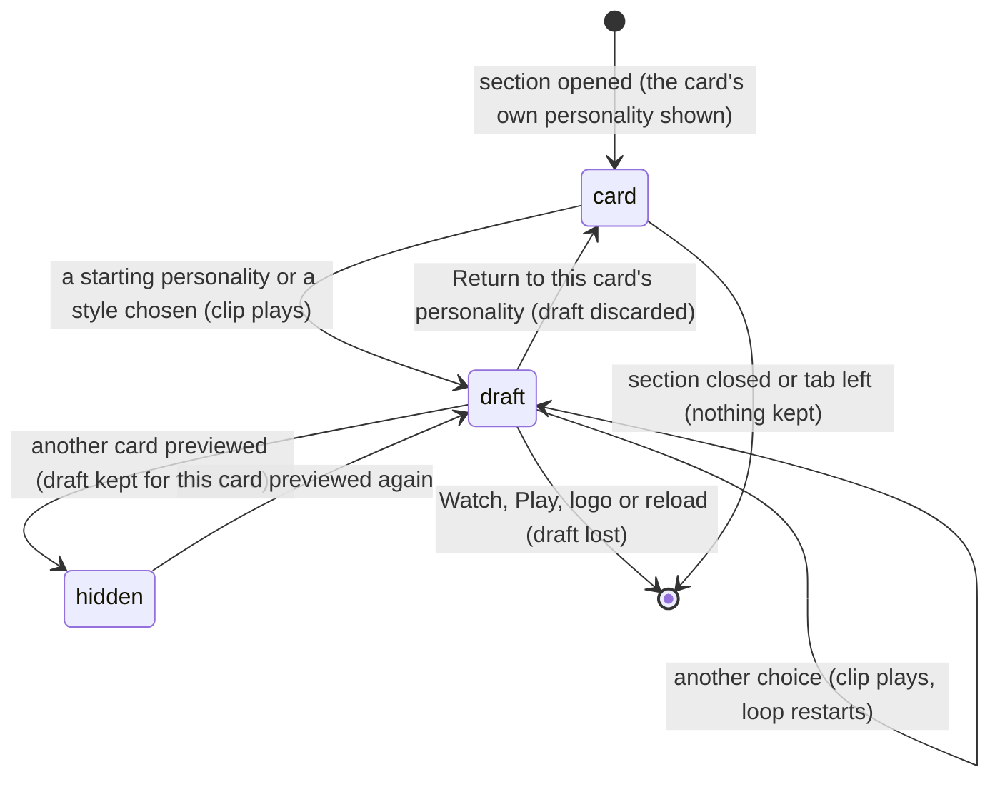

# Explore motion styles

## Summary

Explore motion styles is a preview-only mixer for a card's *personality*: the named combination of five motion styles that shapes how its character enters, waits, throws, celebrates and reacts to a miss. The player picks a starting personality, then any of eight styles for each of the five moments. Each choice plays the matching clip on [the collection's](the-collection.md) preview stage, and rewrites the personality shown in the detail pane. The result is a *motion-style draft*. It is never saved, and it never reaches a card, an installed character, a recording, Watch or Play.

It is a collapsed section headed **Explore motion styles**, under the card grid and detail pane in **The collection**. Opening it shows "Mix an entrance, idle, throw, celebration and miss reaction. These are previews; Codex saves your chosen combination with a new character pack." and six pickers:
- **Starting personality**
- **Entrance style**
- **Idle style**
- **Throw style**
- **Celebration style**
- **Miss reaction**

It works on whichever card is previewed, built-in or installed.

## The simple case

The player selects **03 Beer pong** in the Watch lobby, then opens **The collection**, clicks Doug's card, and opens **Explore motion styles**. The pickers show Doug's personality: **The lock-in showman**, with **Fist-first pop**, **Heel tap**, **Quick snap**, **Showy flourish** and **Annoyed stamp**.

They choose **The wildcard** as the **Starting personality**. The **Motion preview** switches to **Card portal entrance**, and both Dougs burst out of their card portals. The detail pane now reads **The wildcard**: "Wobbly burst · Restless shuffle · Offbeat wind-up · Victory jig · Disbelief wobble". A **Return to this card’s personality** link appears under the pickers.

They set **Celebration style** to **Crowd bow**. The Motion preview switches to **Celebration** and both Dougs bow on a loop. They click **Return to this card’s personality**: the pickers and the detail pane go back to **The lock-in showman**, and the link disappears.

With the lobby on Cornhole, which is the default, the same steps change the text but not the stage: see [Dan and Doug on the cornhole court](#dan-and-doug-on-the-cornhole-court).

## The interaction, event by event

The action narrated here is auditioning a combination, from opening the section until the draft is abandoned.

### Starting

Clicking **Explore motion styles** opens the section. The pickers show the previewed card's personality: its starting personality and its five styles. That personality comes from:
- the card's attached [asset mapping](asset-mapping.md), if it has one
- otherwise, an installed character's pack
- when neither holds a valid personality: **The quiet operator** for Dan, **The lock-in showman** for Doug, and for any other card a starting personality picked from its character ID, the same one every time

If a draft already exists for this card, the pickers show the draft instead, with the **Return to this card’s personality** link. Opening the section changes nothing on the stage.

### Backing out at once

Closing the section, or leaving the tab, before choosing anything keeps nothing and changes nothing.

### Committing

Never commits. Nothing is ever written, and there is no way to export a draft. The first choice creates a draft, and that is the point after which leaving loses something. In the tables below, "while committed" means "while a draft exists".

The first choice fixes nothing either. Every picker can be changed again, and the draft can be dropped at any time.

### While committed

Each choice updates three things at once:
- **The draft.** A new **Starting personality** replaces the whole combination with that personality's five styles. It throws away any styles chosen one at a time. A single style changes only that moment.
- **The detail pane.** Its personality name and five-move summary follow the draft.
- **The preview.** The **Motion preview** switches to the clip for that moment and restarts it from its beginning:

  | Choice | **Motion preview** becomes | Court |
  |---|---|---|
  | **Starting personality** | **Card portal entrance** | The lobby's event |
  | **Entrance style** | **Card portal entrance** | The lobby's event |
  | **Idle style** | **Personality idle** | The lobby's event |
  | **Throw style** | **cornhole** | Cornhole, rebuilt if it was another court |
  | **Celebration style** | **Celebration** | The lobby's event |
  | **Miss reaction** | **Frustration** | The lobby's event |

  The player can also choose any other **Motion preview** clip by hand. The draft still applies to it.

Closing the section keeps the draft, and the preview keeps showing it.

### Resolving

A draft ends in one of these ways:
- **Return to this card’s personality** discards it. The pickers, the detail pane and the preview go back to the card's own personality. The Motion preview stays on whatever clip was last chosen.
- **Previewing another card** hides it. It comes back if the player returns to this card, unless they made a draft for another card in between, which replaces it.
- **Leaving for Watch or Play**, clicking the logo, **Replay** from History, or reloading loses it without a warning. Going to **Standings** and back keeps it.

Nothing is kept anywhere else. The card, its pack and every recording keep the personality they had.

## The choices

There are 24 starting personalities: The quiet operator, The lock-in showman, The wildcard, The ice-cold closer, The powerhouse, The sharpshooter, The hothead, The trickster, The old hand, The eager rookie, The headliner, The stone face, The hype machine, The scrappy underdog, The perfectionist, The swagger king, The party starter, The comeback kid, The slow burn, The live wire, The zen master, The relentless grinder, The chaos merchant and The clubhouse captain.

| Picker | Styles |
|---|---|
| **Entrance style** | Planted arrival, Fist-first pop, Wobbly burst, Easy glide, Heavy landing, Side slide, Paper twist, Spring-loaded hop |
| **Idle style** | Quiet breathing, Heel tap, Restless shuffle, Slow sway, Watchful lean, Rhythmic bob, Weight shift, Relaxed lean |
| **Throw style** | Measured setup, Quick snap, Offbeat wind-up, Smooth release, Power drive, Pendulum rock, Hesitation beat, Whip release |
| **Celebration style** | Quiet fist raise, Showy flourish, Victory jig, Knowing lean, Raised-arm salute, Victory strut, Excited pop, Crowd bow |
| **Miss reaction** | Head-down reset, Annoyed stamp, Disbelief wobble, Small shrug, Surprised recoil, Impatient shuffle, Deadpan hold, Deflated slump |

A personality also has an energy, a tempo and a variation number. The mixer cannot change them; a draft keeps the card's own.

## Dan and Doug on the cornhole court

On a cornhole court, the preview draws Dan and Doug with their cornhole side-view rig, which only stands in its rest idle ([the collection](the-collection.md#motion-preview-clips)). So for Dan and Doug:
- With the lobby on Cornhole, the default, no choice here changes the stage. Only the detail pane's text changes.
- With another lobby event, the entrance, idle, celebration and miss choices show on that court.
- A **Throw style** can never be seen. Choosing one always moves the preview to the cornhole court, where the rig only idles.

Installed characters have no side-view rig, so every choice shows, and **Throw style** plays a cornhole throw at that style's pace.

## Modifiers

| Modifier | Set at the start | Changed while committed |
| --- | --- | --- |
| Input device | A mouse, touch or the keyboard. The summary opens with Enter; the pickers are labelled and reachable with Tab. Game keys do nothing here. | No effect. |
| Event and action combinations | The Watch lobby's event sets the court for every choice except **Throw style**, which always uses Cornhole. | Not applicable: the lobby's event cannot change from this tab. |
| Contest kind | Not applicable: a draft never reaches a contest. Watch contests always use the card's own personality. | Not applicable. |
| Character card | The starting values are the card's own personality. Dan and Doug show nothing on a cornhole court. An installed character shows every choice. A personality with its own name, such as an installed pack's, keeps that name when single styles change; a new **Starting personality** replaces it with that personality's name. | The draft belongs to the card it was made on: see [resolving](#resolving). |
| Presentation settings | **Reduced motion** plays each style in its reduced form, and the entrance loses its burst and puff. **Lower graphics quality** only rebuilds the stage. The preview makes no sound. The clean spectator view cannot be on here. | Toggling either setting keeps the draft. |
| Screen size and orientation | The pickers sit in a grid of columns at least 220 px wide: as many as fit on a wide window, one on a phone. | Reflows at once; the draft is kept. |
| Saved state | An attached asset mapping's personality is the starting point for that card. Nothing about the mixer is saved, so a fresh or returning save starts the same way. | A new mapping or **Reset demo** changes the card's own personality underneath. The draft is kept, and **Return to this card’s personality** then returns to the new one. |

## Cancel and interrupt

| Event | Before committing | While committed |
| --- | --- | --- |
| Escape or click outside | Closes an open picker. The section itself does not close with Escape. | The same; the draft is kept. |
| Pause or resume | Not applicable: the preview has no pause. | Not applicable. |
| Repeated or rapid input | Each choice replaces the last and restarts the clip. | A new **Starting personality** discards every single style chosen before it. Clicking **Return to this card’s personality** twice is impossible: the link disappears after the first click. |
| A panel opens on top | No effect. | The draft is kept, and the preview keeps looping behind the dialog. |
| Navigating away | Nothing to lose. | **Standings** and back keeps the draft, with the section closed. Watch, Play, the logo and **Replay** from History lose it without a warning. |
| Forced finish | Not applicable. | Not applicable. |
| Focus leaves the game | Hiding the browser tab freezes the preview loop. | The same; the draft is kept. |
| Reload, close, or back/forward cache | Nothing is kept. | The draft is lost. |
| Settings or saved data change underneath | **Reduced motion** applies at once. A reload of the Arena save, for example another tab's write, rebuilds the stage; the loop carries on from where it was. | The same; the draft is kept and still shown. |
| Graphics or storage failure | A lost graphics context freezes the preview, with its message only on the Watch tab. Storage is never involved. | The same; the draft is kept. |
| Input device changes | No effect. | No effect. |

## Interactions with other systems

**Points and the ledger.** No interaction. A draft never reaches a contest.

**Saved data and recovery.** No interaction. Drafts are held in memory only and are not in any export. The on-screen text says Codex saves a chosen combination with a new character pack, but the page offers no way to copy or export one ([this browser's save](../foundations/saved-data.md)).

**Watch and Play separation.** Neither sees a draft. Watch contests and Play matches use the card's own personality, from its pack or mapping.

**Devices and players.** No interaction.

**Sound.** No interaction. The preview is silent ([sound](../cross-cutting/sound.md)).

**Reduced motion and graphics quality.** Reduced motion plays reduced styles; Lower graphics quality only rebuilds the stage ([the stage](../foundations/stage.md)).

**Accessibility.** The section is a native disclosure, and each picker is labelled. The detail pane's personality text changes with each choice but is not announced. The preview is visual only ([accessibility](../cross-cutting/accessibility.md)).

**Installed characters.** The mixer works fully for them. A draft never changes an installed character; a changed personality needs a new pack ([Install character](install-character.md)).

**Multiple tabs.** Each tab has its own draft.

**Agent tools.** `configure_arena_event` switches to Watch, which loses the draft. `read_arena` cannot see it ([agent tools](../cross-cutting/agent-tools.md)).

## Edge cases

- **The name can mislead.** After a single style changes, the detail pane still shows the starting personality's name above a summary that no longer matches it.
- **A card's own clips differ from its styles.** Undrafted, Dan and Doug play clips from their character profiles. A draft plays the mixer's style clips instead, so choosing the styles a card already has can still look different.
- **The Animation library wins.** While an **Animation library** clip is chosen, the stage plays it and ignores the draft, except that a throw clip keeps the draft's pace.
- **The throw preview's loop length** follows the card's own personality, not the draft's, so a slower draft throw can be cut off at the end of each loop.

## Open questions and verification

- Read from `components/arena/MotionExplorer.tsx`, `SecondaryViews.tsx`, `lib/arena/personality.ts`, `lib/arena/motion-catalog.json` and `lib/arena/engine/scenes/ArenaScene.ts`. Not yet checked on the production page. No test drives the mixer on `/`.
- **Nothing shows for Dan and Doug on the cornhole court**, including every **Throw style** (`ArenaScene.ts`, lines 188–191; `MotionExplorer.tsx`, line 7). This looks like a bug.
- **No way to keep a draft.** The text points to Codex, but the page gives the player nothing to take there. This is a product call.
- **The personality name after single changes** is kept (`MotionExplorer.tsx`, line 14) while a new starting personality drops it (line 13). Whether a changed mix should keep the original name is a product call.
- **The loop length** uses the card's personality rather than the draft's (`ArenaScene.ts`, line 504). Whether that cuts off slow throws has not been seen.
- **Whether every style clip plays** without error on every court has not been seen.
- **Choosing the starting personality already shown**, with no draft: whether it creates a draft and the **Return to this card’s personality** link depends on whether the picker reports an unchanged choice. Not tried.

Verified against Will-You-Be-My-Hero-Arena commit `3b4ec62`
