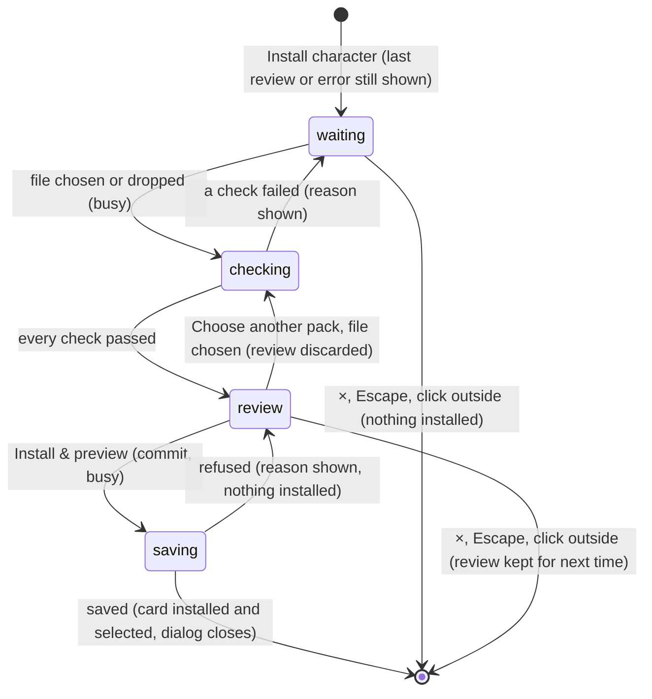

# Install character

## Summary

Install character adds a new card to the Arena from a *character pack*: one `.arena-character.json` file that holds a card, its six pose drawings, their markers, its traits and its personality. The player chooses or drops the file, the page checks it and shows it for review, and **Install & preview** saves it. From then on it is an *installed character*: a card that every demo user owns, that can compete in every Watch sport, and that is kept in this browser's *character library*.

It is the **Install character** button at the right of [the collection's](the-collection.md) heading. It opens a dialog titled **FROM CARD TO COURT.**, described as "Install the finished character pack from your Codex chat." The dialog is *busy* while it checks or saves a pack. It then refuses to close, and its file controls are disabled. How a card becomes a pack in Codex is outside this description; this document starts when a pack reaches the page.

There is no uninstall. An installed character stays until the browser's site data for the Arena is cleared.

## The simple case

The player clicks **Install character**. The dialog shows a yellow box headed **MAKE YOUR NEXT COMPETITOR**, with "Upload a card in Codex and say:" and the quote "“Make this card an arena character.”". Under it is a dashed drop zone, **Choose character pack**, "or drop the .arena-character.json file here".

They drop the pack onto the zone. A spinner and "Checking the card, six poses and alignment…" show for a moment. Then the dialog shows the review:
- **The card image**, tilted, beside **YOUR NEXT COMPETITOR**, the character's name and description, and a badge reading **Four sports · Six poses**.
- **The six poses** on a checkerboard, captioned **Ready**, **Backswing**, **Release**, **Football**, **Basketball** and **Celebrate**.
- **The status** "All six poses checked. Ready to install."
- **Two buttons**, **Choose another pack** and **Install & preview**.

They press **Install & preview**. "Saving your character…" shows briefly, and the dialog closes. The new card is at the end of the card grid, outlined as the previewed card, and two copies of the character idle on the preview stage. In Watch it is now *your* card: the first duel card in the lobby, **THROWS FIRST**.

## The interaction, event by event

The action narrated here is installing a pack, from opening the dialog until it closes.

### Starting

The dialog opens as it was last left, as long as the player has stayed on The collection. A pack under review is still under review, and an error is still shown. On a first opening it shows the yellow Codex box and the drop zone. The line at the bottom always reads "Installed characters stay in this browser. Keep the pack to install on another device. The original card stays intact."

Choosing a file starts the check. The player either clicks the drop zone, which opens the browser's file picker filtered to `.json` files, or drops a file onto the dashed zone. At that instant:
- Any pack under review and any error are cleared.
- The dialog becomes busy. The drop zone greys out, and the status line shows a spinner and "Checking the card, six poses and alignment…".
- The checks run in the order in [what is checked](#what-is-checked), and stop at the first failure.

### Backing out at once

Closing the dialog installs nothing. It closes with ×, Escape or a click outside whenever it is not busy. A pack under review, or the last error, is kept in the dialog and shown again next time, until the player leaves The collection. If a check fails, the reason appears in a red box, the drop zone is usable again, and nothing is kept from that file.

A pack that has passed its checks is held only in the open page. Nothing is written until **Install & preview**.

### Committing

**Install & preview** commits. The dialog becomes busy again, with "Saving your character…" and a spinner. Both review buttons are disabled.

The pack is checked once more against what is already installed:
- **In this tab.** If a card with the same character ID is already installed with a different revision, the install is refused: "This character ID is already in use. Ask Codex for a new pack ID."
- **In the character library.** If the library holds a different pack under the same ID, for example one installed from another tab, the install is refused: "A different pack uses this character ID. Existing characters and saved matches were kept."
- **The identical pack.** Installing it again succeeds without adding a second card. It simply selects it.

The pack is then written to the character library in one step. The write either completes or leaves the library as it was.

### While committed

Saving normally takes a moment. The dialog stays busy and refuses to close until it ends. Nothing else on the page waits for it.

### Resolving

**Installed.** The dialog closes and forgets the pack. At once:
- The card joins the card grid and the collection of every demo user. Each demo user now owns a copy.
- It becomes the previewed card, and the **Motion preview** returns to **Personality idle**. The preview stage rebuilds with two copies of it.
- It becomes your card in [the setup dialog](../watch/setup-dialog.md), so the Watch lobby shows it as the first duel card.
- **Replayable showcase seed** is unticked.
- The Arena save is read again. Nothing is written to it.

The player is left on The collection.

**Refused.** The dialog stays open with the review still shown, and the reason appears in a red box. The player can press **Install & preview** again, choose another pack, or close the dialog. Nothing is installed. The storage messages are in [cancel and interrupt](#cancel-and-interrupt).

## What is checked

The checks run when a file is chosen, in this order. The first failure is shown, word for word:

| Check | Message |
|---|---|
| The file is at most 40 MB (40 × 1024 × 1024 bytes) | "Choose a character pack under 40 MB." |
| The file is JSON (an image or any other file fails here) | "Choose the .arena-character.json file from Codex, not the original card image." |
| It is a version 1 Arena character pack | "Choose a finished .arena-character.json pack made by Codex. A card image alone is not a character pack." |
| The ID is `card-` then 3–71 lowercase letters, digits or hyphens, and is not Dan's or Doug's | "The pack needs a unique character ID; original characters cannot be replaced." |
| The revision is 16 hexadecimal digits | "The character pack revision is invalid." |
| Name, subtitle, signature, rarity and asset name have 1–120 characters; the description 1–1000 | "The pack needs a valid {field}." |
| The card is a person | "This character-pack version supports people. Pet characters need their own animation family." |
| The colour is `#rrggbb` and the specialty one of the four sports | "The character color or sport is invalid." |
| Each trait is a whole number from 25 to 95, and the three total 200 | "Character traits must total 200, with each trait between 25 and 95." |
| Exactly the card, the pose sheet and the six poses, plus the articulated atlas if the pack has one | "The pack must contain the card, pose sheet, six poses and its articulated atlas when registered." |
| Each image is an embedded PNG with a SHA-256 checksum | "Missing or invalid PNG: {file}" |
| The embedded images, as text, total at most 40 MB | "This pack is too large. Codex should optimize it to under 40 MB." |
| The manifest passes the same checks as an [asset mapping](asset-mapping.md#what-is-checked) | Those messages, joined into one line |
| The pack's motion profile, if any, belongs to this ID and brings no rig of its own | "The performance profile must belong to this character." or "Portable PNG packs use the native character rig; Spine exports need the separate licensed asset workflow." |
| The artwork paths belong to this ID and revision | "The pack artwork does not match its character ID." or "The articulated atlas must belong to this character pack." |
| Exactly six poses, each at most 2048 × 2048, with markers inside the drawing | "This pack version requires exactly six registered poses.", "Invalid pose image or dimensions: {pose}" or "The {pose} {origin/hand} marker is outside the drawing." |
| The ready pose, scaled, is 260–420 pixels tall | "The character must be sized to fit the arena." |
| The pack has its creation record | "The character pack is missing its creation record." |

Then each image is opened, one at a time, to bound memory on phones:

| Check | Message |
|---|---|
| The bytes start with the PNG signature | "Invalid PNG bytes: {file}" |
| The bytes match the checksum | "The pack contains a damaged image: {file}. Export it again from Codex." |
| The browser can decode it | "Could not open {file}" |
| At most 6144 pixels on a side and 12 million pixels in all | "The image is too large: {file}" |
| Each pose, and the atlas, has the size its markers were drawn for | "Pose dimensions do not match the drawing: {pose}" or "Articulated atlas dimensions do not match the drawing." |
| Each pose, and the atlas, is at least 5% clear background and at least 5% solid drawing. A magenta background counts as clear in an atlas that declares one | "The {pose} drawing needs a prepared background and a visible character. Codex must finish the cutout before installing.", or "The articulated atlas drawing…" |

The card image and the pose sheet are not checked for transparency.

A pack with an articulated atlas shows "Articulated character, movement tracks and fallback poses checked. Ready to install." and the badge **Four sports · Articulated movement**. Every other pack shows the six-pose wording.

## Modifiers

| Modifier | Set at the start | Changed while committed |
| --- | --- | --- |
| Input device | **Mouse:** click the drop zone, or drag the file onto it. **Keyboard:** Tab to the drop zone and press Enter to open the file picker. **Touch:** tap the drop zone to open the file picker. | No effect. |
| Event and action combinations | No effect: a pack always covers all four Watch sports, as its badge says. | Not applicable. |
| Contest kind | No effect on installing. After installing, your next exhibition or counted entry uses the new card unless you change it. A loaded Watch recording stays as it was. | Not applicable. |
| Character card | A pack cannot replace Dan or Doug, or an installed card with a different revision. Which card was previewed before does not matter. Only packs with a connected rig can be used in Play: see [installed characters](#interactions-with-other-systems). | Not applicable: the pack is fixed at **Install & preview**. |
| Presentation settings | The operating system's reduced-motion setting stops the spinner from spinning. The **Reduced motion** and **Lower graphics quality** checkboxes and the sound switches have no effect on the dialog. | No effect. |
| Screen size and orientation | The dialog is 860 px wide, or the window width less 28 px, and scrolls within 92% of the window height. At 640 px wide and below, the poses sit in two rows of three, and the buttons stack full width with **Install & preview** on top. | Reflows at once. |
| Saved state | Installed characters already in the library decide which IDs conflict. If the library cannot open, checking still works but installing fails. The Arena save, its entries and its policy make no difference. | A corrupt Arena save makes a successful install look like a failure: see [edge cases](#edge-cases). |

## Cancel and interrupt

| Event | Before committing | While committed |
| --- | --- | --- |
| Escape or click outside | Closes the dialog unless it is busy checking a file; while checking, Escape, the × and a click outside do nothing. A review or error is kept for next time. | Refused: the dialog stays open until saving ends. |
| Pause or resume | Not applicable: nothing plays in the dialog. | Not applicable. |
| Repeated or rapid input | The drop zone, the file picker and **Choose another pack** are disabled while a file is checked, so a second file cannot start. Choosing the same file again re-checks it. | **Install & preview** is disabled once pressed, so the pack is saved once. |
| A panel opens on top | Not applicable: the dialog covers the gear and the footer. | Not applicable. |
| Navigating away | The dialog covers the tabs and logo. Only the agent tool can switch views under it. The dialog then disappears, even while busy, and a check under way is abandoned. | If the agent tool switches views during saving, the dialog disappears but the save finishes. The card is still installed and selected as your card. |
| Forced finish | Not applicable. | Not applicable. |
| Focus leaves the game | No effect; the check carries on in a hidden tab. | No effect; saving carries on. |
| Reload, close, or back/forward cache | Nothing is installed. The chosen file is not kept. | The library write is all or nothing. After reloading, the card is either in the collection or not; if not, install again. |
| Settings or saved data change underneath | Another tab installing the same pack ID first makes this install fail with "A different pack uses this character ID…", unless the packs are identical. **Reset demo** anywhere leaves installed characters alone. | The same. |
| Graphics or storage failure | If the library cannot open, installing fails with "The character library could not be opened. Check that browser storage is available." | If the browser refuses the write, the message is "The character could not be saved. Browser storage may be full." or "The character was not installed." Nothing is installed. |
| Input device changes | No effect. | No effect. |

After any failure the review stays, so the player can retry without choosing the file again.

## Interactions with other systems

**Points and the ledger.** No interaction. An installed card earns points only as your card in a counted entry, like any other card.

**Saved data and recovery.** Packs are stored in the character library, IndexedDB `wybmh-character-library-v1`, keyed by character ID. The library is separate from the Arena save. It is not in **Export local save**, and **Reset demo** does not touch it. Recordings name the card and its image paths but hold no images, so a recording that uses an installed character needs that character in the library to show. The pack file is the only backup ([this browser's save](../foundations/saved-data.md)).

**Watch and Play separation.** In Watch the card competes in every sport with its pack's traits and personality ([contests and recordings](../foundations/contests-and-recordings.md)). In Play it is listed in each slot's character choice. It can start a match only if its pack has an articulated atlas with a *connected rig*, a registration that joins the limbs to the body. Otherwise **Start** fails with "{name} needs a connected character rig for direct play. Its existing poses remain available in Watch." ([Play setup](../play/play-setup.md)). The review does not say which kind a pack is: both kinds of articulated pack read **Articulated movement**, and a **Six poses** pack never works in Play.

**Devices and players.** No interaction.

**Sound.** No interaction. The dialog makes no sound.

**Reduced motion and graphics quality.** Only the spinner follows the operating system's reduced-motion setting ([the stage](../foundations/stage.md)).

**Accessibility.** The dialog has a title and a description, and takes focus. The drop zone is a button whose text names it. The file input is visually hidden but labelled "Character pack file". The status line is a status region, and errors are alerts. The card and poses have text alternatives, such as "{name} Ready pose" ([accessibility](../cross-cutting/accessibility.md)).

**Installed characters.** This document is the owner. An installed card appears in [the collection](the-collection.md), in both user collections in [the setup dialog](../watch/setup-dialog.md), and in Play setup.

**Multiple tabs.** Every tab shares the character library, but a tab only reads it when the page loads and whenever another tab writes the Arena save. Another open tab does not show the new card until it reloads or the Arena save is written somewhere.

**Agent tools.** No tool installs a character. `configure_arena_event` can switch views under the dialog, as described above ([agent tools](../cross-cutting/agent-tools.md)).

## Edge cases

- **A conflicting pack passes the review.** ID conflicts are only checked at **Install & preview**, so a pack that will be refused is first shown as "Ready to install."
- **Choose another pack throws the review away** as soon as a new file is chosen, even if the new file fails. Cancelling the file picker keeps the review.
- **The drop zone disappears during review.** A second pack can only be chosen with **Choose another pack**, not dropped.
- **Dropping outside the dashed zone** is not handled by the page. Browsers then open the file in the tab by default, which leaves the Arena.
- **Grid order.** A card installed this visit is added at the end of the grid. After a reload, installed cards follow Dan and Doug in the order of their IDs.
- **A corrupt Arena save.** The pack is installed, but reading the save afterwards fails. The dialog stays open showing the save's error, as if the install had failed.
- **The Animation library** keeps its clip after an install, so the new card appears playing that clip rather than idling.
- **No way to remove a card.** An unwanted installed card stays in every list. Clearing the site's data removes it, together with this browser's save.

## Open questions and verification

- Read from `components/arena/CharacterInstaller.tsx`, `lib/arena/character-pack.ts`, `character-store.ts`, `character-registry.ts`, `Game.tsx` (`onCharacterInstalled`) and `lib/arena/engine/core/ArenaSession.ts`. `tests/run-tests.mjs` checks pack validation, duplicate registration and recordings with an installed card, outside the page. Nothing here has been checked on the production page.
- **The review keeps a pack after closing.** Reopening the dialog shows the last review or error (`CharacterInstaller.tsx`, line 16). Whether it should start fresh is a product call.
- **Success reported as failure** when the Arena save is corrupt: `onCharacterInstalled` re-reads the save inside the install's error handling (`Game.tsx`, line 65; `CharacterInstaller.tsx`, line 15). This looks like a bug.
- **Storage-full wording.** An exceeded quota aborts the library transaction rather than failing a request, which would show "The character was not installed." instead of the storage-full message (`character-store.ts`, line 38). Not tried.
- **"Articulated movement" does not promise Play.** Play needs a connected-rig registration that the review never mentions (`CharacterInstaller.tsx`, line 20; `ArenaSession.ts`, lines 76–82). This may be worth treating as a bug.
- **Dropping outside the zone.** Whether it navigates away from the Arena, as described above, has not been tried (`CharacterInstaller.tsx`, line 19).
- **The hidden file input.** Whether it is an invisible stop in the Tab order has not been tried (`CharacterInstaller.tsx`, line 18).
- **Privacy-hardened browsers** that disturb canvas pixels could fail the transparency check on a good pack (`character-store.ts`, line 29). Not tried.

Verified against Will-You-Be-My-Hero-Arena commit `3b4ec62`
