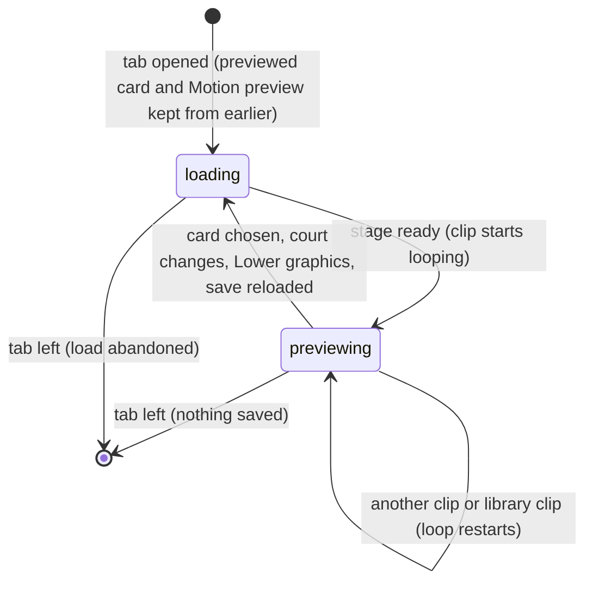

# The collection

## Summary

The collection is the tab where the player looks at the cards and sees their characters move. It lists every card, built-in and installed. It shows one card's traits and personality, and plays that card's character on a small *preview stage*. It is also the way in to [Install character](install-character.md), [Advanced asset mapping](asset-mapping.md) and [Explore motion styles](explore-motion-styles.md).

The tab is **The collection** in the header ([the app shell](../foundations/app-shell.md#views)). Its heading reads **CARDS WITH A LIFE OF THEIR OWN** over **THE COLLECTION.**, and then "Your cards, with their own illustrated competitors and animations." From top to bottom it shows:
- **The collection actions**, at the right of the heading: the **Install character** button, and under it the **Advanced asset mapping** link.
- **The card grid**: one card image per card. Dan Weidensaul and Doug Weidensaul come first, then each installed character.
- **The detail pane**, beside the grid, for the *previewed card*: the card whose details and character are showing.
- **Explore motion styles**, a collapsed section.
- **Animation library**, a picker.
- **The preview stage**, 360 pixels high, showing two copies of the previewed card on a court.

The collection is the same for every demo user, because every demo user owns a copy of every card. Browsing it saves nothing.

## The simple case

The player clicks **The collection**. Dan's card has a teal outline and a yellow check. The detail pane reads **DAN WEIDENSAUL**. The preview stage shows **UNFOLDING THE ARENA…**, then two Dans standing on the cornhole court.

They click Doug's card. The outline and check move to it, the detail pane switches to Doug, and the stage rebuilds with two Dougs. They open **Motion preview** and choose **football**. The stage rebuilds on the football court, and both Dougs throw a football on a loop, each in his own lane.

When they leave for another tab and come back, Doug and **football** are still selected. A reload returns to Dan and **Personality idle**.

## The interaction, event by event

The action narrated here is choosing a card and previewing a motion, from opening the tab until leaving it.

### Starting

Opening the tab shows the previewed card. On a fresh visit that is Dan's. Otherwise it is whichever card was previewed last since the page loaded. The detail pane shows:
- **The name** in large capitals, then the card's description.
- **Three bars:** **Accuracy**, **Consistency** and **Composure**. Each has its number and an orange bar whose length is that number as a percentage. Dan reads 64, 76 and 60; Doug reads 68, 48 and 84. Under them: "Game-only traits. Equal 200-point budgets. Rarity is cosmetic."
- **Signature:** the signature move. It is **The quiet reset** for Dan and **The chest tap** for Doug.
- **The personality:** its name in bold, then its five moves. Dan is **The quiet operator**: "Planted arrival · Quiet breathing · Measured setup · Quiet fist raise · Head-down reset". Doug is **The lock-in showman**: "Fist-first pop · Heel tap · Quick snap · Showy flourish · Annoyed stamp".
- **Motion preview**, a picker. See [motion preview clips](#motion-preview-clips).

The card's subtitle, rarity, specialty and colour are not shown as text. They appear only where the card image itself prints them.

The preview stage loads under the yellow **UNFOLDING THE ARENA…** cover ([the stage](../foundations/stage.md#loading-and-rebuilding)). It draws the previewed card twice, one copy in each lane. The court is the event selected in the [Watch lobby](../watch/lobby.md), unless the Motion preview is one of the four sport clips, which bring their own court. The court's sign reads **CHOOSE A MATCHUP**, and both nameplates read **READY**.

Clicking a card in the grid makes it the previewed card. Its outline and check move, the detail pane changes at once, and the preview stage rebuilds. The Motion preview choice is kept.

### Backing out at once

There is nothing to back out of. Clicking back to the first card, or leaving the tab, leaves no trace in this browser's save. The previewed card and the Motion preview stay in memory for the rest of the visit.

### Committing

Never commits. Choosing cards and clips writes nothing. Two lasting changes start from this tab, as their own actions:
- [Install character](install-character.md) writes the character library.
- [Advanced asset mapping](asset-mapping.md) writes the Arena save.

[Explore motion styles](explore-motion-styles.md) never saves anything.

### While committed

Not applicable, because nothing commits. While the player stays on the tab, the preview loops continuously:
- **Another Motion preview** restarts the loop from its beginning. Choosing a sport clip, or leaving one, also rebuilds the stage on the new court.
- **An Animation library clip** overrides the Motion preview. See [the animation library](#the-animation-library).
- **Reduced motion** changes the clips at once. **Lower graphics quality** rebuilds the stage.

### Resolving

Leaving the tab tears the preview stage down. What survives depends on where the player goes; see [what is kept](#what-is-kept-when-leaving-the-tab). Nothing is written anywhere.

## Motion preview clips

| **Motion preview** option | Court | What both copies do |
|---|---|---|
| **Personality idle** (the default) | The lobby's event | Stand in the card's idle, continuously |
| **walk** | The lobby's event | Walk on the spot, continuously |
| **Card portal entrance** | The lobby's event | Step out of their card portals, one after the other, every 3.65 s (the 2.65 s entrance and a 1 s rest) |
| **cornhole**, **football**, **pong**, **basketball** | That sport's court | Throw that sport's bag or ball at their own target, again and again. Each loop lasts one attempt, a few seconds |
| **Celebration** | The lobby's event | The card's first celebration, looping |
| **Frustration** | The lobby's event | The card's first miss reaction, looping |
| **special**, **Match victory** | The lobby's event | The same celebration as **Celebration** |

**Dan and Doug on the cornhole court.** On a cornhole court, Dan and Doug are drawn by their cornhole *side-view rig*, the figure used for Watch cornhole. On the preview stage that rig only ever stands in its rest idle. So whenever the court is cornhole, every Motion preview, every Animation library clip and every motion-style draft shows the same idle for Dan and Doug. The court is cornhole by default, because the lobby opens on Cornhole. Only **football**, **pong** and **basketball**, or a lobby event other than Cornhole, show their other clips. Installed characters have no such rig and show every clip on every court.

> Technical note: `ArenaScene.renderAt` sends a character with a performance rig to `renderPerformanceIdle` whenever no recording is loaded (line 188). That check comes before the preview clip, the library clip or the draft is considered. The cornhole rig provider gives that rig only to `card-dan` and `card-doug`.

## The animation library

The **Animation library** picker sits between **Explore motion styles** and the stage. Its first option is **Use motion preview above**. The rest is every clip in the shared animation library except the personality styles, labelled "{category} · {name}", for example **throw · airmail**, **ritual · bag flip** or **celebration · fist pump**. Choosing one:
- plays it on both copies from its beginning, looping with a 0.4 s rest
- plays entrance clips out of the card portals, throws the court's bag or ball for throw clips, and keeps a bag in the hand for ritual clips
- hides the court's sign and nameplates
- overrides the Motion preview and any motion-style draft

**Use motion preview above** cannot be chosen again once another clip has been picked: the picker ignores it. The library clip clears only when the player leaves for Watch or Play, or reloads.

## What is kept when leaving the tab

| Choice | Standings and back | Watch or Play and back | Reload |
|---|---|---|---|
| Previewed card | Kept | Kept | Dan |
| Motion preview | Kept | Kept | **Personality idle** |
| Animation library clip | Kept | Cleared | Cleared |
| Motion-style draft | Kept | Lost | Lost |
| **Explore motion styles** open | Closed | Closed | Closed |
| A pack under review in **Install character** | Cleared | Cleared | Cleared |

The preview stage always rebuilds on return.

> Technical note: the previewed card and the Motion preview live in `Game.tsx`. The library clip and the draft live in `SecondaryViews`, which stays mounted between Standings and The collection but is removed for Watch and Play.

## Modifiers

| Modifier | Set at the start | Changed while committed |
| --- | --- | --- |
| Input device | A mouse, touch or the keyboard. The cards are buttons named "Select {card name}", with a pressed state. The pickers, the **Explore motion styles** summary and the actions are reachable with Tab. Game keys do nothing here. | No effect. |
| Event and action combinations | The event selected in the Watch lobby sets the court for every clip except the four sport clips. With **01 Cornhole** selected, the default, Dan and Doug show only their cornhole idle. | The lobby's event cannot change from this tab. The agent tool that changes it also leaves the tab. |
| Contest kind | Not applicable: nothing here is a contest. A Watch recording left loaded stays paused and does not affect the preview. | Not applicable. |
| Character card | Dan and Doug use their built-in figures, and their cornhole side-view rig on the cornhole court. An installed character uses its pack's art on every court. An attached asset mapping for the card changes its personality text and what the preview draws ([asset mapping](asset-mapping.md)). | Clicking another card rebuilds the stage. |
| Presentation settings | **Reduced motion** plays the clips in their reduced form and drops the entrance's burst and puff. **Lower graphics quality** only rebuilds the stage: the preview has none of the contact or camera effects it tones down. The clean spectator view cannot be on here, because it hides the tabs. The preview is silent whatever either sound switch says. | Toggling **Reduced motion** in Arena settings applies at once, without a rebuild. Toggling **Lower graphics quality** rebuilds the stage. |
| Screen size and orientation | At 900 px wide and below, the cards shrink to 175 px. At 640 px and below, the collection actions stretch to the full width; at 600 px and below the heading stacks, so they sit under it. At 600 px and below, the grid and the detail pane stack, the cards are 145 px, and the preview stage grows to 380 px high. The court is fitted and centred in the stage box. | Reflows and rescales at once; nothing reloads. |
| Saved state | Installed cards come from the character library. If it cannot open, only Dan and Doug are listed. An attached mapping for the previewed card changes its personality text and its preview. A corrupt Arena save leaves the tab working, without any mappings. | Any reload of the Arena save rebuilds the preview stage: saving the scoring policy, attaching a mapping, **Reset demo**, or another tab's write. A reset also removes mappings, so the personality text returns to the card's own. |

## Cancel and interrupt

| Event | Before committing | While committed |
| --- | --- | --- |
| Escape or click outside | Closes an open picker or dialog. On the tab itself, Escape does nothing. | Not applicable: nothing commits. |
| Pause or resume | Not applicable: the preview has no pause. It loops until the tab is left. | Not applicable. |
| Repeated or rapid input | Clicking cards quickly rebuilds the stage for each; only the last one stays. Clicking the previewed card again does nothing. Choosing the clip already shown does not restart it. | Not applicable. |
| A panel opens on top | Arena settings, House rules, History and the collection's own dialogs open over the tab. The preview keeps looping behind them. | Not applicable. |
| Navigating away | Switching tab, the logo, or **Replay** from History tears the stage down. What is kept is listed [above](#what-is-kept-when-leaving-the-tab). | Not applicable. |
| Forced finish | Not applicable: nothing here has an end. | Not applicable. |
| Focus leaves the game | Hiding the browser tab freezes the loop, which continues from the same moment when the tab is shown again. Losing window focus has no effect. | Not applicable. |
| Reload, close, or back/forward cache | The page reopens on the Watch lobby. The collection then starts from Dan and **Personality idle**, with no draft or library clip. | Not applicable. |
| Settings or saved data change underneath | **Reduced motion** applies at once. Any reload of the Arena save rebuilds the stage (see Saved state above). | Not applicable. |
| Graphics or storage failure | A lost graphics context freezes the preview. Its message, like any preview load error, goes to the Watch error box, so this tab shows nothing until the player returns to Watch. A character library that cannot open leaves installed cards out of the grid. | Not applicable. |
| Input device changes | No effect. | Not applicable. |

## Interactions with other systems

**Points and the ledger.** No interaction. The traits shown are the ones Watch contests use, but browsing them changes nothing.

**Saved data and recovery.** The tab writes nothing. It reads installed cards from the character library and mappings from the Arena save ([this browser's save](../foundations/saved-data.md)). Its choices last only until a reload.

**Watch and Play separation.** The preview stage is separate from both Watch and Play and has its own clock. It shares two things with Watch: the lobby's event, which sets the court, and the error box, which shows the preview's errors.

**Devices and players.** No interaction.

**Sound.** No interaction. The preview makes no sound, and the footer's **Sound on/off** is unaffected ([sound](../cross-cutting/sound.md)).

**Reduced motion and graphics quality.** Reduced motion changes the clips; Lower graphics quality only rebuilds the stage ([the stage](../foundations/stage.md#reduced-motion-and-lower-graphics-quality)).

**Accessibility.** The heading is a level-one heading and the card name a level-two heading. The card buttons have names and pressed states. The traits are text as well as bars. The pickers are labelled. The preview canvas is labelled "Animated sports arena. Scores and commentary are also shown as text.", which is wrong here: the preview has no scores or commentary ([accessibility](../cross-cutting/accessibility.md)).

**Installed characters.** Each installed card is listed in the grid and can be previewed like Dan and Doug. Installing one makes it the previewed card ([Install character](install-character.md)).

**Multiple tabs.** Each tab has its own previewed card and clips. Another tab's write to the Arena save reloads it here and rebuilds the preview stage.

**Agent tools.** `configure_arena_event` switches to Watch, so it leaves this tab as a tab switch would. It refuses while a Watch recording is loaded, and then the tab stays. `read_arena` reads only Watch state ([agent tools](../cross-cutting/agent-tools.md)).

## Edge cases

- **Two copies of one card.** The preview always shows the previewed card against itself, in both lanes.
- **The grid's order.** A card installed during this visit is added at the end. After a reload, installed cards come after Dan and Doug in the order of their character IDs.
- **The grid does not wrap.** All cards sit in one row, so with several installed cards they get narrower.
- **Another tab playing a contest** saves its playback position every 2 s. Each save reloads the Arena save here, and the preview stage rebuilds, showing **UNFOLDING THE ARENA…** again.
- **Switching to the collection just after locking a contest.** If the Watch stage was still loading, the preview stage becoming ready can start the Watch contest's automatic play. The contest then plays unseen while the player is on this tab.
- **Dan and Doug's own clips** come from their character profiles. The same-named styles in [Explore motion styles](explore-motion-styles.md) use a different set of clips, so they can look different.

## Open questions and verification

- Read from `components/arena/SecondaryViews.tsx`, `Controls.tsx`, `ArenaStage.tsx`, `Game.tsx`, `lib/arena/engine/scenes/ArenaScene.ts`, `lib/arena/personality.ts`, `lib/arena/motion-catalog.json` and `app/globals.css`. Not yet checked on the production page. No test drives this tab.
- **Dan and Doug show only an idle on a cornhole court.** With the default Cornhole event, the Motion preview, the Animation library and motion-style drafts change nothing visible for the built-in cards (`lib/arena/engine/scenes/ArenaScene.ts`, lines 188–191). This looks like a bug.
- **"Use motion preview above" cannot be reselected.** The picker drops an empty value (`components/arena/Controls.tsx`, line 6), and that option's value is empty (`SecondaryViews.tsx`, line 16). This looks like a bug.
- **Three options, one clip.** **special** and **Match victory** show the same celebration as **Celebration** (`ArenaScene.ts`, lines 541–556). This may be a gap rather than a design.
- **Preview errors are invisible here.** The preview reports errors and lost graphics to the Watch error box, which is only drawn on the Watch tab (`SecondaryViews.tsx`, line 16; `Game.tsx`, line 55). This may be worth treating as a bug.
- **The preview can start a Watch contest.** It shares Watch's "stage ready" signal (`Game.tsx`, lines 29–31), so it can release a pending automatic start. This looks like a bug; the timing window has not been tried.
- **Rebuilds from other tabs.** Every reload of the Arena save gives the stage a new list of mappings, which it treats as a change (`Game.tsx`, line 25; `ArenaStage.tsx`, lines 60–66). This looks like a bug.
- **How the grid lays out** with three or more cards, and whether the cards stay readable, has not been seen.

Verified against Will-You-Be-My-Hero-Arena commit `3b4ec62`
