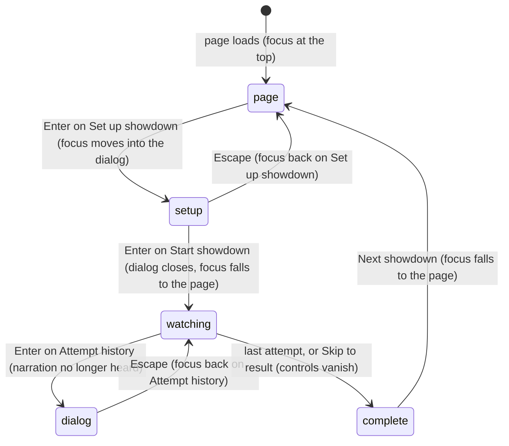

# Accessibility

## Summary

Accessibility is how far the Arena can be used without a mouse, without seeing the canvas, and with less motion. The page has no accessibility mode. What it offers is built into the ordinary controls: every page control is a real button, link, list or checkbox reachable with Tab; dialogs take and trap focus; the Watch *narration* and the Play *caption* are live regions; and **Reduced motion** removes the stage's camera punches, shakes and impact effects.

This document owns keyboard reach, focus handling, labels, live regions, what is visual only, reduced motion, contrast and target sizes. Each feature document answers its own accessibility row in a line and links here.

## The simple case

A keyboard-only user opens the page. Tab moves through the logo, the four main tabs, the gear, the club points chip and the four event buttons. Next come the stage's sound and clean-view buttons, **House rules**, the two duel cards and **Set up showdown**. They press Enter on **Set up showdown**. The setup dialog opens with focus on its first control, the mode tab. Tab moves through the pickers, card buttons and options to **Start showdown**, and Enter locks the contest.

The dialog closes and the contest plays. A screen reader hears the narration change politely as each attempt happens: "Dan lines up the next throw.", "Dan sends a blocker.", "Dan Weidensaul leaves one on the wood. It counts." The user tabs to **Pause playback**, **Playback speed 1×**, **Skip to result** or **Attempt history** in the side station. When the contest is complete, the narration names the winning user and the card they played, for example "Doug takes it with Dan Weidensaul's card." The user tabs on to **Next showdown** in the result panel.

## Keyboard reach

Watch has no keyboard shortcuts and no skip link. Space does not pause and the arrow keys do not seek. Everything is reached with Tab, in page order.

| Area | Tab stops, in order | Notes |
|---|---|---|
| Header | Logo link, **Play**, **Watch**, **Standings**, **The collection**, gear ("Arena settings") | The active tab is shown only by style ([the app shell](../foundations/app-shell.md)). |
| Save recovery box | **Export unreadable save**, **Reset demo…** | Only when this browser's save cannot be read. It sits under the header on every view. |
| Watch lobby | Club points chip, **Resume contest** if shown, **01 Cornhole** to **04 Basketball**, sound, clean view, **House rules**, the two duel cards, **Set up showdown** | Event buttons report pressed or not pressed. **Resume contest** is disabled when the waiting recording uses a character that is no longer installed. |
| Watch playback | Sound, clean view, **Reload the arena** or **Dismiss** if an error shows, **House rules**, pause, speed, skip, attempt history, **Skip entrances** during the first 2.65 s | The duel cards are disabled and skipped. In the clean spectator view the stops are sound, the stage's pause button (while playing), clean view and the error box's button. |
| Watch result | **Attempt history**, **Next showdown**, **Replay same recording** | The result panel comes after the side station. |
| Footer | **House rules**, **History** | **Sound on/off** is text, not a control. |
| Dialogs | Their own controls, then the × (named "Close") | Focus is trapped inside until the dialog closes. |
| Setup dialog | Mode tabs (one stop; the arrow keys move between them), **Your demo user**, **Opponent**, card buttons, **Your strategy**, **Tie rule**, checkboxes, **Start showdown** (**Start anyway** while a counted entry is waiting) | Pickers open a list on Enter, Space or the arrow keys. Card buttons are named "Select {card name}" and report pressed. |
| Play setup | Event buttons, each slot's **Character** and **Controls** lists, **Add player** and **Remove player** (Cornhole and Clubhouse Dash only), **Start {event}**, **Controls and remapping** and, for each keyboard or controller player, its key fields and **Restore default controls** | Native lists; see [Play setup](../play/play-setup.md). |
| Live match | **Pause game**, **Sound on**, **Back to setup**, the stage, **Resume game** on the pause overlay, then each person's **Move** pad, **Aim** pad and action buttons | See [stage focus](#focus-handling) below. |

**On-screen controls by keyboard** ([touch controls](../play/touch-controls.md)). A focused **Move** or **Aim** pad takes the arrow keys: each arrow pushes it fully one way, there are no diagonals, and letting go of any key re-centres it. Action buttons work with Enter or Space, and are disabled until the match has loaded. A held action is a toggle that reports pressed, and its label changes to **Release** or "Stop {action}". After any action button is used, focus jumps to the stage; a pad reached with Tab keeps focus. Pressing a pad with the pointer does not take focus, so it stays on the stage.

## Focus handling

**Dialogs.** A dialog takes focus on its first control when it opens; opened by touch, it focuses the dialog itself, so no on-screen keyboard appears. While it is open, Tab cycles inside it and the rest of the page is hidden from screen readers. Escape, the × or a click outside closes it, and focus returns to the button that opened it, or to whatever had focus before.

**Focus that falls back to the page.** Several controls vanish while they hold focus. Focus then drops to the page itself, and where the next Tab lands depends on the browser:
- **Set up showdown** is gone once a contest is locked, so closing the setup dialog after **Start showdown** has nothing to return to.
- **Skip entrances** removes itself when pressed, and after 2.65 s.
- Pause, speed and skip vanish when playback completes, whether by watching or by **Skip to result**.
- **Next showdown** and **Replay same recording** vanish with the result panel.

**Stage focus in Play.** Keyboard players' keys count only while focus is inside the Play stage ([the input model](../foundations/input-model.md)). The stage is a Tab stop labelled "Playable arena. Focus here for keyboard controls." It takes focus when the match finishes loading, when it is clicked or tapped, and again after **Pause game**, **Resume game**, **Sound on** or **Mute**, or an on-screen action button. Closing a dialog does *not* return focus to the stage: it returns to the gear or footer link that opened the dialog. A keyboard player must tab back, four stops from the gear, or use **Pause game** then **Resume game**. A mouse user can simply click the stage ([the input model](../foundations/input-model.md#starting)).

**Space on page buttons.** During a keyboard match, a focused page button such as **Pause game**, **Back to setup** or an on-screen action button works with Space as well as Enter. The keyboard player's device only holds back the release of a key whose press it took, and it takes presses only while the stage has focus.

**The focus ring.** Keyboard focus draws a 3-pixel teal outline on page buttons and links. The Play stage uses the same darker teal. Play's own buttons use a lighter teal. The stage's ring appears only for keyboard focus, so it usually does not show after a click.

## Labels and live regions

| Element | What assistive technology gets |
|---|---|
| Watch stage | A region named "The backyard arena". The canvas inside is labelled "Animated sports arena. Scores and commentary are also shown as text." |
| Scoreboard | A region (a section) named "Live score" containing each card's first name, score and "n/N {unit}", the sport, and **COUNTED ENTRY** or **EXHIBITION / NO POINTS**. It is not a live region. |
| Narration | A polite, atomic live region: each new line is read whole, after the screen reader finishes what it is saying. |
| Progress bar | A progress bar named "Contest playback", from 0 to 100 percent. It cannot be focused. |
| Playback buttons | "Pause playback" or "Resume playback", "Playback speed 1×" (or 2×, 0.5×), "Skip to result", "Attempt history" |
| Stage buttons | "Enable sound" or "Mute sound"; in the clean spectator view during playback, "Pause playback" or "Resume playback"; "Clean spectator view", which reports no on or off state |
| Duel cards | "Change competitor 1" and "Change competitor 2"; the images are described as "{card name} original collectible card" |
| Error box | An alert, so its message is announced when it appears. Its button is named **Reload the arena** after a stage failure and **Dismiss** otherwise. The setup dialog's own error and its warning about a waiting counted entry are alerts too. |
| Save recovery box | An alert under the header: "This browser's Arena save could not be read: {reason}" |
| Character library notice | A polite status: "Installed characters are unavailable because this browser's character storage could not be opened. The built-in cards still work." |
| Arena settings errors | An alert inside the dialog, above **Save for future entries**, with the plain message, such as "Use whole numbers from 0 to 100." The number fields are marked invalid. |
| Reset dialog error | An alert inside the dialog: "The demo could not be reset: {reason}" |
| Collection preview | The canvas is named "Character preview". Its own error box, with **Reload the preview**, sits under the preview stage. |
| Dialogs | Each has a title and a description. The × is named "Close". |
| Play stage | "Playable arena. Focus here for keyboard controls." |
| Play caption | A polite live region with the event's message. The "{N}s · Practice / no club points" timer beside it is not live. |
| Score strip | Each tile's name and score as text, and a progress bar named "{name} stamina" or "{name} health" |
| Play overlays | The error overlay is an alert. **Opening the cards…** is not announced. Every pause is announced through a hidden polite live region: "Paused. {notice}" for an automatic pause, or "Paused. Resume when you're ready." |
| Remapping fields | "Player {n} {action} key" or "Player {n} {action} button". A refused key or setup error is an alert under that player's fields, such as "Space is already used for Hold / release. Choose another key." |

**The speed button's name includes its value.** It reads "Playback speed 1×", "Playback speed 2×" or "Playback speed 0.5×", matching the visible label.

## What is visual only

- **Watch.** The court itself: where bags lie on a board, which cups are left, and where a ball hit the wall. The commentary names what each attempt hit, but not positions. Also visual only: the yellow underline marking the card now throwing, the court's nameplates, pips and status lines, and the camera moves. The bottom bar's **PAUSED** and **HEAT CHECK / COSMETIC** are text a screen reader can reach, but they are not announced.
- **Play.**
  - The **Release timing** meter, its green window and marker, and the reticle. The caption announces "Release in the green window · Shot: {shot}" and the grade afterwards, but nothing says where the marker is ([the cornhole throw](../play/cornhole.md)).
  - Positions, obstacles and distances in the Dash and the Brawl.
  - Whose turn it is in cornhole, which the nameplates' status lines show. The active tile's highlight in the score strip is clipped out of sight with the strip.
- **Sound.** Watch and Play play only short synthesized tones. Nothing is spoken ([sound](sound.md)).

## Reduced motion

- **The checkbox.** **Reduced motion** in [Arena settings](../club/arena-settings.md) starts from the operating system's "reduce motion" preference, read once when the page loads. It is not saved. Changing the system preference during a visit does not change the checkbox until the page is reloaded.
- **The stage.** Reduced motion removes camera punches and shakes and impact effects in Watch and Play, and squash and stretch in Play. Toggling it during a Play match applies at once to the running match, which carries on ([the stage](../foundations/stage.md#reduced-motion-and-lower-graphics-quality)).
- **The page.** The page's own styling follows the system preference directly, at any time, whatever the checkbox says: transitions are turned off, card hover lift is disabled and spinners stop. The dialogs' 0.1-second fade and zoom still play, because they are animations rather than transitions.
- **Watch.** Only **Pause playback** stops the Watch stage moving.

## Colour, contrast and target sizes

- **Text contrast.** The main text colours checked measure 5:1 or better against their backgrounds. The small print is the weak point: the bottom bar is 9 px at every width. The scoreboard's 8–9 px unit and mode lines are clipped out of sight, so only screen readers get them.
- **Colour and position only.** These cues are shown only by colour or position. The narration names the thrower; the others have no text equivalent:
  - which card is throwing
  - whether a contact burst means a score (yellow) or not (orange)
  - which beer-pong rack is whose (yellow or orange)
- **The focus rings.** The Watch and menu ring, and the Play stage's ring, use the darker teal, about 4:1 against the page background. Play's own buttons still use the lighter teal, about 2.6:1, below the usual 3:1 for focus indicators.
- **Target sizes.**

  | Target | Size |
  |---|---|
  | The gear | 44 px (34 × 36 px at 600 px and below) |
  | Play's toolbar buttons | 44 px tall |
  | Playback buttons | 39 px at every width |
  | Play's on-screen action buttons | at least 82 × 55 px |
  | Play's pads | 82 px round (76 px at 720 px wide and below) |
  | The stage's sound and clean-view buttons | 31 px at every width |
  | The × on a dialog | 28 px |
  | The footer's **House rules** and **History**, and **House rules** under the stage | 12 px text with no padding, well under 24 px tall |

## The interaction, event by event

The action narrated here is a keyboard-only user completing a Watch contest.

### Starting

The page loads with focus at the top. **Set up showdown** is the seventeenth Tab stop, and the first duel card, which opens the same dialog, the fifteenth. A waiting contest's **Resume contest** adds one, and the save recovery box, when shown, adds two. Enter opens the dialog, and focus lands on the selected mode tab.

### Backing out at once

Escape closes the dialog, and focus returns to the button that opened it. Nothing is locked. The choices made so far stay selected ([the setup dialog](../watch/setup-dialog.md)).

### Committing

Enter on **Start showdown** locks the contest ([contests and recordings](../foundations/contests-and-recordings.md)). The button reads **Locking the contest…** for a moment. The dialog closes, and because **Set up showdown** no longer exists, focus falls back to the page.

### While watching

- **Hearing it.** The narration is announced line by line. A screen reader hears who is lining up, what was sent, and the commentary on each result.
- **Reaching the controls.** From the top of the page, the pause button is about eleven Tab stops away. The user can reach the scoreboard by reading the stage, and the progress bar by reading on past it.
- **Dialogs.** Opening **Attempt history** traps focus in its list. While it is open, the rest of the page, including the narration, is hidden from the screen reader, though playback runs on.
- **The clean spectator view** hides the side station, the narration and the side station's playback controls. The stage keeps the sound and clean-view buttons, and between them a **Pause playback** / **Resume playback** button while the recording is playing. The error box stays visible.

### Resolving

When playback is complete, the narration announces the winner. The pause, speed and skip buttons vanish; if one had focus, focus falls to the page. The result panel's heading, score and points are ordinary text after the side station, and are not announced by themselves. **Next showdown** returns to the lobby, and focus falls to the page again.

## Modifiers

| Modifier | Set at the start | Changed while committed |
| --- | --- | --- |
| Input device | Watch and the menus work with Tab, Enter, Space, Escape and the arrow keys in tabs and pickers. They also work with a mouse, touch or a screen reader. In Play, keyboard players need stage focus; controllers, touch and AI players do not ([the input model](../foundations/input-model.md)). | Switching between mouse and keyboard changes nothing but whether the focus ring shows. |
| Event and action combinations | Cornhole's narration is the most detailed: it names each shot and the slide on the board. Beer pong never says which cups remain. In Play, cornhole's meter is visual only, and held actions become toggles that report pressed. | Not applicable: the sport is fixed once locked. |
| Contest kind | Counted or exhibition is shown as text on the scoreboard, the station note and the result. Play shows "Practice / no club points". | Not applicable. |
| Character card | Card images carry their card's name as a description. Narration uses first names while an attempt is under way and full names in the commentary. | Not applicable. |
| Presentation settings | **Reduced motion**, above. **Lower graphics quality** removes Watch's contact and camera effects, and does nothing in Play. The **clean spectator view** removes the narration and the side station's controls, but keeps a pause button on the stage. Sound is tones only. | Each applies at once. Turning on the clean view mid-contest silences the narration until it is turned off. |
| Screen size and orientation | Browser zoom enlarges the page, which reflows at several widths ([the app shell](../foundations/app-shell.md)). At 600 px and below, the tabs and several buttons shrink (see target sizes). | Reflows at once; focus stays where it was. |
| Saved state | Nothing about accessibility is saved. Reduced motion starts from the system preference on every visit. | No effect. |

## Cancel and interrupt

| Event | Before committing | While committed |
| --- | --- | --- |
| Escape or click outside | Escape closes the setup dialog; focus returns to the button that opened it. | Escape closes the open dialog, and focus returns to its button. With no dialog open, Escape does nothing in Watch. |
| Pause or resume | Not applicable: nothing is playing. | Enter or Space on the pause button toggles it, and its name changes. **PAUSED** in the bottom bar is not announced; the narration simply stops changing. |
| Repeated or rapid input | Holding Enter on **Start showdown** repeats the click with key repeat, but only one contest is locked. | Holding Enter on the speed or pause button repeats it, one step per repeat. |
| A panel opens on top | The setup dialog hides the rest of the page from screen readers. | Any dialog hides the page, including the narration, until it closes. Playback continues unheard. |
| Navigating away | In the lobby, Enter on another main tab switches view, and focus stays on that tab. The open setup dialog covers the tabs. | Enter on another main tab pauses playback, and focus stays on that tab. Returning rebuilds the stage, the narration and the controls. |
| Forced finish | Not applicable. | **Skip entrances** and **Skip to result** remove themselves, so focus falls to the page. After **Skip to result** the narration announces the winner. |
| Focus leaves the game | Tabbing around the page has no effect. | Tabbing away from the controls has no effect. Hiding the browser tab stops the clock, and nothing is announced. |
| Reload, close, or back/forward cache | Focus starts at the top again, and the setup choices are forgotten. | The lobby shows the resume banner. **Resume contest** is the Tab stop after the chip, and it reopens paused, so the user must then reach **Resume playback**. |
| Settings or saved data change underneath | Enter on the gear puts focus on the **Reduced motion** checkbox, and Space toggles it. A settings error is announced inside the dialog. | Toggling it applies at once. **Reset demo** unloads the contest; when its dialog closes, focus returns to the gear. A failed reset is announced in the reset dialog, and playback carries on. |
| Graphics or storage failure | An error in the error box is announced as an alert. **Reload the arena** or **Dismiss** follows the stage's buttons. An unreadable save is announced by the save recovery box. | The graphics message is announced. **Reload the arena** removes the error box when pressed, so focus falls to the page. The pause button then correctly reads **Resume playback**. In Play, a graphics loss pauses the match, and the pause is announced. |
| Input device changes | A dialog opened by touch focuses the dialog rather than its first control. | No effect. |

## Interactions with other systems

**Points and the ledger.** Points appear as text on the club points chip, in Standings and in the result panel. Only the waiting contest's points are hidden, and they are hidden from everyone alike ([contests and recordings](../foundations/contests-and-recordings.md#written-and-revealed)). The result headline names the winning user, such as **DOUG WINS.**, with the card on a line under it.

**Saved data and recovery.** Nothing about accessibility is saved. Reduced motion resets to the system preference on every visit ([this browser's save](../foundations/saved-data.md)).

**Watch and Play separation.** Each has its own live region. The Watch narration is read whole each time it changes; the Play caption is announced as it changes. Only Play needs stage focus.

**Devices and players.** Keyboard players need stage focus; controllers work wherever focus is. The on-screen controls can be used from the keyboard, but each action button sends focus back to the stage ([touch controls](../play/touch-controls.md)).

**Sound.** Sound is off by default and made only of tones. A bright tone for a score and a low one for a miss are the only audible results, and nothing is spoken ([sound](sound.md)).

**Reduced motion and graphics quality.** The stage's side belongs to [the stage](../foundations/stage.md). This document owns the page-level behaviour above.

**Accessibility.** This document is the owner.

**Installed characters.** An installed card's image is described by its name, and the narration uses its name like a built-in card's ([Install character](../collection/install-character.md)).

**Multiple tabs.** Each tab has its own focus and live regions. Switching browser tabs pauses a running Play match there, and that tab's hidden live region announces the pause.

**Agent tools.** When a browser agent changes the event, the page changes silently: nothing announces it. While the Play tab is open the call is refused, so a Play match and the focus inside it stay where they were ([agent tools](agent-tools.md)).

## Edge cases

- **The first narration line** is present the moment the live region appears. Screen readers often skip a live region's first content, so "The cards are opening. Make some room." may not be heard.
- **Short lines are lost.** The contact line ("…watches the result.") lasts 0.16 s at 1× and is usually replaced before it is read. At **2×**, several lines per attempt can be skipped.
- **The scoreboard is never announced.** A screen-reader user hears each result, but must read the scoreboard to learn the running score.
- **The locked opponent card** in a counted setup is still a button, reported as pressed, that does nothing.
- **Play setup's lists** are labelled **Character** and **Controls** in every slot. The player number sits beside them, not in their names.
- **Arrow keys on a pad.** Arrow keys on a focused **Aim** pad do not reach the stage, so they cannot be confused with keyboard 1's aim keys.

## Open questions and verification

- Read from `Game.tsx`, `Panels.tsx`, `SetupDialog.tsx`, `Controls.tsx`, `components/ui/dialog.tsx` and Base UI's dialog focus manager, `PlayableArena.tsx`, `LiveStage.tsx`, `TouchControls.tsx`, `LiveArenaGame.ts`, `KeyboardDevice.ts`, `ArenaGame.ts`, `app/globals.css`, `app/live-arena.css` and `public/assets/arena-interface.css`, which loads last and overrides several sizes. No screen reader, keyboard-only pass or contrast tool has been run on the production page.
- **Fixed: Shift+Tab rebinds a key (B-34).** Tab and Shift+Tab now move focus and never bind. A modifier is bound only when it is released with no other key pressed after it.
- **Fixed: Space on page buttons (B-24).** The keyboard player's device used to cancel the release of every bound key anywhere on the page, so Space did nothing on a focused button during a match. It now cancels only a release whose press it took.
- **Fixed: "Live score" (B-36).** The scoreboard is now a named region. The Play stage's label is still on a plain focusable box, and the canvas labels on canvases; whether screen readers read those names has not been checked.
- **Screen readers and game keys.** Whether a screen reader in browse mode swallows J, K, L, E, C and Space before they reach the focused Play stage is unknown. The stage does not ask for application mode.
- **Where focus lands** after **Set up showdown** or **Next showdown** removes the focused control has not been checked in any browser.
- **The narration behind a dialog.** Hiding the page behind a modal dialog is taken from Base UI's modal behaviour. Whether announcements are really suppressed has not been heard.
- **Target and text sizes** are read from the stylesheets, not measured.

Verified against Will-You-Be-My-Hero-Arena commit `364e3c1`
