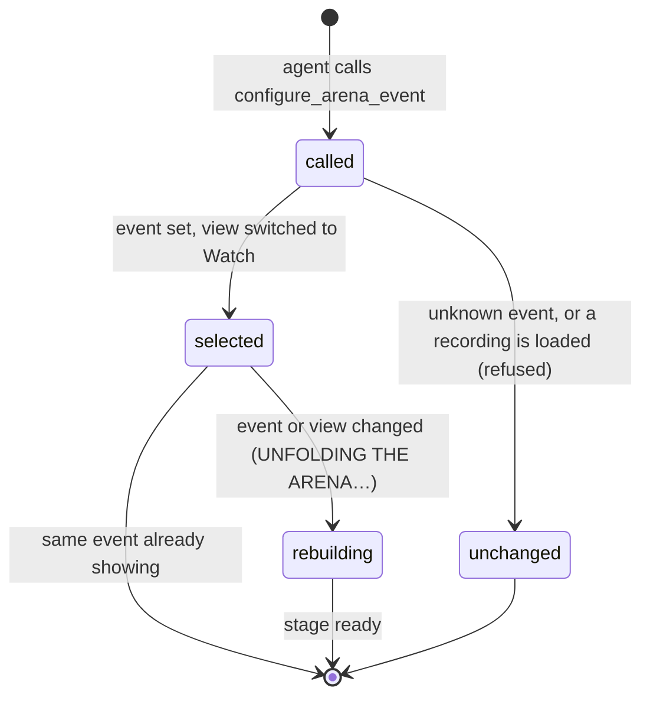

# Agent tools

## Summary

The page offers two tools to a browser agent, an AI assistant built into the browser, through WebMCP. They exist only if the browser provides the WebMCP registration call, and nothing on the page shows whether they are there. **`read_arena`** reads what the Watch tab currently shows: the event, the revealed score, whether playback is complete, and the leaderboard. **`configure_arena_event`** selects one of the four Watch sports, as if its button in the lobby's event dock had been clicked, and switches the page to the Watch tab. Neither tool can start a contest, award points, press a playback control or touch Play. The player gets no notice when an agent acts.

## The simple case

The player asks their browser's assistant, "Set the Arena up for basketball." The assistant calls `configure_arena_event` with `basketball`. The page switches to the Watch tab if it was elsewhere. **04 Basketball** becomes the selected event, the title reads **Basketball / HEAD TO HEAD**, and the stage rebuilds with **UNFOLDING THE ARENA…**. The assistant receives `{ "selectedEvent": "basketball" }`. The player then presses **Set up showdown** themselves. Asked "Who's leading the club?", the assistant calls `read_arena` and reads the leaderboard; the page does not change.

## The two tools

| | `read_arena` | `configure_arena_event` |
|---|---|---|
| Description given to the agent | "Read the current revealed score and leaderboard." | "Select a lobby event. Does not start or award a contest." |
| Marked read-only | Yes | No |
| Input | None | `event`: one of `cornhole`, `football`, `pong`, `basketball` |
| Result | `event`, `score`, `complete`, `leaderboard` | `selectedEvent` |
| Refuses with | Never refuses | "Choose a supported event." or "Return to the lobby before configuring a contest." |

### What `read_arena` returns

| Field | What it holds |
|---|---|
| `event` | The Watch event as a code name: `cornhole`, `football`, `pong` or `basketball`. With a recording loaded, it is that recording's sport. |
| `score` | Two numbers, the revealed score of the card throwing first and of the card throwing second. It is `[0, 0]` with no recording loaded. During playback it matches the scoreboard: an attempt counts only once its score has been shown. |
| `complete` | `true` once the loaded recording's playback is complete, and for as long as its result panel shows. `false` in the lobby and during playback. |
| `leaderboard` | All four demo users, each with `user` (the name), `points` and `rank`, matching Standings. Tied users share a rank. A counted entry that is loaded but not complete, or waiting to resume, is left out, as everywhere else on the page ([written and revealed](../foundations/contests-and-recordings.md#written-and-revealed)). Until this browser's save has loaded, the list is empty. |

The values are those of the page's latest update, at most a few hundredths of a second old during playback. They describe Watch even when another tab is showing. They do not say which tab is showing, who is competing, which cards, whether the contest is a counted entry, how many entries are left, or whether a contest is waiting to resume.

### What `configure_arena_event` does

First it checks the event: anything other than the four code names, such as `running`, `Beer pong` or nothing, is refused with "Choose a supported event." Then it checks for a loaded recording: if any Watch recording is loaded, whether playing, paused, in its entrances or showing its result panel, and even while the player is on another tab, it is refused with "Return to the lobby before configuring a contest." Otherwise it selects the event as the lobby's event button would, switches the view to **Watch**, and returns `{ "selectedEvent": "<event>" }`. What the player sees depends on where they were:

| Where the player was | What happens |
|---|---|
| Watch lobby | The event changes and the stage rebuilds, as for a click on the event button. If that event was already selected, nothing visible changes. |
| Standings or The collection | The page switches to the Watch lobby, whose stage rebuilds. |
| Play setup or a live match | Play is removed at once, as for any tab switch: a running match, paused or not, and every setup choice are lost without warning ([the app shell](../foundations/app-shell.md)). |
| A dialog open over any of these | The setup dialog and the shared dialogs (House rules, Arena settings, History and the others) stay open over the new view. **Install character** belongs to The collection's view and disappears with it, even while busy. An open setup dialog updates its eyebrow, estimate and counted entry for the new sport ([the setup dialog](../watch/setup-dialog.md)). An open **House rules** switches to the new sport's rules. |

## Registration lifetime

The page registers both tools once, as soon as it has loaded, if the browser offers the registration call; it does not wait for this browser's save. They stay registered for the life of the page, across tab switches, dialogs and contests, and are withdrawn only when the page goes away. A reload registers them afresh. If the browser only offers the call after the page has loaded, the tools are never registered. A registration the browser rejects later is ignored, and nothing appears on screen; one that fails at once is not caught (see [open questions](#open-questions-and-verification)).

> Technical note: registration is in `components/arena/Game.tsx`, line 40. The page looks for `document.modelContext.registerTool` and passes an abort signal that fires when the page's main component unmounts.

## What agents cannot do

An agent cannot open the setup dialog, choose a mode, users, cards, strategy or tie rule, or press **Start showdown**. It cannot pause, change speed, skip, replay, resume a contest or return to the lobby. It cannot read the narration, the attempt list, the entries left or the resume banner. It cannot change Arena settings, the scoring policy or the demo data, export anything, or install a character. It cannot see or drive Play, except that selecting an event ends a Play match. So once a recording is loaded, `configure_arena_event` keeps refusing until the player presses **Next showdown** or the logo, or resets the demo.

## The interaction, event by event

The action narrated here is one `configure_arena_event` call, as the player sees it.

### Starting

The agent calls the tool with an event name. Nothing on the page shows that a call has arrived.

### Backing out at once

A refused call changes nothing: the view, the event, a running Play match and any open dialog stay exactly as they were. Only the agent sees the refusal.

### Committing

The call commits the instant it is accepted. The event is selected and the view switched in the same step, and nothing asks for confirmation. A Play match is gone from that moment.

### While committed

The Watch stage rebuilds for the new event, showing **UNFOLDING THE ARENA…**, unless the same event was already showing in the lobby. The player can use the page normally meanwhile.

### Resolving

The player is on the Watch lobby with the new event selected. Nothing is written to this browser's save, and a reload returns to Cornhole ([the app shell](../foundations/app-shell.md)).

## Modifiers

| Modifier | Set at the start | Changed while committed |
| --- | --- | --- |
| Input device | Not applicable: the agent acts through the browser, not an input device. A Play match is discarded whatever devices its players use. | Not applicable. |
| Event and action combinations | Only the four Watch sports are accepted. The three Play events are refused. | Not applicable: the call is over at once. |
| Contest kind | `configure_arena_event` refuses while a recording of any kind is loaded: exhibition, counted entry or replay. `read_arena` does not report the kind. Play practice is discarded. | Not applicable. |
| Character card | No effect. The selected cards stay as they were, and `read_arena` names no cards. | Not applicable. |
| Presentation settings | No effect. In the clean spectator view the event dock is hidden, but the event still changes and the stage rebuilds. | No effect. |
| Screen size and orientation | No effect. | No effect. |
| Saved state | `read_arena` returns an empty leaderboard until the save has loaded, and whenever it failed to load. A contest waiting to resume is left out of the leaderboard but does not block `configure_arena_event`. | No effect: neither tool writes anything. |

## Cancel and interrupt

| Event | Before committing | While committed |
| --- | --- | --- |
| Escape or click outside | Not applicable: the call does not wait for the player. | An open dialog stays open; Escape closes it as usual. |
| Pause or resume | A paused Watch recording is still loaded, so the call is refused. A paused Play match does not protect it. | Not applicable. |
| Repeated or rapid input | Repeated calls for the event already showing change nothing further. | Alternating events rebuild the stage each time; only the last one stays. |
| A panel opens on top | Dialogs do not block the call. | The dialog stays over the new view; see the table above. |
| Navigating away | The player's own tab switch, logo or **Next showdown** simply decides what the next call finds. | The call is itself a navigation. A tab switch straight afterwards follows [the app shell](../foundations/app-shell.md). |
| Forced finish | Not applicable. | Not applicable. |
| Focus leaves the game | The tools work whether or not the page has focus or is visible. A Play match in a hidden tab is already paused, and is still discarded. | No effect. |
| Reload, close, or back/forward cache | A reload withdraws and re-registers the tools. | A reload forgets the selected event and returns to Cornhole. |
| Settings or saved data change underneath | Another tab's write updates what `read_arena` returns. | No effect. |
| Graphics or storage failure | A message already in the error box stays. If the save cannot load, `configure_arena_event` still works. | The rebuilt stage can fail like any other ([the stage](../foundations/stage.md)). |
| Input device changes | Not applicable. | Not applicable. |

## Interactions with other systems

**Points and the ledger.** Read-only. `read_arena` returns revealed points only, so in the tab playing a counted entry an agent cannot learn its result before the player does ([points and entries](../club/points-and-entries.md)).

**Saved data and recovery.** Neither tool writes to this browser's save ([this browser's save](../foundations/saved-data.md)).

**Watch and Play separation.** Both tools are about Watch. `configure_arena_event` ends a Play match without warning, because it switches to Watch.

**Devices and players.** No interaction. The tools cannot send game input ([the input model](../foundations/input-model.md)).

**Sound.** No interaction, except that a discarded Play match's sound ends with it. With no Watch recording loaded, Watch has nothing to silence.

**Reduced motion and graphics quality.** No interaction. The rebuilt stage uses the current settings.

**Accessibility.** An agent's change is not announced. Focus stays where it was, unless it was inside a Play match that disappears ([accessibility](accessibility.md)).

**Installed characters.** No interaction. `read_arena` names users, not cards.

**Multiple tabs.** Each open page registers its own pair of tools, and each reads its own tab's view. Which tab an agent reaches is up to the browser.

**Agent tools.** This document is the owner.

## Edge cases

- **The score has no names.** `score` is in throwing order, and nothing in the result says whose card is whose.
- **Another tab's hidden contest** is hidden in this tab's leaderboard too, as long as this tab has no recording of its own loaded. An idle tab hides whichever contest the save lists as waiting. If this tab has its own recording loaded, the other tab's contest counts ([contests and recordings](../foundations/contests-and-recordings.md#written-and-revealed)).

## Open questions and verification

- Read from `components/arena/Game.tsx`, lines 39–40, and `lib/arena/persistence.ts` (`standings`). No test exercises either tool, and neither has been called on the production page.
- **Where the browser offers WebMCP.** The page looks for `document.modelContext`. Published drafts of the WebMCP proposal describe `navigator.modelContext`. If browsers offer only the latter, the tools are never registered. This needs checking against a browser that ships WebMCP.
- **Duplicate registration.** Whether a browser keeps both pages' tools when two tabs register the same names, and which one an agent then reaches, is unknown. **A registration that fails at once** is a related risk: the page catches only a registration that fails later. If the browser's call throws straight away instead, the error escapes the page's start-up code and could stop the whole page (`Game.tsx`, line 40). This looks like a bug; it has not been tried.
- **Discarding Play without warning.** Letting an agent end a Play match silently may deserve a guard like the one for a loaded recording. This is a product call.

Verified against Will-You-Be-My-Hero-Arena commit `3b4ec62`
