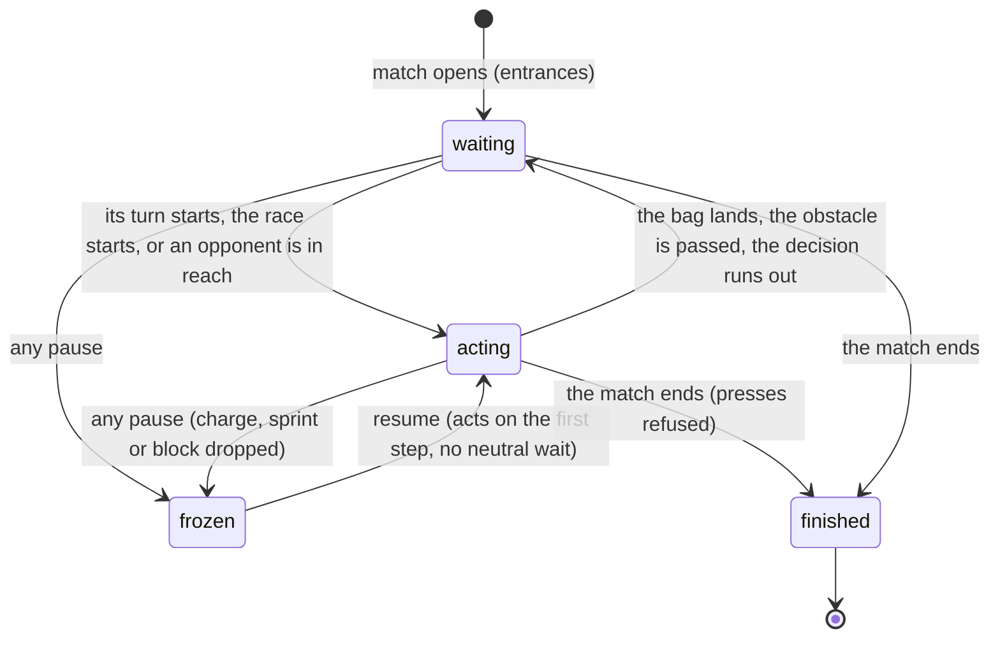

# AI players

## Summary

An AI player is a Play slot driven by the computer instead of a person. It is chosen as **AI player** in a slot's **Controls** list on [Play setup](../play/play-setup.md), and every slot after the first starts as one. Each Play event has its own simple strategy, which produces the same named inputs a person would press: move, charge, primary and so on. Those inputs go through the same path as a person's ([the input model](../foundations/input-model.md)). They are read as pressed, held and released, they are buffered, and the event's rules can refuse them. The AI cannot move a character or score by any other route.

An AI player never pauses the match and never resumes it. It exists only in Play; Watch contests have no AI players.

## The simple case

With the defaults, player 2 is Dan as an **AI player**. He has no control panel under the stage, and his tile in the *score strip*, which only screen readers get, ends in "· AI".
- **In cornhole**, Dan's turn starts, and 0.4 s later he begins to charge from wherever he stands, aimed at the centre of the board. He lets go close to the ideal power, and the caption reads **Perfect release**.
- **In Clubhouse Dash**, Dan runs straight down his lane from the start, sprinting whenever he has the stamina, and jumps or slides as each obstacle in his lane comes up.
- **In Backyard Brawl**, Dan walks toward his opponent until he is in range. Then, a few times a second, he picks a light attack, a heavy attack, a dodge, a power strike, or a block if his opponent is attacking.

When the person pauses, Dan stops with everything else. When they resume, he carries on at once.

## The interaction, event by event

The action narrated here is an AI player's part in one match, from the moment it opens to the result.

### Starting

When the match opens, each AI slot is given an AI device instead of a keyboard, controller or on-screen controls. At that instant:
- **No control panel** is drawn for it, and it needs no stage focus, bindings or [neutral](../foundations/input-model.md#neutral).
- **Its tile** shows "· AI" as its device. The nameplates and the result show only the character's name.
- **On every game step** from then on, the event is asked what this player wants to press, given the game as it is at that step.

During the entrances the AI either presses nothing or presses things the event refuses, such as a sprint before the race starts.

### Backing out at once

A person cannot stop, skip or take over an AI player during a match. The only ways to change it are to pause, which freezes it, or to press **Back to setup**, change its **Controls**, and start again.

### Committing

An AI player has no commit of its own. Each of its presses commits exactly as a person's would. A cornhole charge commits when the charge is accepted, for example, and a Brawl attack when the attack starts. See the event documents: [the cornhole throw](../play/cornhole.md), [Clubhouse Dash](../play/clubhouse-dash.md) and [Backyard Brawl](../play/backyard-brawl.md).

### While acting

The AI reads the true state of the game on every step: the charge's power, the distance to the next obstacle, whether the opponent is mid-attack. It has no reaction delay beyond its own schedule. What it decides is listed in [what each event's AI does](#what-each-events-ai-does).

### When the match ends

Once the event is over, every action it presses is refused. It can still be the winner: the result reads "{name} wins" with the character's name, and nothing says it was the computer.

## What each event's AI does

**Cornhole** (on its own turn only):
- **Where it stands.** It never moves or aims. It throws from wherever the character stands, at the centre of the board.
- **The shot.** It never changes shot, so it always throws its character's default, and it never uses precision mode.
- **The charge.** It starts a charge 0.4 s after its turn begins.
- **The release.** It holds until the power reaches the ideal for its spot, nudged early or late by up to 0.03. The nudge follows a fixed pattern set by how many bags have been thrown in the match. The *release window* is at least ±0.035 wide, and ±0.062 for the built-in cards' default shots, so every AI release is graded **Perfect release**.
- **Where it lands.** An on-target release usually drops into the hole. A 0.03 miss lands about 15 stage pixels short of or past it.

**Clubhouse Dash:**
- **Direction.** It holds full forward and never steers, changes lane, brakes or dodges. In **Free steering / control acceleration** it holds full throttle along its starting line.
- **Sprinting.** It holds sprint whenever its stamina is above 18, and lets go below that. After its opening sprint, it hovers around 18 stamina in short bursts.
- **Obstacles.** When a hurdle in its lane is within 88 stage pixels ahead, it presses jump; for a bar, slide. That is one press per obstacle.
- **Burst sprint.** It presses burst sprint at 4, 12, 20, 28 and 36 seconds of game time. The press does nothing while the ability is cooling down or stamina is below 18.

**Backyard Brawl:**
- **Closing in.** It walks toward the nearest opponent until they are within 112 stage pixels, and then stands its ground. It never backs away.
- **Deciding.** Every 0.26 to 0.54 s, chosen at random, it decides once. If the opponent is farther than 160 pixels at that moment, it presses nothing until its next decision.
- **Blocking.** If the opponent is attacking, it blocks on most decisions: about 69% for Dan and 60% for Doug. On the rest it throws a light attack.
- **Attacking.** Otherwise it picks light (45%), heavy (28%), dodge (12%) or power strike (15%).
- **Holding.** It holds the chosen input until 0.13 s before its next decision, so a block lasts 0.13 to 0.41 s.
- **What it never does.** It never uses counter stance, grapple or taunt. It can chain light, light, heavy into a finisher only by chance.

## Modifiers

| Modifier | Set at the start | Changed while committed |
| --- | --- | --- |
| Input device | The AI is its own device. It needs no stage focus, bindings or neutral, gets no control panel and never rumbles. The remapping section skips AI slots. | Not applicable: a slot's device is fixed for the match. |
| Event and action combinations | Each event's AI uses only part of the event's actions: see [above](#what-each-events-ai-does). It never uses a chord, and makes a combo only by chance. | Not applicable: the event is fixed for the match. |
| Contest kind | Play practice only. Watch contests have no AI players: both sides are simulated before playback ([contests and recordings](../foundations/contests-and-recordings.md)). | Not applicable: practice cannot become anything else. |
| Character card | The card's stats and abilities work for the AI as for a person: scatter, speed, damage, stamina drain. In cornhole the card's default shot is the only one it throws. In the Brawl the card's personality sets how often it blocks; a more intense, showier card blocks less. | Not applicable: cards are fixed for the match. |
| Presentation settings | No effect on what the AI decides. | Toggling **Reduced motion** restarts the match, and the AI starts over with it ([the match shell](../play/match-shell.md)). |
| Screen size and orientation | No effect on the AI. At 720 px wide and below, the tile's whole "Stamina N · AI" line is removed, even for screen readers. | No effect. |
| Saved state | No effect. The AI reads nothing from this browser's save. An AI slot's bindings are saved at **Start** like the others, but never used. | No effect. |

## Cancel and interrupt

"Before committing" here means while the AI is waiting; "while committed" means while it is mid-action, such as charging, sprinting or blocking.

| Event | Before committing | While committed |
| --- | --- | --- |
| Escape or click outside | No effect on the AI. Escape pauses only through a keyboard 1 player with stage focus. | The same. If it pauses, see the next row. |
| Pause or resume | The AI freezes with the match. It is still asked what it wants on every frame, but nothing it produces is used. On resume it acts on the first game step; unlike a controller, it is never held to neutral. | The action is dropped as for a person. A cornhole charge is discarded, and the AI starts a fresh charge on the first step after resuming. A Dash sprint stops, and starts again at once if stamina is above 18. A Brawl block drops. Unless the AI's current decision was about to run out, that decision, block or attack, is pressed again at once. |
| Repeated or rapid input | Not applicable: the AI follows its own schedule and does not mash. | A Brawl AI presses at most one input per decision, a few times a second. Presses the event cannot take yet are buffered like a person's. |
| A panel opens on top | The AI carries on behind the dialog, and the match does not pause. An AI's cornhole turn plays out. | The same. A Brawl AI keeps attacking a keyboard player who cannot respond. |
| Navigating away | The AI is discarded with the match. | The same. |
| Forced finish | A knockout or a time limit can end the match while the AI waits. | The cornhole AI always lets go well before the 2.2 s automatic release. The Dash and Brawl time limits stop it mid-sprint or mid-attack. After the result, its presses are refused. |
| Focus leaves the game | The AI needs no focus. Moving focus within the page stops keyboard players but not the AI. Losing window focus pauses the whole match, AI included. | The same. |
| Reload, close, or back/forward cache | The match is gone; nothing about the AI is kept. | The same. |
| Settings or saved data change underneath | Toggling **Reduced motion** restarts the match with the same seed, and the AI with it. The scoring policy, **Reset demo** and another tab's write have no effect. | The same restart. |
| Graphics or storage failure | Whether the AI keeps playing unseen after a lost WebGL context is unknown. The AI writes no storage. | The same. |
| Input device changes | A person's controller disconnecting pauses the whole match, AI included. The AI's own device never disconnects. An AI slot cannot be taken over mid-match; only **Back to setup** can change it. | The same. |

> Technical note: the AI is an input device (`AIController`) whose poll calls the event's `ai()` method. `ArenaSession` asks it on every step, and also on every frame while paused, but discards the answer while paused. Pausing clears every device, but the AI's clear does nothing, so the AI keeps its plan across the pause.

## Interactions with other systems

**Points and the ledger.** No interaction. An AI plays only in practice, which never awards points.

**Saved data and recovery.** No interaction. An AI slot's bindings are written with the others at **Start**, and nothing else is kept.

**Watch and Play separation.** Only Play has AI players. In Watch, both sides of a contest are simulated in full before playback, and nobody is driven live ([contests and recordings](../foundations/contests-and-recordings.md)).

**Devices and players.** Any number of slots can be AI, up to the event's four players, or two in the Brawl. A match of AI players only is allowed and plays itself, with no control panels. With no person holding a pause key, only the toolbar's **Pause game**, or leaving the window, can pause it ([Play setup](../play/play-setup.md)).

**Sound.** An AI's actions make the same sounds as a person's. It has no controller, so it never rumbles ([sound](sound.md)).

**Reduced motion and graphics quality.** No effect on what the AI decides.

**Accessibility.** Only the score strip's "· AI", which screen readers get above 720 px wide, says which players are AI. Sighted players can tell only from the missing control panel. The caption announces an AI's results like anyone's, for example "Dan: on the board — one point" ([accessibility](accessibility.md)).

**Installed characters.** An installed card can be an AI player if its pack has a connected rig. In cornhole it throws its "standard" default style. In the Brawl its blocking follows the personality in its pack ([Install character](../collection/install-character.md)).

**Multiple tabs.** Each tab's AI runs only in that tab's match, and stops when that tab is left, because the match pauses.

**Agent tools.** No interaction. The agent tools cannot add, remove or drive players. `configure_arena_event` ends the match, AI included, by switching to Watch ([agent tools](agent-tools.md)).

## Edge cases

- **Cornhole favours player 1's AI.** The early-or-late nudge depends on the number of bags thrown so far in the match. In a two-player match, player 1 always throws even-numbered bags, where the nudge is about zero, and nearly always holes them. Player 2 always throws odd-numbered bags, which are 0.03 early or late in turn. The engine's reference match of two AI players ended 12–8 to player 1.
- **The cornhole AI never moves.** An AI in slot 3 or 4 is moved to the nearest allowed spot on its first turn, as in [the cornhole throw](../play/cornhole.md#edge-cases), and throws from there. Dan's AI always throws his "blocker" style.
- **The Dash AI never changes lane.** Each row of obstacles leaves one lane clear, but the AI stays in its own and meets every obstacle there. Players 1 and 4 share a lane.
- **The Dash AI's timing is fixed.** It reacts at 88 pixels whatever its speed, so it can still crash, especially into a bar when it is not sprinting ([Clubhouse Dash](../play/clubhouse-dash.md)).
- **The Brawl AI decides during a pause.** Its schedule keeps being asked while paused, so it can make one fresh decision then. That uses random numbers, so pausing changes the random choices for the rest of the match.
- **Two AIs in the Brawl** fight each other to a knockout or the 60 s limit.

## Open questions and verification

- Read from `PrecisionEvent.ts`, `RunningEvent.ts` and `FightingEvent.ts` (each `ai()` method), `AIController.ts`, `ArenaSession.ts` and `LiveStage.tsx`. `tests/live-tests.mjs` proves that AI players go through the player-controller path, that the cornhole AI scores, that AI runners reach at least 90% of the course, that AI fighters land hits, and that two AI sessions with the same seed match. It runs against the session, not the page, and nothing about AI players is confirmed on the production page.
- **Reference results.** The engine's reference AI-against-AI run (seed `live-proof`, Doug against Dan, in `docs/review/live-engine-tests.json`):
  - cornhole ended 12–8 after 31.8 s
  - both runners finished at 100% after 13.7 s
  - the Brawl ended with Doug knocked out and Dan on 60 HP after 13.1 s
- **Cornhole bias (suspected bug).** The nudge `Math.sin(this.throws * 4.7) * 0.03` counts every bag in the match rather than each player's own (`PrecisionEvent.ts` lines 259–264). In a two-player match that makes player 1's AI systematically more accurate than player 2's. It looks unintended.
- **Brawl decisions during pause.** The Brawl AI can re-decide while paused (`FightingEvent.ts` lines 138–176; `ArenaSession.ts` lines 211–214). Whether that is intended is a product call; players cannot see it directly.
- **Blocking percentages** are computed from the personality values in the character profiles, as 1 − 0.4 × (intensity + showmanship × 0.25). They have not been measured in play.

Verified against Will-You-Be-My-Hero-Arena commit `3b4ec62`
