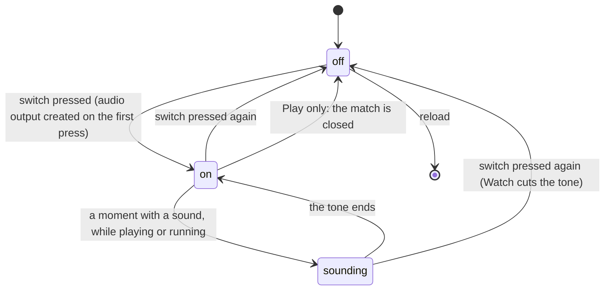

# Sound

## Summary

The Arena has two sound switches, one for Watch and one for Play, and they are independent. Both start off. The sounds are short tones that the page synthesizes as it goes: there is no music, no voice and no recorded audio. Every sound repeats something already shown on screen, so a player with sound off misses nothing.

This document owns:
- the two switches and what each one survives
- what makes a sound in Watch and in Play
- how the page meets the browser's rule against sound that plays by itself
- what pausing, skipping, leaving and hidden tabs do to sound

Controller rumble is independent of both switches; it is described in [the input model](../foundations/input-model.md#devices).

## The simple case

On the Watch tab, the player clicks the speaker button at the bottom right of the stage, just above the bottom bar. It shows a crossed-out speaker and is labelled "Enable sound". The icon changes to a speaker with sound waves, labelled "Mute sound", and the footer changes from **Sound off** to **Sound on**. The player starts a contest and hears:
- **The entrances.** As the cards walk on, a low two-note chord for each card, then a low thump as each one lands.
- **Each attempt.** A short falling tone on each release, and in cornhole a low double thud at each bag's first landing, whether on the board or the ground.
- **Each result.** A bright two-note chime when the attempt scores, or a low thud when it scores nothing.
- **The winner.** A four-note rising fanfare the moment the last attempt ends.

Pausing cuts off any tone that is sounding.

In Play, the player presses **Sound on** in the match toolbar, and the button then reads **Mute**. Focus goes back to the stage, so the game's keys keep working. The button always matches what is heard. The match's sounds are single short blips. Every new match starts silent again.

## The interaction, event by event

The action narrated here is turning a sound switch on and hearing a contest or match.

### Starting

The player presses a switch. On the first press, on the page for Watch or in the match for Play, the page creates the browser's audio output. Because that happens inside a click, the browser's autoplay rule is met. The page never creates audio output before a click, so it never plays, or tries to play, sound by itself.

Play's button can be pressed while **Opening the cards…** still shows. The press counts: the button reads **Mute**, and the match starts with sound on. In that case the audio output is created as the match opens, just after the click.

### Backing out at once

Pressing the switch again before anything has sounded turns it back off. Watch suspends its audio output and the footer returns to **Sound off**. Play simply stops making sounds. Nothing is saved either way.

### Committing

Sound is never saved, and turning it off is always free. The only lasting effect of the first press is the audio output, which stays for the rest of the visit in Watch and until the match is closed in Play. In the tables below, "before committing" means the switch is off, and "while committed" means it is on.

### While sound is on

- **Watch** sounds follow the playback clock and its speed. At **2×** they come twice as fast but keep their pitch and length, so they can overlap. At **0.5×** they are spread out.
- **Play** sounds follow *game time*: nothing sounds while paused, and a Brawl hit sounds as it lands, before the [hit-stop](../play/backyard-brawl.md).
- **Watch and Play never sound together**, because only one of their views is shown at a time.

### Turning it off, or leaving

- **Watch.** Turning it off silences at once. Left on, it stays on for every later contest until the page is reloaded.
- **Play.** The audio output is closed with the match: **Play again**, **Back to setup**, **Choose another event**, a main tab, or the logo. The next match starts off.

## The two switches

| | Watch | Play |
|---|---|---|
| Where | The speaker button at the bottom right of the Watch stage, in the lobby and during playback, and still there in the clean spectator view | **Sound on** or **Mute** in the [match shell](../play/match-shell.md)'s toolbar |
| Label | An icon, named "Enable sound" when off and "Mute sound" when on | Text: **Sound on** when off, **Mute** when on |
| Shown elsewhere | The footer reads **Sound off** or **Sound on** | Nowhere |
| Starts | Off on every page load | Off at the start of every match; a press while the match is loading carries into it |
| Survives | Tab switches, the logo, new contests, replays, **Reset demo** | Nothing: it ends with the match |
| Turning it off | Silences at once, cutting off a tone mid-note | Stops new sounds; a blip already playing finishes |

The two **Sound on** labels mean opposite things. On the Play button it is what pressing will do, so sound is currently off. In the footer it describes Watch sound, which is on. On the Play tab the footer can read **Sound on** while the match is silent.

## What makes sound

**Watch.** The recording's own moments set off the sounds as playback reaches them:

| Moment | Sound |
|---|---|
| Each card's entrance, 0.74 s apart | A low two-note chord |
| Each card landing at the end of its entrance | A low thud, the same as a miss |
| Each release, in every sport | A short tone that falls in pitch |
| A cornhole bag's first landing, on the board or the ground | A low double thud |
| A football, beer pong or basketball contact | Nothing |
| Each result | Two bright rising notes if it scored; a low thud if not |
| A catch or a footstep inside some rituals and celebrations, such as a bag flip or a jump | A low thud |
| The end of the last attempt, when there is a winner | A four-note rising fanfare, about a second long. A draw gets none. |

A sound plays only while the playback clock runs forward normally. When the clock jumps, every sound in between is skipped. Examples are **Skip entrances**, **Skip to result**, and a contest opened at its saved second.

**Play.** The match's events set off the sounds. Each is one tone of less than a quarter of a second that falls slightly in pitch:

| Event | Moment | Sound |
|---|---|---|
| Cornhole | The bag leaves the hand | A short mid blip |
| Cornhole | The bag lands in the hole | A bright blip |
| Cornhole | The bag lands anywhere else | A low blip |
| Clubhouse Dash | A runner crashes into an obstacle | A low blip |
| Clubhouse Dash | Each runner crosses the line | A high blip |
| Backyard Brawl | A hit lands | A low, buzzier blip |
| Backyard Brawl | A hit is blocked | A short mid blip |
| Backyard Brawl | The bout ends, even as a draw | A high blip |
| Any | An animation marks a footstep | A very short tick |

Cornhole has no sound for the end of the match.

## Modifiers

| Modifier | Set at the start | Changed while committed |
| --- | --- | --- |
| Input device | Both switches are ordinary buttons, reached with Tab and pressed with Enter or Space. Neither has a keyboard shortcut. Space works on a focused page button even during a keyboard match ([the input model](../foundations/input-model.md#edge-cases)). After a press on Play's button, focus returns to the stage, so a keyboard player's next key goes to the game ([the match shell](../play/match-shell.md#cancel-and-interrupt)). | No effect. |
| Event and action combinations | The sport or event decides which sounds exist: see [what makes sound](#what-makes-sound). | Not applicable: fixed for the contest or match. |
| Contest kind | Exhibitions, counted entries and replays sound the same. A replay plays every sound again. Practice uses the Play switch. | No effect. |
| Character card | No effect on which tones play. A card's rituals and celebrations decide when Watch's extra thuds fall. | Not applicable: cards are fixed for the contest or match. |
| Presentation settings | Reduced motion and Lower graphics quality do not change sound. The clean spectator view hides the footer's indicator but keeps the stage's speaker button. | Toggling **Reduced motion** during a Play match applies to the running match without restarting it, and its sound stays as it was. In Watch it has no effect on sound. |
| Screen size and orientation | No effect. The Watch speaker button is 31 px at every width. | No effect. |
| Saved state | Not saved. Every visit starts with both switches off, whatever this browser's save holds. | No effect. |

## Cancel and interrupt

| Event | Before committing | While committed |
| --- | --- | --- |
| Escape or click outside | No effect: nothing sounds. | Escape does not mute. In Play it is keyboard 1's pause key, and a paused match makes no sound. In Watch it only closes dialogs, and playback keeps sounding behind them. |
| Pause or resume | No effect. | **Watch:** pausing cuts off any tone, and nothing sounds until playback resumes. **Play:** pausing stops new sounds, and a blip already playing finishes. The switch stays on in both. |
| Repeated or rapid input | Each press toggles. | Each press toggles. The Watch icon changes only once the browser has suspended or resumed the output, a moment after the click. |
| A panel opens on top | No effect. | Sound carries on behind any dialog, because Watch playback and Play matches both keep running. |
| Navigating away | No effect. | **Watch:** switching tab mid-playback, or clicking the logo, cuts off any tone; the switch stays on for the return. **Play:** leaving closes the match's audio output, and the next match starts off. |
| Forced finish | No effect. | **Skip to result** cuts off any tone and skips every remaining sound, including the fanfare. **Skip entrances** skips the entrance chords and thuds. A time limit or knockout in Play makes its usual end sound. |
| Focus leaves the game | No effect. | **Watch:** a hidden tab stops the clock, so no new sounds play; a tone already playing finishes. Losing window focus does not affect Watch, which keeps sounding in an unfocused window. **Play:** losing focus or hiding the tab pauses a match that is still running, which then makes no sound. A finished match is not paused. |
| Reload, close, or back/forward cache | Both switches are off after a reload. | The same. What a page restored from the back/forward cache does with its audio is unknown. |
| Settings or saved data change underneath | No effect. | **Reduced motion** changes a running Play match's effects but not its sound; the match carries on and the button still matches. **Reset demo** cuts off any Watch tone but leaves the switch on. |
| Graphics or storage failure | Sound is not stored, so a refused save has no effect. | A Watch graphics loss pauses playback, so nothing sounds. **Reload the arena** rebuilds the stage with the contest paused at the same second, and the switch still on. A Play graphics loss pauses the match, which makes no sound until **Resume game**. If the browser refuses to create audio output, the Watch switch stays off and the Play button stays **Sound on**. |
| Input device changes | No effect. | No effect on sound. A controller disconnecting pauses a Play match, which then makes no sound. Rumble is unaffected by either switch. |

> Technical note: Watch sound is `ArenaAudio` in `lib/arena/audio.ts`, created once per page load and fed by the recording's director cues. Each Play match creates its own `AudioManager` (`lib/arena/engine/audio/AudioManager.ts`), which is destroyed with the match. Neither uses the game library's own audio, which is switched off.

## Interactions with other systems

**Points and the ledger.** No interaction. A counted entry's result chime plays when the result is shown and gives nothing away early.

**Saved data and recovery.** No interaction. Neither switch is saved ([this browser's save](../foundations/saved-data.md)).

**Watch and Play separation.** Two switches, two audio outputs, two sets of sounds. The footer reflects only Watch. Turning Watch sound on does nothing for Play, and the reverse.

**Devices and players.** No player has a sound of their own; every player's actions make the same sounds. A controller rumbles for its own player regardless of either switch. Keyboard, touch and AI players never rumble ([the input model](../foundations/input-model.md#devices)).

**Sound.** This document is the owner.

**Reduced motion and graphics quality.** Neither changes what sounds. Toggling Reduced motion during a Play match does not restart it, so Play's sound carries on.

**Accessibility.** Every sound repeats something that is also shown, and Watch's narration and Play's caption are announced to screen readers. So a player who cannot hear loses nothing. The Watch button has an accessible name, "Enable sound" or "Mute sound", but no pressed state; the footer's text shows the state. The Play button's visible text is its name ([accessibility](accessibility.md)).

**Installed characters.** No interaction. Installed characters make the same sounds as built-in cards.

**Multiple tabs.** Each tab has its own switches. Two Watch tabs playing side by side in separate windows both sound, because Watch does not pause when its window loses focus. A Play match in a window without focus is paused, and silent.

**Agent tools.** No interaction. The agent tools cannot read or change either switch. `configure_arena_event` is refused while the Play tab is open, so a Play match and its sound carry on ([agent tools](agent-tools.md)).

## Edge cases

- **Sound in the lobby.** The Watch switch works in the lobby, but nothing sounds until a contest plays. Turned on there, it stays on for every contest that follows.
- **The miss thud** is also the sound of a card landing from its entrance, and of some catches and footsteps.
- **Every runner** crossing the line in the Dash plays the high blip, not only the winner.
- **A Brawl draw** plays the same high blip as a win. A Watch draw plays no fanfare.
- **There is no volume control.** The tones are quiet, and only the system volume changes them.
- **Switching from Watch to Play** cuts off Watch's tones and pauses playback. Watch's switch is still on when the player returns.

## Open questions and verification

- Read from `lib/arena/audio.ts`, `lib/arena/engine/audio/AudioManager.ts`, `Game.tsx`, `LiveStage.tsx`, `LiveArenaGame.ts`, `BattleDirector.ts`, `ArenaScene.ts` and `GamepadDevice.ts`. `scripts/production-smoke.mjs` confirms on the production page that **Enable sound** turns into **Mute sound**. No test listens to what is played.
- **Fixed: Reduced motion restart (B-07).** Toggling Reduced motion used to restart a Play match with sound off while the button read **Mute**. It now applies to the running match, and sound is unchanged.
- **Fixed: sound pressed while loading (B-08).** **Sound on** pressed during **Opening the cards…** used to read **Mute** but leave sound off. The match now starts with the button's state.
- **Audio created after loading.** When sound is turned on during loading, the audio output is created as the match opens rather than inside the click. Whether every browser lets it start then has not been checked.
- **Skipped sounds.** Watch skips every sound when the playback clock moves more than 0.3 s between frames (`BattleDirector.ts` lines 258–268). Ordinary playback never moves that far, even at 2×. Whether a stalled frame during a stage rebuild can skip one has not been checked.
- **Play footsteps.** Which Play animations mark footsteps, and so whether running strides tick, has not been checked.
- **Hidden tabs and the back/forward cache.** Whether a tone started just before the tab was hidden is heard, and whether audio comes back after the back/forward cache, are untested.
- **No audio support.** What a browser without Web Audio shows when a switch is pressed has not been tried.

Verified against Will-You-Be-My-Hero-Arena commit `364e3c1`
