# The app shell

## Summary

The app shell is everything around the four main views. It lets the player move between Play, Watch, Standings and The collection, and open the dialogs that sit on top of any of them. It is always present on the page:
- **The header:** the Arena logo, the **Play | Watch | Standings | The collection** tabs, the **LOCAL DEMO** label, and a gear button labelled "Arena settings".
- **The footer:** **House rules**, **History**, and a **Sound on** or **Sound off** indicator.

The page has one route, `/`, and it always opens on the Watch lobby. Nothing about the current view, the selected event or an open dialog is kept in the address bar. This document owns:
- what switching views does to whatever was running
- the list of dialogs and how they close
- the logo's special behaviour

## The simple case

The page loads on **Watch** with Cornhole selected. Clicking **Play** replaces the Watch view with Play setup. **Standings** shows the leaderboard, and **The collection** shows the cards. The active tab is shown in reverse colours, tilted slightly.

The gear opens **Arena settings** as a dialog over whatever view is showing. The footer's **House rules** and **History** open their dialogs the same way. Every dialog closes with its × button, Escape, or a click outside it. When it closes, the view underneath is exactly as it was.

## Views

| Tab | What it shows | Owned by |
|---|---|---|
| **Play** | Play setup, or the live match | [Play setup](../play/play-setup.md), [the match shell](../play/match-shell.md) |
| **Watch** | The lobby, or a loaded recording's playback and result | [the lobby](../watch/lobby.md) and the Watch lifecycle in [contests and recordings](contests-and-recordings.md#the-watch-contest-lifecycle) |
| **Standings** | The leaderboard | [Standings](../club/standings.md) |
| **The collection** | Cards, motion previews, **Install character** | [the collection](../collection/the-collection.md) |

Only one view is shown at a time. Switching tabs does not keep the others running in the background:
- **Watch.** If a recording is playing, switching away *pauses* it first. The recording, its position and the speed are kept, and returning to Watch shows it paused where it was left. The Watch stage itself is torn down while away and rebuilt on return.
- **Play.** Switching away *removes* Play entirely. A running match ends at once without a warning, and nothing about it is kept. Play setup's choices are lost too: event, players, characters, devices, course controls, and any remapping not yet saved by **Start**. Returning shows the defaults.
- **Standings** keeps its sport tab until the page is reloaded.
- **The collection** keeps its previewed card and **Motion preview** clip until reload. The **Animation library** clip and any motion-style draft survive a trip to Standings, but not to Watch or Play.

**The logo** is a link to `/`, but clicking it does not reload the page. Instead it:
1. stops Watch sound
2. writes the loaded recording's position, if one is loaded
3. unloads the recording
4. reloads this browser's save
5. shows the Watch lobby

So from anywhere, the logo is the way back to an empty Watch lobby. A contest left this way becomes the one [waiting to resume](../watch/resume-a-contest.md). Opening the logo in a new tab (middle-click) does load a fresh copy of the page.

## Dialogs

Every dialog is modal: while it is open, the page behind it cannot be clicked. Every dialog closes with its × button, Escape or a click outside, unless noted.

| Dialog | Opened from | Owned by |
|---|---|---|
| Setup: **Who’s stepping onto the court?** | **Set up showdown**, or a duel card, in the Watch lobby | [the setup dialog](../watch/setup-dialog.md) |
| **Arena settings** | The header gear | [Arena settings](../club/arena-settings.md) |
| **Reset the local demo?** | **Reset demo…** in Arena settings | [Reset demo](../club/reset-demo.md) |
| **House rules** | The footer, or **House rules** under the Watch stage | [House rules](../club/house-rules.md) |
| **Your contest history** | The footer's **History**, or **My contest history** in Standings | [History and member record](../club/history-and-member-record.md) |
| **Club member record** | The club points chip, or a name in Standings | [History and member record](../club/history-and-member-record.md) |
| **The contest, as it happened** | **Attempt history** during Watch playback | [playback controls](../watch/playback-controls.md) |
| **Card → competitor mapping** | **Advanced asset mapping** in The collection | [asset mapping](../collection/asset-mapping.md) |
| **Install character** (**FROM CARD TO COURT.**) | **Install character** in The collection | [Install character](../collection/install-character.md). It refuses to close while busy. |

Only one of the Arena settings, House rules, History, member record, attempt history, mapping and reset dialogs can be open at a time. They share one window, and opening another replaces its contents. The setup dialog and **Install character** are separate windows.

A dialog opened over Watch playback does not pause it, and one opened over a Play match does not pause the match. See the interrupt table below.

## The interaction, event by event

The action narrated here is opening a dialog or switching a view, from the click until the player is back where they want to be.

```mermaid
stateDiagram-v2
    [*] --> view
    view --> view : tab clicked (Watch playback pauses; Play is discarded)
    view --> dialog : gear, footer link, chip, card, button
    dialog --> view : ×, Escape, click outside (nothing changed)
    dialog --> editing : a setting or field changed (settings dialogs only)
    editing --> view : saved or closed
    view --> lobby : logo (position written, recording unloaded)
```

### Starting

A tab click or a dialog link starts the action. A tab click takes effect at once; there is no confirmation for any tab, even when it will end a Play match. A dialog opens over the current view and takes keyboard focus.

### Backing out at once

Closing a dialog without changing anything leaves everything as it was. Switching back to a tab restores it only as far as the list above says:
- Watch comes back paused
- Play comes back as fresh setup

### Committing

Switching away from Play is committed the instant the tab is clicked: the match is gone. A dialog commits only if it edits something, for example **Save for future entries**, **Validate & attach**, **Install & preview** or **Reset demo data**. Some controls apply as soon as they are changed; the owning document says which. **Reduced motion** and **Lower graphics quality** are examples.

### While committed

The view or dialog stays as the player left it. The page does nothing in the background except:
- Watch playback, if it was left running behind a dialog
- a Play match, which keeps running behind a dialog

### Resolving

Closing the dialog returns focus to the page. It does not return focus to the Play stage: a keyboard player must Tab to the stage, or use **Pause game** or **Resume game**, before their keys work again. Clicking the stage's drawing does *not* give it focus, as the verification pass confirmed.

## Modifiers

| Modifier | Set at the start | Changed while committed |
| --- | --- | --- |
| Input device | Tabs, the logo, the gear and the footer are ordinary buttons, reachable with Tab and activated with Enter or Space. Game keys do nothing here. | No effect. |
| Event and action combinations | The Watch event selected in the lobby is kept when switching tabs. Play's event is lost when leaving Play. | No effect. |
| Contest kind | No effect on switching. A loaded Watch recording of any kind is paused, not discarded. | No effect. |
| Character card | No effect. | No effect. |
| Presentation settings | The **clean spectator view** hides the header and its tabs, the lobby title, the event dock, the side station with the playback controls, and the footer. The Watch stage fills the window. Only the stage's own sound and clean-view buttons remain, so the clean-view button is the only way back to the tabs (see [playback controls](../watch/playback-controls.md)). The footer's **Sound on/off** reflects only the Watch sound switch, never Play's. | Toggling Reduced motion in Arena settings restarts a Play match behind the dialog. |
| Screen size and orientation | The layout reflows at several widths. At 900 px wide and below, the Watch side station moves under the stage. At 600 px and below, the header shrinks, **LOCAL DEMO** is hidden, and the tabs get smaller. Short landscape screens (540 px high or less) get a shorter stage. | No effect. |
| Saved state | A fresh save and a returning save show the same shell. A corrupt save shows an error in the Watch error box and leaves **Set up showdown** disabled. | Another tab writing the save reloads this tab's save data without changing the view. |

## Cancel and interrupt

| Event | Before committing | While committed |
| --- | --- | --- |
| Escape or click outside | Closes the open dialog, except **Install character** while it is busy. With no dialog open, Escape does nothing in Watch, Standings or The collection. In Play it is keyboard 1's pause key when stage focus is on the stage. | Closing a settings dialog with unsaved scoring changes keeps the draft values in memory. They are shown again when the dialog reopens, but are not saved. |
| Pause or resume | Not applicable: the shell has no pause. | Not applicable. |
| Repeated or rapid input | Clicking a tab twice does nothing more. Clicking the logo twice unloads once. | No effect. |
| A panel opens on top | The shell's own dialogs replace one another rather than stacking. | Opening **Reset demo…** from Arena settings replaces the settings dialog. |
| Navigating away | Tab switches follow the rules above. **Replay** in History or a member record switches to Watch and loads that recording. | The same. A Play match is discarded by any of them. |
| Forced finish | Not applicable. | Not applicable. |
| Focus leaves the game | No effect on the shell. | No effect on the shell. The views underneath react as their own documents say. |
| Reload, close, or back/forward cache | The page always reloads to the Watch lobby with Cornhole selected. The Back button leaves the Arena, because tab switches add no history entries. | The same. A Watch contest's position is written on the way out. |
| Settings or saved data change underneath | Another tab's write reloads the save here. Standings, the chip and History update in place. | The same. |
| Graphics or storage failure | Errors from Watch and from saves appear in the error box under the Watch stage. Most errors raised from a dialog are written only there, so if the player is on another tab, they see nothing until they return to Watch. | The same. |
| Input device changes | No effect. | No effect. |

> Technical note: `Game.tsx` keeps every view's state in one component. Watch's state survives a tab switch because it lives in that component. Play's state lives inside the Play view, which is removed from the page when another tab is chosen.

## Interactions with other systems

**Points and the ledger.** The shell shows no points itself. The club points chip belongs to [the lobby](../watch/lobby.md).

**Saved data and recovery.** The shell reads this browser's save once at start, again after the logo is clicked, and whenever another tab writes it. The label **LOCAL DEMO** is the only hint that nothing is shared beyond this browser ([this browser's save](saved-data.md)).

**Watch and Play separation.** The shell keeps them apart: leaving Watch pauses, leaving Play discards. They share only Reduced motion from Arena settings.

**Devices and players.** No interaction.

**Sound.** The footer indicator mirrors Watch sound only ([sound](../cross-cutting/sound.md)).

**Reduced motion and graphics quality.** Set in Arena settings, which is reachable from every view. Neither is saved across reloads ([the stage](stage.md)).

**Accessibility.** The tabs are a `nav` labelled "Main". They are plain buttons with no selected state for screen readers; the active tab is shown only by style. Dialogs take focus and have titles. See [accessibility](../cross-cutting/accessibility.md).

**Installed characters.** No interaction with the shell.

**Multiple tabs.** Each browser tab is its own shell with its own view. They share only this browser's save.

**Agent tools.** `configure_arena_event` switches the view to **Watch** and selects an event. Called from Play it discards the match; called from Standings or The collection it simply switches ([agent tools](../cross-cutting/agent-tools.md)).

## Edge cases

- **No active-tab signal for assistive technology.** The active tab has no `aria-current` or pressed state; only its styling shows it.
- **The logo with no recording loaded** still reloads this browser's save and shows the lobby. Error text already in the error box stays until something clears it.
- **Replay from History while a Play match runs** discards the match and switches to Watch.
- **Opening Arena settings from Play** and changing **Lower graphics quality** has no visible effect until the player returns to Watch or opens The collection's preview stage.

## Open questions and verification

- Read from `Game.tsx`, `Panels.tsx` and `components/ui/dialog.tsx`. Not yet checked on the production page.
- **Errors behind other views.** Errors raised from a dialog while another view is showing may be invisible, because the error box is only drawn in Watch. An example is a rejected scoring policy while on Standings. That may be worth treating as a bug.
- **The back/forward cache.** How the page behaves when the browser restores it from its back/forward cache (for example, whether a Watch contest resumes playing) is untested. There is no handler for it.
- **The logo with a corrupt save.** Reading the save throws before the view changes, so the click appears to do nothing. This has not been tried.

Verified against Will-You-Be-My-Hero-Arena commit `3b4ec62`
