# Contests and recordings

## Summary

A *contest* is one Watch head-to-head: two demo users, one card each, one of the four Watch sports. The Arena decides a contest completely, before showing any of it. **Start showdown** simulates every attempt from a random seed and stores the result as an immutable *recording*. For a *counted entry*, it also writes both users' points to the *ledger*. Everything the viewer then sees reveals a result that already exists: the entrances, each throw, the scoreboard, the result panel.

This document owns:
- the four kinds of play: exhibition, counted entry, replay and practice
- what *locked* means
- the rule that points are *written* at lock but *revealed* only when playback is complete
- the single lifecycle diagram of a Watch contest

The Watch documents each own one state of that lifecycle and link here for the rules.

## Kinds of play

| Kind | Where | Who chooses the opponent, cards and seed | Points | Recording kept | Resume banner |
|---|---|---|---|---|---|
| **Exhibition** (**Exhibition · no points**) | Watch | The player: any opponent and any card | None | Yes | Yes, if its first viewing is left before complete |
| **Counted entry** (**Counted entry · points**) | Watch | The schedule: opponent, order, sport and seed. Only your own card is chosen; the opponent's card is always Doug | Written at lock, revealed when its first viewing is complete | Yes | Yes, if its first viewing is left before complete |
| **Replay** of a finished recording | Watch | The recording | None new, and none hidden | Already kept | Never (see [edge cases](#edge-cases)) |
| **Practice** | Play | The player, live | Never | No | Never |

All four sports can be exhibitions or counted entries.

**Setup options.** Every contest has the following options, set in [the setup dialog](../watch/setup-dialog.md):
- **Strategy.** Only your card's strategy is chosen. **Steady · tighter grouping** or **Bold · wider swings**. The opponent always plays Steady.
- **Tie rule.** **Finish as a draw**, or **Up to 3 extra equal pairs**. With extra pairs, a tie after the regulation attempts adds one pair of attempts at a time, up to three. A contest still tied after three extra pairs is an *unresolved draw*, scored as a draw.
- **Heat check · cosmetic round label.** Exhibition only. During round three the stage's bottom bar reads **HEAT CHECK / COSMETIC**, or **PAUSED** while paused, and the cards act more showily. Nothing extra is drawn. It never changes a score, though the livelier acting can change how long the contest runs.
- **Replayable showcase seed.** Exhibition Cornhole only. It uses the fixed seed `velvet-paw-29`, so every contest started with it plays out identically.

## How a contest is decided

When **Start showdown** is pressed, the recording is simulated from:
- the sport
- both cards' traits: accuracy, consistency, composure and specialty
- your strategy
- the tie rule
- a seed

For an exhibition the seed is new and random, unless the showcase seed is on. For a counted entry it is the schedule's fixed seed for that pairing, so a counted entry would come out the same whoever started it and whenever.

- **Equal attempts.** Each side gets the same number of attempts, alternating, with the first participant throwing first:

  | Sport | Attempts each |
  |---|---|
  | Cornhole | 4 bags |
  | Football | 5 throws |
  | Beer pong | 6 shots |
  | Basketball | 5 shots |

- **Traits.** Composure matters in the last scheduled round and in every extra pair. Specialty tightens a card's grouping in its own sport (Dan in cornhole, Doug in beer pong) and loosens it slightly in the other three.
- **The card's own description.** Each card's motion profile, poses and personality also feed the simulation:
  - In cornhole, each bag's shot is picked from the card's shot tendencies. Shots push earlier bags differently, so the tendencies can change scores.
  - Where the hand releases comes from the card's poses.
  - The attempt timing comes from the personality.

  An [asset mapping](../collection/asset-mapping.md) attached for a card therefore changes contests locked after it.
- **Timing.** Every attempt is timed for playback when the recording is made:
  - the entrances take 2.65 s
  - each attempt's length depends on the character's personality and throwing speed
  - after the last attempt there is a 2.6 s finale

What each sport shows is in [the four sports](../watch/the-four-sports.md).

**Checks.** The recording carries an integrity hash and is checked before it is stored. A recording that fails its own checks is refused, and the setup dialog shows the problem.

## Written and revealed

This is the rule most other documents depend on.

- **Written at lock.** When **Start showdown** succeeds, the recording and, for a counted entry, both users' awards are *written* to this browser's save. From that instant the result cannot be changed, discarded or played again for points. Closing the tab one second later does not undo it.
- **Hidden until its first viewing is complete.** Locking makes the new contest the save's one contest *waiting to resume*. It stays the waiting contest until its playback first reaches *complete*, and while it is waiting the page hides it. Hiding means it is left out of:
  - the club points chip's points and rank, though not its **entries left** (see below)
  - Standings
  - member records
  - History
  - what `read_arena` reports
- **Revealed at complete.** Playback is complete when the clock reaches the end of the last attempt. That happens by watching, or at once with **Skip to result**. At that instant the contest stops being the waiting one, and this is saved straight away rather than on the next position write. The result panel appears, the chip and Standings include the new points, and History lists the contest.
- **Revealed for good.** Once revealed, a contest is never hidden again. Replaying it, from the result panel, History or a member record, leaves its points showing throughout, and it never becomes the waiting contest again.

> Technical note: the ledger itself never changes after lock. Hiding is a display filter (`Game.tsx`, the `hiddenId` line) that removes the save's waiting contest from the ledger and recording list shown on screen, except while that same contest is loaded here and complete. Every tab applies the same filter, because it is keyed on the save, so another tab also hides the points until this tab's playback completes. Completion clears the waiting contest in the save at once, and the other tab then reveals them too. The export files are built from the stored save, not from this filter, so they include the hidden contest ([this browser's save](saved-data.md#exports)).

**Entries left** is *not* hidden. The chip counts entries from the full save, so it drops by one the moment a counted entry is locked, while the points and rank beside it still leave that contest out.

## The Watch contest lifecycle

```mermaid
stateDiagram-v2
    [*] --> lobby
    lobby --> setup : Set up showdown, or a duel card
    setup --> lobby : closed without starting (nothing kept)
    setup --> locking : Start showdown
    locking --> setup : refused (error shown, nothing kept)
    locking --> loaded : locked (recording and points written)
    loaded --> entrances : stage ready and dialog closed (autoplay)
    entrances --> playing : 2.65 s, or Skip entrances
    playing --> paused : Pause playback, leaving the tab, WebGL loss
    paused --> playing : Resume playback
    playing --> complete : last attempt ends, or Skip to result (points revealed)
    paused --> complete : Skip to result
    playing --> waiting : first viewing left by logo, reload, close (position kept)
    paused --> waiting : the same
    playing --> lobby : replay left by logo, reload, close (nothing kept)
    waiting --> loaded : Resume contest (at the saved second; paused unless it is 0)
    complete --> lobby : Next showdown
    complete --> entrances : Replay same recording (points stay revealed)
```

| State | What the player sees | Owning document |
|---|---|---|
| Lobby | The event dock, the club points chip, the duel cards, **Set up showdown**, and the resume banner if a contest is waiting for its first viewing | [the lobby](../watch/lobby.md) |
| Setup, locking | The setup dialog; **Locking the contest…** on its button while it works | [the setup dialog](../watch/setup-dialog.md) |
| Loaded, entrances, playing, paused | The stage's nameplates, the narration, the progress bar and the playback controls | [playback controls](../watch/playback-controls.md) |
| Complete | The result panel | [result and replay](../watch/result-and-replay.md) |
| Waiting to resume | The resume banner in the lobby | [resume a contest](../watch/resume-a-contest.md) |

The allowance, the schedule and the scoring policy that decide whether a counted entry can start belong to [points and entries](../club/points-and-entries.md).

## The interaction, event by event

### Starting

The contest starts when **Start showdown** is pressed in the setup dialog. At that instant the dialog captures:
- the sport
- your demo user
- the opponent, which for a counted entry comes from the schedule
- both cards
- your strategy
- the tie rule
- the heat check and showcase settings
- the current scoring policy

The button turns into **Locking the contest…** and is disabled. A second click, or a double-click, does nothing.

### Backing out at once

Closing the setup dialog before pressing **Start showdown** keeps nothing: no recording and no points. The selections stay as they were, but only until the page is reloaded.

If **Start showdown** is refused, the dialog stays open with the reason under the button, and nothing is written. The reason also appears in the error box under the stage, with a **Dismiss** button. The reasons the code can give are:
- "No counted entry remains for this event. Choose Exhibition."
- "This ranked entry is unavailable."
- "Scoring policy changed. Review the setup again."
- "A competitor has used their ranked allowance. Exhibition is still available."

In normal use the dialog disables **Start showdown** before any of these can happen. They only surface when this browser's save changed underneath, for example in another tab.

### Committing

The contest commits when it is *locked*: the recording has been simulated, checked and written.
- **Exhibition:** only the recording is written.
- **Counted entry:** both users' awards are written too. The win, draw and loss values come from the policy captured at Starting.
- **Resume position:** the contest is marked as waiting to resume from second 0, so a reload even before playback starts offers the resume banner. It takes the save's single waiting slot. Any contest that was waiting before is revealed at this instant without being watched. When that older contest is a counted entry, the setup dialog has already warned about this; see [the setup dialog](../watch/setup-dialog.md).

The dialog then closes. The new recording loads, playing from the start once the stage is ready and the dialog has finished closing. If the player closed the dialog during **Locking the contest…**, the new contest still plays by itself once the stage is ready.

A counted entry can be locked only once. Pressing **Start showdown** for a pairing already played does not create a second recording or second awards. This includes a second tab racing this one. The page simply loads the existing recording.

### While committed

Playback reveals the recording in order: entrances, then each attempt's release, contact and score, then the finale. Nothing the viewer does during playback changes the outcome. Pause, speed, skipping, leaving and replaying all move through the same stored recording. See [playback controls](../watch/playback-controls.md).

### Resolving

Playback is complete when the clock reaches the end of the last attempt. The counted entry's points are revealed. The result panel names the winning user, for example **DOUG WINS.** with **with Dan Weidensaul’s card** under it, or reads **HONORS SHARED.** for a draw, and shows each user's **+N PTS**. On a first viewing, the contest stops being the one waiting to resume, and that is saved at once. See [result and replay](../watch/result-and-replay.md).

A finished recording can be replayed any number of times, from the result panel, History or a member record. A replay never awards anything, never hides the contest's points, and never writes a playback position.

## Modifiers

| Modifier | Set at the start | Changed while committed |
| --- | --- | --- |
| Input device | Setup and playback use ordinary clicks and keyboard focus. Watch has no game keys. | No effect. |
| Event and action combinations | The sport sets the attempt count, units and rules. Heat check and the showcase seed are exhibition-only, and the showcase seed is Cornhole-only. | Not applicable: the sport cannot change once locked. |
| Contest kind | Exhibition: free choice of opponent and cards, no points. Counted entry: scheduled opponent, order and seed; the opponent's card is locked to Doug; points written at lock. A replay of a revealed contest shows its points throughout and never becomes the waiting contest. | Not applicable: a locked contest's kind is fixed. |
| Character card | Card traits shape the outcome: accuracy, consistency, composure in the last round, and specialty in its own sport. Rarity gives no advantage. An installed card competes with the traits in its pack. | Not applicable. |
| Presentation settings | No effect on the outcome. Reduced motion, lower graphics, the clean view and sound change only how the recording is shown. | No effect on the outcome. |
| Screen size and orientation | No effect on the outcome. | No effect on the outcome. |
| Saved state | Whether a counted entry is available depends on the saved ledger: the allowance, the schedule and entries already played. The policy captured is the saved one. A contest waiting to resume does not block starting another. When it is a counted entry, the setup dialog shows **A counted entry is waiting. Starting this showdown reveals its result without playing it.** and the button reads **Start anyway**. A waiting exhibition is replaced without a warning. | A save change underneath, such as a reset or another tab, cannot change a locked recording. Reset removes it from this browser. |

## Cancel and interrupt

| Event | Before committing | While committed |
| --- | --- | --- |
| Escape or click outside | Closes the setup dialog; nothing kept. Pressed during **Locking the contest…**, the lock still completes, and the new contest plays by itself once the stage is ready; see [the setup dialog](../watch/setup-dialog.md). | Closes whichever dialog is open. Playback is not affected. |
| Pause or resume | Not applicable: nothing is playing. | Stops or restarts the playback clock. The outcome is unchanged. |
| Repeated or rapid input | A double-click on **Start showdown** locks one contest; the second click is ignored while locking. | Repeated **Skip to result** or **Replay same recording** only move through the same recording. |
| A panel opens on top | Not applicable during setup: the setup dialog is already on top. | Playback keeps running behind the dialog. |
| Navigating away | Closing the dialog by switching tab is not possible, because the dialog covers the header. | Switching tab pauses playback and keeps the recording loaded. During a first viewing, the logo writes the position and leaves the contest waiting to resume. During a replay, the logo simply unloads it. Loading another recording, for example **Replay** from History, leaves the waiting contest where it was: its resume banner and its hidden points stay. Only locking a new contest takes the waiting slot. |
| Forced finish | Not applicable. | **Skip entrances** jumps to the first attempt. **Skip to result** jumps to complete, reveals the points at once and, on a first viewing, clears the waiting contest. |
| Focus leaves the game | No effect on the dialog. | Hiding the tab stops the clock without showing **PAUSED**; it resumes when the tab is visible again. Window blur alone has no effect. |
| Reload, close, or back/forward cache | Before **Start showdown**, nothing is kept. If the page goes away *during* **Locking the contest…**, the contest is locked only if the write had already finished. | The recording and any awards are already written. During a first viewing, the position is written on the way out, and on return the resume banner offers the contest. A replay leaves nothing to resume. |
| Settings or saved data change underneath | Arena settings cannot be reached while the setup dialog is open. A policy change or reset in another tab can make **Start showdown** refuse with a reason. | A reset in this tab removes the recording and awards, and returns to an empty stage. A reset that fails shows its reason in the reset dialog and leaves playback running. Another tab's write reloads the save; the loaded recording keeps playing, and the stage is not rebuilt unless the write changed the shown cards' mappings. |
| Graphics or storage failure | If this browser's save refuses the write, **Start showdown** shows the error and nothing is locked. | WebGL loss pauses playback with **Graphics were interrupted. Reload to continue; nothing about the contest has changed.** and a **Reload the arena** button. A failed position save shows **Playback could not be saved. Keep this tab open and export your recording.** with **Dismiss**. Neither changes the outcome. |
| Input device changes | No effect. | No effect. |

## Interactions with other systems

**Points and the ledger.** This document owns when points are written and revealed. The values, the allowance and the schedule are in [points and entries](../club/points-and-entries.md). Each award is tagged with the policy it was locked under, so later policy changes do not rewrite past points.

**Saved data and recovery.** Recordings, awards and the resume position live in [this browser's save](saved-data.md). Locking is one write, protected by the journal, so a crash mid-write either keeps the whole contest or none of it.

**Watch and Play separation.** Only Watch creates contests. Play practice is never a contest, never recorded, and never touches the ledger.

**Devices and players.** No interaction beyond clicks. The two competitors are demo users, not devices.

**Sound.** No effect on the outcome. Watch sound follows the recording's cues ([sound](../cross-cutting/sound.md)).

**Reduced motion and graphics quality.** No effect on the outcome ([the stage](stage.md)).

**Accessibility.** The narration line announces each attempt's result as it is revealed. The scoreboard and result panel are text ([accessibility](../cross-cutting/accessibility.md)).

**Installed characters.** An installed card can compete in any Watch contest. Its pack's traits and personality are used in the simulation, and every demo user owns a copy ([Install character](../collection/install-character.md)).

**Multiple tabs.** Writes are serialized across tabs. A counted entry locked in one tab cannot be locked again in another; the second tab gets the same recording. Another tab hides the new points too, while the contest is the save's waiting one, and reveals them as soon as this tab's first viewing completes (see the technical note under [written and revealed](#written-and-revealed)).

**Agent tools.** `configure_arena_event` refuses while the Play tab is open ("Leave Play before configuring a Watch contest.") and while a recording is loaded ("Return to the lobby before configuring a contest."). `read_arena` returns only the revealed score and the leaderboard as currently shown, which leaves out the waiting contest ([agent tools](../cross-cutting/agent-tools.md)).

## Edge cases

- **A replay never hides points.** Replaying a revealed counted entry leaves its points on the chip, Standings and History throughout. Leaving it midway leaves nothing to resume, and no banner appears.
- **Exhibitions get the resume banner too**, for their first viewing. It reads **Exhibition saved at N seconds.** instead of **Saved at N seconds. Your result is waiting.**
- **The showcase seed adds a new recording every time.** Each start with **Replayable showcase seed** creates a new recording with a new ID, identical in play, so History fills with duplicates.
- **Only one contest can wait to resume.** Locking a new contest replaces the waiting one and reveals it without it being watched. For a waiting counted entry, the setup dialog warns first and the button reads **Start anyway**. Replaying another recording does not touch the waiting one.
- **A waiting recording whose installed character is gone.** The resume banner adds " This recording uses a character that is no longer installed." and **Resume contest** is disabled. See [resume a contest](../watch/resume-a-contest.md).
- **A fresh save** already contains two finished counted basketball contests, so each demo user begins with one entry used and some points.

## Open questions and verification

- The lifecycle and the written/revealed rule are read from `Game.tsx`, `persistence.ts`, `simulation.ts` and `match-timeline.ts`. `tests/run-tests.mjs` checks idempotent awards, journal recovery and duplicate refusal against the repository directly, not through the page.
- Fixed: a replay no longer hides revealed points or takes the resume slot (B-01). The first verification pass found the chip dropping back during a replay, and a "Your result is waiting." banner after leaving it.
- Fixed: replaying another recording no longer silently replaces a waiting counted entry; locking a new contest warns first (B-05).
- Fixed: closing the setup dialog during **Locking the contest…** still autoplays the new contest (B-35). The first verification pass could not make Escape land while the lock was still running, so this path has not been seen on the page.
- **Reload during locking.** What a reload during **Locking the contest…** keeps depends on how far the write had got. This has not been tried.

Verified against Will-You-Be-My-Hero-Arena commit `364e3c1`
