# The input model

## Summary

The input model is how a person's keys, controller buttons and on-screen taps become actions in a Play match. It also covers how AI players feed the same path. Every Play event reads the same set of named inputs: move, aim, primary, secondary, tertiary, special, charge, left modifier, right modifier, celebrate and pause. Each event then gives those inputs its own meaning. This document owns:
- the devices and their default bindings
- the thresholds that separate a press from a release, a tap from a hold, and a double-tap from two presses
- stage focus
- buffering and combos
- what pausing does to input
- returning to neutral
- controllers, and what happens when one disconnects

Every other Play document links here instead of restating these rules.

Input only exists in Play. Watch and the menus are driven by ordinary clicks and keyboard focus. Watch has no game keys: see [the app shell](app-shell.md).

## The simple case

On [Play setup](../play/play-setup.md), each player slot chooses a **Controls** device. The default is:
- player 1 on **Keyboard · WASD**
- every other slot on **AI player**

When **Start {event}** is pressed and the match finishes loading, the stage takes keyboard focus. Player 1 moves with W, A, S and D, aims with the arrow keys, and uses J, K, L, E, Space, left Shift, left Ctrl and C for the event's actions. Escape pauses.

A second person can use **Keyboard · TFGH + numpad** on the same keyboard, or plug in a controller and choose **Controller 1**. Anyone can play with the on-screen pads and buttons under the stage, which appear for every player who is not an AI player.

## Devices

| Device (on screen) | Move | Aim | Actions | Pause |
|---|---|---|---|---|
| **Keyboard · WASD** (keyboard 1) | W A S D | Arrow keys | J, K, L, E, Space, left Shift, left Ctrl, C | Escape |
| **Keyboard · TFGH + numpad** (keyboard 2) | T F G H | Numpad 8 / 4 / 5 / 6 | Numpad 1, 2, 3, 0, Enter, right Shift, right Ctrl, numpad decimal | Backspace |
| **Controller 1–4** | Left stick, plus the D-pad | Right stick | A, X, B, Y (Cross, Square, Circle, Triangle); RT/R2; LB/L1; RB/R1; View/Share | Menu / Options |
| **Touch / on-screen** | **Move** pad | **Aim** pad (cornhole only) | One button per action | **Pause game** on the toolbar only; the overlay's **Resume game** only resumes |
| **AI player** | Decided by the event | Decided by the event | Decided by the event | Never pauses |

The named inputs map to keys and buttons like this. The action names are the ones the remapping section shows:

| Named input | Keyboard 1 | Keyboard 2 | Controller button | Cornhole | Clubhouse Dash | Backyard Brawl |
|---|---|---|---|---|---|---|
| Primary | J | Numpad 1 | 0 (A / Cross) | **Hole runner** | **Jump** | **Light attack** |
| Secondary | K | Numpad 2 | 2 (X / Square) | **Slide** | **Slide** | **Heavy attack** |
| Tertiary | L | Numpad 3 | 1 (B / Circle) | **Roll** | **Dodge** | **Dodge** |
| Special | E | Numpad 0 | 3 (Y / Triangle) | **Airmail** | **Burst sprint** | **Power strike** |
| Charge | Space | Enter | 7 (RT / R2) | **Hold / release** | **Sprint** (held) | Nothing |
| Left modifier | left Shift | right Shift | 4 (LB / L1) | Nothing | **Brake** (held) | **Block** (held) |
| Right modifier | left Ctrl | right Ctrl | 5 (RB / R1) | **Precision mode** | Nothing | **Counter stance**; held with Primary, a grapple |
| Celebrate | C | Numpad decimal | 8 (View / Share) | **Celebrate** | **Celebrate** | **Taunt** |
| Pause | Escape | Backspace | 9 (Menu / Options) | Pause | Pause | Pause |

**Controllers.**
- **Family.** A controller is recognised as Xbox, PlayStation or generic from the name the browser reports. The on-screen glyphs follow the family: an Xbox pad shows "A", a PlayStation pad "Cross", and a generic pad "Button 0".
- **Sticks.** A stick reads as centred inside its 0.18 *deadzone*, and scales smoothly from there to full travel. The D-pad adds to the left stick, so the D-pad alone can move.
- **Rumble.** If the browser supports it, a controller rumbles briefly on three events:
  - a perfect cornhole release
  - a crash in the Dash, which is a stronger rumble
  - being hit in the Brawl, whether the hit lands or is blocked

  Only the affected player's controller rumbles.
- **Before starting.** Browsers only reveal a controller after one of its buttons has been pressed on the page. The setup screen says: "Press a controller button before starting."

**On-screen controls.** These appear under the stage for every player who is not an AI player, whatever their device. See [touch controls](../play/touch-controls.md). Their input merges into the player's own device. For each button, the stronger of the two wins. For each pad, the pad wins whenever it is off-centre. A held action is a toggle on screen: one tap turns it on, and a second tap turns it off.

**Two players may not share a keyboard layout or a controller.** **Start** refuses with "Assign a different keyboard layout or controller to each player." Any number of players can be on touch or AI.

## The interaction, event by event

Every Play input goes through the same five phases, from the moment it is pressed until it is let go.

```mermaid
stateDiagram-v2
    [*] --> up
    up --> down : value rises above 0.2 (pressed)
    down --> up : falls below 0.1 at once (tap)
    down --> held : still down on the next step
    held --> held : every step (held); after 0.36 s, every 0.1 s (repeated)
    held --> up : falls below 0.1 (released)
    down --> buffered : action not possible yet (kept 0.14–0.23 s)
    buffered --> up : becomes possible (acts) or expires (dropped)
```

### Starting

An input starts when its value rises above **0.2**. For keys and on-screen buttons the value is 0 or 1. For controller buttons and triggers it is the analog amount. At that instant:
- **A pressed signal** is produced for the next game step.
- **A double-tap.** If the same input was also pressed less than **0.26 s** earlier, a double-tapped signal is produced as well.
- **Combos.** The press is added to the player's recent press history for combos, which is kept for 1.2 s.

The event's action map then looks for an action that matches three things:
1. the input
2. the phase, whether pressed, held, released or double-tapped
3. the character's current state, such as **AIMING** in cornhole

Some actions also need another input held at the same time, such as the Brawl grapple. If nothing matches, the press does nothing at all and is not kept.

**Stage focus.** A keyboard press only starts while keyboard focus is inside the Play stage's box and not in a text field, list or number box. The stage takes focus when a match finishes loading. It takes focus again whenever the toolbar's **Pause game** or **Resume game**, the overlay's **Resume game**, or an on-screen action button is used. Clicking anywhere else on the page, pressing a **Move** or **Aim** pad, or opening a dialog, moves focus away. Clicking the stage's drawing does *not* bring focus back: the drawing swallows the click. The verification pass confirmed that Space did nothing after a click on the stage, and worked after pressing Tab to reach it.

The operating system's key auto-repeat is ignored. Holding a key produces one press, not a stream.

### Backing out at once

An input released before the next game step is a *tap*. Game steps are 1/60 s apart. A tap still produces a pressed signal and then a released signal. A key tapped and let go between two steps is kept long enough to count once, so a very quick click on an on-screen button or a very short key press is never lost.

A tap is not undone. Whatever the pressed signal started has started. A tap of cornhole charge throws at almost zero power, as described in [the cornhole throw](../play/cornhole.md#backing-out-at-once).

### Committing

An input commits when its matching action runs. If the action matches but cannot run yet, the press is *buffered*. Examples: the character is mid-animation, or an ability is still on cooldown.

#### Buffered presses

A buffered press is kept for the event's buffer time and retried on every game step:

| Event | Buffer |
|---|---|
| Cornhole | 0.14 s |
| Clubhouse Dash | 0.18 s |
| Backyard Brawl | 0.23 s |

- **Limits.** Each player keeps at most four buffered presses. A newer press of the same action replaces an older one.
- **Which inputs.** Only pressed and double-tapped inputs are buffered. A held input simply keeps trying on every step while it is held.
- **Expiry.** A buffered press that is still impossible when its time runs out is dropped silently.

#### Chords and combos

- **Chords.** A chord needs its other input already held above 0.2 when the second input is pressed. The Brawl grapple is the right-modifier input held, then primary:
  - left Ctrl, then J, on keyboard 1
  - right Ctrl, then numpad 1, on keyboard 2
  - RB or R1, then A or Cross, on a controller
- **Combos.** A combo is a sequence of presses within a time window:
  - Brawl light, light, heavy within 1.15 s becomes a finisher.
  - Down, forward, special within 0.65 s becomes a special.

  A combo replaces the action its last press would otherwise have done.
- **Facing.** Left and right are mirrored for a character facing left. "Forward" always means toward the opponent.
- **Stick directions.** A stick or pad counts as a direction (up, down, left or right) once it passes **0.55** of its travel.

### While committed

While an input stays above **0.1**, it produces a held signal on every game step. Held actions such as Dash sprint, Dash brake and Brawl block act on every step. After 0.36 s the input also produces a repeated signal every 0.1 s, but no current event uses it.

Move and aim are read continuously, whatever their phase.

- **Keys.** A key release always counts, even when stage focus has moved away. A key pressed on the stage and let go after clicking elsewhere still releases normally.
- **On-screen toggles.** A toggle stays held until it is tapped again. It is also let go automatically when the game pauses, and when a cornhole turn leaves aiming or charging.

### Resolving

The input resolves when its value falls below **0.1**. That produces a released signal, and actions bound to release run then. Examples:
- **Cornhole:** the throw.
- **Dash:** stop sprinting, stop braking.
- **Brawl:** release guard.

The gap between 0.2 and 0.1 means a trigger or button that hovers around one value does not flicker between pressed and released.

## Neutral

After *any* pause, every controller player's input is ignored until that controller has been at neutral once:
- every button below 0.1
- both sticks within 0.15 of centre

The controller's pause button still works while the player waits. Keyboards and on-screen controls are not held to this. Pausing clears their held keys and toggles instead, so a key still physically down after resuming does nothing until it is pressed again.

This stops a trigger held through a pause from charging the instant play resumes.

## Pause and input

Pausing a Play match does all of the following:
- **Held input** on every device is cleared, and every buffer and combo history is emptied.
- **Characters** stop moving and aiming.
- **On-screen toggles** are let go.
- **The event** reacts. Cornhole discards a charge back to aiming. The Dash stops sprinting and braking, and the Brawl drops a block; see those documents.
- **Controllers** are made to return to [neutral](#neutral).

**What pauses a match.** Any player's pause input toggles pause: pressing it again resumes. Each device has its own pause key, so keyboard 2's Backspace works during keyboard 1's turn. The match also pauses on its own when:
- the window loses focus or the tab is hidden, with **Paused while the window was inactive.**
- a controller reports it is disconnected, with **Controller disconnected. Reconnect it, then resume.**

**A disconnected controller.** While it stays disconnected, resuming pauses again straight away. A controller that was never revealed to the page counts as disconnected, so the match opens paused with that notice.

## Modifiers

| Modifier | Set at the start | Changed while committed |
| --- | --- | --- |
| Input device | **Keyboards** are 0 or 1, so a key is pressed or not. **Controller** buttons are analog, and a half-pulled trigger counts once past 0.2. **On-screen** held actions are toggles, not holds. **AI players** produce the same named inputs from the event's own strategy, and never pause. | The device is fixed for the match. On-screen input can be added to any person's device at any time and merges with it. |
| Event and action combinations | The event decides what each named input does (see the table above), which inputs are held actions, and which chords and combos exist. Left and right modifiers are ordinary inputs, not modifier keys in the desktop sense. | A chord is only recognised when its first input is already held at the moment of the second press. Letting go of the first input mid-way leaves an ordinary press. |
| Contest kind | Input exists only in Play practice. Watch contests of any kind have no game input. | Not applicable. |
| Character card | No effect on input. Cards change what an action achieves, not how it is read. | Not applicable. |
| Presentation settings | No effect on input. Toggling **Reduced motion** restarts the match (see below). | No effect, except through a restart. |
| Screen size and orientation | Keys and controllers are unaffected. The on-screen pads measure a drag relative to their own size, so a small pad reaches full travel with a short drag. | Resizing mid-press does not release anything. |
| Saved state | Slots 1 and 2 load the bindings saved by the last **Start** in this browser; slots 3 and 4 always start from the defaults. Changing a slot's **Controls** replaces its bindings with that device's defaults. A saved binding that fails the format check is ignored for that slot. | No effect: bindings are fixed for the match. |

## Cancel and interrupt

| Event | Before committing | While committed |
| --- | --- | --- |
| Escape or click outside | **Escape** is keyboard 1's pause key. It pauses if a keyboard 1 player exists and stage focus is on the stage; otherwise it does nothing. Clicking outside the stage moves focus away, so later key presses do nothing. | A held key keeps its hold after a click elsewhere, and its release still counts. On-screen toggles stay on. |
| Pause or resume | Every input is cleared, and nothing pressed is carried across the pause. | Every held action is let go as if released, except that no released action runs. A cornhole charge is discarded rather than thrown, for example. Controllers must return to neutral. |
| Repeated or rapid input | Operating-system key repeat is ignored. Two presses within 0.26 s are also a double-tap, which only the Brawl uses (a dodge). Presses the event cannot act on yet are buffered, at most four. | A held input cannot be pressed again without first being released. |
| A panel opens on top | Focus moves into the dialog, so key presses stop counting. Controllers, on-screen controls and AI players carry on. The match does not pause. | Held keys stay held until released; their release counts. |
| Navigating away | The match is closed, and every device is released and detached. | The same; nothing is completed. |
| Forced finish | No effect on input. The event decides what a time limit or automatic release does. | Input already held is simply ignored once the event has finished. |
| Focus leaves the game | Losing window focus or hiding the tab pauses the match and drops every held key. | The same; held actions are let go without their release action. |
| Reload, close, or back/forward cache | The match is gone. Only the bindings saved by the last **Start** remain. | The same. |
| Settings or saved data change underneath | Toggling **Reduced motion** rebuilds the match, and with it every device. Other settings and save changes do not touch input. | The same. |
| Graphics or storage failure | Input is unaffected by a lost WebGL context, as far as the code shows. A refused bindings save is silent, and the match starts with the bindings on screen. | The same. |
| Input device changes | A controller disconnecting pauses the match. On reconnect it must return to neutral. A *different* physical controller that takes over the same index is simply read from then on. On-screen input merges at any time, and the player's tile then shows `touch`. | A disconnect lets go of every held action, as for pause. |

> Technical note: pause is watched by the session itself on every device, before the event's own controls. That is why any player can pause or resume during anyone's turn, and why pause works while a controller is still waiting for neutral.

## Interactions with other systems

**Points and the ledger.** No interaction. Input exists only in practice.

**Saved data and recovery.** The bindings for each slot are saved as `wybmh-input-bindings-v1` when **Start** is pressed, and loaded when Play setup opens. Nothing else about input is saved. See [controls and remapping](../play/controls-and-remapping.md).

**Watch and Play separation.** Watch has no game input. Its only controls are page buttons, and Escape only closes dialogs there.

**Devices and players.** This document is the owner. [AI players](../cross-cutting/ai-players.md) describes what each event's AI decides.

**Sound.** No interaction. Input makes no sound of its own; the events play sounds for what the input causes.

**Reduced motion and graphics quality.** No direct interaction. Changing Reduced motion restarts a running match.

**Accessibility.** All play can be done from the keyboard. The on-screen buttons are focusable buttons, and the pads accept the arrow keys when focused. Stage focus must be on the stage for game keys to work, and the stage's label says so: "Playable arena. Focus here for keyboard controls." See [accessibility](../cross-cutting/accessibility.md).

**Installed characters.** No interaction. Installed characters are driven exactly like built-in ones.

**Multiple tabs.** Each tab reads the keyboard only while it has focus, and switching tabs pauses the match in the tab being left. Controllers are visible to every tab. A match in the background tab stays paused, because it paused when its window lost focus.

**Agent tools.** No interaction. The page's agent tools cannot send game input.

## Edge cases

- **Keyboard 2's Backspace** is also the key many browsers once used for "back". The Arena swallows it only while stage focus is on the stage.
- **Keyboard 2 needs a numeric keypad.** Without one, such as on most laptops, a keyboard 2 player can move with T, F, G and H and use Enter, right Shift, right Ctrl and Backspace. They cannot aim or use primary, secondary, tertiary, special or celebrate.
- **Remapping a key onto a movement key**, such as K to W, is accepted. Both meanings then fire together; see [controls and remapping](../play/controls-and-remapping.md).
- **Two different controllers.** Controller 1 and Controller 2 are browser controller slots 0 and 1. Which physical pad is which depends on the order the browser discovered them in.
- **A stick and the D-pad** pushed opposite ways cancel each other out.
- **The pause key while paused** resumes. There is no separate resume key.
- **Player 1 with keyboard 2's bindings.** If player 1 last started a match on keyboard 2, the next visit shows **Keyboard · WASD** carrying keyboard 2's saved keys: numpad actions, and Backspace to pause. Escape then does nothing.
- **Space on page buttons.** During a match with a keyboard player, the page cancels the release of every bound key anywhere on the page, including Space. A focused page button such as **Sound on** may then not respond to Space. This is read from the code and has not been tried.

## Open questions and verification

- The bindings, thresholds, buffering, combos and neutral rule are read from `lib/arena/engine/input/`, `lib/arena/engine/controllers/` and `ArenaSession.ts`. They are supported by `tests/live-tests.mjs` and `tests/browser/input.spec.ts`, but those tests run against the Lab, not the production page.
- Keyboard 2 has not been tried with Num Lock off. Browsers normally report the physical numpad key either way, but this is unconfirmed.
- Whether a controller whose browser slot changes mid-match is noticed as a disconnect has not been tried.
- Keyboard 2's pause key (Backspace) is also browser "back" in some older browsers. Whether it can navigate away when stage focus is elsewhere has not been tried.

Verified against Will-You-Be-My-Hero-Arena commit `3b4ec62`
