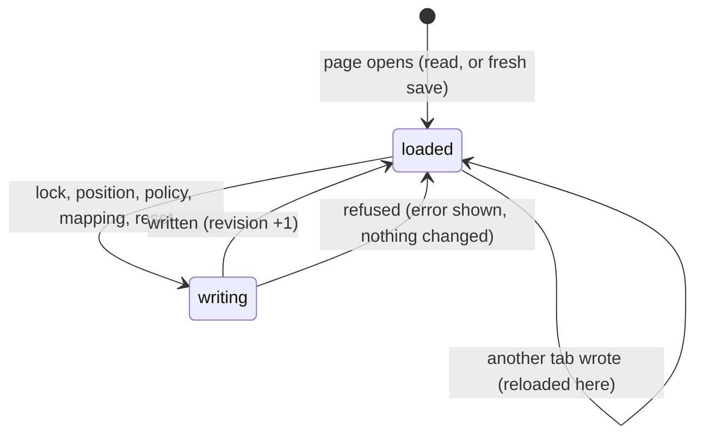

# This browser's save

## Summary

Everything the Arena remembers lives in this browser profile, on this device. There is no account, server or sync; the header's **LOCAL DEMO** label is the only reminder. This browser's save is three separate stores:

| Store | Holds | Written when |
|---|---|---|
| The Arena save (localStorage `wybmh-paper-arena-v2`) | Recordings, the ledger of awards, the scoring policy, the contest waiting to resume and its position, and imported asset mappings | A contest is locked; the playback position is saved; the policy is saved; an asset mapping is attached; the demo is reset |
| The Play bindings (localStorage `wybmh-input-bindings-v1`) | Each Play slot's key and controller bindings | **Start {event}** is pressed in Play |
| The character library (IndexedDB `wybmh-character-library-v1`) | Installed character packs | **Install & preview** succeeds |

These things are *not* saved:
- the current view
- the selected Watch event
- the setup choices: users, cards, mode, strategy and tie rule
- Watch sound and Play sound (both start off)
- **Reduced motion**, which starts from the operating system's setting
- **Lower graphics quality**
- the clean spectator view
- Play setup choices other than bindings
- motion-style drafts in The collection
- any Play match

This document owns:
- what "saved" means
- how saves survive interruption and other tabs
- what happens when storage fails
- exports

## The simple case

A player opens the page for the first time and finds a *fresh save*. The two scheduled basketball counted entries are already played, so each demo user has some points and one entry used. They lock an exhibition, watch half of it, and close the tab.

When they come back, the lobby shows **Saved at N seconds. Your result is waiting.** Standings are as they left them, and the exhibition is in History once it has been watched to the end. Nothing was sent anywhere. Opening the same page in a different browser, or in a private window, shows a fresh save.

## The interaction, event by event

The action narrated here is one write to the Arena save, from the change that causes it until the page is showing the saved result.

### Starting

When the page opens, it reads the Arena save:
- If there is none, it builds a fresh save in memory. The fresh save is not written until the first change.
- If there is a leftover *journal* copy with a newer revision, from a write that was interrupted, the journal wins and becomes the save. The journal is then removed.
- Every copy is checked against its checksum.

Before reading the Arena save, the page opens the character library, so that recordings using installed characters can be shown.

### Backing out at once

Many things change only memory and write nothing:
- closing a dialog without saving
- choosing a different event
- changing setup choices
- toggling sound or Reduced motion

A reload forgets all of them.

### Committing

A write commits in three steps:
1. The whole new save is written to the journal.
2. The same text is written to the save.
3. The journal is removed.

Each write adds one to the save's revision number. Writes that change the ledger or recordings wait for a browser-wide lock on the save, so two tabs cannot interleave them: locking a contest, saving the policy, attaching a mapping, and resetting. Playback-position writes do not take the lock.

### While committed

Other tabs of the Arena on the same browser are told about each write. They re-read the save, and re-open the character library, so their Standings, points chip and History update without a reload. The view, any loaded recording, and dialogs in those tabs are left as they were. Their Watch stage and collection preview are *rebuilt*, though, because every re-read counts as new mappings ([the stage](stage.md#loading-and-rebuilding)). The verification pass saw one lock in one tab reload the lobby stage of another.

### Resolving

The page shows the saved result. After locking a contest, the new recording is loaded. After saving the policy, the settings dialog closes. After a reset, the loaded contest is unloaded.

If a write is refused, the save on disk is unchanged. The usual cause is a full or blocked storage quota. Every write first re-reads the save, so a save that fails its checksum or format check makes every write fail too; the checks themselves run when the save is read, not when it is written. The page shows one of these messages:
- **Locking a contest.** The reason appears in the setup dialog and in the error box.
- **Saving the playback position.** **Playback could not be saved. Keep this tab open and export your recording.**
- **Saving the policy.** The reason appears in the error box under the Watch stage, and the settings dialog stays open.

## Exports

- **Export local save.** In [Arena settings](../club/arena-settings.md), it downloads the Arena save as `clubhouse-save.json`: recordings, ledger, policy, the contest waiting to resume, and mappings. **Reset the local demo?** offers the same export as `clubhouse-before-reset.json`. The export is the save *as shown*. Any recording that is loaded and not yet complete, or waiting to resume, is left out together with its awards, and that includes exhibitions. The verification pass saw an export with 4 awards while the save held 6. The file's waiting-contest field still names the missing recording, and the file carries no checksum.
- **Export immutable recording.** In the attempt history (**The contest, as it happened**), it downloads the loaded recording as `arena-{contest id}.json`.

Nothing on the page can import an exported save or recording back. The bindings and the character library are not included in any export. A character pack is its own backup: keep the `.arena-character.json` file.

## Modifiers

| Modifier | Set at the start | Changed while committed |
| --- | --- | --- |
| Input device | No effect on saving. | No effect. |
| Event and action combinations | No effect. Every sport and Play event saves the same way. | No effect. |
| Contest kind | Exhibitions and counted entries both save a recording and a resume position; only counted entries add awards. Practice saves nothing but bindings. | No effect. |
| Character card | A recording stores the card IDs it used. A recording that uses an installed character depends on that character still being in the library. | No effect. |
| Presentation settings | Not saved. | Not saved. |
| Screen size and orientation | No effect. | No effect. |
| Saved state | A fresh save contains the two basketball contests. A returning save is used as it is. A save that fails its checksum or format check is refused at load (see [edge cases](#edge-cases)). | A reset replaces the save with a fresh one but keeps its revision number rising, so other tabs still notice the change. |

## Cancel and interrupt

| Event | Before committing | While committed |
| --- | --- | --- |
| Escape or click outside | Closing a dialog before its save button writes nothing. | A write already under way finishes; it cannot be cancelled. |
| Pause or resume | No effect on saving. | No effect. |
| Repeated or rapid input | Double-clicking **Start showdown** writes once. Saving the same policy twice writes twice, with the same content. | A counted entry or award can never be written twice. The ledger rejects a duplicate award, and locking an already-played pairing returns the existing recording. |
| A panel opens on top | No effect. | No effect. |
| Navigating away | The logo writes the loaded recording's position. Switching tab does not. | A write under way completes. |
| Forced finish | **Skip to result** writes the position as complete, which clears the contest waiting to resume. | No effect. |
| Focus leaves the game | No effect. | No effect. |
| Reload, close, or back/forward cache | Leaving the page writes the loaded recording's position (on `pagehide`). Unsaved dialog changes are lost. | A write interrupted between its steps leaves a journal. The next load recovers the newer copy, so a contest is either fully locked or not at all. |
| Settings or saved data change underneath | Another tab's write is picked up here straight away. | A locking write waits for another tab's locking write to finish. It then re-reads the save, so it never overwrites the other tab's contest. |
| Graphics or storage failure | If localStorage is full or blocked, writes are refused with the messages above. If IndexedDB cannot open, the character library fails, and so does the Arena save's first load: see the edge cases. | The save on disk is left at its last good revision. |
| Input device changes | No effect. | No effect. |

> Technical note: the journal is written just before the main copy and removed just after it. A reader that finds a journal with a *higher* revision than the main copy knows the main write did not finish, and adopts the journal.

## Interactions with other systems

**Points and the ledger.** Awards are stored only in the ledger inside the Arena save. Club points and standings are recomputed from it every time; there is no stored total that could drift ([points and entries](../club/points-and-entries.md)).

**Saved data and recovery.** This document is the owner.

**Watch and Play separation.** Watch writes the Arena save. Play writes only the bindings. The two never write each other's data.

**Devices and players.** The bindings are saved per Play slot number, not per device or person, but only slots 1 and 2 are read back. Changing a slot's **Controls** replaces its bindings with that device's defaults. In practice a saved remap reaches a later match only for player 1, left on the device it had. See [controls and remapping](../play/controls-and-remapping.md).

**Sound.** Not saved.

**Reduced motion and graphics quality.** Not saved. Reduced motion starts each visit from the operating system's setting, and Lower graphics quality starts off.

**Accessibility.** Refused saves are shown as text in an error region.

**Installed characters.** They live in their own store and are not part of the Arena save, its export or **Reset demo**. Uninstalling needs the browser's own site-data controls; there is no uninstall button ([Install character](../collection/install-character.md)).

**Multiple tabs.** Covered above. Tabs share every store. Locking writes are serialized, and every tab reloads the Arena save when another writes it.

**Agent tools.** No interaction. The agent tools read only what the page is showing, and write nothing.

## Edge cases

- **A save that fails its integrity check** (**The local save did not pass its integrity check.**) or format check (**This save has an unsupported format. Export it before resetting.**) is refused when the page opens. The error box shows it prefixed with **Character library:**, which misleads. **Set up showdown** stays disabled, and there is no way to reset from the page: **Reset demo data** reads the old save first, and throws. The verification pass confirmed the error text, the disabled button, and that **Restore arena** then switched on **Lower graphics quality**.
- **If IndexedDB is unavailable**, for example because browser storage is blocked, the character library cannot open. The page then never reads the Arena save at all. The error box shows **Character library: Error: The character library could not be opened. Check that browser storage is available.** and Watch cannot start a contest. The verification pass confirmed this by making the library fail to open. **Reset demo data** and **Save for future entries** still work in this state, because they read the save directly. They can therefore overwrite a save the page never showed, and **Export local save** first would download nothing useful.
- **Clearing only the character library** through the browser leaves recordings that name an installed character's card. What those recordings show has not been determined.
- **Bindings saved for players 3 and 4** are not loaded when Play setup opens, because setup starts with two slots. Added slots get the default bindings.
- **A fresh save is built again on every load until the first write.** Two tabs opened on a fresh browser therefore both show the fixtures until one of them writes.

## Open questions and verification

- Read from `lib/arena/persistence.ts`, `lib/arena/character-store.ts`, `components/arena/Game.tsx`, `Panels.tsx` and `components/arena/live/PlayableArena.tsx`. `tests/run-tests.mjs` checks the journal, duplicate refusal and idempotency against the repository, not through the page.
- **A corrupt save cannot be recovered from the page.** It shows a misleading **Character library:** prefix and offers no way out except clearing site data. This may be worth treating as a bug.
- **Blocked IndexedDB stops Watch entirely.** A browser that blocks IndexedDB but allows localStorage cannot use Watch at all, even with no installed characters. This may be worth treating as a bug.
- **The playback position is written without the cross-tab lock.** Whether a position write can overwrite a contest locked a moment earlier in another tab has not been tried. It loads, changes and writes the whole save.
- **Recordings whose installed character is gone.** What History shows for a recording whose installed character was cleared from IndexedDB is unknown.

Verified against Will-You-Be-My-Hero-Arena commit `3b4ec62`
