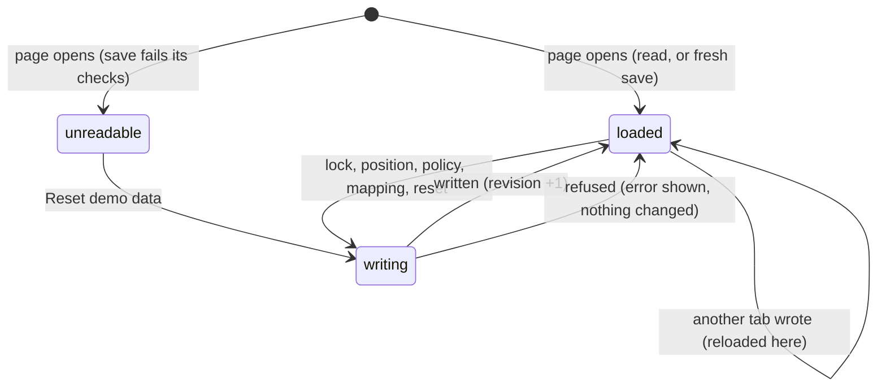

# This browser's save

## Summary

Everything the Arena remembers lives in this browser profile, on this device. There is no account, server or sync; the header's **LOCAL DEMO** label is the only reminder. This browser's save is three separate stores:

| Store | Holds | Written when |
|---|---|---|
| The Arena save (localStorage `wybmh-paper-arena-v2`) | Recordings, the ledger of awards, the scoring policy, the contest waiting to resume and its position, and imported asset mappings | A contest is locked; the playback position of a contest waiting for its first viewing is saved; the policy is saved; an asset mapping is attached; the demo is reset |
| The Play bindings (localStorage `wybmh-input-bindings-v2`) | The key and button bindings of each keyboard layout and controller, one entry per device | **Start {event}** is pressed in Play |
| The character library (IndexedDB `wybmh-character-library-v1`) | Installed character packs | **Install & preview** succeeds |

These things are *not* saved:
- the current view
- the selected Watch event
- the setup choices: users, cards, mode, strategy and tie rule
- Watch sound and Play sound (both start off)
- **Reduced motion**, which starts from the operating system's setting
- **Lower graphics quality**
- the clean spectator view
- Play setup choices other than bindings
- motion-style drafts in The collection
- any Play match

This document owns:
- what "saved" means
- how saves survive interruption and other tabs
- what happens when storage fails
- exports

## The simple case

A player opens the page for the first time and finds a *fresh save*. The two scheduled basketball counted entries are already played, so each demo user has some points and one entry used. They lock an exhibition, watch half of it, and close the tab.

When they come back, the lobby shows **Exhibition saved at N seconds.** with **Resume contest**. Standings are as they left them, and the exhibition is in History once it has been watched to the end. Nothing was sent anywhere. Opening the same page in a different browser, or in a private window, shows a fresh save.

## The interaction, event by event

The action narrated here is one write to the Arena save, from the change that causes it until the page is showing the saved result.

### Starting

When the page opens, it reads the Arena save:
- If there is none, it builds a fresh save in memory. The fresh save is not written until the first change.
- If there is a leftover *journal* copy with a newer revision, from a write that was interrupted, the journal wins and becomes the save. The journal is then removed.
- Every copy is checked against its checksum and format. A save that fails either check is not used; the page shows the unreadable-save box instead (see [edge cases](#edge-cases)).

Before reading the Arena save, the page tries to open the character library, so that recordings using installed characters can be shown. It then reads the Arena save whether or not the library opened.

### Backing out at once

Many things change only memory and write nothing:
- closing a dialog without saving
- choosing a different event
- changing setup choices
- toggling sound or Reduced motion

A reload forgets all of them.

### Committing

A write commits in three steps:
1. The whole new save is written to the journal.
2. The same text is written to the save.
3. The journal is removed.

Each write adds one to the save's revision number. Writes that change the ledger or recordings wait for a browser-wide lock on the save, so two tabs cannot interleave them: locking a contest, saving the policy, attaching a mapping, and resetting. Playback-position writes do not take the lock. They happen only for the contest waiting for its first viewing, never for a replay.

### While committed

Other tabs of the Arena on the same browser are told about each write. They re-read the save, and re-open the character library, so their Standings, points chip and History update without a reload. If the save or the library can now be read, their unreadable-save box or installed-characters notice clears. The view, any loaded recording, and dialogs in those tabs are left as they were. Their Watch stage and collection preview are rebuilt only if the write changed the mappings of the cards they show ([the stage](stage.md#loading-and-rebuilding)).

### Resolving

The page shows the saved result. After locking a contest, the new recording is loaded. After saving the policy, the settings dialog closes. After a reset, the loaded contest is unloaded.

If a write is refused, the save on disk is unchanged. The usual cause is a full or blocked storage quota. Every write except a reset first re-reads the save, so a save that fails its checksum or format check makes those writes fail too; the checks themselves run when the save is read, not when it is written. **Reset demo data** does not read the old save's contents, so it works over an unreadable save. The page shows one of these messages, each where the player is:
- **Locking a contest.** The reason appears in the setup dialog, and in the Watch error box with **Dismiss**.
- **Saving the playback position.** **Playback could not be saved. Keep this tab open and export your recording.** in the Watch error box, with **Dismiss**.
- **Saving the policy.** The plain message, for example **Use whole numbers from 0 to 100.**, appears inside the settings dialog above **Save for future entries**, and the dialog stays open.
- **Resetting.** **The demo could not be reset: {reason}** appears in the reset dialog. Playback is not stopped.
- **Attaching a mapping.** "The mapping could not be saved: {reason}" appears in the mapping dialog.

## Exports

- **Export local save.** In [Arena settings](../club/arena-settings.md), it downloads the Arena save as `clubhouse-save.json`: recordings, ledger, policy, the contest waiting to resume, and mappings. **Reset the local demo?** offers the same export as **Export save**, named `clubhouse-before-reset.json`. The export is the stored save: every recording and every award, including the contest waiting to resume, whatever is loaded. It is the save's contents without the checksum envelope, so the file carries no checksum.
- **Export unreadable save.** When the save cannot be read, the box under the header offers this button. It downloads the stored text exactly as it is, as `clubhouse-save-unreadable.json`. **Export local save** and **Export save** do the same in that state, as `clubhouse-save-unreadable.json` and `clubhouse-before-reset-unreadable.json`.
- **Export immutable recording.** In the attempt history (**The contest, as it happened**), it downloads the loaded recording as `arena-{contest id}.json`.

Nothing on the page can import an exported save or recording back. The bindings and the character library are not included in any export. A character pack is its own backup: keep the `.arena-character.json` file.

## Modifiers

| Modifier | Set at the start | Changed while committed |
| --- | --- | --- |
| Input device | No effect on saving. | No effect. |
| Event and action combinations | No effect. Every sport and Play event saves the same way. | No effect. |
| Contest kind | Exhibitions and counted entries both save a recording, and a resume position until their first viewing completes; only counted entries add awards. A replay saves nothing. Practice saves nothing but bindings. | No effect. |
| Character card | A recording stores the card IDs it used. A recording that uses an installed character depends on that character still being in the library; without it, the recording shows **Unknown card** and cannot be replayed. | No effect. |
| Presentation settings | Not saved. | Not saved. |
| Screen size and orientation | No effect. | No effect. |
| Saved state | A fresh save contains the two basketball contests. A returning save is used as it is. A save that fails its checksum or format check is not used: the page shows the unreadable-save box, which offers an export of the raw text and a reset (see [edge cases](#edge-cases)). | A reset replaces the save with a fresh one, written one revision above the highest it can read from the save or its journal, even an unreadable one. Other tabs therefore still notice the change. |

## Cancel and interrupt

| Event | Before committing | While committed |
| --- | --- | --- |
| Escape or click outside | Closing a dialog before its save button writes nothing. | A write already under way finishes; it cannot be cancelled. |
| Pause or resume | No effect on saving. | No effect. |
| Repeated or rapid input | Double-clicking **Start showdown** writes once. Pressing **Save for future entries** twice before the dialog closes writes twice with the same content. Saving unchanged values keeps the policy's name. New values get a name made from the values, `club-points-{hash}`, so the same values always give the same name. | A counted entry or award can never be written twice. The ledger rejects a duplicate award, and locking an already-played pairing returns the existing recording. |
| A panel opens on top | No effect. | No effect. |
| Navigating away | The logo writes the loaded recording's position if it is still waiting for its first viewing. A replay writes nothing. Switching tab writes nothing. | A write under way completes. |
| Forced finish | **Skip to result** on a first viewing clears the contest waiting to resume, and saves that at once. On a replay it writes nothing. | No effect. |
| Focus leaves the game | No effect. | No effect. |
| Reload, close, or back/forward cache | Leaving the page writes the position of a first viewing (on `pagehide`). A replay writes nothing. Unsaved dialog changes are lost. | A write interrupted between its steps leaves a journal. The next load recovers the newer copy, so a contest is either fully locked or not at all. |
| Settings or saved data change underneath | Another tab's write is picked up here straight away. | A locking write waits for another tab's locking write to finish. It then re-reads the save, so it never overwrites the other tab's contest. |
| Graphics or storage failure | If localStorage is full or blocked, writes are refused with the messages above. If IndexedDB cannot open, only the character library fails: the Arena save still loads, and a notice says installed characters are unavailable (see the edge cases). | The save on disk is left at its last good revision. |
| Input device changes | No effect. | No effect. |

> Technical note: the journal is written just before the main copy and removed just after it. A reader that finds a journal with a *higher* revision than the main copy knows the main write did not finish, and adopts the journal.

## Interactions with other systems

**Points and the ledger.** Awards are stored only in the ledger inside the Arena save. Club points and standings are recomputed from it every time; there is no stored total that could drift ([points and entries](../club/points-and-entries.md)).

**Saved data and recovery.** This document is the owner.

**Watch and Play separation.** Watch writes the Arena save. Play writes only the bindings. The two never write each other's data.

**Devices and players.** The bindings are saved per device, not per slot or person: one entry each for keyboard 1, keyboard 2 and controllers 1 to 4. Touch and AI players have none. Any slot, 1 to 4, that picks a device gets that device's saved bindings, when Play setup opens and whenever its **Controls** changes. A malformed entry is ignored. The older per-slot `wybmh-input-bindings-v1` is read only as a fallback for keyboard 1 and is no longer written. See [controls and remapping](../play/controls-and-remapping.md).

**Sound.** Not saved.

**Reduced motion and graphics quality.** Not saved. Reduced motion starts each visit from the operating system's setting, and Lower graphics quality starts off.

**Accessibility.** Refused saves are shown as text in alert regions, next to where the write was made. The unreadable-save box is an alert, and the installed-characters notice is a polite status.

**Installed characters.** They live in their own store and are not part of the Arena save, its export or **Reset demo**. Uninstalling needs the browser's own site-data controls; there is no uninstall button ([Install character](../collection/install-character.md)). If the library cannot be opened, the rest of the page still works with the built-in cards.

**Multiple tabs.** Covered above. Tabs share every store. Locking writes are serialized, and every tab reloads the Arena save when another writes it. Arena settings re-reads the saved policy each time it opens, so it never shows a stale policy from before another tab's save.

**Agent tools.** No interaction. The agent tools read only what the page is showing, and write nothing.

## Edge cases

- **A save that fails its integrity check or format check** is not used when the page opens. A box under the header, on every view, reads **This browser’s Arena save could not be read: {reason}**. The reason is **The local save did not pass its integrity check.** or **This save has an unsupported format. Export it before resetting.** The box has two buttons:
  - **Export unreadable save** downloads the stored text exactly as it is, as `clubhouse-save-unreadable.json`.
  - **Reset demo…** opens **Reset the local demo?**, where **Reset demo data** works even so: it writes a fresh save one revision above the highest it can read from the save or its journal.

  Until then, **Set up showdown** stays disabled, History reads **The Arena save could not be read.**, House rules leaves out the scoring-policy name, and the logo still returns to the lobby.
- **If IndexedDB is unavailable**, for example because browser storage is blocked, the character library cannot open. The Arena save still loads and Watch works with the built-in cards. A notice under the header reads **Installed characters are unavailable because this browser’s character storage could not be opened. The built-in cards still work.** It clears if a later re-read, such as after another tab's write, opens the library. The clean spectator view hides it.
- **Clearing only the character library** through the browser leaves recordings that name an installed character's card. History, the member record and the attempt list show **Unknown card** for it. Its History and member-record rows are disabled and say "This recording uses a character that is no longer installed." If it is the contest waiting to resume, the resume banner adds the same sentence and **Resume contest** is disabled.
- **Bindings for every slot.** Because bindings are saved per device, a slot added as player 3 or 4 that picks a keyboard layout or controller gets that device's saved bindings too.
- **A fresh save is built again on every load until the first write.** Two tabs opened on a fresh browser therefore both show the fixtures until one of them writes.

## Open questions and verification

- Read from `lib/arena/persistence.ts`, `lib/arena/character-store.ts`, `components/arena/Game.tsx`, `Panels.tsx` and `components/arena/live/PlayableArena.tsx`. `tests/run-tests.mjs` checks the journal, duplicate refusal and idempotency against the repository, not through the page.
- Fixed: a corrupt save is reported under its own name, can be exported as raw text, and can be reset from the page (B-03). The first verification pass found it reported as a **Character library:** error with no way out.
- Fixed: a blocked character library no longer stops Watch; the Arena save loads on its own (B-04). The first verification pass found **Set up showdown** disabled in that state.
- Fixed: the exports contain the whole stored save (B-11). The first verification pass found an export with 4 awards while the save held 6.
- Fixed: a recording whose installed character is gone shows **Unknown card** and cannot be replayed (B-23). This has not been tried on the page.
- **The playback position is written without the cross-tab lock.** Whether a position write can overwrite a contest locked a moment earlier in another tab has not been tried. It loads, changes and writes the whole save.

Verified against Will-You-Be-My-Hero-Arena commit `364e3c1`
