# The stage

## Summary

The stage is the drawn backyard court where the competition happens. There are three, one per place a stage appears:
- **The Watch stage**, under the event title.
- **The Play stage**, in a live match.
- **A preview stage** in The collection.

Every stage draws a fixed 1280×720 scene, scaled to fit its box without distortion and centred in it. This document owns:
- how a stage loads and what it shows while loading
- how it scales
- what **Reduced motion** and **Lower graphics quality** change
- what happens when the browser loses the graphics context (WebGL)
- the Watch error box and its **Reload the arena** and **Dismiss** buttons, and the preview's **Reload the preview**

What the stage *shows* during a contest or match belongs to the sport and event documents. The Watch overlays belong to [playback controls](../watch/playback-controls.md): the scoreboard, the bottom bar and the sound and clean-view buttons.

## The simple case

On the Watch lobby the stage shows the selected event's court with both selected cards standing ready. While it loads, the stage is covered by a yellow card reading **UNFOLDING THE ARENA…** with a spinner. When a contest is locked, the stage rebuilds for that recording and plays it.

In Play, the stage is covered by **Opening the cards…** until the match is ready. It then takes keyboard focus.

Resizing the window rescales the court smoothly. Nothing restarts, and nothing changes size relative to the court.

## Loading and rebuilding

- **The Watch stage is rebuilt from scratch**, showing **UNFOLDING THE ARENA…** again, whenever any of these change:
  - the selected cards
  - the loaded recording
  - the sport
  - **Lower graphics quality**
  - the imported asset mappings of the two cards shown

  Re-reading this browser's save does not rebuild it by itself. A policy save, a reset, the logo or another tab's write rebuilds the stage only if it changed one of those things, for example by unloading the recording or attaching a mapping for a shown card.

  It is also rebuilt every time the player returns to the Watch tab, and by **Reload the arena**. While it rebuilds, the playback clock does not advance: the renderer drives it. Playback continues from where it was once the stage is ready.
- **The Play stage is built once per match.** It is rebuilt only by **Play again**, which starts a new match. Toggling **Reduced motion** applies to the running match without a rebuild.
- **The preview stage** in The collection follows the same rules as the Watch lobby stage, for its own card. On a cornhole court, switching between the plain idle and any other clip also rebuilds it, because Dan's and Doug's idle there uses the cornhole performance figure and every other clip uses the puppet (see [the collection](../collection/the-collection.md)).
- **If a stage's assets fail to load**, Watch reports the error in the error box, with **Reload the arena**. The collection shows it under the preview, with **Reload the preview**. Play shows "Could not load {file}. Return to setup and retry." in its error overlay.

## Scaling

The scene is always 1280×720 *stage pixels*, fitted inside the stage box and centred. Any spare space is letterboxed in the court's background colour. All game rules measure in stage pixels, so the window size never changes an outcome. Examples are the cornhole hole's 13-pixel radius and the Brawl's hit ranges.

The Watch stage box keeps the court's 16:9 shape at every width the verification pass measured:

| Window width | Stage height |
|---|---|
| 1600 px | 710 px |
| 1440 px | 620 px |
| 1100 px | 429 px |
| 850 px | 324 px |
| 390 px | 208 px |

The stylesheet also sets fixed heights (510, 570, 480 and 550 px) and heights for short landscape screens. They are overridden at every size, so the box stays 16:9. In the clean spectator view the stage takes the page's full width.

The page's own text overlays on the stage cannot be seen at any width:
- **In the lobby**, the "THE SAME CREW. HIGHER STAKES." label.
- **During playback**, the "Live score" scoreboard.

Only screen readers get them. What the viewer sees instead is the drawing's sign and nameplates ([playback controls](../watch/playback-controls.md)). The sound and clean-view buttons sit at the bottom right of the stage, just above the bottom bar. In the clean spectator view, a **Pause playback** or **Resume playback** button joins them while a recording is playing or paused.

> Technical note: a second stylesheet, `public/assets/arena-interface.css`, loads after `app/globals.css`. It sets the stage box to `aspect-ratio: 16/9`, and shrinks the scoreboard and the lobby label to a one-pixel clipped box ("The accessible DOM scores remain; the shared Phaser HUD is the sole visual score"). The verification pass saw them hidden at desktop widths; the stylesheet hides them on narrow screens too. The same rule hides the Play stage's score strip and the page's **Release in green** meter; the Play stage draws its own nameplates and meter instead.

## Reduced motion and lower graphics quality

Both are checkboxes in [Arena settings](../club/arena-settings.md). They apply at once and are not saved. **Reduced motion** starts from the operating system's "reduce motion" preference on each visit. **Lower graphics quality** starts off.

| | Reduced motion | Lower graphics quality |
|---|---|---|
| Watch | No contact effects, camera punch or shake, and no burst or dust as the characters land from their entrances. Character clips are played in their reduced form. | The stage is rebuilt. Contact effects and camera punch and shake are removed, as for Reduced motion; the entrance effects and character motion are unchanged. |
| Play | Applies to the running match at once, without a restart. Camera punches and shakes are skipped, impact effects are not drawn at all, and squash and stretch is off. | No effect: Play ignores it. |
| The collection | Previews use reduced clips. On a cornhole court, Dan's and Doug's plain idle is the performance idle whatever the setting; every other clip plays on the puppet, in its reduced form. | The preview stage is rebuilt. The preview has no contact or camera effects to tone down, so the rebuild is the only visible change. |
| The page itself | Transitions are turned off, card hover lift is disabled, and spinners stop spinning. This follows the operating system's preference, not the checkbox. | No effect. |

## Graphics context loss and the error box

A browser can take away a page's WebGL graphics context, for example after a GPU driver reset, or when too many tabs use graphics.

- **In Watch**, the page catches this:
  - playback pauses, and the pause button shows **Resume playback**
  - the error box under the stage reads **Graphics were interrupted. Reload to continue; nothing about the contest has changed.** with a **Reload the arena** button. In the lobby, with no recording loaded, it reads just **Graphics were interrupted. Reload to continue.**, as does the collection preview's own error box

  **Reload the arena** clears the message and rebuilds the stage from scratch. With a recording loaded, it stays paused at the same second, and the player presses **Resume playback** to continue. In the lobby, the idle clock starts again.
- **In Play**, the match pauses under **PAUSED** with the notice **Graphics were interrupted. Resume when the stage is back.** When the browser gives the context back, the notice becomes **Graphics are back. Resume when ready.** **Resume game** resumes. It is an ordinary pause, so held input is cleared ([the input model](input-model.md#pause-and-input)).
- **In The collection**, the preview has its own error box under the preview stage, with a **Reload the preview** button that rebuilds the preview and restarts its clock. The preview has its own clock, so a lost graphics context there stops only the preview. Preview errors never reach the Watch error box.

The Watch error box shows Watch's other errors too: a refused lock, and a failed playback-position save. Its button depends on the error:
- **A stage failure**, meaning assets that fail to load or a graphics loss, shows **Reload the arena**, as above.
- **Any other error** shows **Dismiss**, which only clears the message.

Neither button ever changes **Lower graphics quality**. Errors from elsewhere show where they happen: a rejected scoring policy inside Arena settings, a failed reset inside its dialog, and an unreadable save or a character library that will not open under the header ([this browser's save](saved-data.md#edge-cases)).

## The interaction, event by event

The action narrated here is the stage's life, from being shown until it is ready.

```mermaid
stateDiagram-v2
    [*] --> loading : view shown, or a rebuilding change
    loading --> ready : assets loaded (Watch: playback may start; Play: stage takes focus)
    loading --> failed : asset or runtime error (message shown)
    ready --> loading : Watch: cards, recording, sport, graphics or shown cards' mappings change
    ready --> lost : graphics context lost (Watch and preview: error box; Play: paused)
    lost --> loading : Reload the arena (Watch: same second, paused) or Reload the preview
    lost --> ready : Play: context given back, then Resume game
    failed --> loading : Reload the arena, Reload the preview, or Back to setup and Start (Play)
```

### Starting

The stage appears with its loading cover as soon as the view is shown. The Watch cover reads **UNFOLDING THE ARENA…** and the Play cover **Opening the cards…**. The stage loads the court, the equipment and each card's character art and rig.

### Backing out at once

Leaving the view while the stage is loading cancels the load. Nothing is kept and nothing is shown later.

### Committing

The stage becomes ready. In Watch, a newly locked contest starts playing now, provided the setup dialog has finished closing. Only the Watch stage can start it; the collection's preview becoming ready does not. A replay of the loaded, completed recording chosen from another view also waits for the Watch stage before it plays. In Play, the match's entrances begin and the stage takes keyboard focus.

### While committed

The stage draws continuously. The Watch stage stops drawing new moments while the tab is hidden, because the playback clock does not advance then. The Play stage stops advancing game time while paused.

### Resolving

The stage is torn down when its view is left, or rebuilt when a rebuilding change happens. Nothing about the stage itself is saved.

## Modifiers

| Modifier | Set at the start | Changed while committed |
| --- | --- | --- |
| Input device | Not applicable: the stage takes no input of its own. The Play stage's box is where keyboard focus must be for game keys. | No effect. |
| Event and action combinations | The sport or event decides the court, equipment and camera. | Changing the Watch event in the lobby rebuilds the stage. |
| Contest kind | No effect on the stage. | No effect. |
| Character card | Each card's art and rig is loaded. An installed character's images come from the character library. An installed card without a connected rig cannot be used in Play (see [Install character](../collection/install-character.md)). | Changing a card in setup rebuilds the Watch lobby stage. |
| Presentation settings | See the table above. | **Reduced motion** applies at once in Watch and in a running Play match, without a restart. **Lower graphics quality** rebuilds the Watch stage. |
| Screen size and orientation | The scene is fitted and centred in its box. The Watch stage's box keeps 16:9 (see the table above); the verification pass measured the Play stage's box at 776 px high in a 1440 px window. The collection's preview stage has a fixed box, 360 px high, or 380 px at 600 px and below, so the court is letterboxed there. | Resizing or rotating rescales at once; nothing reloads or restarts. |
| Saved state | An imported asset mapping changes a card's card image, personality and motion profile, and for an installed card its drawn figure too. Dan and Doug are always drawn from their built-in figure ([asset mapping](../collection/asset-mapping.md)). | Attaching a mapping for one of the shown cards rebuilds the Watch stage. Other writes to the save do not. |

## Cancel and interrupt

| Event | Before committing | While committed |
| --- | --- | --- |
| Escape or click outside | No effect on the stage. | No effect on the stage. In Play, Escape is keyboard 1's pause key. |
| Pause or resume | Not applicable while loading. | Watch pause stops the playback clock, and the stage holds its current frame. Play pause freezes the match under the **PAUSED** overlay. |
| Repeated or rapid input | Toggling **Lower graphics quality** repeatedly rebuilds the Watch stage each time. | The same. |
| A panel opens on top | The stage keeps loading behind the dialog. | The stage keeps drawing behind the dialog. |
| Navigating away | The load is abandoned. | The stage is destroyed. Watch rebuilds it on return; Play does not come back. |
| Forced finish | Not applicable. | **Skip to result** and **Skip entrances** jump the Watch stage to the new moment. |
| Focus leaves the game | No effect on loading. | Hiding the tab stops the Watch clock. Losing window focus or hiding the tab pauses Play, unless the match has finished. |
| Reload, close, or back/forward cache | The page reloads to the Watch lobby, whose stage loads again. | The same. |
| Settings or saved data change underneath | A reset in Arena settings unloads the Watch contest and returns the stage to the lobby preview. | Reduced motion applies to a running Play match without a restart. Lower graphics, and a change to the shown cards' mappings, rebuild the Watch stage. Other writes to the save, including another tab's, do not. |
| Graphics or storage failure | An asset that fails to load shows an error: in the Watch error box with **Reload the arena**, under the collection preview with **Reload the preview**, or in the overlay in Play. | Every stage catches a lost graphics context. Watch pauses and offers **Reload the arena**; Play pauses with a notice; the collection preview stops and offers **Reload the preview**. |
| Input device changes | No effect. | No effect on the stage. |

## Interactions with other systems

**Points and the ledger.** No interaction.

**Saved data and recovery.** Imported asset mappings and installed characters, both from this browser's save, decide what characters look like. Nothing about the stage is saved.

**Watch and Play separation.** Separate stages with separate renderers. Lower graphics quality applies only to Watch and The collection.

**Devices and players.** No interaction, except that the Play stage is the focus target for keyboard players.

**Sound.** No interaction; sound is owned by [sound](../cross-cutting/sound.md).

**Reduced motion and graphics quality.** This document is the owner.

**Accessibility.**
- **Watch stage label:** "Animated sports arena. Scores and commentary are also shown as text."
- **Play stage label:** "Playable arena. Focus here for keyboard controls."
- **Preview stage label:** "Character preview".
- The loading covers are text.
- A Play pause caused by a graphics loss, like any automatic pause, is announced through a hidden polite live region.

See [accessibility](../cross-cutting/accessibility.md).

**Installed characters.** Their art is drawn on every stage. A pack whose images fail to load shows a load error.

**Multiple tabs.** Each tab has its own stages and graphics context. Many tabs with stages open make a lost graphics context more likely. Another tab's writes rebuild this tab's stages only when they change the mappings of the cards shown here.

**Agent tools.** Changing the event through `configure_arena_event` rebuilds the Watch lobby stage.

## Edge cases

- **Returning to Watch always reloads the stage**, even after only a glance at Standings. **UNFOLDING THE ARENA…** shows each time.
- **Dismiss** only clears the message, whether or not a recording is loaded. It never touches **Lower graphics quality** or the stage.
- **After a Watch graphics loss**, the pause button shows **Resume playback**, matching the stopped clock.
- **A hidden tab.** While the Watch tab is hidden, the stage simply does not advance, and it picks up where it was when the tab is shown again. The bottom bar never says **PAUSED** for this.

## Open questions and verification

- Read from `components/arena/ArenaStage.tsx`, `lib/arena/engine/core/ArenaGame.ts`, `LiveArenaGame.ts`, `lib/arena/engine/scenes/ArenaScene.ts`, `LiveArenaScene.ts`, `Game.tsx`, `SecondaryViews.tsx` and `app/globals.css`. The first verification pass (2026-09-24) partly checked loading, the 16:9 heights and the hidden overlays at 1440 px. It also found that the old **Restore arena** button toggled **Lower graphics quality** with nothing loaded; fixed in the current build. Graphics loss and narrow screens were not checked.
- **The second stylesheet.** That `public/assets/arena-interface.css` overrides `app/globals.css` is inferred from the measured stage heights. The hidden overlays were checked only at 1440 px. What has not been seen is the bottom-right sound and clean-view buttons, the hidden scoreboard on narrow screens, the side station staying beside the stage down to 720 px, and the clean spectator view keeping 16:9 during a contest rather than filling the window's height.
- **Graphics loss in Play.** The match now pauses (B-14). Whether the stage draws again once the browser gives the context back has not been tried; the code relies on the renderer rebuilding its own resources.
- **Reload the arena.** It rebuilds the stage from scratch. Whether it can draw again while the browser is still withholding a graphics context has not been tried.
- **Resume playback without reloading.** What happens if the player presses **Resume playback** after a Watch graphics loss, before **Reload the arena**, has not been tried.
- **The clock during a rebuild.** The renderer drives the playback clock only once it exists. Whether playback creeps forward for a moment during a rebuild, before the new stage takes over, has not been measured.
- Fixed: the error box's button no longer toggles **Lower graphics quality**, and the pause button shows the real state after a graphics loss (B-13, B-14). Re-reading the save no longer rebuilds the stages (B-12), and preview errors show on The collection (B-10).

Verified against Will-You-Be-My-Hero-Arena commit `364e3c1`
