# The stage

## Summary

The stage is the drawn backyard court where the competition happens. There are three, one per place a stage appears:
- **The Watch stage**, under the event title.
- **The Play stage**, in a live match.
- **A preview stage** in The collection.

Every stage draws a fixed 1280×720 scene, scaled to fit its box without distortion and centred in it. This document owns:
- how a stage loads and what it shows while loading
- how it scales
- what **Reduced motion** and **Lower graphics quality** change
- what happens when the browser loses the graphics context (WebGL)
- the Watch error box and its **Restore arena** button

What the stage *shows* during a contest or match belongs to the sport and event documents. The Watch overlays belong to [playback controls](../watch/playback-controls.md): the scoreboard, the bottom bar and the sound and clean-view buttons.

## The simple case

On the Watch lobby the stage shows the selected event's court with both selected cards standing ready. While it loads, the stage is covered by a yellow card reading **UNFOLDING THE ARENA…** with a spinner. When a contest is locked, the stage rebuilds for that recording and plays it.

In Play, the stage is covered by **Opening the cards…** until the match is ready. It then takes keyboard focus.

Resizing the window rescales the court smoothly. Nothing restarts, and nothing changes size relative to the court.

## Loading and rebuilding

- **The Watch stage is rebuilt from scratch**, showing **UNFOLDING THE ARENA…** again, whenever any of these change:
  - the selected cards
  - the loaded recording
  - the sport
  - **Lower graphics quality**
  - the imported asset mappings. In practice this means *every* re-read of this browser's save: a policy save, a reset, the logo, and every write from another tab. Each re-read produces a new list of mappings, even when nothing in it changed.

  It is also rebuilt every time the player returns to the Watch tab. While it rebuilds, the playback clock does not advance: the renderer drives it. Playback continues from where it was once the stage is ready.
- **The Play stage is built once per match.** It is rebuilt only by **Play again**, which starts a new match, or by toggling **Reduced motion**, which restarts the match.
- **If a stage's assets fail to load**, Watch reports the error in the error box. Play shows "Could not load {file}. Return to setup and retry." in its error overlay.

## Scaling

The scene is always 1280×720 *stage pixels*, fitted inside the stage box and centred. Any spare space is letterboxed in the court's background colour. All game rules measure in stage pixels, so the window size never changes an outcome. Examples are the cornhole hole's 13-pixel radius and the Brawl's hit ranges.

The Watch stage box keeps the court's 16:9 shape at every width the verification pass measured:

| Window width | Stage height |
|---|---|
| 1600 px | 710 px |
| 1440 px | 620 px |
| 1100 px | 429 px |
| 850 px | 324 px |
| 390 px | 208 px |

The stylesheet also sets fixed heights (510, 570, 480 and 550 px) and heights for short landscape screens. They are overridden at every size, so the box stays 16:9. In the clean spectator view the stage takes the page's full width.

The page's own text overlays on the stage cannot be seen at any width:
- **In the lobby**, the "THE SAME CREW. HIGHER STAKES." label.
- **During playback**, the "Live score" scoreboard.

Only screen readers get them. What the viewer sees instead is the drawing's sign and nameplates ([playback controls](../watch/playback-controls.md)). The sound and clean-view buttons sit at the bottom right of the stage, just above the bottom bar.

> Technical note: a second stylesheet, `public/assets/arena-interface.css`, loads after `app/globals.css`. It sets the stage box to `aspect-ratio: 16/9`, and shrinks the scoreboard and the lobby label to a one-pixel clipped box ("The accessible DOM scores remain; the shared Phaser HUD is the sole visual score"). The verification pass saw them hidden at desktop widths; the stylesheet hides them on narrow screens too. The same rule hides the Play stage's score strip and **Release timing** meter; the Play stage draws its own nameplates and meter instead.

## Reduced motion and lower graphics quality

Both are checkboxes in [Arena settings](../club/arena-settings.md). They apply at once and are not saved. **Reduced motion** starts from the operating system's "reduce motion" preference on each visit. **Lower graphics quality** starts off.

| | Reduced motion | Lower graphics quality |
|---|---|---|
| Watch | No contact effects, camera punch or shake, and no burst or dust as the characters land from their entrances. Character clips are played in their reduced form. | The stage is rebuilt. Contact effects and camera punch and shake are removed, as for Reduced motion; the entrance effects and character motion are unchanged. |
| Play | The match **restarts** from its entrances. Camera punches and shakes are skipped, impact effects are not drawn at all, and squash and stretch is off. | No effect: Play ignores it. |
| The collection | Previews use reduced clips. On a cornhole court, though, Dan and Doug always show the same performance idle, whatever the setting. | The preview stage is rebuilt. The preview has no contact or camera effects to tone down, so the rebuild is the only visible change. |
| The page itself | Transitions are turned off, card hover lift is disabled, and spinners stop spinning. This follows the operating system's preference, not the checkbox. | No effect. |

## Graphics context loss and the error box

A browser can take away a page's WebGL graphics context, for example after a GPU driver reset, or when too many tabs use graphics.

- **In Watch**, the page catches this:
  - playback pauses
  - the error box under the stage reads **Graphics paused. Restore the arena to resume the saved contest.** with a **Restore arena** button

  **Restore arena** clears the message and reloads the same recording at the same second, paused. The player presses **Resume playback** to continue.
- **In Play** nothing catches it. There is no message and no pause from the page itself.
- **In The collection**, preview errors go to the same error state as Watch's. The error box is only drawn on the Watch tab, so nothing shows on The collection. A lost graphics context silently stops the preview's clock.

The same Watch error box shows other errors too. Examples: a refused setup, a failed playback-position save, a rejected scoring policy, and a character library that will not open. It always carries **Restore arena**, whatever the error:
- **With a recording loaded**, the button reloads it paused at the current second, as above.
- **With no recording loaded**, the button clears the message and *toggles* **Lower graphics quality**, which rebuilds the stage. That is surprising for an error that had nothing to do with graphics.

## The interaction, event by event

The action narrated here is the stage's life, from being shown until it is ready.

```mermaid
stateDiagram-v2
    [*] --> loading : view shown, or a rebuilding change
    loading --> ready : assets loaded (Watch: playback may start; Play: stage takes focus)
    loading --> failed : asset or runtime error (message shown)
    ready --> loading : Watch: cards, recording, sport, graphics or mappings change
    ready --> lost : graphics context lost (Watch: paused, error box)
    lost --> ready : Restore arena (Watch: same second, paused)
    failed --> loading : Restore arena (Watch) or Back to setup and Start (Play)
```

### Starting

The stage appears with its loading cover as soon as the view is shown. The Watch cover reads **UNFOLDING THE ARENA…** and the Play cover **Opening the cards…**. The stage loads the court, the equipment and each card's character art and rig.

### Backing out at once

Leaving the view while the stage is loading cancels the load. Nothing is kept and nothing is shown later.

### Committing

The stage becomes ready. In Watch, a newly locked contest starts playing now, provided the setup dialog has finished closing. In Play, the match's entrances begin and the stage takes keyboard focus.

### While committed

The stage draws continuously. The Watch stage stops drawing new moments while the tab is hidden, because the playback clock does not advance then. The Play stage stops advancing game time while paused.

### Resolving

The stage is torn down when its view is left, or rebuilt when a rebuilding change happens. Nothing about the stage itself is saved.

## Modifiers

| Modifier | Set at the start | Changed while committed |
| --- | --- | --- |
| Input device | Not applicable: the stage takes no input of its own. The Play stage's box is where keyboard focus must be for game keys. | No effect. |
| Event and action combinations | The sport or event decides the court, equipment and camera. | Changing the Watch event in the lobby rebuilds the stage. |
| Contest kind | No effect on the stage. | No effect. |
| Character card | Each card's art and rig is loaded. An installed character's images come from the character library. An installed card without a connected rig cannot be used in Play (see [Install character](../collection/install-character.md)). | Changing a card in setup rebuilds the Watch lobby stage. |
| Presentation settings | See the table above. | **Reduced motion** applies at once in Watch and restarts a Play match. **Lower graphics quality** rebuilds the Watch stage. |
| Screen size and orientation | The scene is fitted and centred in its box, whose height follows its width at 16:9 (see the table above). | Resizing or rotating rescales at once; nothing reloads or restarts. |
| Saved state | Imported asset mappings replace a card's character art on the Watch stage. | Attaching a mapping rebuilds the Watch stage. |

## Cancel and interrupt

| Event | Before committing | While committed |
| --- | --- | --- |
| Escape or click outside | No effect on the stage. | No effect on the stage. In Play, Escape is keyboard 1's pause key. |
| Pause or resume | Not applicable while loading. | Watch pause stops the playback clock, and the stage holds its current frame. Play pause freezes the match under the **PAUSED** overlay. |
| Repeated or rapid input | Toggling **Lower graphics quality** repeatedly rebuilds the Watch stage each time. | The same. |
| A panel opens on top | The stage keeps loading behind the dialog. | The stage keeps drawing behind the dialog. |
| Navigating away | The load is abandoned. | The stage is destroyed. Watch rebuilds it on return; Play does not come back. |
| Forced finish | Not applicable. | **Skip to result** and **Skip entrances** jump the Watch stage to the new moment. |
| Focus leaves the game | No effect on loading. | Hiding the tab stops the Watch clock. Losing window focus or hiding the tab pauses Play. |
| Reload, close, or back/forward cache | The page reloads to the Watch lobby, whose stage loads again. | The same. |
| Settings or saved data change underneath | A reset in Arena settings unloads the Watch contest and returns the stage to the lobby preview. | Reduced motion restarts a Play match. Lower graphics and mappings rebuild the Watch stage. |
| Graphics or storage failure | An asset that fails to load shows an error: in the error box in Watch, or the overlay in Play. | Watch catches a lost graphics context and pauses; Play does not. |
| Input device changes | No effect. | No effect on the stage. |

## Interactions with other systems

**Points and the ledger.** No interaction.

**Saved data and recovery.** Imported asset mappings and installed characters, both from this browser's save, decide what characters look like. Nothing about the stage is saved.

**Watch and Play separation.** Separate stages with separate renderers. Lower graphics quality applies only to Watch and The collection.

**Devices and players.** No interaction, except that the Play stage is the focus target for keyboard players.

**Sound.** No interaction; sound is owned by [sound](../cross-cutting/sound.md).

**Reduced motion and graphics quality.** This document is the owner.

**Accessibility.**
- **Watch stage label:** "Animated sports arena. Scores and commentary are also shown as text."
- **Play stage label:** "Playable arena. Focus here for keyboard controls."
- The loading covers are text.

See [accessibility](../cross-cutting/accessibility.md).

**Installed characters.** Their art is drawn on every stage. A pack whose images fail to load shows a load error.

**Multiple tabs.** Each tab has its own stages and graphics context. Many tabs with stages open make a lost graphics context more likely.

**Agent tools.** Changing the event through `configure_arena_event` rebuilds the Watch lobby stage.

## Edge cases

- **Returning to Watch always reloads the stage**, even after only a glance at Standings. **UNFOLDING THE ARENA…** shows each time.
- **Restore arena with no recording loaded toggles Lower graphics quality.** Pressed twice for two separate errors, it switches the setting on and then off again.
- **After a Watch graphics loss**, the pause button still offers **Pause playback** even though playback has stopped. Pressing it once *resumes* the clock underneath, and only the second press shows **Resume playback**. **Restore arena** puts the button back in step.
- **A hidden tab.** While the Watch tab is hidden, the stage simply does not advance, and it picks up where it was when the tab is shown again. The bottom bar never says **PAUSED** for this.

## Open questions and verification

- Read from `components/arena/ArenaStage.tsx`, `lib/arena/engine/core/ArenaGame.ts`, `LiveArenaGame.ts`, `lib/arena/engine/scenes/ArenaScene.ts`, `LiveArenaScene.ts`, `Game.tsx` and `app/globals.css`. Not yet checked on the production page.
- **The second stylesheet.** That `public/assets/arena-interface.css` overrides `app/globals.css` is inferred from the measured stage heights. What follows from it has not been seen: the bottom-right sound and clean-view buttons, the hidden scoreboard on narrow screens, the side station staying beside the stage down to 720 px, and the clean spectator view keeping 16:9 during a contest rather than filling the window's height.
- **Graphics loss in Play.** Whether the stage recovers on its own when the browser restores the context, and whether the session keeps advancing unseen, is unknown.
- **Restore arena.** Whether **Restore arena** actually brings back drawing after a real graphics loss, or only clears the message, is unknown. It reloads the recording but does not rebuild the renderer.
- **The clock during a rebuild.** The renderer drives the playback clock only once it exists. Whether playback creeps forward for a moment during a rebuild, before the new stage takes over, has not been measured.
- **Restore arena with no recording** toggling **Lower graphics quality**, and the out-of-step pause button after a graphics loss, look like bugs.

Verified against Will-You-Be-My-Hero-Arena commit `3b4ec62`
