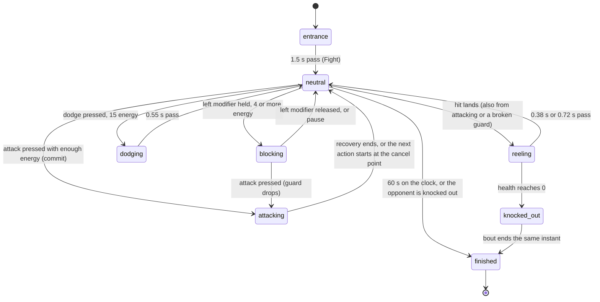

# Backyard Brawl

## Summary

Backyard Brawl is the Play fighting event: exactly two players, one bout, up to 60 seconds. Each fighter starts with 100 health (**HP**) and 100 *energy*, the Brawl's name for stamina. Fighters walk into reach, attack, block, dodge, and knock each other back. A hit that lands takes health; a blocked hit takes 2. Every attack, dodge and counter stance spends energy, which comes back on its own. The bout ends at once when one fighter's health reaches 0, the *knockout*, or when the clock reaches 60 s. The fighter with more health left then wins, and equal health is a draw.

The bout happens on the Play tab, in a *live match* started from [Play setup](play-setup.md) with **Backyard Brawl** selected. There are no turns: both fighters act at the same time, and an AI opponent keeps fighting whatever the other player is doing. The match around the bout, meaning the toolbar, the **PAUSED** overlay and the result with **Play again**, is described in [the match shell](match-shell.md).

The Brawl is *practice*. It never awards points, and nothing about a bout is saved.

## The simple case

By default player 1 is Doug on **Keyboard · WASD** and player 2 is Dan as an **AI player**. When the match opens, both cut-out figures glide in facing the camera, with Doug on the left and Dan on the right, 620 stage pixels apart. The caption reads **Step into the ring**. After 1.5 seconds the caption changes to **Fight — light, light, heavy chains into a finisher**. Both fighters turn side-on to each other with a quick paper-flip, and the fight begins.

The player walks Doug toward Dan with D. As they close, the camera zooms in slightly. Once Dan is within reach, J throws a light attack. If it lands, a yellow star bursts on Dan, the camera shakes, and the game freezes for an instant (*hit-stop*). Dan reels back a few pixels, his **HP** drops by 9, and the caption reads "Doug hits Dan". When Dan swings, holding left Shift raises Doug's guard. A blocked punch shows a teal ring, costs Doug 2 health and 8 energy, and the caption reads "Doug blocks".

Pressing J, J, K in a steady rhythm about a third of a second apart turns the third press into a *finisher*, a bigger and slower blow. E throws a **Power strike**, the biggest attack, once every 6 seconds.

When Dan's health reaches 0, he slumps, both fighters turn to face the camera, and Doug celebrates. The caption and the result read "Doug wins", and the result offers **Play again** and **Choose another event**. If 60 seconds pass first, the fighter with more health wins. On equal health the caption reads **Draw** and the result reads **Session complete**.

## The interaction, event by event

The action narrated here is one attack exchange: a press, the swing, and what it does to the other fighter. The diagram shows the states one fighter passes through during a whole bout.

### Starting

An attack starts with a press of J (**Light attack**), K (**Heavy attack**) or E (**Power strike**), or with a chord or combo that turns one of those presses into something else. The bindings for every device are in [the input model](../foundations/input-model.md#devices). At the instant of the press, the game works out which attack the press means:

- **A chord.** J while the right modifier (left Ctrl) is already held is a *grapple*, not a light attack ([chords and combos](../foundations/input-model.md#chords-and-combos)).
- **The finisher combo.** K as the third of J, J, K pressed within 1.15 s is a finisher. Any other press in between breaks the sequence, including starting to walk, pressing block, or pressing counter stance. A direction already held from before does not break it. The J presses only have to arrive in order; the light attacks do not have to land, or even all happen.
- **The special combo.** E as the third of down, forward, E within 0.65 s is recognised as a combo. It produces exactly the same **Power strike** as E alone. "Forward" means toward the opponent, so it is D for the fighter on the left and A for the fighter on the right.

The attack starts at once if the fighter is free. A fighter is free when all of these hold:

- the fight has begun
- they are not reeling from a hit
- they are not in the middle of another attack, dodge or taunt, or that action has reached its *cancel point*
- they have the attack's energy

Blocking counts as free: any attack can be thrown straight out of a raised guard. If the fighter is not free, the press waits in the Brawl's 0.23 s [buffer](../foundations/input-model.md#buffered-presses) and starts the moment they are. A fighter who is short of energy is not free either, so the press also waits and fires if energy grows back enough within 0.23 s.

The *cancel point* is the moment late in an attack or dodge when the next action is allowed to cut off the rest of it. It is listed for each attack in [attacks and defences](#attacks-and-defences).

### Backing out at once

An attack cannot be taken back once it has started, and there is no cancel input. The only presses that never become attacks are these:

- **A press that waited and expired.** It was made while the fighter could not act, and 0.23 s passed without that changing. It is dropped silently and costs nothing.
- **A press made during the entrances.** Attacks cannot start until **Fight**. A press more than 0.23 s before it is lost; one in the last 0.23 s waits and fires as the fight begins.
- **A press cleared by a pause.** Pausing empties the buffer and the combo history.

How long J, K or E is held makes no difference: a tap and a long hold give the same single attack. Holding the key does not repeat it. Block is the one held action in the Brawl. The guard is up exactly while the left modifier is held, so a quick tap of left Shift raises it for a moment and drops it again.

### Committing

The attack commits on the game step it starts. From that instant:

- **Energy is spent**: 6 for a light attack, 14 for a heavy, 20 for a finisher, 22 for a power strike, and 16 for a grapple. A power strike also starts its 6-second cooldown.
- **The fighter is rooted.** Walking input is ignored until the attack ends, and the fighter's facing is fixed. Knockback from an earlier hit still carries them.
- **Any guard drops,** even if the left modifier is still held.
- **The previous action is cut off.** If the fighter was past the cancel point of an earlier attack or dodge, that action ends and the new swing starts.

Nothing else can change the attack after this point.

### While attacking

The attack runs through three stretches of fixed length. The exact figures for each attack are in [attacks and defences](#attacks-and-defences).

1. **Startup.** The wind-up. The attack cannot hit yet, and the fighter is exposed. If an opponent's hit lands first, the attack is lost: the energy is gone and no blow is thrown.
2. **Active.** For about a fifth of a second the attack can connect. On every game step the game checks the opponent. They are struck if they are in front of the attacker, within the attack's reach, and not in the first 0.42 s of a dodge. Reach is measured between the two fighters' centres in stage pixels, and the fighters can never stand closer than 88 pixels. The first step that qualifies lands the blow. An attack connects at most once.
3. **Recovery.** The fighter pulls back. From the cancel point on they can start their next action. Otherwise they return to their stance when the attack ends.

Meanwhile the opponent can still act if they are free:

- **Block.** A guard that is up at the instant the blow connects stops it, even if it was raised during the active window. A light attack gives the defender about 0.15 s to react.
- **Dodge.** It makes them untouchable for 0.42 s.
- **Counter stance.** It softens the blow if it lands within the next 0.7 s.
- **Attack back.** If both fighters' blows connect on the same game step, both land. This is a trade.

Presses the attacker makes during their own swing wait in the buffer and play at the cancel point, provided that is within 0.23 s. A left modifier held through the swing raises the guard at the cancel point, which cuts the recovery short.

### The hit

When the blow connects, there are four possible outcomes.

**It lands.**

- **Damage.** The defender loses the attack's damage, set by the attacker's card. Counter stance, if it is still running, cuts it to 65%, rounded. The **HP** numbers drop at once, both in the canvas panel and in the score strip.
- **Knockback.** The defender slides back in the direction of the blow: about 13 stage pixels for a light attack and up to 44 for a power strike. They stop at the stage walls, at x = 105 and x = 1175.
- **Hit reaction.** The defender reels and cannot act or walk. The reaction lasts 0.38 s for less than 15 damage and 0.72 s for 15 or more. Any attack of theirs is lost, and any guard drops.
- **Hit-stop.** The game clock holds for 3 steps (0.05 s) on a blow under 15 damage and 5 steps (0.08 s) on a heavier one. Nothing moves, and the struck fighter shivers from side to side. Presses made during the freeze are still read: they wait in the buffer, and the buffer does not age while the clock holds.
- **Effects.** A yellow star and ring burst over the defender. The camera shakes and punches in, harder for bigger blows. The defender's figure squashes briefly.
- **Other feedback.** With **Sound on**, a low punch tone plays. A defender on a controller feels a short rumble. The caption reads "{attacker} hits {defender}".

**It is blocked.**

- **Chip damage.** The defender loses exactly 2 health and 8 energy, whatever the attack.
- **Knockback.** It is cut to about a fifth: 2 to 8 pixels.
- **No reaction.** There is no hit-stop and no reel, and the guard stays up. A teal ring shows and the camera gives a small shake.
- **Other feedback.** With **Sound on**, a higher tone plays, and a defender on a controller feels the same short rumble. The caption reads "{defender} blocks".

A block that takes the defender's energy to 0 is a *guard break*. The guard drops and the defender reels for 0.38 s with no further damage. The caption still says "{defender} blocks". Chip damage can knock a fighter out: a blocked hit at 2 health or less ends the bout. A grapple cannot be blocked.

**It is dodged.** It passes through a fighter who is in the first 0.42 s of a dodge. Nothing is shown. If the active window is still open when the dodge's protection ends, the blow can still land.

**It misses.** The opponent was out of reach, or behind the attacker. The energy is spent and the attacker still goes through the full recovery.

**The end of the bout.** The bout ends on the game step on which either of these happens:

- only one fighter has health left
- the clock reaches 60 s

Hits that land on that same step still count. At that instant:

- **Actions stop.** No attack in progress can connect any more, knockback stops dead, and no further attack, block, dodge or counter stance is accepted.
- **Both fighters turn** to face the camera.
- **The winner** is the fighter with the most health left, above 0, and they celebrate. A knocked-out fighter slumps where they stand.
- **Equal health** at the time limit is a draw, and both fighters celebrate. A trade that knocks both out on the same step is also a draw, and nobody celebrates.
- **The result.** The caption reads "{name} wins" or **Draw**. The result reads "{name} wins" or, for any draw, **Session complete**. With **Sound on**, a bright victory tone plays.

Nothing is written anywhere.

## Attacks and defences

The figures are the same for keyboard 2, controllers and the on-screen buttons. Times are measured from the moment the action starts. Damage is shown as Dan / Doug, and a blocked hit always does 2.

| Attack | Keyboard 1 | Energy | Damage | Reach | Can hit | Cancel point | Ends | Knockback |
|---|---|---|---|---|---|---|---|---|
| **Light attack** | J | 6 | 9 / 9 | 120 px | 0.15–0.26 s | 0.35 s | 0.48 s | 13 px |
| **Heavy attack** | K | 14 | 17 / 16 | 134 px | Dan 0.26–0.43 s, Doug 0.23–0.39 s | Dan 0.58 s, Doug 0.52 s | Dan 0.80 s, Doug 0.72 s | 28 px |
| Finisher | J, J, K within 1.15 s | 20 | 25 / 24 | 148 px | 0.30–0.51 s | 0.68 s | 0.94 s | 38 px |
| **Power strike** | E, or down, forward, E | 22, then 6 s cooldown | 28 / 27 | 155 px | 0.31–0.53 s | 0.71 s | 0.98 s | 44 px |
| Grapple | left Ctrl held, then J | 16, plus 12 for counter stance | 19 / 18 | 92 px | 0.27–0.45 s | 0.60 s | 0.84 s | 33 px |

| Defence | Keyboard 1 | Energy | What it does |
|---|---|---|---|
| **Block** | left Shift, held | 4 needed to raise it; 8 per blocked hit | Every blow except a grapple does 2 damage. The fighter walks at 38% speed, and energy returns at 3 per second instead of 11. |
| **Dodge** | L, or A or D tapped twice within 0.26 s | 15 | A hop of about 33 px, in the direction being held or tapped, or backward if none. Untouchable for 0.42 s, able to act again at 0.47 s, and done at 0.55 s. |
| **Counter stance** | left Ctrl | 12 | For 0.7 s, blows that land do 65% of their damage. The figure does not change and nothing on screen shows it. It is not a counterattack. |
| **Taunt** | C | 0 | Plays one of the character's celebrations, which lasts 0.65–1.5 s. During it the fighter can walk but cannot attack, block, dodge or use counter stance. |

Energy returns at 11 per second, capped at 100, whether the fighter is walking, attacking or reeling. It returns at 3 per second while blocking. Walking speed is 166 px/s for Dan and 192 px/s for Doug.

## Modifiers

| Modifier | Set at the start | Changed while committed |
| --- | --- | --- |
| Input device | **Keyboard 1** uses the keys in the tables above, with A and D to walk. **Keyboard 2** walks with F and H and uses numpad 1, 2, 3 and 0, right Shift, right Ctrl and numpad decimal. A **controller** walks with the left stick or D-pad and uses A (Cross) for light, X (Square) for heavy, B (Circle) to dodge, Y (Triangle) for power strike, LB or L1 to block, RB or R1 for counter stance, RB held with A for a grapple, and View or Share to taunt. Space, Enter and the right trigger do nothing in the Brawl. **Touch** has a **Move** pad and the buttons **Light attack**, **Heavy attack**, **Dodge**, **Power strike**, **Block**, **Counter stance** and **Taunt**. **Block** is a toggle that reads **Stop block** while on. Touch alone cannot grapple, because **Counter stance** is a tap and cannot be held. An **AI player** walks in, then attacks, blocks and dodges on its own ([AI players](../cross-cutting/ai-players.md)). | The device cannot be changed during a match. On-screen taps merge with a keyboard or controller at any time: see [input device changes](#cancel-and-interrupt). |
| Event and action combinations | **Left modifier** held is the guard. **Right modifier** pressed is counter stance, and held with primary it is a grapple. Pressing the right modifier to set up a grapple always starts counter stance too, so a grapple costs 28 energy in all. **J, J, K** makes a finisher, and **down, forward, E** makes a power strike. A **double-tap** of left or right is a dodge. | A combo's last press replaces the attack it would have made. Letting go of the right modifier before J leaves an ordinary light attack. Holding the left modifier through an attack raises the guard at the cancel point. |
| Contest kind | Always Play practice. The caption shows **Practice / no club points**. Exhibition, counted entry and replay are Watch-only and do not apply. | Not applicable: practice cannot become anything else. |
| Character card | The card sets damage and walking speed. Dan's attack rating is 0.82 and Doug's 0.68, so Dan hits a little harder. Doug's mobility is 0.82 and Dan's 0.56, so Doug walks faster. Their heavy attacks differ: Dan's is an uppercut that is slower to arrive, and Doug's is a quicker cross. Both cards have **Power strike**. Each card also lists a defence rating (Dan 0.86, Doug 0.5), and it has no effect. Installed characters: see [interactions](#interactions-with-other-systems). | Not applicable: cards are chosen in setup. |
| Presentation settings | **Reduced motion** removes the camera shake and punch-in, the hit and block star and ring, and the recoil squash. Hit-stop and the struck fighter's shiver remain. **Lower graphics quality** has no effect in Play. The **clean spectator view** is Watch-only. Play's sound switch reads **Sound on** and starts off. | Toggling **Reduced motion** in Arena settings restarts the whole bout: see [settings change underneath](#cancel-and-interrupt). The sound switch takes effect on the next cue. |
| Screen size and orientation | The stage scales to fit and stays centred. Reach, knockback and walking speed are in stage pixels, so window size does not change the fight. The camera stays centred and zooms in up to 1.13× as the fighters close, which does not depend on the window. | Resizing or rotating rescales the stage mid-swing. Nothing pauses. |
| Saved state | The bout reads nothing from this browser's save except the bindings saved at the last **Start**, which decide the attack keys. | No effect. |

## Cancel and interrupt

| Event | Before committing | While committed |
| --- | --- | --- |
| Escape or click outside | **Escape** is keyboard 1's pause key. If a player uses keyboard 1, it pauses while stage focus is inside the stage, and does nothing otherwise. A **click elsewhere on the page** moves stage focus away, so later key presses do nothing. The bout does not wait: the opponent keeps fighting and the clock keeps running. | **Escape** pauses, and the attack freezes mid-swing. A **click elsewhere** does not stop the attack or a held guard. The guard stays up until its key is let go, because releases always count. |
| Pause or resume | The game freezes under the **PAUSED** overlay with **Resume when you’re ready.** The clock, health, energy, cooldowns and dodge or counter timers all stop. Any guard drops, and the on-screen **Block** toggle resets. The buffer and the combo history are emptied, so a J, J started before the pause needs three fresh presses. After resuming, a key still held does nothing until pressed again, and controllers must [return to neutral](../foundations/input-model.md#neutral). | The attack freezes where it is and continues from there on resume. Its hit, if it comes, lands as normal. Any hit-stop still owed plays out after resuming. |
| Repeated or rapid input | Operating-system key repeat is ignored. Mashing J gives one light attack every 0.35 s, because only the newest waiting press of the same attack is kept. Energy runs out after about 15 seconds of this. J, J, K pressed within about a tenth of a second gives one light attack and no finisher: the finisher waits only 0.23 s, and the first light attack's cancel point is 0.35 s in. Two taps of A or D within 0.26 s are a dodge, and cost 15 energy, even when the player only meant to step. | Presses during the swing wait for the cancel point, and are dropped if it is more than 0.23 s away. A second dodge press counts only if it comes within 0.23 s of the first dodge's cancel point at 0.47 s. |
| A panel opens on top | Opening Arena settings, House rules or History moves focus into the dialog, so key presses stop counting. The match does not pause. An AI opponent keeps attacking a fighter who can no longer respond, and the clock keeps running toward 60 s. | The attack plays out. A guard already held stays up until its key is let go. |
| Navigating away | Switching the main tab, clicking the logo, or **Replay** from History closes the match at once without a warning. Health and setup choices are lost. Returning to Play shows setup with its defaults. | The same. The swing and the bout are gone. |
| Forced finish | A **knockout** or the **60 s limit** ends the bout at once. Waiting presses are dropped and no further attack is accepted. **Taunt** still works for a fighter who was not knocked out. | The attack stops counting where it is. A blow that has not yet connected never will. A blow that connects on the very step the bout ends still counts, and can decide the winner. |
| Focus leaves the game | Losing window focus or hiding the browser tab pauses, with **Paused while the window was inactive.** Held keys are dropped, including the guard. Moving focus to another part of the page only stops key presses from counting. | Pausing on focus loss freezes the attack, as for pause. Moving focus within the page leaves it running. |
| Reload, close, or back/forward cache | The match is gone and nothing is kept. The page reopens on the Watch lobby. | The same; the half-thrown attack leaves no trace. |
| Settings or saved data change underneath | Toggling **Reduced motion** restarts the bout from its entrances, with the same random seed and both fighters back at 100 health. Play's sound goes off even though its button still reads **Mute**. Changing the scoring policy, **Reset demo**, or another tab writing the save have no effect on the bout. | The same restart; the attack and the health lost are gone. |
| Graphics or storage failure | Play has no handler for a lost WebGL context. What the player sees is not known (see open questions). Saving bindings at **Start** fails silently if storage is refused. It happens before the bout and does not affect it. | The same. |
| Input device changes | A **controller disconnecting** pauses with **Controller disconnected. Reconnect it, then resume.** After reconnecting, it must return to neutral. The **on-screen** controls work alongside a key or controller at any time. The player's tile then shows `touch` as their device until they next use the original device. | A controller disconnecting pauses and freezes the attack. A guard held by both the on-screen **Block** toggle and a key stays up until *both* are let go. |

After an interrupt the player stays in the match unless they navigated away or reloaded. Unlike cornhole, nothing is discarded by a pause except the guard, the buffer and the combo history. An attack in progress survives a pause.

> Technical note: pause is handled by the session, not by the event's own controls. That is why either player's pause key works at any moment. Pressing it again while paused resumes. The hit-stop freeze is also held by the session, which keeps reading input while its clock stands still.

## Interactions with other systems

**Points and the ledger.** No interaction. Play never reads or writes club points, and the caption says **Practice / no club points**. The damage each fighter deals is tallied internally but never shown or kept.

**Saved data and recovery.** No interaction. A bout writes nothing. The only Play data saved is the bindings, written when **Start Backyard Brawl** is pressed ([controls and remapping](controls-and-remapping.md)).

**Watch and Play separation.** Watch has no fighting sport ([the four sports](../watch/the-four-sports.md)). The Brawl is simulated live from each input. Each match gets a fresh random seed, which decides the AI's choices and which entrance and celebration each character plays. Hit-stop exists only in Play.

**Devices and players.** Exactly two players. Setup offers no **Add player** or **Remove player** for the Brawl, and switching to it from an event with more players keeps the first two. Two people can share one keyboard, using keyboard 1 and keyboard 2. Two players may not share a keyboard layout or a controller, and two AI players can fight each other while the player watches. The AI walks in until it is about 112 px away and decides what to press every 0.26–0.54 s, acting only within 160 px. It usually blocks when its opponent is attacking, and otherwise throws light, heavy or power attacks or dodges. It never grapples, uses counter stance or taunts, though its random presses can fall into a J, J, K finisher ([AI players](../cross-cutting/ai-players.md), [the input model](../foundations/input-model.md)).

**Sound.** Off by default in every match. With **Sound on**, three short synthesized tones play: a low punch on a landed hit, a higher one on a block, and a bright victory tone at the end. Watch's sound switch has no effect here ([sound](../cross-cutting/sound.md)).

**Reduced motion and graphics quality.** Reduced motion removes the camera shake, the punch-in, the hit and block effects and the squash. It also turns off the side-view figures' extra organic motion. Timing, damage and hit-stop are unchanged. Lower graphics quality is not applied to Play ([the stage](../foundations/stage.md)).

**Accessibility.** The caption is an `aria-live` region. It announces **Fight — light, light, heavy chains into a finisher**, each "{attacker} hits {defender}" or "{defender} blocks", and the result. The same message twice in a row is not announced again, so a run of hits by one fighter is read once. Health is in the score strip as text, "{N} HP", and as a progress bar labelled "{name} health". Energy is text only. The on-screen buttons are real buttons, and **Block** reports its pressed state ([accessibility](../cross-cutting/accessibility.md)).

**Installed characters.** An installed card can be chosen in setup. If its pack has no connected rig, the match fails to open with "{name} needs a connected character rig for direct play. Its existing poses remain available in Watch." An installed card that does open fights as its cut-out figure, not on a side-view rig. Unless its pack sets its own values, it uses defaults: 170 px/s walking, damage of 8 light, 16 heavy, 23 finisher, 26 power strike and 18 grapple, and Doug's quicker cross as its heavy. A pack whose abilities leave out power strike cannot use **Power strike** ([Install character](../collection/install-character.md)).

**Multiple tabs.** Each tab runs its own bout, and leaving a tab pauses the bout in it. The only shared thing is the saved bindings; the last **Start** in any tab wins.

**Agent tools.** `configure_arena_event` switches the page to the Watch tab. Called while a Play match is running (and no Watch recording is loaded), it ends the bout exactly as navigating away does. `read_arena` reads only Watch state ([agent tools](../cross-cutting/agent-tools.md)).

## Edge cases

- **Sides never swap.** Player 1 starts at x = 310 facing right and player 2 at x = 930 facing left. The fighters are pushed apart whenever they come closer than 88 pixels, so neither can walk through or behind the other. Pushing into the opponent shoves both of them.
- **Profile and front views.** The fighters face the camera during the entrances and after the result, and are side-on while fighting. The fighter facing left shows the back three-quarters of their clothes, not a mirror image.
- **What the attacks look like.** Dan and Doug have one jab and one heavy punch to draw with. Doug's heavy attack looks the same as his light attack, and the finisher, power strike and grapple all look like the heavy punch. They differ in timing, reach and effects, not in the drawing.
- **Taunt on Dan and Doug.** Pressed during the fight, the figure does not visibly celebrate, but the fighter still cannot attack or guard until the celebration ends. Pressed in the gap between the end of an entrance and **Fight**, it can run past the start.
- **Holding block.** The raised-guard pose shows for the first 0.35 s of a held block and then settles back to the fighting stance, while the guard itself stays up.
- **Counter stance** shows nothing but the energy dropping by 12. A blow softened below 15 damage also gets the short reel and short hit-stop.
- **The special combo** is only a slower way to press E: same cost, cooldown, damage and 6 s wait.
- **Power strike during its cooldown** does nothing. The press waits 0.23 s and is dropped. The cooldown is not shown anywhere.
- **A finisher short of energy** does not fall back to a heavy attack. The K press does nothing unless 20 energy is available within 0.23 s.
- **The clock** in the caption counts up from 0, not down. The bout ends when it reaches 60, which includes the 1.5 s entrance, so there are 58.5 s of fighting. Hit-stop and pauses do not count. The caption keeps counting after the result appears.
- **Health** is shown in two places: a large number and bar in each top corner of the stage, with **HP · ENERGY {N}**, and the score strip below. Neither tile is highlighted, because there is no turn.
- **The hint under the stage** for keyboard 1 reads "W A S D move · Move into range, attack, guard or dodge. Chain light, light, heavy." It does not mention the grapple, the special combo or the double-tap dodge.
- **After the result**, key presses still reach the stage. **Taunt** plays another celebration for a fighter who was not knocked out.

## Open questions and verification

- Everything above was read from the code, `tests/live-tests.mjs` and the `fighting-live` scenario in `tests/browser/scenarios.spec.ts`. None of it has yet been checked on the production page. The tests prove that startup has no hitbox, that a forward guard takes 2, that a press during recovery starts at the cancel point, that an expired press never fires, that hit-stop holds 3–5 steps without dropping input, and that the fighters never come closer than 88 px. They run against the session or the Lab, not through the page.
- **Taunt is invisible but locks the fighter.** This looks like a bug. `ArenaCharacter.celebrate` (`lib/arena/engine/characters/ArenaCharacter.ts`, lines 116–119) changes the state but not the substate. The side-view rig only shows a celebration for the substates `finished` or `celebrating` (`lab/human-motion/PlayMotionRig.ts`, lines 147–149).
- **The guard pose drops after 0.35 s of a held block.** This looks like a bug. The block clip is 0.35 s long (`lib/arena/engine/animation/LiveClips.ts`, line 147). When it ends, the character clears its clip (`ArenaCharacter.ts`, lines 145–157), and the rig removes the guard as soon as the clip is no longer the block (`PlayMotionRig.ts`, lines 161–166).
- **Counter stance is damage reduction, not a counter.** It has no animation, effect or caption (`lib/arena/engine/characters/components/CombatComponent.ts`, lines 87–92; `lib/arena/engine/events/fighting/CombatPhysics.ts`, line 74). This is a product call.
- **The special combo does nothing extra.** It maps to the same command as E (`lib/arena/engine/events/fighting/FightingActionMap.ts`, lines 12–17). It looks unfinished.
- **The defence rating is never read.** Dan's 0.86 and Doug's 0.5 have no effect: only the attack rating and mobility are used (`CombatPhysics.ts`, lines 21 and 70). This looks like a gap.
- **Setting up a grapple costs an extra 12 energy,** because the held right modifier's press is also counter stance (`FightingActionMap.ts`, lines 21–28 and 61–66). Whether that is intended is a product call.
- **The 60 s limit includes the 1.5 s entrance** (`lib/arena/engine/events/fighting/FightingEvent.ts`, lines 46–58 and 130–136). Nothing on screen says so, which looks unintended.
- **A draw reads two ways.** The caption says **Draw** while the result says **Session complete** (`FightingEvent.ts`, lines 203–207; `components/arena/live/LiveStage.tsx`, lines 183–187).
- **A guard break is announced as a block** (`FightingEvent.ts`, lines 87–94 and 104–106).
- **The caption clock keeps counting after the result**, because the session keeps advancing (`LiveStage.tsx`, line 178). It looks like an oversight.
- **Touch alone cannot grapple.** The grapple is hidden from the on-screen buttons, and **Counter stance** is a tap (`components/arena/live/TouchControls.tsx`, lines 95–127).
- **Whether the drawn punch lines up with the hit** has not been measured. The rig plays its own jab or heavy at its own speed, whatever the attack's timing, including Dan's slower uppercut.
- **Rumble.** Only the struck player's controller rumbles, briefly and the same for every hit and block. Nothing rumbles on a win. This has not been felt on hardware.
- **WebGL context loss** during a bout has no handler. Whether the stage goes blank and whether the bout keeps running unseen are unknown.
- **The back/forward cache.** Whether the browser keeps a bout through its back/forward cache, and whether it comes back paused, is untested.

Verified against Will-You-Be-My-Hero-Arena commit `3b4ec62`
