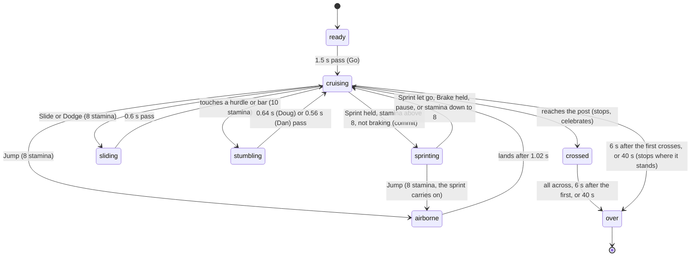

# Clubhouse Dash

## Summary

Clubhouse Dash is the Play running race. One to four runners start together on the left of a three-lane backyard track and race right to a checkered finish post, 2230 stage pixels away. On the way are seven rows of obstacles: yellow *hurdles* to jump and teal *bars* to slide under. The first runner across the line wins, and runners who cross on the same game step share the win. Along the way, each runner can:
- sprint while holding Sprint, paid for from a *stamina* bar
- jump, slide, dodge into another lane, burst sprint, brake and celebrate
- change lanes or steer, depending on the **Course controls** chosen in setup

The race happens on the Play tab, in a *live match* started from [Play setup](play-setup.md) with **Clubhouse Dash** selected. Everyone runs at once; there are no turns. Each runner's nameplate shows their progress as a percentage of the course, and, with one or two runners, their stamina. The race ends when every runner has crossed the line, 6 seconds after the first runner crosses, or 40 seconds after the match opened, whichever comes first.

The Dash is *practice*. It never awards points, and nothing about a race is saved.

## The simple case

With the defaults, player 1 is Doug on keyboard 1 and player 2 is Dan, an AI player. **Course controls** is **Auto forward / change lanes**. After **Opening the cards…**, both runners stand at the start line facing the camera:
- Doug in the back lane, at the top of the track
- Dan in the middle lane

The caption reads **Take your mark**. After a second and a half it reads **Go — jump hurdles, slide under bars**. Both runners turn side-on and start running to the right by themselves, and the camera follows the pack.

The player holds Space to sprint, and watches the stamina bar on Doug's nameplate drain. As a yellow hurdle comes up in Doug's lane they press J to jump it; for a teal bar they press K to slide under it. W and S move Doug one lane up or down the screen, and he is drawn a little larger in each lane nearer the camera. Touching an obstacle is a crash: Doug stumbles, slows almost to a walk for a moment, and loses 10 stamina. The camera shakes.

When Doug reaches the post, the caption reads "Doug crosses the line", and he stops, turns to face the camera and celebrates. The AI Dan times his jumps and slides to his speed; in the reference race between two AI runners, both are across by 12.62 seconds on the caption's clock. When both are across, or 6 seconds after the first one crossed, the caption reads **Finish — race complete** and stops counting. The result shows "{name} wins" with **Play again** and **Choose another event**.

## The interaction, event by event

The action narrated here is one sprint, from pressing Sprint to letting go, set inside the race around it. Jumps, slides and crashes happen during it.

### Starting

The match opens on the countdown. For 1.5 seconds:
- the caption reads **Take your mark**, and the in-canvas sign reads **READY · PRACTICE** ([the match shell](match-shell.md#the-parts-of-the-screen))
- each runner faces the camera and plays an entrance
- each runner's card is drawn small behind them, outlined by a brief yellow glow, and it trails them for the whole race

The runners stand in this order:
- **Player 1** in the back lane, at the top of the track.
- **Player 2** in the middle lane.
- **Player 3** in the front lane.
- **Player 4** in the back lane, 95 stage pixels behind player 1.

Each runner is drawn at the size of their *lane depth*: the nearer the camera, the larger. The scale is 0.65 in the back lane, 0.685 in the middle lane and 0.72 in the front lane, and it follows the runner for the whole race.

During the countdown only **Celebrate** does anything, and only once the entrance has finished. A Jump, Slide, Dodge or Burst sprint press is held for the 0.18 s [buffer](../foundations/input-model.md#buffered-presses) and then dropped. A held Sprint or Brake keeps trying on every step, so holding Sprint through the countdown gives a sprinting start.

At 1.5 seconds the race starts:
- **The caption** changes to **Go — jump hurdles, slide under bars**, and the sign to **RUNNING · PRACTICE**.
- **The runners turn side-on**, with a quick paper-flip turn.
- **With Auto forward**, every runner starts running at once. From standing, Doug reaches 90% of his cruising speed of 172 stage pixels per second in about 0.4 s; Dan reaches 168 in about 0.5 s.
- **With Free steering**, nobody moves until they push right.
- **Stamina** is 100, the maximum, for everyone.

A sprint starts when the player presses and holds Sprint: Space on keyboard 1, Enter on keyboard 2, the right trigger (RT or R2), or a tap on the on-screen **Sprint** toggle. The only thing captured is how hard it is pressed. Keys and the on-screen toggle always press fully; a trigger reports how far it is pulled.

### Backing out at once

A tap of Sprint is harmless. The sprint lasts only while the key is down. One game step of sprinting costs 0.3 stamina, and speed changes gradually, so the tap is barely visible. On the on-screen controls, one tap turns the sprint on and the button reads **Stop sprint**. It stays on until tapped again.

There is no way to leave the race except to pause or leave the match: see [navigating away](#cancel-and-interrupt). A runner cannot give up or step off the course.

Jumps, slides and dodges cannot be backed out of at all. Once one is accepted, its stamina is paid and it runs its full length.

### Committing

The sprint commits on the first game step that the held Sprint is accepted while the race is running, stamina is above 8 and Brake is not held. From that instant:
- **Top speed rises** by 65 stage pixels per second, scaled by how far a trigger is pulled. At full press that is 237 for Doug and 233 for Dan. Speed eases up toward it; Doug gets 90% of the way in about 0.4 s, Dan in about 0.5 s. The stride lengthens into a sprint.
- **Stamina drains** at 18 per second, however far past 0.2 a trigger is pulled. Dan drains at 12 per second, because he has *iron stamina*. From full, Doug's sprint lasts 5.1 s before stamina is down to 8; Dan's lasts 7.7 s.
- **Nothing on screen names the sprint.** The only signs are the speed-up and, with one or two runners, the stamina bar falling on the runner's nameplate. The score strip gives screen readers the number.

Committing fixes nothing else. The runner can still steer, jump, slide, dodge, burst and brake: see [while sprinting](#while-sprinting). Stamina already spent is never returned.

If stamina is 8 or less, or Brake is held, when Sprint is pressed, the press is still held but gives no sprint. The sprint then starts by itself as soon as stamina recovers above 8 and Brake is let go.

### While sprinting

Speed and stamina update on every game step. Everything in [moves](#moves) stays available:

- **Changing lanes** (Auto forward). Up (W, T, the stick or the **Move** pad pushed more than halfway) moves one lane toward the back. Down moves one lane toward the front. The runner glides across in about a quarter of a second, and their size changes with them, so after two lane changes into the front lane they match a runner who started there. Their feet stay planted while they grow or shrink. Holding the direction changes lane again every 0.24 s until the edge lane. Changing lanes costs nothing and works in the air, mid-slide and mid-crash. Left and right do nothing in this mode.
- **Steering** (Free steering). Up and down move the runner across the track at 160 stage pixels per second, anywhere between the top and bottom of the track, and their size follows their position. Forward speed follows how far right the player pushes: full on a key, partial on a stick or pad. With nothing pushed right, the runner slows to a stop, and stays stopped even while braking or stumbling. Pushing left also only stops; nobody runs backwards.
- **Jumping a hurdle.** A jump rises 76 stage pixels and lasts 1.02 s, covering about 175 pixels at cruising speed and 240 at full sprint. It clears a hurdle only if the runner is more than 42 pixels up, the hurdle's drawn height, for the whole time they are within 33 pixels of it. Take-off must come 0.36–0.66 s before reaching the hurdle at cruising speed, a window of about 0.30 s. At full sprint it is 0.31–0.71 s, a window of about 0.40 s.
- **Sliding under a bar.** A slide lasts 0.6 s, and the runner keeps their speed. It passes a bar only if it covers the whole time within 33 pixels of it. At cruising speed the slide must start 0.19–0.41 s before the bar. At full sprint that becomes 0.14–0.46 s. Sprinting makes both windows wider, because the runner spends less time beside the obstacle.
- **Burst sprint** adds another 75 on top for 1.4 s: 312 for Doug and 308 for Dan when also sprinting. The caption says nothing about it.
- **Brake** overrides everything: the runner slows toward 45 stage pixels per second for as long as it is held (in **Free steering**, 45 scaled by the forward push). A sprint held at the same time stops: it gives no speed and costs no stamina, and stamina recovers while braking.
- **Crashing.** Touching a hurdle below its 42-pixel height, or a bar at any height without a slide, is a *crash*. The runner stumbles, and their speed drops to 28% of what it was, then eases toward 45 until the stumble ends. The stumble lasts 0.9 − 0.4 × the card's recovery rating: 0.64 s for Doug and 0.56 s for Dan. They lose 10 stamina, and a crash at cruising speed costs about 0.6 s overall for Doug and a little less for Dan. The crash also brings:
  - a dust puff
  - a camera shake
  - a controller rumble
  - with sound on, a low thud

  Jump, Slide and Dodge are refused until the stumble has played out (0.75 s), and Burst sprint is refused while the stumble lasts. The runner passes through the obstacle; each obstacle can trip each runner only once.

**Running out of stamina.** At 8 or less, the sprint stops giving speed and stamina starts to recover. Once it is above 8 the sprint resumes. Holding Sprint all the way down therefore leaves stamina hovering around 8, with a flickering, partial sprint: about 42% of full for Doug, 52% for Dan. At that level a Jump, Slide or Dodge (8 each) is still possible: a press made at a moment just under 8 waits in the [buffer](../foundations/input-model.md#buffered-presses) and goes through a step later. Burst sprint (18) is refused. After the jump, stamina is near 0, and the sprint stays off for about 0.6 s while it climbs back above 8.

### Letting go and crossing the line

Letting go of Sprint ends it. That means releasing the key, easing a trigger below 0.1, or tapping **Stop sprint**. The bonus goes, speed eases back to cruising, and stamina recovers at 13 per second from the next step, 7.7 s from empty to full. It recovers whenever the runner is not sprinting, that is, when Sprint is not held, while Brake is held, or while stamina is 8 or less, whether they are running, in the air, sliding or stumbling. Nothing else changes.

The race resolves at the finish post, 2230 stage pixels from the start line of players 1 to 3, which reads 100%. Each runner's percentage is measured from their own start line, so player 4, who starts 95 pixels further back, also reads 0% at the start and 100% at the post.

A runner who reaches the post:
- stops dead on the line
- turns to face the camera and celebrates
- keeps 100%, and their stamina stops changing

The caption reads "{name} crosses the line", and with sound on a bright tone plays. From then on, only **Celebrate** does anything for that runner.

The race ends at the first of these:
- every runner has crossed
- 6 seconds after the first runner crossed
- 40 seconds on the caption's clock, which includes the 1.5-second countdown, so there are 38.5 seconds of racing

At the end, every runner still on the course stops where they stand and turns to face the camera, keeping their percentage. The sign reads **FINISHED · PRACTICE**, and the caption's clock stops at the finish time. The caption reads:
- **Finish — race complete** when one runner crossed first; the result reads "{name} wins"
- "Dead heat — race complete" when two or more runners crossed first on the same game step, a *dead heat*; they share the win, and the result reads **Draw**
- **Time limit** if nobody crossed within 40 seconds; the result reads **Draw**

The Play result and its buttons belong to [the match shell](match-shell.md). Nothing is written anywhere.

## The course

The course is the same in every race. Each row has exactly one empty lane, and the empty lane moves one lane toward the back with each row, wrapping from the back lane to the front. Middle-lane obstacles sit 50 pixels further on than the others in rows 1, 3, 4, 6 and 7.

| Row | Distance from the start line (progress) | Back lane | Middle lane | Front lane |
|---|---|---|---|---|
| 1 | 320 px (14%) | Bar | Hurdle | Empty |
| 2 | 565 px (25%) | Hurdle | Empty | Hurdle |
| 3 | 810 px (36%) | Empty | Hurdle | Bar |
| 4 | 1055 px (47%) | Hurdle | Bar | Empty |
| 5 | 1300 px (58%) | Bar | Empty | Hurdle |
| 6 | 1545 px (69%) | Empty | Hurdle | Hurdle |
| 7 | 1790 px (80%) | Hurdle | Hurdle | Empty |

- **Hurdles** are drawn as yellow triangles 42 pixels tall, like traffic cones. They trip a runner only below that drawn height. The on-screen controls hint calls them hurdles.
- **Bars** are a teal crossbar 76–93 pixels up, on two posts.
- **The finish** is a black-and-cream checkered post.
- **The track.** Faint lines mark the three lanes.

A runner who weaves into each row's empty lane never needs to jump or slide.

## Moves

| Key (keyboard 1 / 2) | Controller | Move | What it does | Stamina | Refused when |
|---|---|---|---|---|---|
| Space / Enter | RT / R2 | **Sprint** (held) | +65 top speed while held | 18 per second (Dan 12) | Gives no speed at 8 or less, or while braking |
| J / numpad 1 | A / Cross | **Jump** | 1.02 s in the air, 76 px high | 8 | In the air, mid-slide, mid-crash, or below 8 stamina. A celebration is cut short instead. |
| K / numpad 2 | X / Square | **Slide** | 0.6 s low enough to pass bars | 8 | As for Jump |
| L / numpad 3 | B / Circle | **Dodge** | A slide that also moves one lane toward the camera; from the front lane it moves back one lane, to the middle | 8 | As for Jump |
| E / numpad 0 | Y / Triangle | **Burst sprint** | +75 top speed for 1.4 s; usable again 7 s after it started | 18 | Mid-crash, within 7 s of the last burst, or below 18 stamina |
| left Shift / right Shift | LB / L1 | **Brake** (held) | Slows toward 45 while held | None | Never, during the race |
| C / numpad decimal | View / Share | **Celebrate** | Plays a celebration; the runner keeps running, and the caption reads "{name} celebrates". The next Jump, Slide or Dodge cuts it short. | None | Mid-entrance, mid-jump, mid-slide, mid-crash or mid-celebration |

Before **Go**, and for a runner who has crossed the line, every move except **Celebrate** is refused. A refused Jump, Slide, Dodge, Burst sprint or Celebrate press is kept for 0.18 s and happens then if it becomes possible, for example the moment a runner lands. Nothing on screen shows a refusal, the burst's 7-second wait, or whether a burst is active.

## Modifiers

| Modifier | Set at the start | Changed while committed |
| --- | --- | --- |
| Input device | **Keyboard 1** sprints with Space, and **keyboard 2** with Enter; keys always sprint at full strength. A **controller** sprints with the right trigger. The bonus scales with the pull (a half pull gives about half), but stamina drains at the full rate for any pull past 0.2. **Touch** uses the **Sprint** and **Brake** toggles, one-tap buttons for the rest, and a **Move** pad; there is no **Aim** pad. An **AI player** runs forward in its own lane and sprints while it has more than 18 stamina. It times its moves to its speed: it jumps a hurdle once it is within 0.5 × its speed in pixels, about half a second away, and slides under a bar within 0.3 × its speed (never closer than 36 px). Both fall inside the timing windows above ([AI players](../cross-cutting/ai-players.md)). | The device cannot be changed during a match. On-screen taps merge with a keyboard or controller at any time: see [input device changes](#cancel-and-interrupt). |
| Event and action combinations | **Course controls** decides movement for every runner: **Auto forward / change lanes** runs automatically and moves lane by lane, while **Free steering / control acceleration** makes each runner push right to run and steer freely. It is chosen only in setup and kept for **Play again**. **Right modifier** (Ctrl, RB or R1) and **Aim** do nothing in the Dash. There are no chords, combos or double-taps. Two of Jump, Slide and Dodge pressed together do only one of them; the other is dropped. **Celebrate** mid-race never blocks: the next Jump, Slide or Dodge cuts it short. | Everything in [moves](#moves) can be added mid-sprint. Brake switches the sprint off while it is held, drain included; letting go of Brake with Sprint still held brings the sprint back. A burst taken during Brake is wasted. In **Free steering**, easing off the forward push scales the sprint and burst bonuses down with it. |
| Contest kind | Always Play practice. The caption shows **Practice / no club points**. Exhibition, counted entry and replay are Watch-only and do not apply. | Not applicable: practice cannot become anything else. |
| Character card | **Doug**: cruising 172, sprinting 237, the quicker to change speed, sprint drain 18 per second, recovery 0.65 (a 0.64 s stumble). **Dan**: cruising 168, sprinting 233, a little slower to change speed, *iron stamina* (sprint drain 12 per second), recovery 0.85 (a 0.56 s stumble). Both have **Burst sprint**. An **installed character** runs at 168 with drain 18, stumbles for 0.7 s and has Burst sprint, unless its pack carries its own profile with other values. The cards' printed bars (accuracy, consistency, composure) play no part. | Not applicable: cards are chosen in setup. |
| Presentation settings | **Reduced motion** removes the dust puffs on landing and crashing, the camera shake on a crash, and the squash and stretch on take-off and landing. Timing and results are unchanged. **Lower graphics quality** has no effect in Play. The **clean spectator view** is Watch-only. Play's sound switch reads **Sound on** and starts off. | Toggling **Reduced motion** in Arena settings applies to the running race at once, with no restart: see [settings change underneath](#cancel-and-interrupt). The sound switch takes effect on the next cue. |
| Screen size and orientation | The course is 3100 stage pixels long, wider than the 1280×720 stage. The camera always shows a 1280-pixel slice and follows the pack. Window size never changes what is visible or any timing. On the **Move** pad, a lane change needs more than half the pad's travel up or down; in **Free steering**, how far right it is dragged sets the speed. | Resizing or rotating rescales the stage mid-race. Nothing pauses and the sprint continues. |
| Saved state | The race reads nothing from this browser's save. The only saved thing that matters is the bindings saved for the player's keyboard layout or controller at the last **Start**, which decide the action keys. | No effect. |

## Cancel and interrupt

| Event | Before committing | While committed |
| --- | --- | --- |
| Escape or click outside | **Escape** is keyboard 1's pause key. If a player uses keyboard 1, it pauses while stage focus is inside the stage, and does nothing otherwise. A **click elsewhere on the page** moves stage focus away, so later key presses do nothing, but the race goes on. With **Auto forward**, the runner keeps running and crashes into every obstacle left in its lane. Clicking the stage gives it focus back. | **Escape** pauses and lets go of the sprint. A **click elsewhere** leaves the sprint running: the held key keeps draining stamina, and letting go of it still counts. |
| Pause or resume | The game freezes and the **PAUSED** overlay shows **Resume when you’re ready.** Everything is kept and continues on resume: positions, lanes, a jump in mid-air, a slide, a stumble, a burst's remaining time and the countdown. Keys held through the pause do nothing until pressed again. A **Free steering** runner therefore coasts to a stop until forward is pressed afresh. Controllers must first [return to neutral](../foundations/input-model.md#neutral), stick included. | The sprint and any brake are **let go**, and the on-screen toggles switch off. After resuming, the runner eases back to cruising speed until Sprint is pressed again. Stamina already spent is not returned. |
| Repeated or rapid input | Operating-system key repeat is ignored. Jump presses mashed in the air do nothing, except one in the last 0.18 s before landing, which jumps again the moment the runner lands and costs another 8. Burst sprint presses during its 7-second wait do nothing and cost nothing. Lane presses closer together than 0.24 s lose the extra ones. | Sprint cannot be pressed again without letting go first. Pressing the on-screen **Sprint** and the key together keeps the sprint on until *both* are released. |
| A panel opens on top | Opening Arena settings, House rules or History moves focus into the dialog, so key presses stop counting. The race does not pause. Controller, touch and AI players carry on. With **Auto forward**, a keyboard player's runner keeps running and crashes into each obstacle ahead. | The sprint continues behind the dialog until stamina is down to about 8. Letting go of the key still counts, because releases always do. |
| Navigating away | Switching the main tab, clicking the logo, or **Replay** from History closes the match at once without a warning. Progress and setup choices, including **Course controls**, are lost. Returning to Play shows setup with its defaults. | The same. The sprint and the race are gone. |
| Forced finish | The race ends 6 s after the first runner crosses, or at 40 s. A runner still on the course stops where they stand, keeps their percentage, and cannot win. | The same; the sprint simply ends. A sprint itself has no time limit: stamina is its only limit. |
| Focus leaves the game | Losing window focus or hiding the browser tab pauses, with **Paused while the window was inactive.** Held keys are dropped. Moving focus to another part of the page only stops key presses from counting; the race goes on. | Pausing on focus loss lets go of the sprint, as for pause. Moving focus within the page leaves it running (see **Escape or click outside**). |
| Reload, close, or back/forward cache | The match is gone and nothing is kept. The page reopens on the Watch lobby. | The same; the race leaves no trace. |
| Settings or saved data change underneath | Toggling **Reduced motion** applies to the running race at once: dust, crash shake and squash follow the new setting. Progress, stamina and the sound are kept. Changing the scoring policy, **Reset demo**, or another tab writing the save have no effect on the race. | The sprint carries on; only the effects change. |
| Graphics or storage failure | A lost WebGL context pauses the race with **Graphics were interrupted. Resume when the stage is back.** When the context returns, the notice becomes **Graphics are back. Resume when ready.** Before the race opens, the side-view art for Dan and Doug is downloaded and checked, whichever cards are racing. If a file fails to load or does not match its checksum, the error shows in the stage overlay and the race never starts. Saving bindings at **Start** fails silently if storage is refused. | The pause lets go of the sprint, as for any pause. |
| Input device changes | A **controller disconnecting** pauses with **Controller disconnected. Reconnect it, then resume.** Resuming while it is still disconnected pauses again at once. After reconnecting, it must return to neutral. The **on-screen** pad and buttons work alongside a key or controller at any time. The player's tile then shows `touch` as their device until they next use the original device. | A controller disconnecting pauses and lets go of the sprint. Tapping **Stop sprint** while the key is also held does not end the sprint; see **Repeated or rapid input**. |

After an interrupt the player stays in the race unless they navigated away or reloaded. Nothing about the race is kept anywhere once the match closes.

> Technical note: the Dash clears sprint and brake whenever the session pauses *or* resumes (`RunningEvent.onPause`, which the session calls both ways). Jumps, slides, stumbles and bursts are timers in game time, so they freeze with the clock rather than being cancelled.

## Interactions with other systems

**Points and the ledger.** No interaction. Play never reads or writes club points; the caption says **Practice / no club points**.

**Saved data and recovery.** No interaction. A race writes nothing. The only Play data saved is the bindings, written for each keyboard layout or controller in use when **Start Clubhouse Dash** is pressed ([controls and remapping](controls-and-remapping.md)). The **Course controls** choice is not saved.

**Watch and Play separation.** The Dash has no Watch counterpart; Watch's sports are cornhole, football, beer pong and basketball ([the four sports](../watch/the-four-sports.md)). Each race gets a fresh random seed, but the course has no randomness. The seed only changes which entrance and celebration each character plays, so the same inputs give the same race.

**Devices and players.** One to four runners race at once; a player can race alone by pressing **Remove player** in setup. A solo runner who crosses the line wins. Runners pass through each other, and any number can share a lane. Two players may not share a keyboard layout or a controller; any number can use touch or AI. See [the input model](../foundations/input-model.md).

**Sound.** Off by default in every match. With **Sound on**, a low thud plays on each crash and a bright tone as each runner crosses the line. Running, jumping, sliding and bursting play no tones of their own. Whether the runners' strides tick as footsteps is an open question in [sound](../cross-cutting/sound.md#open-questions-and-verification). Watch's sound switch has no effect here ([sound](../cross-cutting/sound.md)).

**Reduced motion and graphics quality.** Reduced motion removes dust, crash camera shake, and squash and stretch; the race's timing and results are unchanged. Toggling it mid-race applies at once. Lower graphics quality is not applied to Play ([the stage](../foundations/stage.md)).

**Accessibility.** The caption is an `aria-live` region. It announces **Take your mark**, the start, each mid-race celebration ("{name} celebrates"), each runner crossing the line and the finish, including a dead heat. Crashes, lane changes, bursts and approaching obstacles are visual only. Nothing warns a player who cannot see the track that a hurdle or bar is coming. The progress percentage is plain text, and stamina is a progress bar labelled "{name} stamina". The on-screen buttons are real buttons: **Sprint** and **Brake** report their on or off state, and the **Move** pad takes arrow keys when focused ([accessibility](../cross-cutting/accessibility.md)).

**Installed characters.** An installed card can be chosen in setup. If its pack has no connected rig, the match fails to open with "Error: {full card name} needs a connected character rig for direct play. Its existing poses remain available in Watch." One that opens runs as its front-view puppet rather than on the side-view rig Dan and Doug use, and with the default running values in [modifiers](#modifiers). Unlike Dan and Doug, its puppet does draw a mid-race **Celebrate** ([Install character](../collection/install-character.md)).

**Multiple tabs.** Each tab runs its own race. The only shared thing is the saved bindings; for each keyboard layout or controller, the last **Start** in any tab wins.

**Agent tools.** `configure_arena_event` switches the page to the Watch tab. Called during a race (and with no Watch recording loaded), it ends the race exactly as navigating away does. `read_arena` reads only Watch state ([agent tools](../cross-cutting/agent-tools.md)).

## Edge cases

- **Player 4** starts 95 pixels behind the start line and runs 2325 pixels to the post. Their progress is measured from their own start, so it reads 0% at the start, never less.
- **Doing nothing** in **Auto forward** still finishes: the runner crashes into every obstacle in its lane and crosses at about 17.6 s (Doug) or 17.8 s (Dan). In **Free steering**, doing nothing leaves the runner at 0% until the race ends; braking or stumbling does not creep them forward.
- **Hurdles are exactly as tall as they look.** A runner visibly above a hurdle's 42-pixel top clears it.
- **Bars cannot be jumped.** Any touch without a slide is a crash, at any height.
- **A crash mid-jump** happens in the air. The runner stumbles but keeps its arc and lands normally.
- **The fastest line** weaves into each row's empty lane while sprinting. It costs no stamina for jumps, and a runner doing it crosses at about 11.6–11.9 s. A clean run that stays in lane with Sprint held throughout, and no Burst sprint, takes about 12.1–12.3 s, since holding Sprint to empty never costs a jump. One without any sprint takes about 14.6 s for Doug and 15.0 s for Dan.
- **A dead heat** is shared. Runners crossing on the same game step all win, the caption reads "Dead heat — race complete", and the result reads **Draw**.
- **The camera** centres on a point 260 pixels ahead of the middle of the pack. A runner more than about 760 pixels behind the leader drifts off the left edge of the screen.
- **Lane depth.** A runner's size always matches the lane they are in, lane changes included, so runners in the same lane are drawn at the same size.
- **Celebrate on Dan and Doug.** The side-view rig draws no mid-race celebration for them: the figure keeps running, and only the caption shows "{name} celebrates". It no longer blocks the next move.
- **After the result**, the caption's clock stops at the finish time. The nameplates of runners stopped by the time limit still read **MOVING**.
- **The nameplates' status line** reads **MOVING**, **ACTION** during a jump or slide, **REACTION** during a crash, **CELEBRATING** or **IDLE**. The big number is the progress without the % sign.
- **After crossing the line**, a runner's on-screen **Sprint** toggle can still read **Stop sprint**. It no longer does anything.

## Open questions and verification

- Everything above was read from the code and `tests/live-tests.mjs`. None of it has yet been checked on the production page. The tests prove that AI runners make progress, that sprinting moves a runner and costs stamina, that a jump leaves the ground, that pause freezes the clock, and that **Free steering** stands still without a forward push. They run against the session directly, not through the page. The race times and timing windows above come from a re-implementation of the fixed rules at 1/60 s steps, not from measurement. The reference AI-against-AI race in `docs/review/live-engine-tests.json` ends with both runners home at 12.62 s.
- **The side-view rig still draws no mid-race celebration** for Dan and Doug: it starts a celebration only at the finish (`lab/human-motion/PlayMotionRig.ts`). **Celebrate** no longer blocks the next move, and the caption announces it, but the figure itself shows nothing. The front-view puppet of an installed character does draw it.
- **Fixed: celebrate no longer blocks** (B-15). Jump, Slide and Dodge cut a celebration short.
- **Fixed: lane depth** (B-17). A runner's size follows their lane or steering position, and the side-view rig rescales its whole solved figure so the feet stay planted.
- **Fixed: Dash physics slips** (B-29). Braking stops the sprint and its drain; the sprint stops at 8 stamina, so a jump stays possible; free steering does not creep; progress is measured from each runner's own start; the stumble uses the card's recovery rating; dodge moves one lane toward the camera, or back from the front lane, and never wraps; the AI times its moves to its speed; hurdles collide at their drawn 42 px; and a dead heat is shared.
- **Dodge in Free steering** still moves nothing sideways and is only a slide, because free steering has no lanes.
- **A half-pulled trigger** pays the full stamina drain for part of the bonus (`RunningPhysics.ts`). This is a product call.
- **Trailing runners leaving the screen** is read from `CameraManager.ts` 16–22. It has not been seen.
- **Fixed: graphics loss** (B-14). A lost WebGL context pauses the race. This is read from the code; it has not been tried on the page.
- **The back/forward cache.** Whether the browser keeps a race through its back/forward cache, and whether it comes back paused, is untested.

Verified against Will-You-Be-My-Hero-Arena commit `364e3c1`
