# Controls and remapping

## Summary

Controls and remapping is where a player changes which key or controller button does each action for their slot before a Play match. It is the collapsed **Controls and remapping** section at the bottom of [Play setup](play-setup.md). Opened, it shows one line of instructions: "Keyboard: click a key field and press a new key. Generic gamepads: change button indices or stick axes to match your controller." Then comes a group of fields for every player slot on a keyboard or a controller. Each group lists the selected event's actions:
- with a key field for a keyboard slot
- with a button number for a controller slot, plus four stick-axis numbers

Each group ends with **Restore default controls**. A key that is already in use is refused, with a message under that player's fields. A change applies to the setup at once but is only saved when **Start {event}** is pressed. It is saved for the *device*, the keyboard layout or controller, not for the slot, in `wybmh-input-bindings-v2`. Move and aim keys and the pause key or button cannot be changed. The [input model](../foundations/input-model.md#devices) owns the default bindings; this document owns changing them.

## The simple case

A player on **Keyboard · WASD** wants U instead of J for **Hole runner**. They open **Controls and remapping**, click the **Hole runner** field under **Player 1**, and press U. The field changes from **KeyJ** to **KeyU**. They press **Start Cornhole**. The binding is saved for keyboard 1, U selects **Hole runner** in the match, and the on-screen button for it shows **U** instead of **J**.

The next time Play setup opens in this browser, player 1's **Hole runner** field reads **KeyU** again. Any other slot that picks **Keyboard · WASD** gets the same keys.

Had they pressed Space instead, the field would have stayed **KeyJ**, and the message "Space is already used for Hold / release. Choose another key." would have appeared under **Player 1**'s fields.

## What the section lists

Each group of fields is headed **Player {N}** with the slot's number, in slot order. There is one group per slot whose **Controls** is a keyboard layout or a controller. Slots on **Touch / on-screen** or **AI player** get none. When no slot qualifies, only the instructions show.

The group lists the selected event's actions, one field each, in the event's own order. Move and aim are left out, and so is every action the event keeps hidden. Where two actions share one input, only the first visible one is listed.

| Named input | Keyboard 1 default | Keyboard 2 default | Controller default | Cornhole | Clubhouse Dash | Backyard Brawl |
|---|---|---|---|---|---|---|
| Primary | **KeyJ** | **Numpad1** | 0 (A / Cross) | **Hole runner** | **Jump** | **Light attack** |
| Secondary | **KeyK** | **Numpad2** | 2 (X / Square) | **Slide** | **Slide** | **Heavy attack** |
| Tertiary | **KeyL** | **Numpad3** | 1 (B / Circle) | **Roll** | **Dodge** | **Dodge** |
| Special | **KeyE** | **Numpad0** | 3 (Y / Triangle) | **Airmail** | **Burst sprint** | **Power strike** |
| Charge | **Space** | **Enter** | 7 (RT / R2) | **Hold / release** | **Sprint** | Not listed |
| Left modifier | **ShiftLeft** | **ShiftRight** | 4 (LB / L1) | Not listed | **Brake** | **Block** |
| Right modifier | **ControlLeft** | **ControlRight** | 5 (RB / R1) | **Precision mode** | Not listed | **Counter stance** |
| Celebrate | **KeyC** | **NumpadDecimal** | 8 (View / Share) | **Celebrate** | **Celebrate** | **Taunt** |

The fields appear in this order:
- **Cornhole:** **Hole runner**, **Slide**, **Roll**, **Airmail**, **Hold / release**, **Precision mode**, **Celebrate**
- **Clubhouse Dash:** **Sprint**, **Jump**, **Dodge**, **Slide**, **Burst sprint**, **Brake**, **Celebrate**
- **Backyard Brawl:** **Light attack**, **Heavy attack**, **Dodge**, **Power strike**, **Block**, **Counter stance**, **Taunt**

The hidden actions ride on the input they share, so remapping that input moves them too:
- **Cornhole:** letting go of charge throws. Pressing primary during the result pause celebrates.
- **Clubhouse Dash:** letting go of sprint recovers stamina, and letting go of brake accelerates again.
- **Backyard Brawl:** right modifier held with primary grapples, letting go of block releases the guard, and a sideways double-tap dodges.

**A binding belongs to the named input, not to the event.** Changing **Hole runner** to U also makes U **Jump** in the Dash and **Light attack** in the Brawl. Switching the event card relabels the fields but keeps every value.

**Restore default controls** follows the fields in every group. **A controller slot** also shows four number fields after it, whatever the event: **Move X axis**, **Move Y axis**, **Aim X axis** and **Aim Y axis**. They default to 0, 1, 2 and 3.

## The interaction, event by event

The action narrated here is remapping one binding, from focusing its field until the change is saved at **Start** or lost.

```mermaid
stateDiagram-v2
    [*] --> loaded : Play setup opens (slot 1 reads keyboard 1's saved bindings)
    loaded --> listening : key field clicked or tabbed into
    listening --> loaded : Tab, Shift+Tab or click elsewhere (nothing changed)
    listening --> key_refused : a key already in use (message under the fields)
    key_refused --> listening : binding unchanged; press another key
    listening --> changed : a free key pressed, or a modifier released alone (binding replaced)
    changed --> changed : another key pressed, or a number edited (replaced again)
    loaded --> changed : controller button or axis number edited
    changed --> loaded : Restore default controls, or the slot's Controls changed
    changed --> start_refused : Start with a number out of range (slot and action named)
    start_refused --> changed : any binding changed (the message clears)
    changed --> saved : Start with valid bindings (written for the device; match begins)
    changed --> [*] : Play tab left or page reloaded (change lost)
    saved --> [*]
```

### Starting

The player opens the section by clicking **Controls and remapping**. Clicking or tabbing into a key field changes nothing. The field is read-only, shows no cursor, and waits for the next key. A controller slot's number fields are ordinary number boxes with spinner arrows.

### Backing out at once

Tabbing out or clicking elsewhere leaves the binding as it was. Tab and Shift+Tab always move focus and never bind, so the fields can be left with the keyboard. There is no other key that cancels: Escape, Enter, Space and Backspace are all treated as keys. A key already in use is refused and leaves the binding as it was (see [conflicts](#conflicts)). Opening and closing the section without a change keeps nothing and writes nothing.

### Committing

For a key field, the first free key pressed replaces the binding at once. The field shows the browser's code for the physical key, such as **KeyU**, **Digit1**, **ArrowUp** or **ShiftRight**. The key's own action is suppressed, so Space does not scroll the page. A modifier key (Shift, Control, Alt or Meta) is bound when it is released with no other key pressed after it; if another key follows while it is held, that other key is the one considered. The binding is now *committed* in the glossary's sense: it differs from what is saved. Nothing is written yet.

A refused key changes nothing. The message under the player's fields names the key by a short name and says what already uses it, for example "Space is already used for Hold / release. Choose another key." or "J is already used for Light attack by player 2. Choose another key." Only one such message shows at a time. It goes when any key is accepted or any **Restore default controls** is pressed.

For a controller field, every edit replaces the number. Buttons are browser button numbers 0–31. Axes are browser axis numbers 0–15. The spinner arrows stay inside those ranges, but typing does not. An emptied field counts as 0.

### While unsaved

The change stays as long as the setup does:
- **Further keys.** Every further key press in the same field replaces it again; the last key pressed wins.
- **Event switches.** It survives switching the event card, and adding or removing *other* slots.
- **Matches.** It survives a match started from this setup and **Back to setup**. That match uses it, and **Start** saves it on the way.
- **Resets.** It is lost when that slot's **Controls** changes (see [below](#resets-when-the-controls-change)), when **Restore default controls** is pressed for that player, when that slot is removed, when the Play tab is left, and on reload.

Keys are checked against other bindings as they are pressed (see [conflicts](#conflicts)). Controller button and axis numbers are not.

### Saving at Start

**Start {event}** first checks that no two slots share a keyboard layout or controller, then that every slot's bindings are valid. The limits are:
- controller buttons: whole numbers 0–31
- axes: whole numbers 0–15
- key codes: a letter followed by up to 25 letters or digits, which every physical key's code satisfies

A bad number refuses the start with a message naming the first slot and action at fault: "Player {N}: {action} needs a valid key, button or axis.", for example "Player 2: Hold / release needs a valid key, button or axis." An axis is named "the move stick axis" or "the aim stick axis". The message clears as soon as a binding, card or **Controls** choice changes.

When the checks pass, the bindings of every slot on a keyboard layout or controller are written under that device's name, `keyboard`, `keyboard2` or `gamepad:0` to `gamepad:3`, in `wybmh-input-bindings-v2`. Devices not in this match keep what was saved for them before. Touch and AI slots are not saved. The match then begins with the bindings on screen ([Play setup](play-setup.md#committing)). If the browser refuses the write, nothing says so; the match still uses the bindings on screen, and the next visit gets the older ones.

The saved bindings are read back when Play setup opens, for player 1 on **Keyboard · WASD**, and again every time any slot's **Controls** changes, for the device chosen. A saved entry that fails the format check is ignored, and the device's defaults are used instead.

## Resets when the Controls change

Changing a slot's **Controls** list replaces that slot's bindings with the ones saved for the new device, read from storage at that moment. If nothing valid is saved for it, the slot gets that device's defaults:
- **Keyboard · TFGH + numpad** gets keyboard 2's keys.
- Every other choice gets keyboard 1's keys, together with the default controller buttons and axes.

This happens on every change, including a change away and straight back. Unsaved remapping for that slot is lost; saved remapping comes back with its device. Any slot, 1 to 4, gets a device's saved bindings this way, so a controller remapped as player 2 returns when player 3 picks that controller on a later visit.

**Restore default controls** puts that player's bindings back to their device's defaults, as listed above, and clears any refusal message. It does not touch storage: the defaults are only saved if **Start** is pressed afterwards.

## What cannot be remapped

- **Keyboard move and aim keys.** Keyboard 1 always moves with W, A, S and D and aims with the arrow keys. Keyboard 2 always uses T, F, G and H and numpad 8, 4, 5 and 6.
- **The pause key and button.** Escape, Backspace and controller button 9 are never listed.
- **The D-pad.** Controller buttons 12 to 15 always add to movement.
- **Hidden actions.** They follow their shared input, as listed above.
- **Inputs the event does not list.** Examples are the left modifier in cornhole, the right modifier in the Dash and charge in the Brawl. They keep their binding and can be changed by selecting another event first.
- **Touch and AI slots.** They have no fields.

## Conflicts

**Keys are checked when they are pressed.** A key is refused, and the binding left as it was, when it is already used by:
- **another action of the same player**, including their pause key and inputs this event does not list, such as the left modifier in cornhole
- **the player's own movement or aim keys**: "W is already used for movement. Choose another key." or "… for aiming."
- **the other keyboard layout's keys**, movement, aim and actions alike, because both layouts read the same keyboard: "… is already used for Light attack by player 2. Choose another key."

Pressing the key a field already holds is accepted and changes nothing.

**Controller buttons and axes are not checked.** What a clash does in a match:
- **Two actions on one button** both happen on one press.
- **An action on the player's own pause button** never happens. The pause is handled first, and pausing clears the press.
- **An action on a D-pad button** also moves.

## Modifiers

| Modifier | Set at the start | Changed while committed |
| --- | --- | --- |
| Input device | **Keyboard · WASD** and **Keyboard · TFGH + numpad** slots show key fields. **Controller 1–4** slots show button numbers and four axis numbers, with no key fields. Both have **Restore default controls**. **Touch / on-screen** and **AI player** slots show no fields. The section itself is used with a keyboard for key capture; a mouse or touch can open it, edit numbers and restore defaults. | Changing the slot's **Controls** replaces its bindings with the new device's saved bindings or defaults, and discards the change. |
| Event and action combinations | The event decides which seven actions are listed and what they are called. The same named input carries one binding across all three events. | Switching event relabels the fields and keeps every value. |
| Contest kind | Always Play practice. Watch has no bindings. | Not applicable: practice cannot become anything else. |
| Character card | No effect. Bindings belong to the device, not the card. | No effect. |
| Presentation settings | No effect. | No effect. |
| Screen size and orientation | The fields wrap into as many columns as fit, each at least 130 px wide. A key field is read-only, so on a touch-only device it brings up no on-screen keyboard (see open questions). | Resizing reflows the fields and keeps their values. |
| Saved state | Player 1 opens with keyboard 1's saved bindings, if valid. Any slot that later picks a keyboard layout or controller gets that device's saved bindings, if valid, and otherwise its defaults. | No effect until **Start**, which overwrites the saved bindings of the devices in the match and keeps the rest. |

## Cancel and interrupt

| Event | Before committing | While committed |
| --- | --- | --- |
| Escape or click outside | **Escape** in a key field is treated as a key. It is refused while a keyboard player uses it to pause, as keyboard 1 does by default ("Escape is already used for pause. Choose another key."), and otherwise becomes the binding. A click elsewhere leaves the field unchanged. | A click elsewhere keeps the change. **Escape** in the field replaces it with Escape only if Escape is free. |
| Pause or resume | Not applicable: remapping happens only on Play setup, where no game is running. | Not applicable: the same. |
| Repeated or rapid input | Operating-system key repeat captures the same key again, so it changes nothing. Clicking a spinner arrow repeatedly stops at 0 or 31 (0 or 15 for an axis). Pressing a used key repeatedly shows the same refusal. | The last free key pressed wins. Typing past the limits is not stopped until **Start** refuses it. |
| A panel opens on top | A dialog takes focus, so key presses reach the dialog, not the field. | The change is kept behind the dialog. |
| Navigating away | Nothing to lose. | The unsaved change is lost with the setup. The bindings from the last **Start** remain. |
| Forced finish | Not applicable: nothing in remapping has a time limit. | Not applicable: the same. |
| Focus leaves the game | Switching window leaves the field as it is. | The change is kept. |
| Reload, close, or back/forward cache | Nothing to lose. | The unsaved change is lost. |
| Settings or saved data change underneath | Another tab's **Start** rewrites the saved bindings for its devices. This setup picks them up the next time a slot's **Controls** changes to one of those devices, or when Play is opened again. **Reset demo** does not touch bindings. | This tab's next **Start** overwrites what another tab saved for the same devices, and keeps what it saved for others. |
| Graphics or storage failure | Blocked storage leaves every slot on defaults. | A refused save is silent. The match uses the on-screen bindings, but they are gone next visit. |
| Input device changes | Plugging in a different controller changes nothing here; the numbers apply to whatever pad is in that browser slot. | Changing the slot's **Controls** replaces the bindings with the new device's saved bindings or defaults. |

After an interrupt the player stays on Play setup with the change intact, unless the setup itself went away.

## Interactions with other systems

**Points and the ledger.** No interaction.

**Saved data and recovery.** The bindings are the only thing Play saves. They live in their own storage key, `wybmh-input-bindings-v2`, apart from the Arena save, as one entry per device: `keyboard`, `keyboard2` and `gamepad:0` to `gamepad:3`. A malformed entry is ignored and that device falls back to its defaults. They are not in **Export local save**, and **Reset demo** leaves them alone ([this browser's save](../foundations/saved-data.md)).

**Watch and Play separation.** Watch has no game input and no bindings.

**Devices and players.** Bindings belong to a device, whichever slot uses it. Two keyboard players on one keyboard remap independently, but neither can take a key the other already uses ([the input model](../foundations/input-model.md#devices)).

**Sound.** No interaction.

**Reduced motion and graphics quality.** No interaction.

**Accessibility.**
- Each key field is named "Player {N} {action} key", and each button field "Player {N} {action} button".
- The axis fields are named by their visible labels.
- A screen reader reads back the raw code, such as "KeyU".
- A refusal message is an alert, so it is announced when it appears.
- Tab and Shift+Tab always move between fields; **Restore default controls** is an ordinary button.
- Capturing a key needs a physical keyboard.

See [accessibility](../cross-cutting/accessibility.md).

**Installed characters.** No interaction. The same fields apply to every card.

**Multiple tabs.** The saved bindings are shared. For each device, the last **Start** in any tab that used it wins. A setup already open notices another tab's save only when one of its slots next changes **Controls**.

**Agent tools.** No interaction. `configure_arena_event` switches to Watch, which discards any unsaved change ([agent tools](../cross-cutting/agent-tools.md)).

## Edge cases

- **Three spellings of one key.** The fields show raw codes such as **ShiftLeft** and **ControlLeft**. The refusal message says "Shift (Left)", and the on-screen buttons show **Shift L** and **Control L** ([touch controls](touch-controls.md)).
- **Keys are physical positions.** On a French AZERTY keyboard, the key printed A is captured as **KeyQ**, and the default "WASD" is the keys printed Z, Q, S and D.
- **Chords cannot be captured.** Holding Shift and pressing J binds J alone. A modifier key becomes the binding only when it is pressed and released on its own.
- **Unlisted inputs are named in words.** When the key belongs to an input this event does not list, the refusal names it plainly, for example "Shift (Left) is already used for the left modifier. Choose another key." in cornhole, or "Space is already used for charge. Choose another key." in the Brawl.
- **Keyboard 2 and keyboard 1's movement keys.** A keyboard 2 player cannot take W, A, S, D or the arrow keys while another slot is on **Keyboard · WASD**, because both layouts read the same keyboard. The message names that player, for example "W is already used for movement by player 1. Choose another key." AI, touch and controller slots never conflict with a key.
- **Keyboard 2 slots** open showing **Numpad1**, **Enter**, **ShiftRight**, **ControlRight** and **NumpadDecimal**. On a keyboard without a numpad, remapping these to other keys is the only way to reach those actions. Aiming stays on the numpad.
- **A key with no code**, such as some on-screen keyboards send, would fail the format check and refuse **Start**. This is read from the check, not seen.
- **Button and axis numbers beyond the pad's own** are accepted and simply never read as pressed or moved.
- **A controller slot saves key bindings too**, the defaults it was given, and a keyboard slot saves the default buttons. Only the visible kind can be changed.

## Open questions and verification

- Read from `components/arena/live/PlayableArena.tsx`, `lib/arena/engine/input/InputBindings.ts`, `KeyboardDevice.ts`, `GamepadDevice.ts`, `ArenaSession.ts` and the three action maps. No test drives the remapping section; `tests/browser/input.spec.ts` uses default bindings in the Lab. Nothing here has been checked on the production page.
- **Fixed: saved remapping survives** (B-18). Bindings are saved and restored per device, for any slot.
- **Fixed: remapping checks** (B-34). Keys already in use are refused with a message under the player's fields, Tab and Shift+Tab no longer bind, **Restore default controls** exists, and an invalid binding at **Start** names the slot and action.
- **Controller numbers are still unchecked.** Two actions can share a button, and an action on the player's own pause button is silently lost, because the pause is handled before the action (`ArenaSession.ts`). Whether buttons should be checked like keys is a product call.
- **Fixed: only keyboard slots conflict** (B-34, `364e3c1`). The check first treated AI, touch and controller slots as keyboard 1, so a keyboard 2 player was refused W, A, S, D and the arrow keys even when nobody used keyboard 1.
- **The number fields.** How the fields behave while typing, for example whether clearing one shows "0" at once, has not been tried in a browser.
- **Touch-only devices.** Whether a read-only key field can capture anything there has not been tried.

Verified against Will-You-Be-My-Hero-Arena commit `364e3c1`
