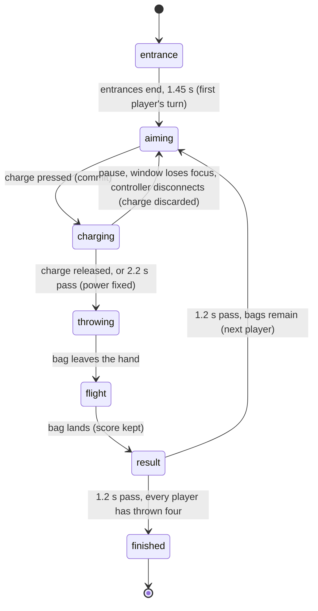

# The cornhole throw

## Summary

The cornhole throw is how a player sends one bag at the board in a Play Cornhole match. They pick a spot, aim, choose a *shot*, hold to charge, and let go while the marker is inside the green *release window*. Each player throws four bags, taking turns in slot order. Every bag scores for the player who threw it:
- 3 in the hole
- 1 on the board
- 0 off it

The throw happens on the Play tab, in a *live match* started from [Play setup](play-setup.md) with **Cornhole** selected. At any moment exactly one player is the *active player*. Several things tell everyone whose turn it is:
- that player's tile in the *score strip* is highlighted
- their in-canvas status reads **AIMING** or **CHARGING**
- a target reticle shows on the board
- the *caption* reads "{name}: aim, hold charge, then release"

Cornhole is *practice*. It never awards points, and nothing about a throw is saved.

## The simple case

When the match opens, both cards walk on for about a second and a half (**Cards to court**). Then the first player's turn begins. They see:
- their character holding a bag at the throwing spot on the left
- a white reticle over the board on the right
- the prompt "{name}: aim, hold charge, then release"

Moving left or right shifts the thrower along the throwing line. The aim keys or stick move the reticle.

The player presses and holds the charge button: Space on keyboard 1. The **Release timing** meter appears over the stage with a marker sliding right and a green band, and the character plays a short pre-throw ritual. The caption reads **Release in the green window**. The player lets go while the marker is in the green. The caption reads **Perfect release**, the character throws, and a moment later the bag leaves the hand and arcs onto the board.

When the bag lands, the result is announced ("Doug: on the board — one point") and the thrower reacts. The score strip updates. After a short pause the next player's turn begins with the reticle re-centred. When every player has thrown four bags, the caption reads **Final score**, and the result shows "{name} wins", or **Session complete** on a tie. The result offers **Play again** and **Choose another event**.

## The interaction, event by event

### Starting

A turn starts 1.2 seconds after the previous bag landed, or 1.45 seconds after the match opened for the first player. At that instant:

- **The shot is reset** to this character's default shot (see [shots](#shots)). The reticle returns to the centre of the board. The thrower's spot along the line is *not* reset; it is wherever this character last stood.
- **The caption** changes to "{name}: aim, hold charge, then release".
- **The status labels change.** The in-canvas status for the active player reads **4 BAGS LEFT · AIMING**, counting down each turn. Every other player reads **WAITING**.
- **Only the active player can act.** Presses from other players do nothing, except **Celebrate** (C on keyboard 1), which plays a celebration for that player's own character.

While aiming, the active player can:

- **Move** (W/S/A/D, the left stick, or the **Move** pad). Only left and right count. The thrower slides along the line at 35 stage pixels per second, between x = 165 and x = 350. Where they stand changes how much power the throw needs: see [committing](#committing).
- **Aim** (the arrow keys, the right stick, or the **Aim** pad). The reticle moves up to 115 stage pixels along the throw and 48 across it, at 0.65 of its range per second. It takes about a second and a half to reach an edge.
- **Choose a shot** with J, K, L or E: **Hole runner**, **Slide**, **Roll** or **Airmail**. Nothing on screen shows which shot is selected.
- **Turn on precision mode** with left Ctrl.

None of these commit anything. The player can aim as long as they like; the turn has no time limit.

### Backing out at once

There is no way to decline a throw or pass the turn. Once the turn has started, the only ways out are these:

- **Pause.** The turn stays in aiming, with the reticle where it was.
- **Leave the match.** See [navigating away](#cancel-and-interrupt).

A quick tap of the charge button is not a back-out; it commits a throw. The press starts a charge and the release, even on the very next game step, throws it. The power is almost zero, so the caption reads **Early release** and the bag falls far short of the board. On the on-screen controls, one tap starts a charge and does not throw until a second tap.

### Committing

The throw commits when the charge press is accepted. That is a key press, a trigger pulled past 0.2, or the first tap on the on-screen **Hold / release** button. From that instant:

- **Power starts rising** from zero at 1/1.5 per second. It reaches 1.0 after 1.5 seconds and stops at 1.2.
- **The meter appears.** The **Release timing** meter appears with its marker at the left. The green band is centred on the *ideal power* and is as wide as the *release window*:
  - **Ideal power** is 0.7 at the starting spot. It rises by about 0.04 at the far left of the line and falls by about 0.1 at the far right. Standing farther from the board needs a stronger throw.
  - **The release window** is ±0.035, plus up to 0.045 more for the card's skill with the selected shot, plus 0.035 in precision mode, plus 0.025 for a *clutch performer* on their last bag.

  At the starting spot a perfect release is about 1.05 seconds into the charge.
- **The caption** reads **Release in the green window**. The in-canvas status reads **CHARGING**.
- **The character plays a pre-throw ritual** from its personality, such as a bag squeeze or a stare at the board.

Committing fixes nothing else. Position, aim, shot and precision mode can all still change: see [while charging](#while-charging).

### While charging

The marker slides right in real time. Every change the player makes applies live:

- **Moving** the thrower moves the green band, because the ideal power depends on where the thrower stands at the instant of release.
- **Aiming** still moves the reticle.
- **Changing the shot** changes the window width, the arc, and which throwing animation will play.
- **Precision mode**, turned on now, widens the green band at once for three seconds.

The charge ends in one of three ways:

1. **The player lets go.** See [the throw](#the-throw).
2. **Two point two seconds pass.** The throw releases by itself at full power (1.2). The caption reads **Late release**, and the bag flies long. On the on-screen controls, the **Release** button turns back into **Hold / release**.
3. **The game pauses.** The charge is discarded. See [cancel and interrupt](#cancel-and-interrupt).

### The throw

On release, the power is fixed and graded against the ideal:

- **Perfect release**: inside the window. A controller rumbles briefly.
- **Early release**: short of the window.
- **Late release**: past it.

The character plays the throw for the selected shot. The bag leaves the hand at the throw's release point, not at the moment the button was let go. The landing spot is decided then:

- **Starting point.** It starts from the hole, moved by the reticle's offset.
- **Timing.** It is pushed past the hole by a late release or short of it by an early one, at 490 stage pixels per unit of power error. It also drifts toward the front edge of the board by 60 pixels per unit of error.
- **Scatter.** It is scattered randomly by up to ±11 × (1 − accuracy) pixels, or 40% of that while precision mode is still active.

The bag flies for 0.88 seconds, or 1.25 for an **Airmail**. The arc is flattest for a **Hole runner**, highest for an **Airmail**, and the bag tumbles during a **Roll**.

When it lands:

- **Scoring.** Within 13 stage pixels of the hole's centre is **in the hole — three points**, and the bag disappears. On the board surface is **on the board — one point**, and the bag stays drawn on the board. Anywhere else is **off the board**.
- **Pushing earlier bags.** A board landing within 26 pixels of an earlier board bag pushes that bag toward the hole:
  - 12 pixels, or 24 for a **Slide**
  - 18 for an **Airmail**

  A pushed bag can drop into the hole. It then scores 3 for *its* owner, who may be the opponent.
- **Roll.** A **Roll** that nudges a bag stops 16 pixels nearer the front edge for each bag it nudged. That can carry it off the board.
- **Scores.** Every player's score is recomputed from their bags. The caption announces only the thrown bag's own result.
- **Effects.** The thrower plays a celebration or a miss reaction. A hole gives a hole sound and a small camera punch; anything else gives a board-impact sound.

After 1.2 seconds the next player's turn starts. After everyone has thrown four bags, the match finishes:
- **The winners** are every player with the highest score, and they all celebrate.
- **The result** reads "{name} wins" for one winner, or **Session complete** for a tie.

Nothing is written anywhere.

## Shots

| Key (keyboard 1 / 2) | Shot | Arc | Pushes an earlier bag | Card skill used for the window |
|---|---|---|---|---|
| J / numpad 1 | **Hole runner** | Flat | 12 px | 0.6 for both built-in cards |
| K / numpad 2 | **Slide** | Medium | 24 px | Dan 0.72, Doug 0.9 |
| L / numpad 3 | **Roll** | Medium, tumbling | 12 px, then stops nearer the front | Dan 0.86, Doug 0.55 |
| E / numpad 0 | **Airmail** | High, 1.25 s flight | 18 px | Dan 0.72, Doug 0.63 |

Each turn starts on the character's most frequent style:
- **Doug** starts on **Hole runner**.
- **Dan** starts on a "blocker" style that none of the four buttons selects. It flies like a Slide, pushes like a Hole runner, and uses 0.6 for the window.
- **Installed characters** start on a "standard" style that behaves the same way.

## Modifiers

| Modifier | Set at the start | Changed while committed |
| --- | --- | --- |
| Input device | **Keyboard 1** charges with Space, and **keyboard 2** with Enter. A **controller** charges with the right trigger (RT or R2). The trigger is analog, so a half pull counts once it passes 0.2 and releases below 0.1. **Touch** charges with a tap on **Hold / release**, which then reads **Release**. A second tap throws. An **AI player** charges 0.4 s after its turn starts, and lets go within a few hundredths of the ideal, varied a little each throw. | The device cannot be changed during a match. Adding on-screen taps to a keyboard or controller merges the two: see [input device changes](#cancel-and-interrupt). |
| Event and action combinations | **J/K/L/E** choose the shot. **Right modifier** (left Ctrl, right Ctrl for keyboard 2, RB or R1) turns on precision mode while aiming or charging. It costs 15 stamina, lasts 3 s, and then has a 10 s cooldown; with less than 15 stamina it does nothing. The caption shows **Precision mode**. The **left modifier** (Shift, LB or L1) does nothing in cornhole. **Celebrate** (C) plays a celebration for any player at any time their character is not already mid-animation. J during the result pause does the same for the thrower. | The shot can still be changed; the latest choice before release wins. Precision mode can be turned on mid-charge, and the green band widens at once. It only narrows scatter if it is still active when the bag leaves the hand, 3 s after activation. Moving mid-charge moves the green band. |
| Contest kind | Always Play practice. The caption shows **Practice / no club points**. Exhibition, counted entry and replay are Watch-only and do not apply. | Not applicable: practice cannot become anything else. |
| Character card | The card's accuracy sets the scatter: Dan 0.76, Doug 0.68. Its shot skills set the window width (see [shots](#shots)). Its default shot sets the starting style. **Dan** is a clutch performer, so his window is 0.025 wider on his fourth bag. Both built-in cards have precision mode. An installed character without a connected rig cannot start a match: see [interactions](#interactions-with-other-systems). | Not applicable: cards are chosen in setup. |
| Presentation settings | **Reduced motion** skips the camera punch on a hole and calms the impact effects. **Lower graphics quality** has no effect in Play. The **clean spectator view** is Watch-only. Play's sound switch reads **Sound on** and starts off. Turned on, it plays a release tone, a hole tone and a board-impact tone. | Toggling **Reduced motion** in Arena settings restarts the whole match: see [settings change underneath](#cancel-and-interrupt). The sound switch takes effect on the next cue. |
| Screen size and orientation | The stage scales to fit and stays centred. The hole, the board and every distance above are in stage pixels, so window size does not change the difficulty. The on-screen pads measure from their own centre, whatever their size. | Resizing or rotating rescales the stage mid-throw. Nothing pauses and the charge continues. |
| Saved state | The throw reads nothing from this browser's save. The only saved thing that matters is the bindings last saved by **Start**, which decide which keys are J/K/L/E and charge. | No effect. |

## Cancel and interrupt

| Event | Before committing | While committed |
| --- | --- | --- |
| Escape or click outside | **Escape** is keyboard 1's pause key. If a player uses keyboard 1, it pauses while stage focus is inside the stage, and does nothing otherwise. With no keyboard 1 player it does nothing. A **click elsewhere on the page** moves stage focus away, so later key presses do nothing. The turn waits. | **Escape** pauses and discards the charge. A **click elsewhere** does not stop the charge. The charge key's release still counts, so letting go throws. Otherwise the automatic release throws at 2.2 s. |
| Pause or resume | The game freezes and the **PAUSED** overlay shows **Resume when you’re ready.** The reticle, shot, spot and precision timer are kept. Resuming continues aiming. | The charge is **discarded**. The meter disappears, the ritual stops, and the player is back to aiming with no bag thrown. The throw counts for nothing and the same player still has the turn. After resuming they must press charge afresh; a key or trigger still held through the pause does nothing until released. Controllers must first [return to neutral](../foundations/input-model.md#neutral). |
| Repeated or rapid input | Operating-system key repeat is ignored. Mashing shot keys just reselects; the last one wins. Extra precision presses during its cooldown do nothing and cost nothing. A double-tap of charge throws on the first release, and the second press lands after the turn has moved on, so it does nothing. | The charge key cannot be pressed again without first releasing it, which throws. Pressing charge on the on-screen button and the key together keeps the charge held until *both* are released. |
| A panel opens on top | Opening Arena settings, House rules or History moves focus into the dialog, so key presses stop counting. The match does not pause. Controller, touch and AI players carry on, but the turn waits for the active player. | The charge keeps rising behind the dialog. Letting go of the key still throws, because releases always count. If nothing is let go, the automatic release throws at 2.2 s. |
| Navigating away | Switching the main tab, clicking the logo, or **Replay** from History closes the match at once without a warning. Scores and setup choices are lost. Returning to Play shows setup with its defaults. | The same. The charge, the bag and the match are gone. |
| Forced finish | None. Aiming has no time limit. | The automatic release throws at full power 2.2 s after the charge began: **Late release**. |
| Focus leaves the game | Losing window focus or hiding the browser tab pauses, with **Paused while the window was inactive.** Held keys are dropped. Moving focus to another part of the page only stops key presses from counting. | Pausing on focus loss discards the charge, as for pause. Moving focus within the page leaves the charge running (see **Escape or click outside**). |
| Reload, close, or back/forward cache | The match is gone and nothing is kept. The page reopens on the Watch lobby. | The same; the half-charged throw leaves no trace. |
| Settings or saved data change underneath | Toggling **Reduced motion** restarts the match from its entrances with the same random seed. All bags and scores are lost. Play's sound goes off even though its button still reads **Mute**. Changing the scoring policy, **Reset demo**, or another tab writing the save have no effect on the match. | The same restart; the charge is lost. |
| Graphics or storage failure | Play has no handler for a lost WebGL context. What the player sees is not known (see open questions). Saving bindings at **Start** fails silently if storage is refused. It happens before the throw and does not affect it. | The same. |
| Input device changes | A **controller disconnecting** pauses with **Controller disconnected. Reconnect it, then resume.** Resuming while it is still disconnected pauses again at once. After reconnecting, it must return to neutral. Using the **on-screen** pads or buttons alongside a key or controller works at any time. The player's tile then shows `touch` as their device until they next use the original device. | A controller disconnecting pauses and discards the charge. An on-screen **Release** tap while a key is also held does not throw; see **Repeated or rapid input**. |

After an interrupt the player stays in the match unless they navigated away or reloaded. A pause always returns the active player to aiming with their turn intact. Nothing about a throw is kept anywhere once the match closes.

> Technical note: pause is handled by the session, not by the event's own controls. That is why every player's pause key works during any player's turn. Pressing it again while paused resumes.

## Interactions with other systems

**Points and the ledger.** No interaction. Play never reads or writes club points; the caption says **Practice / no club points**.

**Saved data and recovery.** No interaction. A throw writes nothing. The only Play data saved is the bindings, written when **Start Cornhole** is pressed ([controls and remapping](controls-and-remapping.md)).

**Watch and Play separation.** Play Cornhole is simulated live from each input. Each match gets a fresh random seed when it is started, so the same inputs do not reproduce the same scatter from one match to the next. It shares no recording, ledger or playback clock with Watch Cornhole, which has its own rules ([the four sports](../watch/the-four-sports.md)).

**Devices and players.** Up to four players take turns in slot order: player 1, 2, 3, 4, then back to player 1. Two players may not share a keyboard layout or a controller. Any number can use touch or AI. See [the input model](../foundations/input-model.md).

**Sound.** Off by default in every match. With **Sound on**, three short synthesized tones play: one on release, a bright one on a hole, and a low one on a board or floor landing. Watch's sound switch has no effect here ([sound](../cross-cutting/sound.md)).

**Reduced motion and graphics quality.** Reduced motion removes the camera punch on a hole and softens effects; the throw's timing and scoring are unchanged. Lower graphics quality is not applied to Play ([the stage](../foundations/stage.md)).

**Accessibility.** The caption is an `aria-live` region. It announces the turn prompt, **Release in the green window**, the release grade and each landing. The **Release timing** meter and the reticle are visual only. Nothing tells a screen-reader user where the marker is relative to the window. The on-screen buttons are real buttons, and the pads take arrow keys when focused ([accessibility](../cross-cutting/accessibility.md)).

**Installed characters.** An installed card can be chosen in setup. If its pack has no connected rig, the match fails to open with "{name} needs a connected character rig for direct play. Its existing poses remain available in Watch." An installed card that does open throws with the "standard" default style ([Install character](../collection/install-character.md)).

**Multiple tabs.** Each tab runs its own match. The only shared thing is the saved bindings; the last **Start** in any tab wins.

**Agent tools.** `configure_arena_event` switches the page to the Watch tab. Called while a Play match is running (and no Watch recording is loaded), it ends the match exactly as navigating away does. `read_arena` reads only Watch state ([agent tools](../cross-cutting/agent-tools.md)).

## Edge cases

- **Players 3 and 4.** They stand farther right when the match opens. On their first turn they are moved to the nearest allowed spot (x = 350), so they may visibly jump.
- **Where the thrower stands** is kept between their own turns. **The reticle** is not; it re-centres every turn.
- **A bag knocked into the hole** disappears and scores for its owner. The announcement names only the thrower's bag, so the other player's score can go up with no message about it.
- **A tie** ends with **Session complete**, and every tied player celebrates. This includes 0–0.
- **Stamina** only goes down in cornhole. It does not recover, so precision mode can be used at most six times per match. Its cooldown and remaining time are not shown anywhere except the one-off caption **Precision mode** and the stamina bar dropping by 15.
- **Celebrating mid-aim.** The active player can press **Celebrate** while aiming. It does not stop them charging afterwards. Pressed during the pre-throw ritual, it does nothing.
- **Charge pressed too early.** Pressed during the entrances or during another player's result pause, it is ignored entirely rather than buffered. The player must press again once their turn starts.
- **The on-screen Release button** returns to **Hold / release** by itself when the throw is released automatically, and when the turn passes.
- **The held bag** is drawn in the thrower's hand from the start of their turn until the release point. **In-flight bags** are drawn in the air. **Board bags** stay drawn until the match closes.
- **The in-canvas status** counts **BAGS LEFT** for each player. A bag in flight is not subtracted until it has landed.

## Open questions and verification

- Everything above was read from the code and `tests/live-tests.mjs`. None of it has yet been checked on the production page. The tests prove release timing changes the score, a held trigger cannot re-charge after resume, and the AI scores through release events. They run against the session directly, not through the page.
- **A tap throws a dud.** A quick tap of the charge key throws at almost zero power instead of doing nothing. That may be intended, but it is the main difference from the on-screen controls, where a tap only starts a charge. This is a product call.
- **The selected shot is never shown.** Dan's default "blocker" style cannot be reselected once the player picks another shot that turn. That looks like a gap rather than a design.
- **A Roll can stop more than once.** A Roll that lands near several board bags stops 16 px nearer the front edge for *each* of them. That looks like a bug: the offset sits inside the per-bag loop in `PrecisionPhysics.ts`.
- **Toggling Reduced motion during a match** restarts it and leaves the Sound button reading **Mute** while sound is off. This may be worth treating as a bug.
- **The gap between letting go and the bag leaving the hand** depends on the throw animation. It has not been measured on the page.
- **Players 3 and 4 jumping** to x = 350 on their first turn is read from the clamp in `PrecisionEvent.update`. It has not been seen.
- **WebGL context loss** during a Play match has no handler. Whether the stage goes blank and whether the session keeps running are unknown.
- **The back/forward cache.** Whether the browser keeps a Play match through its back/forward cache, and whether it comes back paused, is untested.

Verified against Will-You-Be-My-Hero-Arena commit `3b4ec62`
