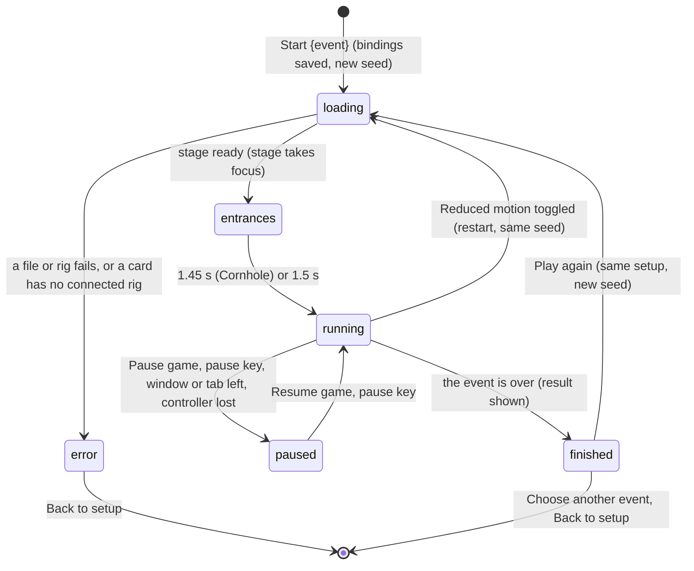

# The match shell

## Summary

The match shell is everything around a Play event while a match is loading, running or finished: the toolbar above the stage, the three *overlays* on it, the *score strip*, the *sign* and the *nameplates* over it, the *caption* below it, one control panel per person, and the result at the end. It is the same for all three Play events. What happens *inside* a match belongs to the event documents: [the cornhole throw](cornhole.md), [Clubhouse Dash](clubhouse-dash.md) and [Backyard Brawl](backyard-brawl.md).

This document owns:
- loading, and the errors that stop a match from opening
- pausing, by hand and automatically, and the **PAUSED** overlay
- Play's sound switch
- what the score strip, caption, sign, nameplates and control panels show
- the result, **Play again**, **Choose another event** and **Back to setup**
- what Reduced motion does to a match that is running

A Play match is *practice*. The caption says **Practice / no club points** from the first frame to the last.

## The simple case

On [Play setup](play-setup.md) the player presses **Start Cornhole**. The setup is replaced by the match. At the top is a toolbar:
- **DIRECT PLAY / PRACTICE** over the event's name in capitals
- **Pause game**, **Sound on** and **Back to setup** on the right

The stage is covered by **Opening the cards…** for a moment. Then the cover lifts, the characters walk on, and the stage takes keyboard focus.

**What is on screen.**
- **The nameplates**, in the top corners of the stage, show each player's name and score. The *score strip* holds a tile per player with the same figures and a line such as "Stamina 100 · keyboard", but the production page clips it out of sight, so only screen readers get it.
- **The caption**, under the stage, shows the event's latest message on the left and "3s · Practice / no club points" on the right.
- **The control panels.** Under the caption, each person has a control panel with a one-line hint and the on-screen controls.

Escape pauses. The stage dims under **PAUSED** and **Resume when you’re ready.**, with a **Resume game** button. When the match is over, the control panels are replaced by the result: "Doug wins", or **Session complete** on a tie, with **Play again** and **Choose another event**.

## The interaction, event by event

The action narrated here is a Play match, from **Start {event}** to its result.

Pausing during the entrances works the same way, and resuming continues them. **Back to setup**, a main tab or the logo leave from any state.

### Starting

The action starts when setup accepts **Start {event}** ([Play setup](play-setup.md)). At that instant:
- **Captured:**
  - the event
  - each slot's card, device and bindings
  - the Dash's course controls
  - any imported asset mapping for each card
  - the current **Reduced motion** setting
- **Written:** the bindings, to `wybmh-input-bindings-v1`. Nothing else is written, then or later.
- **Chosen:** a fresh random seed, so no two matches play out alike.
- **Shown:**
  - **The toolbar**, with **Pause game** disabled until the match is ready, and **Sound on**. Play's sound is off at the start of every match.
  - **The cover.** The stage is covered by **Opening the cards…**.
  - **The caption** reads "Loading the arena" and "0s · Practice / no club points".
  - **The score strip** is empty.
  - **The control panels** already show. Until the match reports its players, each is labelled with its slot's internal name, such as **player-1**, and shows keyboard move keys whatever the device.

While covered, the page fetches and checks the character rigs, then loads the court, the equipment and each card's art ([the stage](../foundations/stage.md#loading-and-rebuilding)).

### Backing out at once

**Back to setup** during **Opening the cards…** abandons the load and returns to Play setup with every choice as it was. The only trace is the bindings written by **Start**. Leaving by a main tab or the logo also abandons it, but setup then comes back with its defaults ([the app shell](../foundations/app-shell.md#views)).

If the match cannot open, the cover is replaced by the error overlay, with the reason. There is no retry button: the player presses **Back to setup**, changes what is needed, and presses **Start** again. The messages are:
- **No connected rig.** "Error: {full card name} needs a connected character rig for direct play. Its existing poses remain available in Watch." It appears for an installed card whose pack has no connected rig.
- **A file fails to load.** "Could not load {asset}. Return to setup and retry." for an art or equipment file, where {asset} is the asset's internal name, such as "arena-background", not a file name.
- **A rig file is missing or altered.** "Error: Cannot load performance asset {file}" or "Error: Performance asset hash mismatch: {file}". The Dash and the Brawl say "side rig asset" instead.

The "Error:" prefix is part of the message as shown.

### Committing

A Play match is committed from the moment **Start {event}** is pressed ([the glossary](../glossary.md#state)): the bindings are written and the seed is fixed. Nothing about the match itself is at stake until its clock starts, when the stage is ready:
- **The cover lifts** and the stage takes keyboard focus ([stage focus](../foundations/input-model.md#starting)).
- **Pause game** becomes available.
- **The entrances.** *Game time* starts at 0 and the characters play their entrances: 1.45 s in cornhole ("Cards to court"), and 1.5 s in the Dash ("Take your mark") and the Brawl ("Step into the ring").

From here, leaving throws away a match in progress. In the tables below, "before committing" means while **Opening the cards…** is showing, and "while committed" means from the entrances to the result.

### While the match runs

- **The caption** shows the event's latest message and the whole seconds of game time. It refreshes about 13 times a second. The counter stops while paused and, in the Brawl, during [hit-stop](backyard-brawl.md).
- **The score strip and the nameplates** follow scores, stamina and health as they change.
- **Pausing by hand.** **Pause game** pauses. So does any player's pause key or a controller's Menu or Options button ([pause and input](../foundations/input-model.md#pause-and-input)). When paused:
  - The stage dims under **PAUSED** and **Resume when you’re ready.**, with a **Resume game** button.
  - The toolbar button also reads **Resume game**, and the sign's phase reads **PAUSED · PRACTICE**.
  - Either **Resume game** button resumes and puts keyboard focus back on the stage, and so does the pause key again.
  - AI players never pause and cannot resume ([AI players](../cross-cutting/ai-players.md)).
- **Automatic pauses.** The match pauses by itself, with its own notice instead of **Resume when you’re ready.**:
  - **Paused while the window was inactive.** when the window loses focus or the browser tab is hidden
  - **Controller disconnected. Reconnect it, then resume.** when a controller player's pad is not connected

  Coming back to the window does not resume; a player must. A later automatic pause replaces the notice.
- **Pausing clears input.** Held keys, buffers and on-screen toggles are let go, and the on-screen buttons are redrawn. Controllers must return to [neutral](../foundations/input-model.md#neutral). Each event reacts too; cornhole, for example, discards a charge ([the cornhole throw](cornhole.md#cancel-and-interrupt)).
- **Sound on** turns Play's sound on, and the button then reads **Mute** ([sound](../cross-cutting/sound.md)).

### The result

The event decides when the match is over:
- **Cornhole:** every bag has been thrown.
- **The Dash:** every runner is home, or 6 s have passed since the first finisher, or 40 s since the match opened.
- **The Brawl:** a knockout, or 60 s since the match opened.

At that step:
- **The sign's phase** reads **FINISHED · PRACTICE**. In cornhole and the Brawl the winners celebrate now. In the Dash nobody celebrates at the end: each runner celebrated as they crossed the line.
- **The result** replaces the control panels. It reads "{name} wins" for a single winner, using the character's short name, for example "Dan wins". Anything else reads **Session complete**: a cornhole tie, a Dash nobody finished in time, a Brawl level on health at the time limit, or a double knockout.
- **Play again** starts a new match with exactly the same setup and a new seed. It goes back through **Opening the cards…** with sound off. It does not write the bindings again.
- **Choose another event** and **Back to setup** both return to Play setup with every choice kept, including the event. Despite its name, **Choose another event** changes nothing by itself.

Nothing about the match is kept anywhere.

## The parts of the screen

| Part | Where | What it shows |
|---|---|---|
| Toolbar | Above the stage | **DIRECT PLAY / PRACTICE** and the event's name; **Pause game** or **Resume game**; **Sound on** or **Mute**; **Back to setup** |
| Stage | The full width of the page, 16:9 | The event, scaled to fit ([the stage](../foundations/stage.md)) |
| Sign and nameplates | Drawn inside the stage | A hanging sign with the event's title and phase, and a nameplate per player in the top corners |
| Score strip | A 1-pixel box at the stage's top left, so only screen readers get it | One tile per player |
| Overlays | Over the whole stage, dimming it | **Opening the cards…**, the error, or **PAUSED** |
| **Release timing** meter | Drawn at the bottom left of the stage as **RELEASE TIMING**, cornhole only, while charging. The page's own copy, labelled **Release in green**, is clipped like the score strip | See [the cornhole throw](cornhole.md) |
| Caption | Under the stage | The event's message, and "Ns · Practice / no club points" |
| Control panels | Under the caption, one per person | Name, move keys, a hint, and the [on-screen controls](touch-controls.md) |
| Result | In place of the control panels | "{name} wins" or **Session complete**, **Play again**, **Choose another event** |

**Score strip tiles.** Only screen readers get these; sighted players see the same figures on the nameplates.

| Event | Score | Bar | Small line |
|---|---|---|---|
| Cornhole | "{n} PTS" | Stamina | "Stamina {n} · {device}" |
| Clubhouse Dash | "{n}%" of the course | Stamina | "Stamina {n} · {device}" |
| Backyard Brawl | "{n} HP" | Health | "Energy {n} · {device}" |

- **The device** is the family of whatever that player last used: "keyboard" for either layout, "xbox", "playstation", "generic", "touch", or "AI".
- **The active player's tile** carries a yellow underline, clipped out of sight with the strip. Only cornhole has an active player.
- **At 720 px wide and below** the small line is removed, so screen readers no longer get the stamina, energy or device.

**The sign and nameplates.**
- **The sign** reads **CORNHOLE**, **RUNNING** or **FIGHTING** over the phase, for example **AIMING · PRACTICE**, **PAUSED · PRACTICE** or **FINISHED · PRACTICE**.
- **The nameplates.** Players 1 and 3 are on the left, players 2 and 4 on the right. Each plate shows the first name and a big number: cornhole points, Dash percent or Brawl health. Under it are a status line and either bag pips (cornhole), a stamina bar (Dash) or a health bar (Brawl). With three or four players the plates are smaller and have no pips or bars.
- **Hiding.** A plate or the sign disappears while a bag passes behind it, so they never cover the play.

**Control panels.** There is one for each player who is not an AI player, in slot order. Each label reads the player's name, their move keys and the event's hint:
- **Move keys:** "W A S D move", "T F G H move", "Left stick move" or "Move pad move", following the device family.
- **Cornhole:** "Aim, hold charge, then release in green. On screen: tap charge, then release."
- **Clubhouse Dash:** "Sprint, jump over cones, slide under bars. On-screen sprint toggles."
- **Backyard Brawl:** "Move into range, attack, guard or dodge. Chain light, light, heavy."

## Modifiers

| Modifier | Set at the start | Changed while committed |
| --- | --- | --- |
| Input device | Every person gets a control panel, whatever their device; AI players get none. Keyboard players need stage focus: the stage takes it when ready, and again after **Pause game** or **Resume game**. A controller the browser has not revealed yet counts as disconnected, so the match opens paused with **Controller disconnected. Reconnect it, then resume.** In an all-AI match nobody has a pause key, so only the toolbar button pauses by hand. | Devices are fixed for the match. Using the on-screen controls changes the tile's device to "touch" until the player's own device is used again ([the input model](../foundations/input-model.md)). |
| Event and action combinations | The event sets the score text, the bar's meaning, the caption's messages, the hint, the length of the entrances and how the match ends. Only cornhole has an active player and the **Release timing** meter. Held actions and chords belong to the event documents. | Not applicable: the event is fixed until **Back to setup**. |
| Contest kind | Always practice. The caption reads **Practice / no club points** and the sign's phase ends in **PRACTICE**. | Not applicable: practice cannot become anything else. |
| Character card | Tiles, plates, control panels and the result use the character's short name, such as "Doug". A card without a connected rig stops the match opening. Imported asset mappings for a card are passed into the match ([asset mapping](../collection/asset-mapping.md)). | Not applicable: cards are fixed until **Back to setup**. |
| Presentation settings | **Reduced motion** is read at **Start**. With it on, camera punches and shakes are skipped, impact effects are not drawn, and squash and stretch is off. **Lower graphics quality** has no effect. The **clean spectator view** hides the tabs, so Play cannot be reached while it is on. Play's sound starts off. | Toggling **Reduced motion** restarts the match: see [settings change underneath](#cancel-and-interrupt). The sound switch applies from the next sound. |
| Screen size and orientation | The stage is the full width of the page column at 16:9, so it has no letterbox. At 720 px wide and below, the toolbar wraps, the tiles shrink and lose their small line, the caption stacks and the result wraps. | Resizing or rotating rescales at once. Nothing pauses. |
| Saved state | The match reads nothing from this browser's save except the imported asset mappings that setup passes in. A corrupt save, or a character library that will not open, does not stop Play; the match starts without mappings. | No effect. Another tab writing the save, **Reset demo** and a policy change leave the match alone. |

## Cancel and interrupt

| Event | Before committing | While committed |
| --- | --- | --- |
| Escape or click outside | Escape does nothing: the stage does not have focus until the match is ready. There is nothing to dismiss. | **Escape** is keyboard 1's pause key. With a keyboard 1 player and stage focus it pauses, and pressed again it resumes. The **PAUSED** overlay is not a dialog; a click on it does nothing. A click elsewhere on the page moves focus off the stage, so key presses stop counting. Clicking the stage's drawing does not bring focus back ([stage focus](../foundations/input-model.md#starting)); pressing Tab to reach it, or **Pause game** then **Resume game**, does. |
| Pause or resume | **Pause game** is disabled, and pause keys do nothing, until the stage is ready. | Pauses and resumes as described above. Game time stops, input is cleared, and the event reacts. Pausing still works after the result, over the finished stage. |
| Repeated or rapid input | **Back to setup** acts on the first click. **Sound on** can be toggled, but see the open questions for clicks this early. | The pause key toggles once per press; key repeat is ignored. **Pause game** acts on the state it last showed, which refreshes about every 75 ms, so a very fast double-click pauses once instead of pausing and resuming. |
| A panel opens on top | Loading carries on behind the dialog. | The match does not pause. Focus moves into the dialog, so keyboard players stop responding while controllers, touch and AI players carry on. Closing the dialog does not give focus back to the stage ([the app shell](../foundations/app-shell.md#resolving)). |
| Navigating away | A main tab, the logo, **Replay** from History or the agent tool abandons the load. Returning to Play shows setup with its defaults. **Back to setup** keeps the setup choices. | The same, with no warning. The match, its scores and its sound are gone. **Back to setup** and **Choose another event** keep the setup choices; every other way out loses them. |
| Forced finish | Not applicable: nothing runs while loading. | The event ends the match: the last bag, the Dash's limits, a knockout or the Brawl's limit. The result appears at once. Play has no skip. |
| Focus leaves the game | Losing window focus or hiding the tab while loading pauses the match before it is shown. It opens under **PAUSED** with **Paused while the window was inactive.** | Losing window focus or hiding the tab pauses with that notice, even after the result. Moving focus elsewhere on the page only stops keyboard input. That includes a click on **Sound on**, **Mute** or **Back to setup**, which leaves focus on that button: Enter then presses the button instead of acting in the game, and Space may do nothing at all ([the input model](../foundations/input-model.md#edge-cases)). |
| Reload, close, or back/forward cache | The load is abandoned. The page reopens on the Watch lobby. Only the bindings remain. | The same; nothing about the match is kept. |
| Settings or saved data change underneath | Toggling **Reduced motion** starts the load again with the new setting. The scoring policy, **Reset demo** and another tab's write have no effect. | Toggling **Reduced motion** restarts the match from its entrances with the same seed, and every score is lost. No **Opening the cards…** cover appears; the old tiles and caption stay until the new match reports. The new match starts unpaused even if the old one was paused. Play's sound goes off, but its button still reads **Mute**. Other changes have no effect. |
| Graphics or storage failure | A failed file or rig shows the error overlay; **Back to setup** is the only way on. Saving the bindings at **Start** fails silently if storage is refused. | Play has no handler for a lost WebGL context ([the stage](../foundations/stage.md#graphics-context-loss-and-the-error-box)). What the player sees is not known. A match writes no storage. |
| Input device changes | A controller not yet revealed to the page makes the match open paused, as above. | A controller disconnecting pauses with **Controller disconnected. Reconnect it, then resume.** Resuming while it is still disconnected pauses again at once. After reconnecting, it must return to neutral. On-screen input merges at any time and the tile shows "touch". |

After an interrupt the player stays in the match unless they navigated away, reloaded, or toggled Reduced motion. A pause never loses a score.

> Technical note: `LiveStage.tsx` rebuilds the whole game when either the match's setup or the Reduced motion value changes. Its own `ready`, `snapshot` and `sound` values are not reset, which is why the restart shows no cover and the sound button keeps its label.

## Interactions with other systems

**Points and the ledger.** No interaction. The match never reads or writes points, and the caption says **Practice / no club points** throughout ([contests and recordings](../foundations/contests-and-recordings.md#kinds-of-play)).

**Saved data and recovery.** Only the bindings are written, when **Start {event}** is pressed; **Play again** does not write them. Nothing about a match can be recovered once it closes ([this browser's save](../foundations/saved-data.md), [controls and remapping](controls-and-remapping.md)).

**Watch and Play separation.** The match has its own stage, clock, pause and sound switch. **Pause game** has nothing to do with Watch's **Pause playback**. A Watch recording stays loaded and paused on the Watch tab while a match runs.

**Devices and players.** One to four players; the Brawl takes exactly two, and setup always offers at least two slots. Every person's pause input works during anyone's turn. Each tile names the device family the player last used ([the input model](../foundations/input-model.md)).

**Sound.** Play's own switch is in the toolbar, and is off at the start of every match. The footer's **Sound on/off** reflects Watch, not this switch ([sound](../cross-cutting/sound.md)).

**Reduced motion and graphics quality.** Reduced motion is read at **Start** and restarts a match when changed. Lower graphics quality is ignored ([the stage](../foundations/stage.md#reduced-motion-and-lower-graphics-quality)).

**Accessibility.**
- **The stage** is labelled "Playable arena. Focus here for keyboard controls." and shows a teal outline when focused from the keyboard.
- **The caption** is a polite live region, so each event message is announced. **The error overlay** is an alert.
- **The PAUSED overlay** is not announced. A screen-reader user is not told when losing window focus pauses the match; only the toolbar button's label changes.
- **Each tile's bar** is labelled "{name} stamina" or "{name} health".

See [accessibility](../cross-cutting/accessibility.md).

**Installed characters.** An installed card plays like a built-in one if its pack has a connected rig. Otherwise the match fails with the rig error above ([Install character](../collection/install-character.md)).

**Multiple tabs.** Each browser tab runs its own match. Leaving a tab hides it, which pauses its match. The last **Start** in any tab decides the saved bindings.

**Agent tools.** `configure_arena_event` switches the page to Watch, which ends the match without a warning. If a Watch recording is loaded, the tool refuses and the match carries on. `read_arena` reads only Watch ([agent tools](../cross-cutting/agent-tools.md)).

## Edge cases

- **After the result** the match is still live underneath. The seconds counter keeps counting, **Pause game** still works, and switching windows shows **PAUSED** over the finished stage. No event accepts moves any more, but **Celebrate** (**Taunt** in the Brawl) still plays.
- **Two names for the same event.** The toolbar says **Clubhouse Dash** and **Backyard Brawl**; the in-canvas sign says **RUNNING** and **FIGHTING**.
- **Two endings in the Brawl.** The caption reads "{name} wins" or "Draw". The result reads "{name} wins" or **Session complete**.
- **The Dash hint** mentions cones. The course's obstacles are hurdles and bars.
- **Short and full names.** The result uses the character's short name ("Doug wins"). The rig error uses the full card name ("Doug Weidensaul").
- **Telling people from AI.** The tile's "· AI" is clipped with the score strip, so only the missing control panel shows which players are AI.
- **Touch players at the end.** The result replaces the control panels, so on-screen players lose their buttons, including **Celebrate**, when the match ends.
- **Before the match reports** its players, each control panel is labelled with a slot name such as **player-1**, and a controller player's panel reads "W A S D move".
- **The sound button is always enabled**, even while loading or after an error. **Pause game** is disabled until the match is ready, and stays disabled after an error.

## Open questions and verification

- Read from `LiveStage.tsx`, `PlayableArena.tsx`, `LiveArenaGame.ts`, `ArenaSession.ts`, `LiveArenaScene.ts`, `ArenaHud.ts`, the three events' `view()` and `app/live-arena.css`. `scripts/production-smoke.mjs` confirms on the production page that **Start** opens a match whose caption counts seconds with no overlay, that **Pause game** turns into **Resume game**, and that the Arena save is not written. Everything else is unconfirmed there.
- **Reduced motion restart (suspected bug).** Toggling it mid-match restarts the match and leaves the sound button reading **Mute** while sound is off, because the new game is always created with sound off (`LiveStage.tsx` lines 27, 48–52 and 67). The same restart shows no loading cover and keeps **Pause game** enabled, because `ready` is not reset (lines 26, 53 and 129–131). It also un-pauses a paused match.
- **Sound pressed while loading (suspected bug).** **Sound on** pressed during **Opening the cards…**, before the rigs have been fetched and the game created, changes to **Mute** but leaves sound off. The click reaches no game, and the game is then created with sound off (`LiveStage.tsx` lines 36–56 and 85–92).
- **Focus after the toolbar (possible bug).** Clicking **Sound on**, **Mute** or **Back to setup** does not return focus to the stage, unlike the pause buttons. Keyboard players stop responding, and Enter then re-presses the button (`LiveStage.tsx` lines 85–93; `KeyboardDevice.ts` lines 24–29). Browsers that do not focus a clicked button, such as Safari, have not been tried.
- **Clicking the stage for focus.** The verification pass confirmed that clicking the stage does not give it focus ([stage focus](../foundations/input-model.md#starting)). The stage's drawing library cancels the default action of a mouse press on its canvas (Phaser 3.90, `MouseManager.js`, `preventDefaultDown` is on by default), so the browser does not move focus to the stage.
- **WebGL context loss.** Play has no handler (`LiveArenaGame.ts` lines 53–75). Whether the stage goes blank and whether the session keeps running is unknown.
- **The back/forward cache.** Whether a match survives it, and whether it comes back paused, is untested.
- **Focus on restart.** When the match restarts behind Arena settings, the new stage asks for focus. Whether it takes focus out of the open dialog is unknown.
- **The score strip and the page's meter are not visible.** `public/assets/arena-interface.css` (lines 109–123), loaded by `app/layout.tsx`, clips `.live-score-strip` and `.shot-meter` to a 1-pixel box, with the comment "the shared Phaser HUD is the sole visual score". The verification pass's screenshots show no strip over the stage.

Verified against Will-You-Be-My-Hero-Arena commit `3b4ec62`
