# Play setup

## Summary

Play setup is where a player chooses what to practise and who plays before a live match starts. They pick one of three Play events, give each *player slot* a card and a **Controls** device, and press **Start {event}**. It is the Play tab whenever no match is running. The header reads **YOUR CARD. YOUR CONTROLS.** over **TAKE THE COURT.**, with **Direct play · no club points** beside it. Below that come:
- the three event cards
- the player slots
- **Add player** and **Remove player**, for Cornhole and Clubhouse Dash only
- **Course controls**, for Clubhouse Dash only
- **Start {event}** and the controller hint
- the collapsed **Controls and remapping** section, owned by [controls and remapping](controls-and-remapping.md)

Nothing on this screen awards points or writes this browser's save. The only thing **Start** writes is the *bindings*. Every choice is kept in memory only, and leaving the Play tab throws all of it away.

## The simple case

The player clicks **Play** in the header. **Cornhole** is selected. **PLAYER 1** is Doug Weidensaul on **Keyboard · WASD**, and **PLAYER 2** is Dan Weidensaul as an **AI player**. Each slot shows the chosen card's image beside its two lists.

They leave everything as it is and press **Start Cornhole**. The setup disappears and the live match takes its place, with **Opening the cards…** over the stage while it loads. From here [the match shell](match-shell.md) and [the cornhole throw](cornhole.md) take over.

When the match ends, **Choose another event** (or **Back to setup** at any time) brings the setup back exactly as it was left. **Play again** starts the same line-up again without showing the setup.

## Events

| Event card | Description on the card | Players | Extra setup |
|---|---|---|---|
| **Cornhole** | Aim, charge and release. Four bags each. | 1 to 4 | **Add player** / **Remove player** |
| **Clubhouse Dash** | Sprint, change lanes, jump hurdles and slide under bars. | 1 to 4 | **Add player** / **Remove player**, **Course controls** |
| **Backyard Brawl** | Move, block and dodge. Chain light, light, heavy. | Exactly 2 | None |

The selected card turns yellow with an orange underline. The **Start** button's label follows it: **Start Cornhole**, **Start Clubhouse Dash** or **Start Backyard Brawl**.

**Course controls** has two choices, explained in [the Clubhouse Dash](clubhouse-dash.md):
- **Auto forward / change lanes**, the default
- **Free steering / control acceleration**

## Player slots

Each slot is headed **PLAYER 1** to **PLAYER 4** and has three things:

- **The card image**, tilted, with the text "{card name} card" for screen readers. It changes as soon as the card changes.
- **Character.** Every card in this browser: **Dan Weidensaul**, **Doug Weidensaul**, then any *installed characters*. Any number of slots may pick the same card.
- **Controls.** Eight choices:
  - **Keyboard · WASD**
  - **Keyboard · TFGH + numpad**
  - **Controller 1**
  - **Controller 2**
  - **Controller 3**
  - **Controller 4**
  - **Touch / on-screen**
  - **AI player**

  The list is always the same. It does not check whether a controller is plugged in.

| Slot | Default card | Default Controls | Default bindings |
|---|---|---|---|
| **PLAYER 1** | Doug Weidensaul | **Keyboard · WASD** | The bindings saved for keyboard 1, or its defaults |
| **PLAYER 2** | Dan Weidensaul | **AI player** | None in use |
| **PLAYER 3** (added) | Doug Weidensaul | **AI player** | None in use |
| **PLAYER 4** (added) | Dan Weidensaul | **AI player** | None in use |

**Bindings follow the device.** Whenever a slot's **Controls** changes, the slot takes the bindings saved for the new device, or that device's defaults if none are saved: keyboard 2's keys for **Keyboard · TFGH + numpad**, and keyboard 1's keys with the default controller buttons and axes for anything else. Any slot, 1 to 4, can pick up a saved device this way. Unsaved remapping for that slot is replaced. **Touch / on-screen** and **AI player** have no saved bindings and always get the defaults. See [controls and remapping](controls-and-remapping.md#resets-when-the-controls-change).

**Add player** adds a slot at the end, up to four. **Remove player** removes the last slot and stops at one. Both buttons fade out when they cannot be used. Backyard Brawl shows neither. Selecting it with three or four slots removes the extras at once, and selecting Cornhole again does not bring them back. Selecting it with one slot adds a second slot, Dan Weidensaul as an **AI player**.

## The interaction, event by event

The action narrated here is setting up and starting one match, from opening the Play tab to the moment the match takes over.

```mermaid
stateDiagram-v2
    [*] --> setup : Play tab opened (defaults; keyboard 1's saved bindings read into slot 1)
    setup --> setup : event, card, Controls, player count, course controls or a binding changed
    setup --> refused : Start pressed with a shared device or an invalid binding
    refused --> setup : anything in setup changed (the message clears)
    refused --> loading : Start pressed again, now valid
    setup --> loading : Start pressed, valid (bindings saved per device, fresh seed)
    loading --> match : cards open (see the match shell)
    match --> setup : Back to setup, Choose another event (choices kept)
    match --> loading : Play again (same choices, new seed)
    setup --> [*] : Play tab left (everything lost)
    match --> [*] : Play tab left (match and choices lost)
```

### Starting

The setup appears every time the Play tab is opened. Leaving Play removes it entirely, so each visit starts again from the defaults above:
- **Cornhole** selected
- two slots
- **Auto forward / change lanes**
- **Controls and remapping** collapsed
- no error

At that instant the setup reads the saved bindings, `wybmh-input-bindings-v2`, which are kept per device. Player 1, on **Keyboard · WASD**, gets keyboard 1's saved bindings. The AI slot needs none. A saved entry that fails the format check is ignored, and a missing or unreadable store leaves the defaults. The older `wybmh-input-bindings-v1` store is read only as a fallback for keyboard 1 (see [edge cases](#edge-cases)). Nothing else is read from this browser's save. The Watch tab's selected event does not carry over: Play always opens on Cornhole.

### Backing out at once

Leaving the Play tab, clicking the logo, or reloading drops every choice without a warning. Nothing is written, so the bindings saved by the last **Start** are still there next time. There is nothing to undo and nothing to confirm.

### Committing

The setup commits when **Start {event}** is pressed and passes its two checks, in this order:

1. **One keyboard layout or controller per player.** Two slots on the same keyboard layout, or on the same controller number, are refused with "Assign a different keyboard layout or controller to each player." Any number of slots may use **Touch / on-screen** or **AI player**.
2. **Valid bindings.** A controller button outside 0–31 or not a whole number, or a stick axis outside 0–15, is refused with a message that names the first slot and action at fault: "Player {N}: {action} needs a valid key, button or axis." For example "Player 2: Hold / release needs a valid key, button or axis." or, for an axis, "Player 2: the aim stick axis needs a valid key, button or axis."

A refusal shows the message in a red box under the **Start** row, announced to screen readers. It clears as soon as anything in setup changes: a slot's card, **Controls** or a binding, **Restore default controls**, the event, the number of players, or **Course controls**.

When both checks pass, three things happen at once:

- **The bindings are saved.** The bindings of every slot on a keyboard layout or controller are written under that device, in `wybmh-input-bindings-v2`. Devices not in this match keep what was saved for them before. Touch and AI slots are not saved. If the browser refuses the write, nothing is shown and the match starts anyway.
- **The match is fixed.** The event, the slots, the cards, the devices, the bindings and the course controls are copied into the match, along with any asset mapping attached to each card. A fresh random seed is drawn, so no two starts play out alike.
- **The setup is replaced** by the live match, showing **Opening the cards…**

### While the match runs

The match is owned by [the match shell](match-shell.md) and the event documents ([cornhole](cornhole.md), [Clubhouse Dash](clubhouse-dash.md), [Backyard Brawl](backyard-brawl.md)). Nothing the player does in the match changes the setup's choices, and the setup keeps them in memory while the match runs.

**Play again** starts a new match with the same choices and a new seed, without showing the setup. It does not write the bindings again.

### Returning to setup

**Back to setup**, or **Choose another event** on the result, removes the match and shows the setup exactly as it was left: event, slots, cards, devices, course controls and remapping. **Controls and remapping** is collapsed again. The saved bindings are *not* re-read on this return; the slots keep what is on screen until a slot's **Controls** changes. Only leaving the Play tab discards the choices.

## Modifiers

| Modifier | Set at the start | Changed while committed |
| --- | --- | --- |
| Input device | The setup is used with a mouse, touch or the keyboard. Every control is a native button, list or field, reached with Tab. Game keys and controllers do nothing here. The **Controls** choice decides which slots get remapping fields (keyboards and controllers only) and which count towards the one-device-per-player check. | Not applicable: devices are fixed for the match. **Back to setup** is the way to change them. |
| Event and action combinations | The event sets the player limits, whether **Add player**, **Remove player** and **Course controls** show, the **Start** label, and which actions the remapping section lists. Switching event keeps each remaining slot's card, device and bindings, and adds an AI slot if the new event needs more players. | Not applicable: the event is fixed for the match. |
| Contest kind | Always Play practice, as **Direct play · no club points** says. Exhibition and counted entry are Watch-only. | Not applicable: practice cannot become anything else. |
| Character card | Any card for any slot, including the same card twice. A card's traits make no difference to the setup. An installed character without a connected rig is not refused here; the match fails to open instead (see [interactions](#interactions-with-other-systems)). | Not applicable: cards are fixed for the match. |
| Presentation settings | **Reduced motion** is read when the match starts; toggling it on the setup changes nothing visible. **Lower graphics quality** has no effect on Play. The clean spectator view is Watch-only. Play's sound switch lives in the match toolbar and starts off in every match. | Toggling **Reduced motion** applies to a running match at once, without restarting it; the setup's choices are unaffected. |
| Screen size and orientation | The three event cards stay side by side at every width, with smaller text at 720 px and below. There, the player slots stack in one column and the **Start** button sits above its hint. | Not applicable: the setup is not shown during a match. |
| Saved state | The saved bindings are kept per device and fill any slot that picks that device (see [edge cases](#edge-cases)). The Arena save's points, entries, resume state and policy are never read. A corrupt Arena save, or an unavailable character library, does not stop Play from starting with the built-in cards. | No effect. The bindings are written once, at **Start**. |

## Cancel and interrupt

| Event | Before committing | While committed |
| --- | --- | --- |
| Escape or click outside | The setup is not a dialog, so there is nothing to dismiss. Escape closes an open list. Inside a remapping key field, Escape becomes that action's key ([controls and remapping](controls-and-remapping.md)). | Escape is keyboard 1's pause key while stage focus is on the stage ([the match shell](match-shell.md)). The setup's choices are unaffected. |
| Pause or resume | Not applicable: no game is running on the setup. | Pausing and resuming the match leave the setup's choices unchanged. |
| Repeated or rapid input | A double-click on **Start** starts one match; the setup is gone after the first click. **Add player** stops at four and **Remove player** at one. Clicking event cards repeatedly keeps cutting the slots to that event's maximum, and topping them up to its minimum. | Each **Play again** draws a new seed. |
| A panel opens on top | Arena settings, House rules and History open over the setup. The choices are kept and are there when the dialog closes. | The match does not pause behind a dialog ([the match shell](match-shell.md)). |
| Navigating away | Switching tab, the logo, **Replay** from History or the agent tool changing the event drops every choice without a warning. Unsaved remapping is lost. | The match ends at once, and the setup's choices are lost with it. Returning to Play shows the defaults. |
| Forced finish | Not applicable: the setup has no time limit. | When the match finishes, its result offers **Play again** and **Choose another event**, both keeping the choices. |
| Focus leaves the game | No effect. The setup waits as it is. | The match pauses ([the input model](../foundations/input-model.md#pause-and-input)). The choices are unaffected. |
| Reload, close, or back/forward cache | Every choice is lost and the page reopens on the Watch lobby. Only the bindings from the last **Start** survive. | The same; the match leaves no trace. |
| Settings or saved data change underneath | **Reduced motion** is picked up at **Start**. Another tab pressing **Start** rewrites the saved bindings for its devices. This setup picks them up the next time a slot's **Controls** changes to one of those devices, or when the Play tab is opened again; slots already on screen keep what they show. **Reset demo** does not touch the bindings. | Toggling **Reduced motion** applies to the match at once; nothing restarts. Other changes do not reach it. |
| Graphics or storage failure | A refused bindings write is silent, and the match starts with the bindings on screen. Blocked storage on opening leaves the defaults. | A lost WebGL context pauses the match ([the match shell](match-shell.md)). The setup's choices are kept in memory either way. |
| Input device changes | Plugging in or removing a controller changes nothing on the setup; the list always offers four controllers. A controller the browser has not yet revealed is not detected until a button is pressed. | A controller that is missing when the match opens pauses it with **Controller disconnected. Reconnect it, then resume.** ([the input model](../foundations/input-model.md#pause-and-input)). |

After any interrupt before **Start**, the player is either still on the setup with everything as it was, or somewhere else with nothing kept.

## Interactions with other systems

**Points and the ledger.** No interaction. The setup reads and writes no points, and says so with **Direct play · no club points**.

**Saved data and recovery.** The setup reads the bindings when the Play tab opens and whenever a slot's **Controls** changes, and writes them, per device, at **Start**. It passes the imported asset mappings already loaded from the Arena save into the match, but never writes the Arena save. The production smoke test confirms the Arena save is unchanged after starting a match ([this browser's save](../foundations/saved-data.md)).

**Watch and Play separation.** Play's event choice is independent of Watch's. Opening Play pauses a playing Watch recording, and the recording waits in Watch ([the app shell](../foundations/app-shell.md#views)).

**Devices and players.** One to four players in Cornhole and the Dash, exactly two in the Brawl, each on one device. Two slots may not share a keyboard layout or a controller; any number may use touch or AI. An all-AI match is allowed and plays itself. The rules for each device are in [the input model](../foundations/input-model.md#devices), and what the AI does is in [AI players](../cross-cutting/ai-players.md).

**Sound.** The setup makes no sound. Play's sound switch is in the match toolbar, starts off in every match, and is separate from Watch's ([sound](../cross-cutting/sound.md)).

**Reduced motion and graphics quality.** **Reduced motion** is passed to the match at **Start**. **Lower graphics quality** is ignored by Play ([the stage](../foundations/stage.md#reduced-motion-and-lower-graphics-quality)).

**Accessibility.**
- The event cards are buttons that report whether they are pressed.
- The **Character** and **Controls** lists are labelled.
- Each card image is described as "{card name} card".
- The error box is announced when it appears.
- The page offers no Play-specific help beyond the hint text.

See [accessibility](../cross-cutting/accessibility.md).

**Installed characters.** Installed cards appear in every **Character** list once the character library has loaded, with their own card image. The setup does not check their rig. If the pack has no connected rig, the match shows an error instead of opening: "Error: {full card name} needs a connected character rig for direct play. Its existing poses remain available in Watch." ([Install character](../collection/install-character.md)).

**Multiple tabs.** Each tab has its own setup. They share only the saved bindings. For each keyboard layout or controller, the last **Start** in any tab that used it wins; a **Start** leaves the other devices' saved bindings alone.

**Agent tools.** `configure_arena_event` switches the page to Watch, which discards the setup like any other tab switch. `read_arena` reads nothing from Play ([agent tools](../cross-cutting/agent-tools.md)).

## Edge cases

- **Solo play.** Cornhole and the Dash can start with one player: press **Remove player** once from the default two. **Remove player** is then disabled. The Brawl always has two.
- **Saved bindings follow the device.** A remap saved for **Keyboard · TFGH + numpad** or a controller comes back for whichever slot picks that device next, on this visit or a later one. Player 1 always opens on **Keyboard · WASD** with keyboard 1's own saved keys, whatever device they used last.
- **The old store.** Bindings saved by an earlier version of the page, under `wybmh-input-bindings-v1`, are only a fallback for keyboard 1: the first slot's old entry is used while nothing is saved for keyboard 1 in the new store, and only if its pause key is Escape. The old store is never written, so the first **Start** on keyboard 1 retires it.
- **Removing a slot loses its choices.** Adding it again gives the defaults for that slot number, not what it had.
- **Course controls are remembered** while on the tab, even when another event is selected. They only affect the Dash.
- **Every slot can be AI.** The match then has no on-screen controls, and the players only watch.
- **Every slot can be touch.** Each gets its own control panel under the stage ([touch controls](touch-controls.md)).
- **The error box** clears on any setup change, including the event, the number of players and **Course controls**, so a shared-device error fixed by **Remove player** disappears at once.
- **Capitalization differs.** The slot heading reads **PLAYER 1**, and the remapping group's heading reads **Player 1**.
- **The controller hint** reads: "Xbox, PlayStation and browser gamepads use the same actions. Press a controller button before starting. Unsupported layouts can be remapped below."

## Open questions and verification

- Read from `components/arena/live/PlayableArena.tsx`, `lib/arena/engine/core/EventRegistry.ts`, `ArenaSession.ts`, `InputBindings.ts` and `app/live-arena.css`. `scripts/production-smoke.mjs` only presses **Start** with the defaults, and checks that the Arena save is not written. Nothing else here has been checked on the production page.
- **Fixed: solo play** (B-36). **Remove player** now stops at the event's own minimum, one for Cornhole and the Dash.
- **Fixed: saved bindings follow the device** (B-18). They are saved per device under `wybmh-input-bindings-v2`, and any slot, 1 to 4, gets them back when it picks that device. A malformed entry is ignored instead of risking the Play tab.
- **Fixed: the setup error clears on every change** (B-34, `364e3c1`). It first stayed after an event switch, **Add player**, **Remove player** or a **Course controls** change.
- **Missing WebGL.** What the player sees if WebGL is unavailable when **Start** is pressed has not been determined.
- **Imported asset mappings.** What an asset mapping attached to a built-in card changes in a Play match has not been determined.

Verified against Will-You-Be-My-Hero-Arena commit `364e3c1`
