# Touch controls

## Summary

The touch controls are the on-screen pads and buttons under the Play stage that drive a character without a keyboard or controller. Every player who is not an **AI player** gets one control panel, whatever their **Controls** device. Each control panel has:
- the player's name
- a line such as "W A S D move · {hint}"
- a round **Move** pad, and an **Aim** pad in cornhole only
- one button per action, each showing a *glyph* and a label

A *held action* is a toggle on screen: one tap turns it on and the button changes its label, and a second tap turns it off. For a **Touch / on-screen** player the control panel is their whole device. For anyone else, its input merges with their keyboard or controller. The control panels appear when the match opens, and give way to the result when it finishes. Like the rest of Play, nothing done here is saved or scored.

## The simple case

Player 1 chose **Touch / on-screen** and started Cornhole. Under the stage they see **Doug**, the line "Move pad move · Aim, hold charge, then release in green. On screen: tap charge, then release.", two pads and seven buttons, each marked **Tap**.

They press on the **Aim** pad and drag up and right. The knob follows their finger and the reticle over the board drifts that way. They lift their finger, the knob springs back, and the reticle stops. They tap **Hold / release**: it turns yellow and reads **Release**, and the charge meter appears. A second tap on **Release** throws, and the button reads **Hold / release** again.

## The control panel

One control panel appears for each player who is not an **AI player**, in slot order, below the caption. It is headed by the character's short name, such as **Doug** or **Dan**. Beside the name is the move glyph, the word "move", and the event's hint:

| Event | Hint | Pads | Buttons, in order (toggles marked) |
|---|---|---|---|
| Cornhole | "Aim, hold charge, then release in green. On screen: tap charge, then release." | **Move**, **Aim** | **Hole runner**, **Slide**, **Roll**, **Airmail**, **Hold / release** (toggle), **Precision mode**, **Celebrate** |
| Clubhouse Dash | "Sprint, jump over cones, slide under bars. On-screen sprint toggles." | **Move** | **Sprint** (toggle), **Jump**, **Dodge**, **Slide**, **Burst sprint**, **Brake** (toggle), **Celebrate** |
| Backyard Brawl | "Move into range, attack, guard or dodge. Chain light, light, heavy." | **Move** | **Light attack**, **Heavy attack**, **Dodge**, **Power strike**, **Block** (toggle), **Counter stance**, **Taunt** |

The buttons are the same actions, in the same order, as [controls and remapping](controls-and-remapping.md#what-the-section-lists) lists. Hidden actions such as the Brawl grapple have no button, and there is no pause button in the control panel.

A toggle that is on turns yellow with an orange underline and changes its label:

| Toggle | Off | On |
|---|---|---|
| Cornhole charge | **Hold / release** | **Release** |
| Dash sprint | **Sprint** | **Stop sprint** |
| Dash brake | **Brake** | **Stop brake** |
| Brawl block | **Block** | **Stop block** |

**Glyphs.** Each button's small key cap, and the move glyph beside the name, show how the same action is reached on the device the player used *most recently*. The button glyphs below are in the order primary, secondary, tertiary, special, charge, left modifier, right modifier, celebrate:

| Most recent input | Move glyph | Button glyphs (defaults) |
|---|---|---|
| Keyboard 1 | **W A S D** | **J**, **K**, **L**, **E**, **Space**, **Shift L**, **Control L**, **C** |
| Keyboard 2 | **T F G H** | **Num 1**, **Num 2**, **Num 3**, **Num 0**, **Enter**, **Shift R**, **Control R**, **Num Decimal** |
| Xbox controller | **Left stick** | **A**, **X**, **B**, **Y**, **RT**, **LB**, **RB**, **View** |
| PlayStation controller | **Left stick** | **Cross**, **Square**, **Circle**, **Triangle**, **R2**, **L1**, **R1**, **Share** |
| Generic controller | **Left stick** | **Button 0**, **Button 2**, **Button 1**, **Button 3**, **Button 7**, **Button 4**, **Button 5**, **Button 8** |
| The screen | **Move pad** | **Tap** on every button |

The glyphs follow the slot's bindings, including any remapping. A **Touch / on-screen** player always sees **Tap** and **Move pad**. A keyboard or controller player sees their own keys until they touch the control panel, then **Tap** until they next use their own device. The label then reads, for example, "Move pad move · …".

## The interaction, event by event

The action narrated here is a drag on a pad and a tap on a toggle.

```mermaid
stateDiagram-v2
    [*] --> ready : match opens (one control panel per player who is not AI)
    ready --> dragging : pointer down on a pad (offset sent)
    dragging --> dragging : pointer moves, on or off the pad (value follows, clamped)
    dragging --> ready : pointer lifted or cancelled, pad loses focus, pause (centre sent)
    ready --> on : toggle tapped (press sent; label flips)
    on --> ready : toggle tapped again (release sent)
    on --> ready : pause; cornhole turn leaves aiming or charging (cleared)
    ready --> ready : action button tapped (press and release)
    ready --> [*] : match finishes (control panels replaced by the result)
```

### Starting

**A pad.** Pressing on a pad captures that pointer, so the pad keeps following it wherever it goes until it is lifted. The pointer can be a finger, a pen or a mouse. The value is the pointer's offset from the pad's centre, divided by 38% of the pad's width (or height). It is clamped to −1…1 on each axis separately. Full travel is about 31 px from the centre of an 82 px pad. The knob moves with the value, up to 24 px. There is no *deadzone*: any press away from the exact centre moves. Pressing the pad also gives it keyboard focus, which takes *stage focus* away from a keyboard player (see [edge cases](#edge-cases)).

**A toggle.** A tap turns it on at once. The label flips, the button reports itself as pressed, and the game receives a press of that action.

**Any action button**, toggle or not, hands keyboard focus back to the stage, so a keyboard player's keys keep working.

### Backing out at once

**A pad.** Pressing and lifting without moving still sends the offset for one game step, then the centre. In cornhole that nudge is too small to see; in the Brawl a quick flick past 0.55 of the pad's travel counts as a direction press.

**A plain button** is a *tap*: the press and the release are sent together, and the game still counts it once ([the input model](../foundations/input-model.md#backing-out-at-once)).

**A toggle** cannot be backed out of. The first tap is already a press. Two quick taps press and then release. In cornhole that throws at almost no power, **Early release**, just as a quick tap of Space does ([the cornhole throw](cornhole.md#backing-out-at-once)).

### Committing

**A pad** commits on the next game step after the pointer goes down: the thrower slides, the reticle drifts, the runner steers or the fighter walks.

**A toggle** commits with its first tap:
- **Cornhole:** the charge starts and the **Release timing** meter appears.
- **Dash:** sprinting or braking starts.
- **Brawl:** the guard goes up.

What each means in the game is in [cornhole](cornhole.md#committing), [the Clubhouse Dash](clubhouse-dash.md) and [the Backyard Brawl](backyard-brawl.md).

### While dragging or toggled on

**A pad** updates on every pointer movement, measured against the pad's current size and position. Leaving the pad does not stop it; the value just stays clamped at full travel. A second finger can drag the other pad at the same time.

**A toggle** stays on and acts on every game step, exactly as if its key were held down. The player can use every other button meanwhile.

### Letting go

**A pad** returns to the centre, and sends the centre, when any of these happens:
- the pointer is lifted anywhere
- the browser cancels the pointer
- the pad loses the pointer
- the pad loses keyboard focus

**A toggle** is released by a second tap, which sends the release:
- **Cornhole:** the throw.
- **Dash:** sprinting or braking stops.
- **Brawl:** the guard drops.

A toggle is also cleared *without* its release action in two cases:
- **On any pause.** The whole control panel is rebuilt and every toggle comes back off.
- **In cornhole, when that player stops aiming or charging.** This covers the automatic release 2.2 s into a charge; the button reads **Hold / release** again.

## Modifiers

| Modifier | Set at the start | Changed while committed |
| --- | --- | --- |
| Input device | **Touch / on-screen**: the control panel is the only device, the glyphs read **Tap**, and pausing needs the toolbar or overlay button. **Keyboard** or **controller**: the control panel merges with the device. For each action the stronger of the two wins, and a pad wins whenever it is off-centre. The player's tile then shows `touch`, and the glyphs switch to **Tap** until the device is used again. **AI player**: no control panel. A mouse works the pads and buttons like a finger. | Holding the same action on a key and on screen keeps it held until *both* let go. Moving the stick or keys while a pad is off-centre does nothing; the pad wins until it is lifted. |
| Event and action combinations | The event decides the pads, buttons and toggles in [the control panel](#the-control-panel). Combos work by tapping, for example **Light attack**, **Light attack**, **Heavy attack**. Two quick flicks of the **Move** pad sideways are a double-tap, which dodges in the Brawl. The Brawl grapple needs right modifier *held*, but **Counter stance** is a plain tap, so the control panel alone cannot grapple. | A toggle can be turned off at any time, including in the middle of another action. |
| Contest kind | Always Play practice. Watch has no on-screen game controls. | Not applicable: practice cannot become anything else. |
| Character card | No effect. Every card gets the same buttons. There is no button for Dan's default "blocker" shot ([shots](cornhole.md#shots)). | No effect. |
| Presentation settings | **Reduced motion**, **Lower graphics quality**, the clean spectator view and the sound switch do not change the control panel. Taps make no sound of their own. | Toggling **Reduced motion** restarts the match. A Dash or Brawl toggle that was on keeps reading **Stop …** in the new match, where nothing is held. |
| Screen size and orientation | The pads are 82 px across, 76 px at 720 px wide and below, whatever the stage's size. At that width the pads sit above the buttons, and the name sits above its hint. The buttons wrap and are at least 82 × 55 px (78 px wide on narrow screens). Dragging on a pad never scrolls the page, and double-tapping a button does not zoom. | Resizing or rotating mid-drag is harmless; the next movement is measured against the pad's new box. |
| Saved state | The glyphs show the slot's bindings, from the last **Start** or from remapping. The control panel itself saves nothing. | No effect. |

## Cancel and interrupt

| Event | Before committing | While committed |
| --- | --- | --- |
| Escape or click outside | With stage focus on the stage, Escape is keyboard 1's pause key. With a pad focused, Escape does nothing. A click elsewhere moves focus away from a keyboard player's stage ([the input model](../foundations/input-model.md#starting)). | Letting go of *any* key while a pad has focus centres it, Escape included. A tap elsewhere that takes focus off the pad centres it until the finger moves again. A toggle stays on. |
| Pause or resume | The control panel stays visible and tappable under the **PAUSED** overlay, but nothing done on it during the pause carries over. A toggle tapped while paused lights up, then comes back off on resume. | Pausing rebuilds the control panel. Toggles come back off, and a finger held on a pad must be lifted and pressed again. A cornhole charge is discarded, not thrown ([the cornhole throw](cornhole.md#cancel-and-interrupt)). |
| Repeated or rapid input | Taps faster than one per game step (1/60 s) count once. Presses the event cannot act on yet are buffered ([the input model](../foundations/input-model.md#buffered-presses)). | Tapping a toggle twice quickly presses and releases it. In cornhole that throws a dud; in the Dash it sprints for an instant. |
| A panel opens on top | Dialogs are modal, so the control panel cannot be touched while one is open. | A toggle stays on behind the dialog: the runner keeps sprinting and the fighter keeps blocking. A cornhole charge releases by itself at 2.2 s. |
| Navigating away | The control panel goes with the match. | The same; nothing held is completed. |
| Forced finish | The control panels are replaced by the result when the Dash's time runs out, the Brawl ends, or cornhole's last bag lands. | The cornhole automatic release turns **Release** back into **Hold / release**. Any Dash or Brawl toggle disappears with the control panel at the finish. |
| Focus leaves the game | Losing window focus or hiding the tab pauses the match, and the control panel is rebuilt as for pause. | The same. Focus moving elsewhere on the page centres a focused pad but leaves toggles on. |
| Reload, close, or back/forward cache | The control panel and the match are gone. | The same. |
| Settings or saved data change underneath | Toggling **Reduced motion** restarts the match. A drag in progress carries on into it. Other changes do not reach the control panel. | After a restart, a Dash or Brawl toggle can still read **Stop …** with nothing held. The first tap turns it off; the second turns it on. Cornhole's toggle is cleared, because the new match starts with the entrances. |
| Graphics or storage failure | A lost WebGL context has no handler in Play. The control panel keeps sending input; what the stage shows is not known. The control panel uses no storage. | The same. |
| Input device changes | Screen input can be added to any keyboard or controller at any time. The tile and glyphs switch to touch and back. A controller disconnecting pauses the match, and the control panel is rebuilt. | A toggle on the screen and a held key or trigger combine; letting go of one leaves the action held by the other. |

After any interrupt the player is either still in the match with the control panel back in its resting state, or out of the match with the control panel gone.

## Interactions with other systems

**Points and the ledger.** No interaction. The controls exist only in practice.

**Saved data and recovery.** No interaction. The control panel writes nothing; its glyphs reflect the bindings saved at the last **Start** ([controls and remapping](controls-and-remapping.md)).

**Watch and Play separation.** Watch has no game input. Its playback buttons are ordinary page buttons ([playback controls](../watch/playback-controls.md)).

**Devices and players.** One control panel per player who is not AI, whatever their device. Two or more people can share one touch screen, each on their own control panel, and each pad follows its own finger ([the input model](../foundations/input-model.md#devices)).

**Sound.** No interaction. Taps make no sound; the events play sounds for what the taps cause ([sound](../cross-cutting/sound.md)).

**Reduced motion and graphics quality.** No direct interaction. Changing **Reduced motion** restarts the match underneath the control panel.

**Accessibility.**
- The pads are focusable groups named **Move** and **Aim**. Focused, they take the arrow keys: each arrow gives full travel in that direction, one direction at a time. The knob does not move for keys.
- The action buttons are real buttons, named by their glyph and label. The toggles report whether they are pressed.
- Nothing announces a pad's position.

See [accessibility](../cross-cutting/accessibility.md).

**Installed characters.** No interaction. Installed cards get the same control panel.

**Multiple tabs.** Each tab has its own control panel. Switching tabs pauses the match being left, which clears its toggles.

**Agent tools.** No interaction. The agent tools cannot press on-screen controls; `configure_arena_event` ends the match and removes the control panel ([agent tools](../cross-cutting/agent-tools.md)).

## Edge cases

- **Hold / release tapped out of turn stays on.** In cornhole, tapping **Hold / release** during another player's turn, or during the entrances, does nothing in the game but leaves the button reading **Release**. It is still on when the player's own turn starts. The first tap then only turns it off, and a second tap charges. Meanwhile a keyboard player on the same slot cannot charge with Space: the button's hold hides the key's press.
- **Touching a pad takes stage focus.** After a keyboard player drags a pad, their keys do nothing until they tap an action button, Tab to the stage, or use a toolbar pause button. Clicking the stage's drawing does not bring focus back. With the **Move** pad focused, keyboard 1's arrow keys drive the pad, so they move rather than aim.
- **Tapping a button while dragging a pad** moves focus to the stage, and that centres the pad. It stays centred until the dragging finger moves again.
- **Arrow keys on a focused pad** cannot make a diagonal. Letting go of any key centres the pad, even while another arrow is still held.
- **Corners are faster than a stick.** Each axis is clamped separately, so a pad pushed into a corner gives full value on both axes. A controller stick gives about 0.7 on each.
- **While the match loads**, the control panel is already there, headed by the slot's internal name, such as "player-1", with keyboard glyphs. Taps before the stage exists are dropped. A Dash or Brawl toggle tapped while **Opening the cards…** shows is held in the game when play begins, but its button has gone back to reading off.
- **A controller the browser has not revealed** shows the generic glyphs, **Button 0** and so on, until it reports its name.
- **Nothing hides the control panel** for a keyboard or controller player on a desktop. It is always there under the stage.

## Open questions and verification

- Read from `components/arena/live/TouchControls.tsx`, `LiveStage.tsx`, `lib/arena/engine/input/InputDevice.ts`, `InputGlyphs.ts`, `ArenaSession.ts` and `app/live-arena.css`. `tests/live-tests.mjs` proves that a tap shorter than a step is kept, that a pad flick is kept for one step, and that input injected into the session drives each event. No test touches the control panel in a browser, and nothing here has been checked on the production page.
- **The out-of-turn Hold / release** looks like a bug. The reset runs only when "not aiming or charging" *changes*, and a waiting player's value never changes (`TouchControls.tsx`, lines 89–94; `LiveStage.tsx`, lines 228–233). The charge press is ignored outside aiming (`PrecisionActionMap.ts`, lines 24–30).
- **A pad centring when a button is tapped** looks like a bug. The pad centres on blur (`TouchControls.tsx`, line 64), and every button tap moves focus to the stage (`LiveStage.tsx`, lines 234–238).
- **Pads taking stage focus.** The pad is focusable and does not prevent focus on press (`TouchControls.tsx`, lines 39–44). Whether phone and tablet browsers focus it on a tap has not been tried.
- **Stale Dash and Brawl toggles after a Reduced motion restart.** The match is rebuilt (`LiveStage.tsx`, lines 31–67), but the control panel keeps its toggle state unless the pause state changes (line 220). This may be worth treating as a bug.
- **A dialog opened during a drag.** Whether the pad keeps following the captured pointer behind a modal dialog has not been tried.
- **Toggles tapped while loading.** Input sent after the match object exists but before it is ready is kept, and the control panel is rebuilt without its toggle state when the first snapshot arrives (`LiveStage.tsx`, lines 48–56 and 220). This is read from code, not seen.
- **WebGL context loss** under the control panel has not been tried.

Verified against Will-You-Be-My-Hero-Arena commit `3b4ec62`
