# Touch controls

## Summary

The touch controls are the on-screen pads and buttons under the Play stage that drive a character without a keyboard or controller. Every player who is not an **AI player** gets one control panel, whatever their **Controls** device. Each control panel has:
- the player's name
- a line such as "W A S D move · {hint}"
- a round **Move** pad, and an **Aim** pad in cornhole only
- one button per action, each showing a *glyph* and a label, plus a **Grapple** button in the Brawl

A *held action* is a toggle on screen: one tap turns it on and the button changes its label, and a second tap turns it off. For a **Touch / on-screen** player the control panel is their whole device. For anyone else, its input merges with their keyboard or controller. The control panels appear when the match opens, with their buttons disabled until it has loaded, and give way to the result when it finishes. Like the rest of Play, nothing done here is saved or scored.

## The simple case

Player 1 chose **Touch / on-screen** and started Cornhole. Under the stage they see **Doug**, the line "Move pad move · Aim, hold charge, then release in green. On screen: tap charge, then release.", two pads and seven buttons, each marked **Tap**.

While **Opening the cards…** shows, and during the entrances, **Hold / release** is disabled, and tapping it does nothing. When their turn begins, it can be tapped. They press on the **Aim** pad and drag up and right. The knob follows their finger and the reticle over the board drifts that way. They lift their finger, the knob springs back, and the reticle stops. They tap **Hold / release**: it turns yellow and reads **Release**, and the charge meter appears. A second tap on **Release** throws, and the button reads **Hold / release** again, disabled until their next turn.

## The control panel

One control panel appears for each player who is not an **AI player**, in slot order, below the caption. It is headed by the character's short name, such as **Doug** or **Dan**. Beside the name is the move glyph, the word "move", and the event's hint:

| Event | Hint | Pads | Buttons, in order (toggles marked) |
|---|---|---|---|
| Cornhole | "Aim, hold charge, then release in green. On screen: tap charge, then release." | **Move**, **Aim** | **Hole runner**, **Slide**, **Roll**, **Airmail**, **Hold / release** (toggle), **Precision mode**, **Celebrate** |
| Clubhouse Dash | "Sprint, jump hurdles, slide under bars. On-screen sprint toggles." | **Move** | **Sprint** (toggle), **Jump**, **Dodge**, **Slide**, **Burst sprint**, **Brake** (toggle), **Celebrate** |
| Backyard Brawl | "Move into range, attack, guard or dodge. Chain light, light, heavy." | **Move** | **Light attack**, **Heavy attack**, **Dodge**, **Power strike**, **Block** (toggle), **Counter stance**, **Taunt**, **Grapple** |

The buttons are the same actions, in the same order, as [controls and remapping](controls-and-remapping.md#what-the-section-lists) lists. The one addition is the Brawl's **Grapple**, a move that needs two inputs at once: its button presses counter stance and light attack together, so a touch-only player can grapple. Its key cap joins the two glyphs with "+", for example **Tap+Tap** on screen or **Control L+J** for keyboard 1. Other hidden actions have no button, and there is no pause button in the control panel.

**While the match loads,** every action button, toggles and **Grapple** included, is disabled. **In cornhole, Hold / release** is enabled only during that player's own aiming or charging turn. It stays enabled while it reads **Release**, so a held charge can always be let go.

A toggle that is on turns yellow with an orange underline and changes its label:

| Toggle | Off | On |
|---|---|---|
| Cornhole charge | **Hold / release** | **Release** |
| Dash sprint | **Sprint** | **Stop sprint** |
| Dash brake | **Brake** | **Stop brake** |
| Brawl block | **Block** | **Stop block** |

**Glyphs.** Each button's small key cap, and the move glyph beside the name, show how the same action is reached on the device the player used *most recently*. The button glyphs below are in the order primary, secondary, tertiary, special, charge, left modifier, right modifier, celebrate:

| Most recent input | Move glyph | Button glyphs (defaults) |
|---|---|---|
| Keyboard 1 | **W A S D** | **J**, **K**, **L**, **E**, **Space**, **Shift L**, **Control L**, **C** |
| Keyboard 2 | **T F G H** | **Num 1**, **Num 2**, **Num 3**, **Num 0**, **Enter**, **Shift R**, **Control R**, **Num Decimal** |
| Xbox controller | **Left stick** | **A**, **X**, **B**, **Y**, **RT**, **LB**, **RB**, **View** |
| PlayStation controller | **Left stick** | **Cross**, **Square**, **Circle**, **Triangle**, **R2**, **L1**, **R1**, **Share** |
| Generic controller | **Left stick** | **Button 0**, **Button 2**, **Button 1**, **Button 3**, **Button 7**, **Button 4**, **Button 5**, **Button 8** |
| The screen | **Move pad** | **Tap** on every button |

The glyphs follow the slot's bindings, including any remapping. A **Touch / on-screen** player always sees **Tap** and **Move pad**. A keyboard or controller player sees their own keys until they touch the control panel, then **Tap** until they next use their own device. The label then reads, for example, "Move pad move · …".

## The interaction, event by event

The action narrated here is a drag on a pad and a tap on a toggle.

```mermaid
stateDiagram-v2
    [*] --> loading : match opens (one control panel per player who is not AI; action buttons disabled)
    loading --> ready : match ready (buttons enabled)
    ready --> dragging : pointer down on a pad (offset sent; focus stays put)
    dragging --> dragging : pointer moves, on or off the pad, or focus moves (value follows, clamped)
    dragging --> ready : pointer lifted or cancelled, pause (centre sent)
    ready --> on : toggle tapped (press sent; label flips)
    on --> ready : toggle tapped again (release sent)
    on --> ready : pause; cornhole turn leaves aiming or charging (cleared)
    ready --> ready : action button or Grapple tapped (press and release)
    ready --> [*] : match finishes (control panels replaced by the result)
```

### Starting

**A pad.** Pressing on a pad captures that pointer, so the pad keeps following it wherever it goes until it is lifted. The pointer can be a finger, a pen or a mouse. The value is the pointer's offset from the pad's centre, divided by 38% of the pad's width (or height). It is clamped to −1…1 on each axis separately. Full travel is about 31 px from the centre of an 82 px pad. The knob moves with the value, up to 24 px. There is no *deadzone*: any press away from the exact centre moves. Pressing the pad does not take keyboard focus, so a keyboard player's keys keep working on the stage while they drag.

**A toggle.** A tap turns it on at once. The label flips, the button reports itself as pressed, and the game receives a press of that action.

**Any action button**, toggle or not, hands keyboard focus back to the stage, so a keyboard player's keys keep working.

**Grapple** sends a press of counter stance and light attack together, then lets both go, all in one tap.

### Backing out at once

**A pad.** Pressing and lifting without moving still sends the offset for one game step, then the centre. In cornhole that nudge is too small to see; in the Brawl a quick flick past 0.55 of the pad's travel counts as a direction press.

**A plain button** is a *tap*: the press and the release are sent together, and the game still counts it once ([the input model](../foundations/input-model.md#backing-out-at-once)).

**A toggle** cannot be backed out of. The first tap is already a press. Two quick taps press and then release. In cornhole that throws at almost no power, **Early release**, just as a quick tap of Space does ([the cornhole throw](cornhole.md#backing-out-at-once)).

### Committing

**A pad** commits on the next game step after the pointer goes down: the thrower slides, the reticle drifts, the runner steers or the fighter walks.

**A toggle** commits with its first tap:
- **Cornhole:** the charge starts and the **Release timing** meter appears.
- **Dash:** sprinting or braking starts.
- **Brawl:** the guard goes up.

What each means in the game is in [cornhole](cornhole.md#committing), [the Clubhouse Dash](clubhouse-dash.md) and [the Backyard Brawl](backyard-brawl.md).

### While dragging or toggled on

**A pad** updates on every pointer movement, measured against the pad's current size and position. Leaving the pad does not stop it; the value just stays clamped at full travel. Tapping an action button with another finger, which moves focus to the stage, does not stop it either. A second finger can drag the other pad at the same time.

**A toggle** stays on and acts on every game step, exactly as if its key were held down. The player can use every other button meanwhile.

### Letting go

**A pad** returns to the centre, and sends the centre, when any of these happens:
- the pointer is lifted anywhere
- the browser cancels the pointer
- the pad loses the pointer
- the pad loses keyboard focus while it is not being dragged, that is, after it was used with the arrow keys

**A toggle** is released by a second tap, which sends the release:
- **Cornhole:** the throw.
- **Dash:** sprinting or braking stops.
- **Brawl:** the guard drops.

A toggle is also cleared *without* its release action in two cases:
- **On any pause.** The whole control panel is rebuilt and every toggle comes back off.
- **In cornhole, when that player stops aiming or charging.** This covers the automatic release 2.2 s into a charge; the button reads **Hold / release** again and is disabled until their next turn.

## Modifiers

| Modifier | Set at the start | Changed while committed |
| --- | --- | --- |
| Input device | **Touch / on-screen**: the control panel is the only device, the glyphs read **Tap**, and pausing needs the toolbar's **Pause game**; resuming takes either **Resume game** button. **Keyboard** or **controller**: the control panel merges with the device. For each action the stronger of the two wins, and a pad wins whenever it is off-centre. The player's tile then shows `touch`, and the glyphs switch to **Tap** until the device is used again. **AI player**: no control panel. A mouse works the pads and buttons like a finger. | Holding the same action on a key and on screen keeps it held until *both* let go. Moving the stick or keys while a pad is off-centre does nothing; the pad wins until it is lifted. |
| Event and action combinations | The event decides the pads, buttons and toggles in [the control panel](#the-control-panel). Combos work by tapping, for example **Light attack**, **Light attack**, **Heavy attack**. Two quick flicks of the **Move** pad sideways are a double-tap, which dodges in the Brawl. The Brawl grapple needs the right modifier held with light attack; the **Grapple** button presses both at once. The charged power strike (down, forward, **Power strike**) can be done with pad flicks and a tap. | A toggle can be turned off at any time, including in the middle of another action. |
| Contest kind | Always Play practice. Watch has no on-screen game controls. | Not applicable: practice cannot become anything else. |
| Character card | No effect. Every card gets the same buttons, and each cornhole turn starts on a shot one of the buttons selects ([shots](cornhole.md#shots)). | No effect. |
| Presentation settings | **Reduced motion**, **Lower graphics quality**, the clean spectator view and the sound switch do not change the control panel. Taps make no sound of their own. | Toggling **Reduced motion** applies to the running match without restarting it, so the control panel, its toggles and any drag carry on unchanged. |
| Screen size and orientation | The pads are 82 px across, 76 px at 720 px wide and below, whatever the stage's size. At that width the pads sit above the buttons, and the name sits above its hint. The buttons wrap and are at least 82 × 55 px (78 px wide on narrow screens). Dragging on a pad never scrolls the page, and double-tapping a button does not zoom. | Resizing or rotating mid-drag is harmless; the next movement is measured against the pad's new box. |
| Saved state | The glyphs show the slot's bindings, from the last **Start** or from remapping. The control panel itself saves nothing. | No effect. |

## Cancel and interrupt

| Event | Before committing | While committed |
| --- | --- | --- |
| Escape or click outside | With stage focus on the stage, Escape is keyboard 1's pause key. With a pad focused by Tab, Escape does nothing. A click elsewhere moves focus away from a keyboard player's stage, and a click on the stage brings it back ([the input model](../foundations/input-model.md#starting)). Pressing a pad does not move focus. | Letting go of *any* key while a pad has focus centres it, Escape included. A drag carries on whatever happens to focus. A toggle stays on. |
| Pause or resume | The control panel stays visible and tappable under the **PAUSED** overlay, but nothing done on it during the pause carries over. A toggle tapped while paused lights up, then comes back off on resume. | Pausing rebuilds the control panel. Toggles come back off, and a finger held on a pad must be lifted and pressed again. A cornhole charge is discarded, not thrown ([the cornhole throw](cornhole.md#cancel-and-interrupt)). |
| Repeated or rapid input | Taps faster than one per game step (1/60 s) count once. Presses the event cannot act on yet are buffered ([the input model](../foundations/input-model.md#buffered-presses)). Taps on a disabled button do nothing. | Tapping a toggle twice quickly presses and releases it. In cornhole that throws a dud; in the Dash it sprints for an instant. |
| A panel opens on top | Dialogs are modal, so the control panel cannot be touched while one is open. | A toggle stays on behind the dialog: the runner keeps sprinting and the fighter keeps blocking. A cornhole charge releases by itself at 2.2 s. |
| Navigating away | The control panel goes with the match. | The same; nothing held is completed. |
| Forced finish | The control panels are replaced by the result when the Dash's time runs out, the Brawl ends, or cornhole's last bag lands. | The cornhole automatic release turns **Release** back into **Hold / release**, disabled until the player's next turn. Any Dash or Brawl toggle disappears with the control panel at the finish. |
| Focus leaves the game | Losing window focus or hiding the tab pauses the match, and the control panel is rebuilt as for pause. | The same. Focus moving elsewhere on the page centres a pad focused with Tab, but not one being dragged, and leaves toggles on. |
| Reload, close, or back/forward cache | The control panel and the match are gone. | The same. |
| Settings or saved data change underneath | Toggling **Reduced motion** applies to the match at once. The control panel is untouched: toggles keep their state and a drag in progress carries on. Other changes do not reach the control panel. | The same; what is held stays held, and the buttons show it. |
| Graphics or storage failure | A lost WebGL context pauses the match with **Graphics were interrupted. Resume when the stage is back.**, and the control panel is rebuilt as for any pause. The control panel uses no storage. | The same; toggles come back off and a cornhole charge is discarded. |
| Input device changes | Screen input can be added to any keyboard or controller at any time. The tile and glyphs switch to touch and back. A controller disconnecting pauses the match, and the control panel is rebuilt. | A toggle on the screen and a held key or trigger combine; letting go of one leaves the action held by the other. |

After any interrupt the player is either still in the match with the control panel back in its resting state, or out of the match with the control panel gone.

## Interactions with other systems

**Points and the ledger.** No interaction. The controls exist only in practice.

**Saved data and recovery.** No interaction. The control panel writes nothing; its glyphs reflect the bindings saved at the last **Start** ([controls and remapping](controls-and-remapping.md)).

**Watch and Play separation.** Watch has no game input. Its playback buttons are ordinary page buttons ([playback controls](../watch/playback-controls.md)).

**Devices and players.** One control panel per player who is not AI, whatever their device. Two or more people can share one touch screen, each on their own control panel, and each pad follows its own finger ([the input model](../foundations/input-model.md#devices)).

**Sound.** No interaction. Taps make no sound; the events play sounds for what the taps cause ([sound](../cross-cutting/sound.md)).

**Reduced motion and graphics quality.** No direct interaction. Changing **Reduced motion** applies to the match underneath the control panel without disturbing it.

**Accessibility.**
- The pads are focusable groups named **Move** and **Aim**, reached with Tab. Focused, they take the arrow keys: each arrow gives full travel in that direction, one direction at a time. The knob does not move for keys.
- The action buttons are real buttons, named by their glyph and label, such as "Tap+Tap Grapple". The toggles report whether they are pressed. A button that cannot be used yet is disabled rather than silently ignored.
- Nothing announces a pad's position.

See [accessibility](../cross-cutting/accessibility.md).

**Installed characters.** No interaction. Installed cards get the same control panel.

**Multiple tabs.** Each tab has its own control panel. Switching tabs pauses the match being left, which clears its toggles.

**Agent tools.** No interaction. The agent tools cannot press on-screen controls; `configure_arena_event` is refused while the Play tab is open, so the match and its control panel stay ([agent tools](../cross-cutting/agent-tools.md)).

## Edge cases

- **Hold / release out of turn.** In cornhole the button is disabled during the entrances, during other players' turns, and while the player's own bag is in the air or landing. A keyboard player on the same slot can therefore always charge with Space on their own turn.
- **Pads keep stage focus.** Dragging a pad leaves keyboard focus where it was, so a keyboard player's keys keep working. Only a pad reached with Tab takes focus; with the **Move** pad focused that way, keyboard 1's arrow keys drive the pad, so they move rather than aim.
- **Tapping a button while dragging a pad** moves focus to the stage and leaves the drag running.
- **Arrow keys on a focused pad** cannot make a diagonal. Letting go of any key centres the pad, even while another arrow is still held.
- **Corners are faster than a stick.** Each axis is clamped separately, so a pad pushed into a corner gives full value on both axes. A controller stick gives about 0.7 on each.
- **While the match loads**, the control panel is already there, headed by the slot's internal name, such as "player-1", with keyboard glyphs. Its action buttons are disabled until the match is ready, so no toggle can be switched on before play begins. The pads can be pressed, but do nothing until the match runs.
- **Grapple is the only two-input button.** It needs nothing held: one tap is the whole chord. Like a keyboard grapple, it costs 16 energy, and a counter stance its press would start is cancelled and refunded ([Backyard Brawl](backyard-brawl.md#attacks-and-defences)).
- **A controller the browser has not revealed** shows the generic glyphs, **Button 0** and so on, until it reports its name.
- **Nothing hides the control panel** for a keyboard or controller player on a desktop. It is always there under the stage.

## Open questions and verification

- Read from `components/arena/live/TouchControls.tsx`, `LiveStage.tsx`, `lib/arena/engine/input/InputDevice.ts`, `InputGlyphs.ts`, `ArenaSession.ts` and `app/live-arena.css`. `tests/live-tests.mjs` proves that a tap shorter than a step is kept, that a pad flick is kept for one step, and that input injected into the session drives each event. No test touches the control panel in a browser, and nothing here has been checked on the production page.
- **Fixed: on-screen toggles stay in step with the game** (B-19). **Hold / release** is disabled outside the player's own aiming or charging turn, every action button is disabled until the match has loaded, a drag is no longer re-centred when focus moves to a button, and Reduced motion no longer restarts the match under the toggles.
- **Fixed: pads no longer take focus** (B-06). Pressing a pad cancels the browser's default focus move (`TouchControls.tsx`, `Stick`). Whether phone and tablet browsers behave the same on a tap has not been tried.
- **Fixed: touch can grapple** (B-28). The Brawl's control panel has a **Grapple** button.
- **The Grapple glyph** joins the device glyphs of its two inputs (`TouchControls.tsx`, `inputGlyph`), so a touch player sees **Tap+Tap**, which does not say which two inputs it presses. Whether a descriptive cap such as "counter+light" was intended is open.
- **A dialog opened during a drag.** Whether the pad keeps following the captured pointer behind a modal dialog has not been tried.
- **WebGL context loss** under the control panel has not been tried; the pause is read from the code.

Verified against Will-You-Be-My-Hero-Arena commit `364e3c1`
