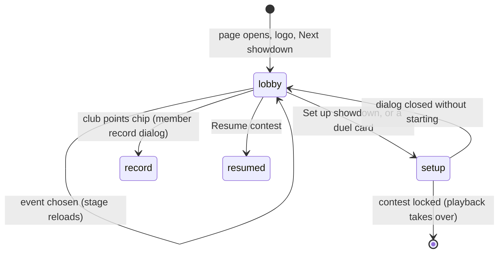

# The lobby

## Summary

The lobby is the Watch tab with no recording loaded, which is where the page opens. It is where the player chooses a sport, sees their standing, and starts setting up a contest. From top to bottom it shows:
- **The title** "BACKYARD SPORTS / 0N" over the selected event's name and **/ HEAD TO HEAD**.
- **The club points chip** on the right.
- **The resume banner**, when a contest is waiting.
- **The event dock** **CHOOSE YOUR EVENT** with four buttons: **01 Cornhole**, **02 Football**, **03 Beer pong**, **04 Basketball**.
- **The stage**, previewing the court with the two selected cards. The stage's sign reads the event's name over **CHOOSE A MATCHUP**, and each card's nameplate reads **READY** with a score of 0. The page also has a label, "THE SAME CREW. HIGHER STAKES." and "{N} {units} each / Fully automatic". It is hidden at every width, so only screen readers get it ([the stage](../foundations/stage.md#scaling)).
- **The side station** **ON THE CARD**, with the two duel cards labelled **THROWS FIRST** and **THROWS SECOND**, a note, **Set up showdown**, and a stamp such as "4 BAGS EACH / ~{S} SEC", where S is the estimated length in seconds.
- **The floor caption** under the stage, "GROSS POINTS. EQUAL ATTEMPTS. SETTLE IT ON THE COURT.", and a **House rules** link.

The lobby owns the event choice, the chip, the preview and the way into [the setup dialog](setup-dialog.md). The banner belongs to [resume a contest](resume-a-contest.md).

## The simple case

The page opens with **01 Cornhole** selected, showing **Cornhole / HEAD TO HEAD**. The chip reads "{N} CLUB POINTS" with "Doug · Rank {n} · 3 entries left". On a fresh save, the points are whatever Doug earned in the pre-played basketball fixture.

The player clicks **03 Beer pong**:
- the title changes
- the stage reloads the beer-pong table
- the sign reads **BEER PONG**
- the stamp updates

They press **Set up showdown**, and the setup dialog opens for Beer pong.

## The interaction, event by event

The action narrated here is choosing a matchup in the lobby, from arriving until the setup dialog takes over.

### Starting

The lobby appears when the page loads, when the logo is clicked, or after **Next showdown**. It reads this browser's save, then shows:
- **The chip** with your demo user's revealed club points and rank, and **entries left**. Entries left is the allowance, never more than 4, minus the counted entries already locked, whether or not revealed. It reads 0 while **Counted entries enabled** is off.
- **The resume banner**, if a contest is waiting.
- **The stage**, loading the selected event with the two selected cards.

"Your demo user" is whoever was last chosen in the setup dialog: Doug until then.

**Set up showdown** is disabled until the save has loaded. It stays disabled if the save cannot be read. In that case a box under the header, on every view, reads **This browser’s Arena save could not be read: {reason}**, with **Export unreadable save** and **Reset demo…** ([this browser's save](../foundations/saved-data.md)).

The Arena save is read on its own, so a character library that cannot be opened does not stop the lobby. A notice under the header then reads **Installed characters are unavailable because this browser’s character storage could not be opened. The built-in cards still work.** Watch works with Dan's and Doug's cards.

### Backing out at once

Choosing events, or opening and closing the setup dialog, saves nothing. The selected event survives tab switches but not a reload.

### Committing

The lobby itself commits nothing. It hands over to the setup dialog, whose **Start showdown** is the commit. While a counted entry is waiting to resume, that button reads **Start anyway** ([the setup dialog](setup-dialog.md#starting)).

### While committed

Not applicable: once a contest is locked, playback replaces the lobby.

### Resolving

The lobby is replaced by playback when a recording loads. The ways a recording loads are:
- **Start showdown**
- **Resume contest**
- **Replay** from History or a member record

## The club points chip

The chip shows:
- **{points} CLUB POINTS** for the current demo user
- "{name} · Rank {n} · {k} entries left"

Points and rank leave out the counted entry waiting to resume: a locked contest that has not yet been watched to the end. The one exception is while that same contest is loaded and complete. A replay of a contest that has already been revealed never hides its points. Entries left does not leave the waiting contest out. Clicking the chip opens that user's **Club member record** ([history and member record](../club/history-and-member-record.md)).

The chip follows whoever "you" are in the setup dialog. Switching **Your demo user** there to Sam makes the chip show Sam, even if the dialog is then closed without starting.

## Modifiers

| Modifier | Set at the start | Changed while committed |
| --- | --- | --- |
| Input device | Ordinary buttons. The event buttons show their pressed state to screen readers. | No effect. |
| Event and action combinations | The selected event sets the title, the preview court, the stage's sign, the stamp's count, unit and estimate, and which counted entry the setup dialog offers. | Not applicable. |
| Contest kind | The lobby does not show the mode. The duel cards show your card and the *exhibition* opponent card even when the setup dialog is on **Counted entry · points**, whose real opponent card is Doug. | Not applicable. |
| Character card | The duel cards and the stage preview use the cards chosen in the setup dialog: by default Dan's card first and Doug's second. An installed character appears once chosen. | Not applicable. |
| Presentation settings | Reduced motion and lower graphics change the preview. The clean spectator view hides everything but the stage, the error box and the unreadable-save box. It hides the resume banner and the character-library notice too. In the lobby that leaves no way to set up a contest until it is turned off. | Toggling rebuilds or restyles the preview at once. |
| Screen size and orientation | At 1000 px wide and below, **CHOOSE YOUR EVENT** is hidden. At 720 px and below, the side station moves under the stage. The stage keeps the court's 16:9 shape, so it is only about 208 px high in a 390 px phone window. | Reflows at once. |
| Saved state | The chip, the banner and **Set up showdown** depend on the save. A fresh save shows each user one counted entry used. With **Counted entries enabled** off, **entries left** reads 0. An unreadable save leaves **Set up showdown** disabled, and the box under the header explains it. A blocked character library leaves the lobby working with the built-in cards. | Another tab's write updates the chip and banner in place. The preview does not reload unless the two shown cards' mappings changed. |

## Cancel and interrupt

| Event | Before committing | While committed |
| --- | --- | --- |
| Escape or click outside | Closes an open dialog; the lobby is unchanged. | Not applicable. |
| Pause or resume | Not applicable: nothing plays in the lobby. The preview's characters idle continuously. | Not applicable. |
| Repeated or rapid input | Clicking event buttons quickly reloads the stage for each; only the last choice stays. | Not applicable. |
| A panel opens on top | The lobby stays underneath, unchanged. | Not applicable. |
| Navigating away | The selected event and setup choices are kept in memory. The stage is rebuilt on return. | Not applicable. |
| Forced finish | Not applicable. | Not applicable. |
| Focus leaves the game | No effect. | Not applicable. |
| Reload, close, or back/forward cache | The lobby reopens with Cornhole and default choices. The banner shows if a contest is waiting. | Not applicable. |
| Settings or saved data change underneath | A policy change updates the entries left. A reset updates the chip and removes the banner. Another tab's write updates both. None of these reloads the preview, unless the two shown cards' mappings changed. | Not applicable. |
| Graphics or storage failure | A preview that fails to load, or loses its graphics, shows the error box with **Reload the arena**. It rebuilds the preview and restarts its idle clock. Any other error in the box, such as a refused lock, shows **Dismiss** instead. Neither button changes **Lower graphics quality** ([the stage](../foundations/stage.md)). An unreadable save or a blocked character library is reported under the header instead, as in [Starting](#starting). | Not applicable. |
| Input device changes | Not applicable. | Not applicable. |

## Interactions with other systems

**Points and the ledger.** The chip shows revealed points and rank for the current demo user ([points and entries](../club/points-and-entries.md)).

**Saved data and recovery.** The lobby reads the save and writes nothing. The logo re-reads it. An unreadable save is reported in its own box under the header, which offers **Export unreadable save** and **Reset demo…** ([this browser's save](../foundations/saved-data.md)).

**Watch and Play separation.** The lobby's event choice does not affect Play's, and Play's does not affect the lobby's.

**Devices and players.** No interaction.

**Sound.** The stage's sound button is present in the lobby, but the preview makes no sound cues.

**Reduced motion and graphics quality.** Applied to the preview ([the stage](../foundations/stage.md)).

**Accessibility.**
- The event buttons use `aria-pressed`.
- The duel card buttons are labelled "Change competitor 1" and "Change competitor 2".
- The stage's box is labelled "The backyard arena"; the drawing inside it has its own label ([the stage](../foundations/stage.md#interactions-with-other-systems)).
- The chip is a button with its text as its name.
- The unreadable-save box is an alert. The character-library notice is a polite status.

**Installed characters.** Installing a character selects it as your card, so it appears as the first duel card and in the preview. If the character library cannot be opened, the lobby shows the notice under the header and works with the built-in cards.

**Multiple tabs.** Each tab has its own selection. The chip and banner follow the shared save. Another tab's writes do not reload this tab's preview unless they change the shown cards' mappings.

**Agent tools.** `configure_arena_event` selects an event in the lobby, as if its button had been clicked. From Standings or The collection it switches to Watch. It refuses while the Play tab is open, with "Leave Play before configuring a Watch contest.", and while a recording is loaded ([agent tools](../cross-cutting/agent-tools.md)).

## Edge cases

- **The duel cards' order and opponent card do not reflect a counted entry**; see [the setup dialog](setup-dialog.md#edge-cases).
- **The chip changes user** when **Your demo user** changes in the setup dialog, even if no contest is started.
- **The bottom bar in the lobby** shows placeholder text: **PEPPERONI CHEESERS** and **HOME COURT ADVANTAGE: NONE**.
- **The stamp's estimate** ("~{S} SEC") is based on Dan's and Doug's timing whatever cards are chosen.
- **Beer pong's stamp** reads "6 SHOTS EACH", matching the nameplates ([the four sports](the-four-sports.md)).

## Open questions and verification

- Read from `Game.tsx` (the lobby branch) and `app/globals.css`. Not yet checked on the production page.
- **The clean spectator view in the lobby.** In the lobby it hides **Set up showdown** and the event dock. It now also hides the resume banner (B-36). Whether it is meant to be available before a contest is still a product call.
- Fixed: **Restore arena** no longer toggles **Lower graphics quality** in the lobby. The error box offers **Reload the arena** or **Dismiss** (B-13).
- Fixed: an unreadable save and a blocked character library each have their own message under the header, and a blocked library no longer disables Watch (B-03, B-04).

Verified against Will-You-Be-My-Hero-Arena commit `364e3c1`
