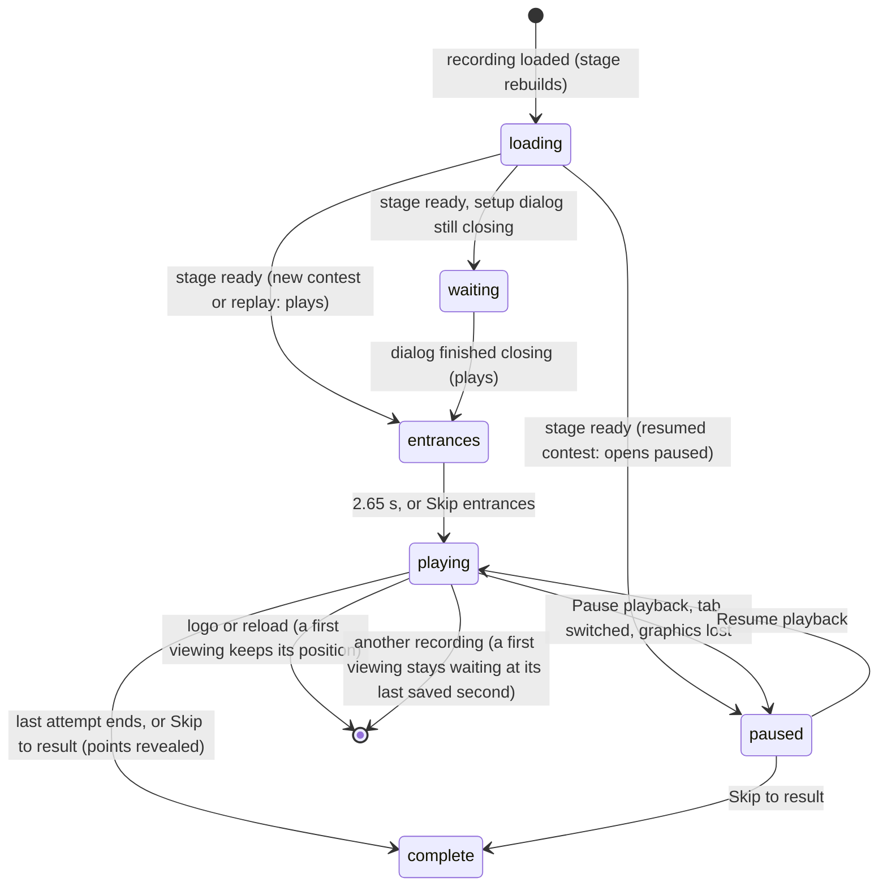

# Playback controls

## Summary

Playback is how a locked Watch contest is shown: the recording plays out on the stage from the entrances to the last attempt. The viewer can:
- pause it
- change its speed
- skip the entrances or skip straight to the result
- open the list of attempts so far
- turn sound on
- hide everything but the stage

None of these can change the result, which already exists ([contests and recordings](../foundations/contests-and-recordings.md)).

**When it appears.** Playback appears on the Watch tab whenever a recording is loaded, which happens:
- after **Start showdown**
- after **Replay** from History or a member record
- after **Resume contest**
- after **Replay same recording**

**What changes on the tab.** While a recording is loaded:
- the title reads **{EVENT} / LIVE**
- the event dock and the resume banner are hidden
- the side station is headed **THE MATCH CARD**
- the stage draws a nameplate for each card in its top corners

This document owns everything from the moment a recording is loaded until playback is complete. The result panel and what follows belong to [result and replay](result-and-replay.md).

## The simple case

After **Start showdown**, the stage rebuilds for the contest (**UNFOLDING THE ARENA…**). Then it begins:
1. **The entrances.** The bottom bar reads **CARDS TO COURT** and the narration says "The cards are opening. Make some room."
2. **The attempts.** After 2.65 seconds the attempts begin, alternating between the two cards. The nameplates in the stage's top corners show each card's revealed score and how many attempts are left, for example **2 BAGS LEFT**. The narration describes each throw as it happens and its result once it lands. The bottom bar counts **ROUND 1**, **ROUND 2** and so on, with **● LIVE** on the right, and the progress bar under the stage fills.
3. **The controls.** At the side, under the narration, are four buttons: pause, a speed button reading **1×** (named "Playback speed 1×"), skip to result, and attempt history. During the entrances a **Skip entrances** link appears under them.

When the last attempt ends, playback is complete and the result panel appears ([result and replay](result-and-replay.md)).

## The interaction, event by event

### Starting

A recording is loaded. At that instant:
- **The clock** is set to the recording's start (second 0), or, for **Resume contest**, to the saved second. Its end is the recording's full length, including a 2.6-second finale after the last attempt.
- **The speed** is reset to **1×**.
- **The stage rebuilds**, showing **UNFOLDING THE ARENA…**.
- **Whether it plays by itself** depends on how the recording arrived:

  | How it arrived | What happens |
  |---|---|
  | **Start showdown** | Plays once the stage is ready *and* the setup dialog has finished closing. If the dialog was closed during **Locking the contest…**, it plays once the stage is ready |
  | **Replay** from History or a member record | Plays once the stage is ready. This holds even for the recording already loaded, when the replay is started while another main tab, such as Standings, is showing: the clock waits for the Watch stage to rebuild. From the Watch tab, a replay of the loaded recording plays at once, like **Replay same recording** |
  | **Replay same recording** | Plays at once from second 0; the stage is not rebuilt |
  | **Resume contest** | Opens *paused* at the saved second; a contest saved at second 0 plays once the stage is ready ([resume a contest](resume-a-contest.md#edge-cases)) |

### Backing out at once

The viewer can leave before anything plays: the logo, a reload, another replay, or a tab switch. The contest stays locked, because that happened at **Start showdown**. What is kept depends on whether this is the contest's first viewing, which is the one [waiting to resume](resume-a-contest.md), or a replay of a contest already revealed:
- **The logo or a reload.** For a first viewing, the position is written (second 0 or wherever it was), so the lobby offers the contest on the resume banner. A replay writes nothing, and no banner appears for it.
- **Another replay**, from History or a member record, loads that recording instead. A first viewing stays waiting at its last written second, and its points stay hidden. The other recording is a replay, so it never takes the waiting slot.
- **A tab switch** pauses and keeps the recording loaded.

### Committing

Playback commits the moment the clock starts advancing. From then on, for a first viewing:
- **The position is written** to this browser's save every 2 seconds of playback.
- **The contest waits to resume.** It has been the one [waiting to resume](resume-a-contest.md) since it was locked. If the viewer leaves, the lobby offers it.
- **Counted-entry points stay hidden** until complete ([written and revealed](../foundations/contests-and-recordings.md#written-and-revealed)).

A replay of a contest that has already been revealed commits nothing. It never writes a position, never becomes the waiting contest, and never hides its points.

### While playing

**Pause playback / Resume playback.** The first button toggles the clock. Pausing stops the stage on its current frame, stops any sound that is playing, and shows **PAUSED** on the right of the bottom bar, in a heat-check round too. Resuming continues from the same moment.

**Speed.** The **1×** button cycles **1×** → **2×** → **0.5×** → **1×**. It changes how fast the clock runs, including the entrances and finale. The speed is not saved. It resets to 1× whenever a recording is loaded, replayed or resumed.

**Skip entrances.** Shown only during the first 2.65 seconds. It jumps to the start of the first attempt.

**Skip to result.** Jumps to the very end of the recording, past the finale. Playback becomes complete at once and any sound stops. For a first viewing, the waiting contest is cleared and saved at once, so the points appear immediately.

**Attempt history.** Opens **The contest, as it happened**. It lists every attempt that has *landed* so far, numbered, with:
- the card
- what it hit, for example "hole", "board" or "rim out"
- the commentary
- the points it scored

The points are signed: "+3", "+1", "+0", or "−1" for a cornhole bag that lowered its thrower's score. A card that is no longer installed is named **Unknown card**. Before the first landing it reads "The first attempt has not landed yet." Its **Export immutable recording** link downloads the whole recording as JSON, including attempts not yet shown. Playback keeps running behind the dialog.

**Sound.** The speaker button at the bottom right of the stage, just above the bottom bar, labelled "Enable sound" or "Mute sound", turns Watch sound on or off. It starts off. The footer's **Sound on/off** mirrors it. See [sound](../cross-cutting/sound.md).

**Clean spectator view.** The button beside it hides the rest of the page and lets the stage take the page's full width:
- the header and tabs
- the title
- the event dock
- the side station, with its narration and playback controls
- the floor caption, with **House rules**
- the footer

The progress bar, the error box and, when complete, the result panel stay. (In the lobby the clean view also hides the resume banner.) The same button brings everything back. While a recording is playing, the clean view adds a pause button to the stage's own controls, between the sound and clean-view buttons, named "Pause playback" or "Resume playback". It works like the side station's. The viewer cannot change speed, skip or open attempt history until they leave the clean view. At completion the extra pause button goes, like the others.

**What the stage shows.**

| Where | During the entrances | During the attempts | When complete |
|---|---|---|---|
| Nameplates, drawn on the stage | Each card's first name, revealed score, pips for attempts left, and a status such as **4 BAGS LEFT · WAITING** | The same; the thrower's status names what they are doing | The same |
| Sign, drawn on the stage | The event's name and **CARDS TO COURT** | The event's name and the current phase | The event's name and the final phase |
| Bottom bar, left | **CARDS TO COURT** | **ROUND n** | **FINAL SCORE** |
| Bottom bar, right | **● LIVE** or **PAUSED** | **● LIVE** or **PAUSED**; during a heat-check attempt, **HEAT CHECK / COSMETIC** unless paused | **FULL TIME** |

The page also has its own scoreboard, a region named "Live score". It shows each card's revealed score, "n/N {unit}", and **COUNTED ENTRY** or **EXHIBITION / NO POINTS**. N counts the regulation attempts until the first extra pair begins ([the four sports](the-four-sports.md#traits-strategy-heat-check-and-ties)). The scoreboard cannot be seen at any width, which the verification pass confirmed at desktop widths ([the stage](../foundations/stage.md#scaling)). Screen readers still read it, but a sighted viewer is never told on the stage whether the contest counts. Only the side station's note and the floor caption say so.

The floor caption under the stage reads "COLLECTIONS: {user} / {user} / {mode}", for example "COLLECTIONS: Doug / Dan / Counted entry" or "… / Exhibition". The side station's note reads "Points post once. Replay as often as you like." for a counted entry, and "EXHIBITION / NO LEADERBOARD POINTS" for an exhibition.

### Resolving

When the clock passes the end of the last attempt, playback is complete. It gets there by watching or by **Skip to result**. Then:
- **The waiting contest is cleared.** For a first viewing, the save stops listing it as waiting at once, not on the next 2-second write, so its points appear immediately.
- **The title** becomes **{EVENT} / FINAL**.
- **The controls.** All the playback buttons except **Attempt history** disappear, and so does the side station's note.
- **The narration** announces the winning demo user and the card they played, for example "Doug takes it with Dan Weidensaul’s card.", or "Honors shared. The rivalry continues."
- **The result panel** appears below. From here [result and replay](result-and-replay.md) takes over.

The finale keeps animating for about 2.6 seconds after completion, unless the viewer skipped to the result.

## Modifiers

| Modifier | Set at the start | Changed while committed |
| --- | --- | --- |
| Input device | Mouse, touch or keyboard on ordinary buttons. There are no keyboard shortcuts: Space does not pause and the arrow keys do not seek. | No effect. |
| Event and action combinations | The sport sets the units, the number of attempts and what the stage shows ([the four sports](the-four-sports.md)). | Not applicable: a recording's sport is fixed. |
| Contest kind | Counted entry: the page's hidden scoreboard says **COUNTED ENTRY**, and the visible side station's note reads "Points post once. Replay as often as you like." Exhibition: **EXHIBITION / NO POINTS**. A replay of a revealed recording looks the same as its first showing, but never writes a position or hides its points. | Not applicable. |
| Character card | Each card's personality sets its entrance, rituals, timing and reactions, so recordings with different cards run for different lengths. | Not applicable. |
| Presentation settings | Reduced motion removes contact effects and camera punch and shake, and calms the characters' clips. Lower graphics quality removes the same effects and rebuilds the stage. Sound starts off. The clean spectator view hides the side station's controls and keeps only a pause button on the stage. | Toggling Reduced motion applies at once. Toggling Lower graphics quality rebuilds the stage, and playback carries on from the same moment once it is ready. Sound and the clean view toggle at once. |
| Screen size and orientation | The stage rescales, keeping the court's 16:9 shape. The page's own scoreboard stays hidden on narrow screens too. | Rescales at once; playback is not interrupted. |
| Saved state | A resumed contest opens paused at its saved second. | Another tab writing the save does not interrupt playback, and does not rebuild the stage unless the two cards' mappings changed. |

## Cancel and interrupt

| Event | Before committing | While committed |
| --- | --- | --- |
| Escape or click outside | No effect; Watch has no keyboard shortcuts. | Closes **The contest, as it happened**, or any other open dialog. Playback is not affected. |
| Pause or resume | The pause button is available as soon as the recording is loaded. While the stage is still loading, it offers **Resume playback**. Pressing it starts the clock at once, before the stage is drawn, so the start of the entrances may be missed. | Pauses or resumes the clock and stops any sound. The result is unchanged. |
| Repeated or rapid input | Not applicable. | Each speed click moves one step round the cycle. **Skip to result** pressed again after completion does nothing new. The pause button toggles each time. |
| A panel opens on top | Loading carries on. | Playback keeps running behind the dialog: attempt history, House rules, Arena settings or History. |
| Navigating away | Switching tab keeps the recording. For a first viewing, the logo writes the position at second 0. Another recording leaves a first viewing waiting, and does not take the waiting slot itself. | Switching tab pauses and stops sound. Returning shows the contest paused where it was, after the stage rebuilds. For a first viewing, the logo writes the position, and the contest then waits to resume; a replay is simply left. A replay from History leaves a first viewing waiting at its last written second, with its points still hidden. |
| Forced finish | **Skip to result** works even before playback starts. | **Skip entrances** jumps to the first attempt. **Skip to result** jumps to the end, clears the waiting contest at once and reveals the points. |
| Focus leaves the game | Not applicable. | Hiding the browser tab stops the clock. Nothing says **PAUSED**, and sound is not stopped. Playback carries on by itself when the tab is visible again. Losing window focus without hiding the tab has no effect. |
| Reload, close, or back/forward cache | A first viewing is kept, waiting to resume at second 0. A replay leaves nothing behind. | For a first viewing, the position is written as the page goes away. The lobby then offers **Resume contest**, which opens paused at that second. A replay writes nothing. |
| Settings or saved data change underneath | **Reset demo** in this tab unloads the recording. | **Reset demo** in this tab stops playback, unloads the recording and returns to the empty lobby. If the reset fails, the reset dialog shows **The demo could not be reset: {reason}**, and playback is not stopped. Another tab's reset leaves this tab's playback running. The recording still exists in memory, but is gone from the save. |
| Graphics or storage failure | A stage that fails to load shows the error box with **Reload the arena**, which rebuilds the stage. | A lost graphics context pauses playback, and the pause button shows **Resume playback**. The error box reads **Graphics were interrupted. Reload to continue; nothing about the contest has changed.** with **Reload the arena**. It rebuilds the stage at the same second, still paused, and the viewer presses **Resume playback** to continue. It never changes **Lower graphics quality**. If writing the position fails, the error box reads **Playback could not be saved. Keep this tab open and export your recording.** with **Dismiss**, and playback continues. |
| Input device changes | Not applicable. | Not applicable. |

> Technical note: the playback clock never moves more than 0.1 s × the speed in one frame. A stalled frame, or a return from a hidden tab, resumes smoothly instead of jumping ahead.

## Interactions with other systems

**Points and the ledger.** On a first viewing, a counted entry's points are hidden from the chip, Standings, member records and History until playback is complete. **Skip to result** reveals them at once ([written and revealed](../foundations/contests-and-recordings.md#written-and-revealed)). A replay of a revealed contest never hides them.

**Saved data and recovery.** Only the contest waiting to resume keeps a position. For it, the position is written every 2 seconds of playback, when leaving by the logo, and when the page goes away. It is cleared, and saved at once, at completion ([resume a contest](resume-a-contest.md)). A replay of a revealed contest never writes one.

**Watch and Play separation.** Watch playback never reads input devices, and pausing Watch has nothing to do with pausing Play.

**Devices and players.** No interaction.

**Sound.** The stage's speaker button; off by default ([sound](../cross-cutting/sound.md)).

**Reduced motion and graphics quality.** See [the stage](../foundations/stage.md).

**Accessibility.**
- **The narration** is a polite live region, so screen readers hear each attempt and result as it happens.
- **The progress bar** is a `progressbar` labelled "Contest playback", with a percentage.
- **The playback buttons** have labels: "Pause playback" or "Resume playback", "Playback speed {value}×" (for example "Playback speed 1×"), "Skip to result" and "Attempt history". After a graphics loss, the pause button's label matches the stopped clock.
- **The scoreboard** is a region named "Live score".

See [accessibility](../cross-cutting/accessibility.md).

**Installed characters.** They play back like built-in cards, using their pack's personality.

**Multiple tabs.** Each tab plays its own copy. Two tabs playing the same first viewing both write its position; the last write wins. When one tab completes it, the waiting slot is cleared. The other tab then stops writing, and reveals the points as soon as it re-reads the save, even mid-playback. Replays in either tab write nothing.

**Agent tools.** `read_arena` returns the *revealed* score and whether playback is complete. `configure_arena_event` refuses while a recording is loaded, and while the Play tab is open.

## Edge cases

- **There is no seek.** The progress bar cannot be dragged, and there is no rewind other than **Replay same recording** after completion.
- **A heat-check round.** An exhibition with **Heat check · cosmetic round label** shows **HEAT CHECK / COSMETIC** in the bottom bar during round three's attempts, instead of **● LIVE**. Pausing shows **PAUSED** instead; the label returns on resume.
- **Skipping past the finale.** **Skip to result** jumps past the finale, so the winner's victory animation is skipped. Watching to the end shows it.
- **Pausing during the finale** is only possible by switching tab: at completion the pause button disappears with the other playback buttons, and the result panel is already showing.
- **Speed and the progress bar.** At 2× speed a first viewing's position is still written every 2 seconds of *playback* time, so about once a second in real time.
- **Duel cards.** The duel cards in the side station are disabled during playback, so the setup dialog cannot be opened.

## Open questions and verification

- Read from `Game.tsx` (`replay`, `pause`, `skip`, `navigate`, the clock subscription), `lib/arena/clock.ts`, `simulation.ts`, `MatchNarration.ts`, `ArenaGame.ts` and `app/globals.css`. Not yet checked on the production page. `scripts/production-smoke.mjs` covers pause, sound, replay, **Resume contest** and skip on the production page, so those are the likeliest to be right.
- Fixed: after a lost graphics context the pause button shows **Resume playback**, so the first press resumes (B-14). The error box's button is now **Reload the arena** for a stage failure and **Dismiss** for anything else (B-13).
- Fixed: replaying another recording no longer takes over the waiting slot or reveals a first viewing's points (B-01, B-05).
- **Sound on a hidden tab.** Whether sound keeps playing tones while the tab is hidden has not been tried. The clock stops, so no *new* cues should fire.
- **Resume playback while loading.** Whether the clock really advances while the stage is still loading depends on which part of the page is driving the clock at that moment. This has not been tried.
- Fixed: the clean spectator view keeps a pause button on the stage while a recording plays (B-36). It still offers no speed, skip or attempt history; whether it should is a product call.

Verified against Will-You-Be-My-Hero-Arena commit `364e3c1`
