# Result and replay

## Summary

The result panel is what a Watch contest ends on. It appears below the stage the moment playback is *complete*, when the last attempt ends or the viewer presses **Skip to result**. It shows:
- the winning demo user and the card they played, or **HONORS SHARED.**
- the final score
- what each demo user gained

From here the viewer can go back to the lobby with **Next showdown**, or watch the same recording again with **Replay same recording**. For a counted entry's first viewing this is also the moment its points are *revealed* everywhere on the page ([written and revealed](../foundations/contests-and-recordings.md#written-and-revealed)). Once revealed, they stay revealed, through any number of replays.

This document owns the complete state and the replay that starts from it. Replays started from History or a member record are owned by [history and member record](../club/history-and-member-record.md). They play the same way.

## The simple case

Demo user Doug, playing the Dan card, beats demo user Dan, playing the Doug card, 7–4 in a counted cornhole entry. As the last bag settles:
- **The title** changes to **CORNHOLE / FINAL**, and the bottom bar reads **FINAL SCORE** and **FULL TIME**.
- **The narration** says "Doug takes it with Dan Weidensaul’s card."
- **The result panel**, dark, slides in below the stage with:
  - **COUNTED RESULT / POINTS POSTED**
  - **DOUG WINS.**, with "with Dan Weidensaul’s card" under it
  - **7 — 4 Cornhole**
  - one column per demo user, for example "Doug **+3 PTS**", "9 total / Rank 1 (was 2)"
- **The chip.** The club points chip above the stage now includes the new points.

The viewer presses **Next showdown** to return to an empty lobby, or **Replay same recording** to watch it again from the start.

## The interaction, event by event

```mermaid
stateDiagram-v2
    [*] --> complete : last attempt ends, or Skip to result (points revealed, waiting contest cleared)
    complete --> lobby : Next showdown (recording unloaded)
    complete --> replaying : Replay same recording (from second 0, 1×; points stay shown)
    replaying --> complete : last attempt ends, or Skip to result
    replaying --> [*] : logo, reload, another recording (nothing written; points stay shown)
    complete --> [*] : tab switch, logo, reload (nothing more to keep)
```

### Starting

Playback becomes complete when the clock reaches the end of the last attempt. At that instant:
- **The waiting contest is cleared.** If this was the contest's first viewing, the save stops listing it as waiting to resume. This is saved at once, whether the viewer watched to the end or pressed **Skip to result**.
- **The contest's points are revealed** in the club points chip, Standings, member records and History, immediately. A replay's points were never hidden.
- **The result panel appears**, and the playback buttons other than **Attempt history** disappear.
- **The finale.** A winner's finale keeps animating for about 2.6 seconds unless the viewer skipped.

The result panel shows:

| Part | Counted entry | Exhibition |
|---|---|---|
| Eyebrow | **COUNTED RESULT / POINTS POSTED** | **EXHIBITION / NO LEADERBOARD POINTS** |
| Headline | The winning demo user in capitals, for example **DOUG WINS.**, with a line under it naming the card they played in full: "with Dan Weidensaul’s card". A draw reads **HONORS SHARED.**, with no card line | The same |
| Score | "{score} — {score} {event}", adding " / Unresolved draw after three extra pairs" when extra pairs ran out | The same |
| Each user | Name, **+{points} PTS** from the policy the contest was locked under, "{total} total / Rank {n}", and "(was {n})" when the rank changed | Name, **+0 PTS**, "{total} total / Rank {n}" |

The headline names the same demo user that the points go to. The card line says which card won. So when both users play the same card, for example counted Doug against Doug, the headline still says which user won.

### Backing out at once

Leaving right away keeps everything as it is. That includes switching tab, the logo, or a reload. The contest is finished and its points stay revealed.

### Committing

Nothing new is committed here. The points were written when the contest was locked; the result panel only reveals them.

**Replay same recording** commits a replay: the same recording starts again from second 0 at **1×**, playing at once without rebuilding the stage. The result panel disappears until the replay completes. The contest stays revealed: its points stay in the chip, Standings, member records and History, and the replay never writes a position or becomes the contest waiting to resume. See [edge cases](#edge-cases).

### While committed

During a replay, every control in [playback controls](playback-controls.md) works as it did the first time. The replay shows exactly the same attempts, because it is the same recording.

### Resolving

- **Next showdown** stops sound, unloads the recording, re-reads this browser's save, and shows the lobby. It writes no position, because completion already cleared the waiting contest. The setup choices are kept for the next **Set up showdown**.
- **A replay that reaches its end** comes back to this same result panel.

## Modifiers

| Modifier | Set at the start | Changed while committed |
| --- | --- | --- |
| Input device | Buttons only; no keyboard shortcuts. | No effect. |
| Event and action combinations | The score line names the event. Units are not shown on the result panel. | Not applicable. |
| Contest kind | See the table above. A counted entry shows the policy's points and the rank change. An exhibition shows **+0 PTS**. | A replay of either kind awards nothing new, and never hides the points. |
| Character card | The headline names the winning user. The line under it names the winning card's full name. | Not applicable. |
| Presentation settings | Reduced motion and lower graphics change the finale's effects only. In the clean spectator view the result panel stays visible under the full-window stage. | No effect on the result panel. |
| Screen size and orientation | At 1150 px and below, the result panel's buttons move under the scores. | Reflows at once. |
| Saved state | Totals and ranks are computed from the whole revealed ledger. "(was {n})" compares against the ledger without this contest. | Another tab's write updates the totals and ranks in place. |

## Cancel and interrupt

| Event | Before committing | While committed |
| --- | --- | --- |
| Escape or click outside | No effect on the result panel. | Closes an open dialog; a replay keeps playing. |
| Pause or resume | Not applicable: only **Attempt history** remains at completion. | During a replay the pause button is back and works normally. |
| Repeated or rapid input | **Replay same recording** pressed repeatedly restarts from second 0 each time. **Next showdown** can be pressed only once, because the result panel goes away. | The same. |
| A panel opens on top | The result panel stays underneath. | The replay keeps playing behind the dialog. |
| Navigating away | Switching tab and back shows the result panel again after the stage rebuilds. The logo returns to the lobby, like **Next showdown**. **Replay** of this recording from History or a member record, while another main tab is showing, waits for the Watch stage to be ready before playing. | Mid-replay, switching tab pauses the replay. The logo returns to the lobby and writes nothing: no resume banner appears for the replay, and its points stay shown. Another recording simply replaces the replay. |
| Forced finish | Not applicable. | **Skip to result** ends the replay at once and brings the result panel back. |
| Focus leaves the game | No effect. | Hiding the tab stops the replay's clock until it is visible again. |
| Reload, close, or back/forward cache | After completion there is nothing to resume; the page reopens on the lobby. | Mid-replay, nothing is written. The page reopens on the lobby with no resume banner for this contest. |
| Settings or saved data change underneath | **Reset demo** unloads the recording and removes the contest and its points. If the reset fails, the reset dialog shows **The demo could not be reset: {reason}**, and the result panel stays. | The same; a failed reset does not stop the replay. |
| Graphics or storage failure | A lost graphics context pauses the finale and shows the error box with **Reload the arena**; the result panel stays. The bottom bar then reads **PAUSED** rather than **FULL TIME**. **Reload the arena** rebuilds the stage at the same second, still paused, and at completion there is no pause button to resume the rest of the finale. | During a replay, the same as in [playback controls](playback-controls.md). |
| Input device changes | Not applicable. | Not applicable. |

## Interactions with other systems

**Points and the ledger.** The result panel's **+N PTS** comes from the policy saved with the contest, so a later policy change never alters it. Totals and ranks come from the revealed ledger ([points and entries](../club/points-and-entries.md)).

**Saved data and recovery.** Completing a first viewing clears the waiting contest, saved at once. A replay never sets it ([resume a contest](resume-a-contest.md)).

**Watch and Play separation.** Play's own result screen is separate and never shows points ([the match shell](../play/match-shell.md)).

**Devices and players.** No interaction.

**Sound.** With Watch sound on, a decided contest's finale plays a victory fanfare; a draw has none ([the four sports](the-four-sports.md#scoring-and-reaction)). **Next showdown** stops any sound.

**Reduced motion and graphics quality.** They affect the finale only.

**Accessibility.** The headline is a heading, and the narration announces the winning user and card. The rank change is text. The result panel is not announced as a live region by itself.

**Installed characters.** An installed winning card's full name appears in the line under the headline and in the narration.

**Multiple tabs.** Another tab hides the points while the contest is the save's waiting one. It reveals them when this tab's completion clears the waiting slot. That write happens at completion, so both tabs reveal at about the same moment.

**Agent tools.** `read_arena` reports `complete: true` and the final revealed score.

## Edge cases

- **Replays keep the points shown.** **Replay same recording** on a counted entry leaves the chip, Standings, member records and History unchanged while the replay runs. Leaving mid-replay leaves no resume banner.
- **A draw** shows **HONORS SHARED.** and gives each user the draw points: 1 by default.
- **An unresolved draw** after three extra pairs is still a draw for points.
- **"(was {n})"** appears only for counted entries, and only when the user's rank actually changed.
- **A counted entry played before a policy change** keeps its original points on the result panel, but rank and totals always use today's full ledger.

## Open questions and verification

- Read from `Game.tsx` (the result panel, `backToLobby`, `replay`) and `persistence.ts` (`awardsFor`, `standings`, `savePlayback`). `scripts/production-smoke.mjs` replays and skips on the production page, but does not check the points display.
- Fixed: a replay no longer hides a revealed contest's points, and an abandoned replay no longer leaves a resume banner (B-01).
- Fixed: the headline names the winning user, with the card on the line under it (B-02).
- **Graphics loss during the finale.** After **Reload the arena** at completion, the stage stays paused with **PAUSED** in the bottom bar, and no control resumes the rest of the finale. This is read from `Game.tsx` (`retryStage` and the bottom bar), not tried. Whether the finale should resume by itself is a product call.

Verified against Will-You-Be-My-Hero-Arena commit `364e3c1`
