# Result and replay

## Summary

The result panel is what a Watch contest ends on. It appears below the stage the moment playback is *complete*, when the last attempt ends or the viewer presses **Skip to result**. It shows:
- the winning card, or **HONORS SHARED.**
- the final score
- what each demo user gained

From here the viewer can go back to the lobby with **Next showdown**, or watch the same recording again with **Replay same recording**. For a counted entry this is also the moment its points are *revealed* everywhere on the page ([written and revealed](../foundations/contests-and-recordings.md#written-and-revealed)).

This document owns the complete state and the replay that starts from it. Replays started from History or a member record are owned by [history and member record](../club/history-and-member-record.md). They play the same way.

## The simple case

Doug's card beats Dan's 7–4 in a counted cornhole entry. As the last bag settles:
- **The title** changes to **CORNHOLE / FINAL**, and the bottom bar reads **FINAL SCORE** and **FULL TIME**.
- **The narration** says "Doug Weidensaul takes it."
- **The result panel**, dark, slides in below the stage with:
  - **COUNTED RESULT / POINTS POSTED**
  - **Doug WINS.**
  - **7 — 4 Cornhole**
  - one column per demo user, for example "Doug **+3 PTS**", "9 total / Rank 1 (was 2)"
- **The chip.** The club points chip above the stage now includes the new points.

The viewer presses **Next showdown** to return to an empty lobby, or **Replay same recording** to watch it again from the start.

## The interaction, event by event

```mermaid
stateDiagram-v2
    [*] --> complete : last attempt ends, or Skip to result (points revealed, position cleared)
    complete --> lobby : Next showdown (recording unloaded)
    complete --> replaying : Replay same recording (from second 0, 1×)
    replaying --> complete : last attempt ends, or Skip to result
    replaying --> waiting : logo, reload (position kept; points hidden again)
    replaying --> [*] : another recording (position not written; its points shown again)
    complete --> [*] : tab switch, logo, reload (nothing more to keep)
```

### Starting

Playback becomes complete when the clock reaches the end of the last attempt. At that instant:
- **The position is cleared**, so the contest is no longer waiting to resume. This happens with the next position write, or at once for **Skip to result**.
- **The contest's points are revealed** in the club points chip, Standings, member records and History.
- **The result panel appears**, and the playback buttons other than **Attempt history** disappear.
- **The finale.** A winner's finale keeps animating for about 2.6 seconds unless the viewer skipped.

The result panel shows:

| Part | Counted entry | Exhibition |
|---|---|---|
| Eyebrow | **COUNTED RESULT / POINTS POSTED** | **EXHIBITION / NO LEADERBOARD POINTS** |
| Headline | "{card's first name} WINS.", or **HONORS SHARED.** for a draw | The same |
| Score | "{score} — {score} {event}", adding " / Unresolved draw after three extra pairs" when extra pairs ran out | The same |
| Each user | Name, **+{points} PTS** from the policy the contest was locked under, "{total} total / Rank {n}", and "(was {n})" when the rank changed | Name, **+0 PTS**, "{total} total / Rank {n}" |

The headline names the winning *card*, while the columns name the demo *users*. When both users play the same card, for example counted Doug against Doug, the headline does not say which user won.

### Backing out at once

Leaving right away keeps everything as it is. That includes switching tab, the logo, or a reload. The contest is finished and its points stay revealed.

### Committing

Nothing new is committed here. The points were written when the contest was locked; the result panel only reveals them.

**Replay same recording** commits a replay: the same recording starts again from second 0 at **1×**, playing at once without rebuilding the stage. From that moment the page treats it as unfinished again. The result panel disappears, and the contest's points are hidden until the replay completes. See [edge cases](#edge-cases).

### While committed

During a replay, every control in [playback controls](playback-controls.md) works as it did the first time. The replay shows exactly the same attempts, because it is the same recording.

### Resolving

- **Next showdown** stops sound, writes the final position, which clears the waiting contest, unloads the recording, re-reads this browser's save, and shows the lobby. The setup choices are kept for the next **Set up showdown**.
- **A replay that reaches its end** comes back to this same result panel.

## Modifiers

| Modifier | Set at the start | Changed while committed |
| --- | --- | --- |
| Input device | Buttons only; no keyboard shortcuts. | No effect. |
| Event and action combinations | The score line names the event. Units are not shown on the result panel. | Not applicable. |
| Contest kind | See the table above. A counted entry shows the policy's points and the rank change. An exhibition shows **+0 PTS**. | A replay of either kind awards nothing new. |
| Character card | The headline uses the winning card's first name. | Not applicable. |
| Presentation settings | Reduced motion and lower graphics change the finale's effects only. In the clean spectator view the result panel stays visible under the full-window stage. | No effect on the result panel. |
| Screen size and orientation | At 1150 px and below, the result panel's buttons move under the scores. | Reflows at once. |
| Saved state | Totals and ranks are computed from the whole revealed ledger. "(was {n})" compares against the ledger without this contest. | Another tab's write updates the totals and ranks in place. |

## Cancel and interrupt

| Event | Before committing | While committed |
| --- | --- | --- |
| Escape or click outside | No effect on the result panel. | Closes an open dialog; a replay keeps playing. |
| Pause or resume | Not applicable: only **Attempt history** remains at completion. | During a replay the pause button is back and works normally. |
| Repeated or rapid input | **Replay same recording** pressed repeatedly restarts from second 0 each time. **Next showdown** can be pressed only once, because the result panel goes away. | The same. |
| A panel opens on top | The result panel stays underneath. | The replay keeps playing behind the dialog. |
| Navigating away | Switching tab and back shows the result panel again after the stage rebuilds. The logo returns to the lobby, like **Next showdown**. | Mid-replay, switching tab pauses the replay. The logo leaves it *waiting to resume*, with its points hidden again. Another recording takes over the waiting slot instead, so this contest's points are shown again. |
| Forced finish | Not applicable. | **Skip to result** ends the replay at once and brings the result panel back. |
| Focus leaves the game | No effect. | Hiding the tab stops the replay's clock until it is visible again. |
| Reload, close, or back/forward cache | After completion there is nothing to resume; the page reopens on the lobby. | Mid-replay, the position is written. The lobby then shows the resume banner "Your result is waiting." for a contest that already finished. |
| Settings or saved data change underneath | **Reset demo** unloads the recording and removes the contest and its points. | The same. |
| Graphics or storage failure | A lost graphics context pauses the finale and shows the error box; the result panel stays. | During a replay, the same as in [playback controls](playback-controls.md). |
| Input device changes | Not applicable. | Not applicable. |

## Interactions with other systems

**Points and the ledger.** The result panel's **+N PTS** comes from the policy saved with the contest, so a later policy change never alters it. Totals and ranks come from the revealed ledger ([points and entries](../club/points-and-entries.md)).

**Saved data and recovery.** Completion clears the waiting contest. A replay sets it again ([resume a contest](resume-a-contest.md)).

**Watch and Play separation.** Play's own result screen is separate and never shows points ([the match shell](../play/match-shell.md)).

**Devices and players.** No interaction.

**Sound.** With Watch sound on, a decided contest's finale plays a victory fanfare; a draw has none ([the four sports](the-four-sports.md#scoring-and-reaction)). **Next showdown** stops any sound.

**Reduced motion and graphics quality.** They affect the finale only.

**Accessibility.** The headline is a heading, and the narration announces the winner. The rank change is text. The result panel is not announced as a live region by itself.

**Installed characters.** An installed winning card's first name is used in the headline.

**Multiple tabs.** Another tab with nothing loaded hides the points while the contest is the save's waiting one. It reveals them when this tab's completion clears the waiting slot, so both tabs reveal at about the same moment.

**Agent tools.** `read_arena` reports `complete: true` and the final revealed score.

## Edge cases

- **Replays hide revealed points again.** **Replay same recording** on a counted entry makes the page hide that contest's points while the replay runs: the chip drops back and Standings lose the points. If the viewer then leaves mid-replay, the lobby offers **Resume contest** with "Your result is waiting." for a result already seen, and the points stay hidden until the replay is finished or skipped.
- **A draw** shows **HONORS SHARED.** and gives each user the draw points: 1 by default.
- **An unresolved draw** after three extra pairs is still a draw for points.
- **"(was {n})"** appears only for counted entries, and only when the user's rank actually changed.
- **A counted entry played before a policy change** keeps its original points on the result panel, but rank and totals always use today's full ledger.

## Open questions and verification

- Read from `Game.tsx` (the result panel, `backToLobby`, `replay`) and `persistence.ts` (`awardsFor`, `standings`, `savePlayback`). `scripts/production-smoke.mjs` replays and skips on the production page, but does not check the points display.
- **Replays hiding points.** Hiding a finished contest's points during a replay, and the resume banner that follows an abandoned replay, look like a bug.
- **Headline names the card, not the user.** A counted Doug-against-Doug match's headline cannot tell the users apart. This is a product call.

Verified against Will-You-Be-My-Hero-Arena commit `3b4ec62`
