# Resume a contest

## Summary

Resuming lets a viewer come back to a Watch contest they left before its first viewing finished, and pick up from where they were. This browser's save remembers one *contest waiting to resume*: its recording and the second of playback reached. Only a first viewing waits. A newly locked contest, counted or exhibition, is the waiting one from second 0 until it has been watched to the end or skipped. A replay of a contest already revealed never waits.

While a contest is waiting, the Watch lobby shows the *resume banner* above the event dock. For a counted entry it reads:

> Saved at N seconds. Your result is waiting. **Resume contest**

For an exhibition it reads:

> Exhibition saved at N seconds. **Resume contest**

"1 second" is singular. **Resume contest** loads that recording at the saved second, paused unless that second is 0.

This document owns the waiting state and the banner, from the moment a contest is locked until it is resumed and finished, or replaced.

## The simple case

A viewer starts a counted Football entry, watches 40 seconds and closes the tab. The next day they open the Arena:
1. The Watch lobby shows the banner "Saved at 39 seconds. Your result is waiting." The saved second is whatever was last written, so it can trail slightly.
2. The chip does not yet include that contest's points.
3. They press **Resume contest**. The stage rebuilds for the recording and shows the moment they left, paused.
4. They press **Resume playback** and it continues.

## The interaction, event by event

```mermaid
stateDiagram-v2
    [*] --> watching : contest locked (waiting at second 0)
    watching --> waiting : logo, reload, close (position written)
    watching --> waiting : a replay of another recording (last written second kept)
    waiting --> resumed : Resume contest (at the saved second; paused unless it is 0)
    resumed --> watching : Resume playback
    waiting --> replaced : another contest locked (Start anyway for a counted entry)
    watching --> finished : complete, or Skip to result (waiting cleared at once)
    replaced --> [*]
    finished --> [*]
```

### Starting

A contest becomes the one waiting to resume as soon as it is locked, at second 0, whether it is a counted entry or an exhibition. While it is loaded, its saved second is updated:
- **Every 2 seconds of playback.**
- **When the viewer clicks the logo.**
- **When the page goes away**, whether by reload, closing the tab or navigating off the page.

No other recording writes a position. Replaying something else from History or a member record does *not* touch the waiting slot. The waiting contest keeps its last written second, its points stay hidden, and the banner returns in the lobby.

The saved second never goes past the recording's end. As soon as the waiting contest reaches the end of its last attempt, by watching or by **Skip to result**, the waiting slot is cleared and saved at once.

### Backing out at once

The banner can be ignored. The viewer can replay other contests from History or a member record, and the waiting contest stays waiting.

The viewer can also set up and lock a different contest. The new contest then becomes the waiting one and replaces the old one. If the old one was a counted entry, its points are revealed without it being played. So the setup dialog warns first: **A counted entry is waiting. Starting this showdown reveals its result without playing it.**, and its button reads **Start anyway** ([the setup dialog](setup-dialog.md#starting)). A waiting exhibition is replaced without a warning.

### Committing

**Resume contest** commits. It loads the recording with the clock at the saved second, paused, and at **1×**. A contest saved at second 0 is the exception: it plays by itself once the stage is ready (see [edge cases](#edge-cases)). The stage rebuilds, and the banner and event dock disappear.

If the recording uses a character that is no longer installed, the banner adds " This recording uses a character that is no longer installed." and **Resume contest** is disabled.

### While committed

The contest is an ordinary loaded recording; see [playback controls](playback-controls.md). It keeps writing its position every 2 seconds of playback.

### Resolving

When playback completes, the waiting contest is cleared at once and the points are revealed immediately ([result and replay](result-and-replay.md)).

## What "waiting" hides

While a contest is waiting to resume, the page hides its recording and awards:
- its points are left out of the club points chip, Standings, member records and `read_arena`'s leaderboard
- the contest is left out of History and the member record's list

The one exception is while that same contest is loaded and complete. This is the only filter: a replay of a contest that has already been revealed never hides its points.

The chip's **entries left** already counts it ([written and revealed](../foundations/contests-and-recordings.md#written-and-revealed)). A waiting exhibition has no points to hide, but it is still left out of History. Exports are not filtered: they contain the whole stored save.

## Modifiers

| Modifier | Set at the start | Changed while committed |
| --- | --- | --- |
| Input device | The banner's **Resume contest** is an ordinary button. | No effect. |
| Event and action combinations | The resumed recording's sport replaces the lobby's selected event. | Not applicable. |
| Contest kind | Only a first viewing can wait: a counted entry or an exhibition. A replay of a revealed recording never waits. A counted entry's banner reads "Saved at N seconds. Your result is waiting."; an exhibition's reads "Exhibition saved at N seconds." | Not applicable. |
| Character card | The recording's own cards are loaded, whatever the lobby had selected. If one is an installed character that is no longer installed, the banner says so and **Resume contest** is disabled. | Not applicable. |
| Presentation settings | The clean spectator view hides the banner. | No effect. |
| Screen size and orientation | The banner wraps on narrow screens. | No effect. |
| Saved state | Only one contest can be waiting. The banner needs the recording to still be in this browser's save, and a save that can be read. | Locking another contest replaces it; replaying another recording does not. **Reset demo** removes it. |

## Cancel and interrupt

| Event | Before committing | While committed |
| --- | --- | --- |
| Escape or click outside | No effect on the banner. | Closes any open dialog; the resumed contest stays loaded. |
| Pause or resume | Not applicable. | A resumed contest opens paused. **Resume playback** starts it. |
| Repeated or rapid input | **Resume contest** can only be pressed once, because the banner disappears. | Not applicable. |
| A panel opens on top | The banner stays underneath. | The resumed contest stays paused, or keeps playing, behind the dialog. |
| Navigating away | The banner reappears whenever the lobby is shown. Replaying another contest from History or a member record leaves this one waiting. | As in [playback controls](playback-controls.md): a tab switch pauses, and the logo writes the position again. A replay of another contest from History leaves this one waiting at its last written second. |
| Forced finish | Not applicable. | **Skip to result** completes the contest and clears the waiting state at once. |
| Focus leaves the game | No effect. | Hiding the tab stops the clock. |
| Reload, close, or back/forward cache | The banner is shown again on return. | The position is written as the page goes away, and the banner returns. |
| Settings or saved data change underneath | Another tab can replace or clear the waiting contest, by locking another contest, finishing or skipping this one, or resetting. Replays in another tab do not affect it. This tab's banner then follows the save it re-reads. | Another tab playing the same contest writes the same position, and the last write wins. If that tab finishes it first, the slot is cleared, and this tab stops writing and reveals the points when it re-reads the save. |
| Graphics or storage failure | If the saved recording is no longer in the save, no banner is shown. If the save cannot be read, there is no banner either; the box under the header explains why. | If a position write fails, the error box reads **Playback could not be saved. Keep this tab open and export your recording.**, with **Dismiss**. |
| Input device changes | Not applicable. | Not applicable. |

## Interactions with other systems

**Points and the ledger.** A waiting counted entry's points are hidden until it completes or is replaced. Nothing is written or removed; only what is shown changes. A replay never hides points.

**Saved data and recovery.** The waiting contest and its second are part of the Arena save. **Export local save** and **Export save** include the waiting recording, its awards and the field that names it, whatever is loaded. **Reset demo** removes them ([this browser's save](../foundations/saved-data.md)).

**Watch and Play separation.** Play never writes a position; a Play match cannot be resumed.

**Devices and players.** No interaction.

**Sound.** Resuming does not change the Watch sound switch.

**Reduced motion and graphics quality.** No interaction.

**Accessibility.** The banner is plain text with a labelled button. It is not announced as a live region.

**Installed characters.** A waiting recording that uses a character no longer in the library still shows the banner, with " This recording uses a character that is no longer installed." added, and **Resume contest** disabled. Installed cards are also missing while the character library cannot be opened, so the same sentence appears then.

**Multiple tabs.** All tabs share the one waiting slot.

**Agent tools.** `read_arena` does not report a waiting contest, and its leaderboard leaves out the waiting contest's points.

## Edge cases

- **An exhibition's banner** reads "Exhibition saved at N seconds." It does not say a result is waiting, because an exhibition has no points to reveal.
- **An abandoned replay** of a revealed contest leaves nothing behind: no banner, and no hidden points.
- **Starting a new contest replaces** the waiting one. For a counted entry, the setup dialog warns first and its button reads **Start anyway**; the old entry's points then become visible, with no playback. A waiting exhibition is replaced without a warning.
- **A waiting contest can sit under other replays.** While the viewer replays other contests from History, the waiting contest stays hidden from History and the points, and the banner returns in the lobby.
- **A contest saved at second 0 plays by itself.** If it was left before its playback began, for example by a reload while the stage was still loading after **Start showdown**, **Resume contest** starts it from the entrances once the stage is ready instead of opening paused. The page treats a start at second 0 like a new load.
- **The saved second is rounded down** on the banner ("Saved at 39 seconds"), but resuming uses the exact saved moment. At one second the banner reads "Saved at 1 second."
- **The clean spectator view hides the banner.** In the lobby, the viewer must leave the clean view to see it.

## Open questions and verification

- Read from `Game.tsx` (the banner, `replay`, the clock subscription, `pagehide`) and `persistence.ts` (`savePlayback`, `commit`). `scripts/production-smoke.mjs` exercises **Resume contest** on the production page.
- Fixed: only a first viewing waits. Replays never write a position or leave a banner, and an exhibition's banner no longer says a result is waiting (B-01).
- Fixed: replaying another contest no longer replaces the waiting one, and locking a new contest over a waiting counted entry asks first (B-05).
- Fixed: the banner says "1 second", and the clean spectator view hides it (B-36).
- Fixed: exports include the waiting recording and its awards (B-11).

Verified against Will-You-Be-My-Hero-Arena commit `364e3c1`
