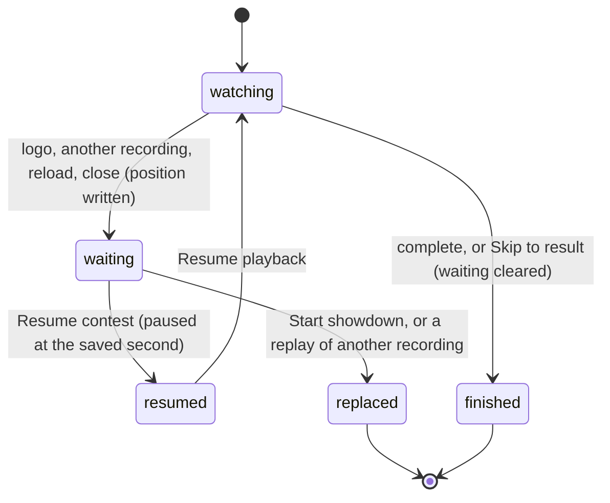

# Resume a contest

## Summary

Resuming lets a viewer come back to a Watch contest they left before it finished and pick up from where they were. This browser's save remembers one *contest waiting to resume*: its recording and the second of playback reached. While a contest is waiting, the Watch lobby shows the *resume banner* above the event dock:

> Saved at N seconds. Your result is waiting. **Resume contest**

**Resume contest** loads that recording paused at the saved second.

This document owns the waiting state and the banner, from the moment a contest is left unfinished until it is resumed, replaced or finished.

## The simple case

A viewer starts a counted Football entry, watches 40 seconds and closes the tab. The next day they open the Arena:
1. The Watch lobby shows the banner "Saved at 39 seconds. Your result is waiting." The saved second is whatever was last written, so it can trail slightly.
2. The chip does not yet include that contest's points.
3. They press **Resume contest**. The stage rebuilds for the recording and shows the moment they left, paused.
4. They press **Resume playback** and it continues.

## The interaction, event by event

### Starting

A contest becomes the one waiting to resume as soon as it is locked, at second 0. After that its saved second is updated:
- **Every 2 seconds of playback.**
- **When the viewer clicks the logo.**
- **When the page goes away**, whether by reload, closing the tab or navigating off the page.
- **When another recording is loaded.** Every recording that plays writes its own position, so a replay of anything takes over the waiting slot within its first moment of playback.

The saved second never goes past the recording's end. A write made at or after the end of the last attempt clears the waiting contest instead.

### Backing out at once

The banner can be ignored. The viewer can set up and start a different contest instead, and the new contest replaces the waiting one; the old one's points, if it was a counted entry, are then revealed. Nothing asks for confirmation.

### Committing

**Resume contest** commits. It loads the recording with the clock at the saved second, paused, and at **1×**. The stage rebuilds, and the banner and event dock disappear.

### While committed

The contest is an ordinary loaded recording; see [playback controls](playback-controls.md). It keeps writing its position every 2 seconds of playback.

### Resolving

When playback completes, the waiting contest is cleared and the points are revealed ([result and replay](result-and-replay.md)).

## What "waiting" hides

While a counted entry is waiting to resume, the page hides it exactly as it does during playback:
- its points are left out of the club points chip, Standings and member records
- the contest is left out of History

The chip's **entries left** already counts it ([written and revealed](../foundations/contests-and-recordings.md#written-and-revealed)). An exhibition hides nothing, because it has no points, but it still waits to resume and still hides from History.

## Modifiers

| Modifier | Set at the start | Changed while committed |
| --- | --- | --- |
| Input device | The banner's **Resume contest** is an ordinary button. | No effect. |
| Event and action combinations | The resumed recording's sport replaces the lobby's selected event. | Not applicable. |
| Contest kind | Exhibitions, counted entries and replays of finished recordings can all be waiting. The banner's wording, "Your result is waiting.", is the same for all three. | Not applicable. |
| Character card | The recording's own cards are loaded, whatever the lobby had selected. | Not applicable. |
| Presentation settings | No effect. | No effect. |
| Screen size and orientation | The banner wraps on narrow screens. | No effect. |
| Saved state | Only one contest can be waiting. The banner needs the recording to still be in this browser's save. | Starting another contest or replaying another recording replaces it. **Reset demo** removes it. |

## Cancel and interrupt

| Event | Before committing | While committed |
| --- | --- | --- |
| Escape or click outside | No effect on the banner. | Closes any open dialog; the resumed contest stays loaded. |
| Pause or resume | Not applicable. | A resumed contest opens paused. **Resume playback** starts it. |
| Repeated or rapid input | **Resume contest** can only be pressed once, because the banner disappears. | Not applicable. |
| A panel opens on top | The banner stays underneath. | The resumed contest stays paused, or keeps playing, behind the dialog. |
| Navigating away | The banner reappears whenever the lobby is shown. | As in [playback controls](playback-controls.md): a tab switch pauses, and the logo writes the position again. |
| Forced finish | Not applicable. | **Skip to result** completes the contest and clears the waiting state. |
| Focus leaves the game | No effect. | Hiding the tab stops the clock. |
| Reload, close, or back/forward cache | The banner is shown again on return. | The position is written as the page goes away, and the banner returns. |
| Settings or saved data change underneath | Another tab can replace or clear the waiting contest, by playing something or resetting. This tab's banner then follows the save it re-reads. | Another tab's playback writes its own position, and the last write wins. |
| Graphics or storage failure | If the saved recording can no longer be found, **Resume contest** does nothing. | If a position write fails, the error box reads **Playback could not be saved. Keep this tab open and export your recording.** |
| Input device changes | Not applicable. | Not applicable. |

## Interactions with other systems

**Points and the ledger.** A waiting counted entry's points are hidden until it completes or is replaced. Nothing is written or removed; only what is shown changes.

**Saved data and recovery.** The waiting contest and its second are part of the Arena save. They are exported with **Export local save** and removed by **Reset demo** ([this browser's save](../foundations/saved-data.md)).

**Watch and Play separation.** Play never writes a position; a Play match cannot be resumed.

**Devices and players.** No interaction.

**Sound.** Resuming does not change the Watch sound switch.

**Reduced motion and graphics quality.** No interaction.

**Accessibility.** The banner is plain text with a labelled button. It is not announced as a live region.

**Installed characters.** A waiting recording that uses an installed character needs that character in the library to show.

**Multiple tabs.** All tabs share the one waiting slot.

**Agent tools.** `read_arena` does not report a waiting contest.

## Edge cases

- **An exhibition shows "Your result is waiting."** too, though it has no points to reveal.
- **An abandoned replay of a finished contest** becomes the waiting contest. Its already-seen points are hidden again until it is finished.
- **Starting a new contest silently replaces** the waiting one, whose points then become visible, with no playback.
- **The saved second is rounded down** on the banner ("Saved at 39 seconds"), but resuming uses the exact saved moment.

## Open questions and verification

- Read from `Game.tsx` (the banner, `replay`, the clock subscription, `pagehide`) and `persistence.ts` (`savePlayback`, `commit`). `scripts/production-smoke.mjs` exercises **Resume contest** on the production page.
- **The banner for exhibitions and finished replays.** The banner wording for exhibitions and finished replays is misleading. It is probably a consequence of saving the position for every recording, not a design.
- **Losing a waiting counted entry.** A waiting counted entry being replaced without warning when another contest starts may deserve a confirmation. This is a product call.

Verified against Will-You-Be-My-Hero-Arena commit `3b4ec62`
