# The setup dialog

## Summary

The setup dialog is where the player decides who competes in a Watch contest, and locks it. It chooses:
- exhibition or counted entry
- which demo user "you" are
- the opponent
- both cards
- your strategy
- the tie rule
- for exhibitions, two cosmetic options

**Start showdown** then turns those choices into an immutable recording ([contests and recordings](../foundations/contests-and-recordings.md)).

The dialog opens from the Watch lobby, either from **Set up showdown** or by clicking either duel card. Its title is **Who’s stepping onto the court?** and its eyebrow names the sport and attempt count, for example **CORNHOLE · 4 ATTEMPTS EACH**. Its description reads "Choose the cards. Press Start showdown. Every move plays out automatically." It cannot be opened while a recording is loaded: the duel cards are disabled then, and **Set up showdown** is not shown. While this browser's save cannot be read, **Set up showdown** is disabled, and the box under the header explains why. The duel cards still open the dialog. **Start showdown** then cannot work, because there is no save to lock into (read from code, not tried).

## The simple case

On a fresh visit the dialog opens on **Exhibition · no points**, with these choices:
- **Your demo user** Doug, playing the Dan card
- **Opponent** Dan, playing the Doug card
- **Your strategy** **Steady · tighter grouping**
- **Tie rule** **Finish as a draw**

The review strip at the bottom reads "Exhibition. No leaderboard points. Unlimited matchups." and "Dan throws first · approximately N seconds". The player presses **Start showdown**. The button briefly reads **Locking the contest…**, the dialog closes, and the contest begins playing on the stage.

For points, the player chooses **Counted entry · points** instead. The opponent becomes **Scheduled opponent** with a name that cannot be changed, and the opponent's card becomes **LOCKED OPPONENT CARD**, always Doug. The review strip lists the points: "Win +3 · Draw +1 · Loss +0. Both users receive their result once."

## The interaction, event by event

```mermaid
stateDiagram-v2
    [*] --> choosing : Set up showdown, or a duel card
    choosing --> [*] : ×, Escape, click outside (choices kept in memory, nothing saved)
    choosing --> locking : Start showdown, or Start anyway
    locking --> choosing : refused (reason shown, nothing saved)
    locking --> closing : locked (recording and any points written)
    locking --> [*] : Escape (lock still finishes; plays once the stage is ready)
    closing --> [*] : dialog finished closing (playback may begin)
```

### Starting

The dialog opens showing the current choices, which live in memory for as long as the page is open. The first time, those are the defaults above. After that, they are whatever was last chosen, including the mode tab.

The sport is the one selected in the lobby's event dock, and the dialog offers no way to change it. For a counted entry, the dialog works out the scheduled pairing for this sport and user, and shows:
- **Scheduled opponent**: the other user in that pairing, or **No entry remaining**
- **N counted entries left** for your user. It reads 0 while **Counted entries enabled** is off, and never counts more than 4, one for each scheduled pairing.

**A counted entry waiting to resume.** If this browser's save has a counted entry waiting to resume, an alert sits above the review strip, on both tabs: **A counted entry is waiting. Starting this showdown reveals its result without playing it.** The start button then reads **Start anyway** instead of **Start showdown**. A waiting *exhibition* gives no warning; starting replaces it silently ([resume a contest](resume-a-contest.md)).

### Backing out at once

Closing the dialog with its ×, Escape, or a click outside saves nothing. The choices made so far are *not* reverted, though. They stay selected for the next time the dialog opens, and the lobby's duel cards already show the chosen cards. A reload forgets them.

### Committing

**Start showdown** commits, or **Start anyway** when a counted entry is waiting. The button is disabled, and reads **Locking the contest…**, until the lock finishes or is refused. A second click is ignored.

The dialog captures the choices and the current scoring policy, then locks the contest:
- **Exhibition.** A fresh random seed is used, or `velvet-paw-29` if **Replayable showcase seed** is ticked for Cornhole. Your chosen opponent and both chosen cards compete, and your strategy applies to your card. The opponent always plays Steady.
- **Counted entry.** The schedule decides the users, their order and the seed. Your card is your choice; the opponent's is Doug. Heat check and the showcase seed are never applied, even if they were ticked in exhibition before switching.

The new contest becomes the one waiting to resume, at second 0. If another contest was waiting, it is replaced. A replaced counted entry's points are revealed without it being played; that is what the warning above says.

### While committed

While locking, the dialog shows **Locking the contest…** and nothing else changes. Locking itself took about 0.6 seconds in the verification pass: the whole contest is simulated, checked and written in one step. Closing the dialog and rebuilding the stage for the recording can take much longer on a slow machine, and playback waits for both.

### Resolving

- **Locked.** The dialog closes. The recording loads on the stage, and it starts playing once *both* the stage is ready and the dialog has finished its closing animation. If the dialog was already closed while locking, it starts once the stage is ready. Ownership passes to [playback controls](playback-controls.md).
- **Refused.** The dialog stays open, the reason appears in red under the button, and nothing is saved. The same reason appears in the error box under the stage, with a **Dismiss** button. The possible reasons are listed in [contests and recordings](../foundations/contests-and-recordings.md#backing-out-at-once).
- **Already played.** If the counted pairing turns out to be played already, for example in another tab, no new recording or points are made. The existing recording loads and plays instead.

## Modifiers

| Modifier | Set at the start | Changed while committed |
| --- | --- | --- |
| Input device | Every control is a button, tab, list or checkbox, reachable with Tab. Card choices are buttons announced as "Select {card name}" with a pressed state. Game keys do nothing. | No effect. |
| Event and action combinations | The lobby's sport sets the attempt count, the estimate and whether **Replayable showcase seed** is offered: Cornhole only. The dialog cannot change the sport. | Not applicable: the sport was captured when **Start showdown** was pressed. |
| Contest kind | **Exhibition · no points**: free opponent and cards, and the two options **Heat check · cosmetic round label** and, for Cornhole, **Replayable showcase seed**, with no points. **Counted entry · points**: the scheduled opponent and order, the locked Doug card, points; **Start showdown** is disabled when no entry remains. | Not applicable once pressed. |
| Character card | Your collection lists every card your user owns: both built-in cards and every installed card. In exhibition, the opponent's collection lists theirs. Card traits affect the outcome, not the dialog. | Not applicable. |
| Presentation settings | No effect on the choices. The dialog's short fade-and-zoom plays whatever the Reduced motion setting. | No effect. |
| Screen size and orientation | The dialog is at most the window width minus 36 px, and at most 92% of the window height, or 94% at 600 px wide and below. It scrolls when the content is taller. | No effect. |
| Saved state | The counted tab depends on the save: the allowance used, which scheduled pairings are played, and whether **Counted entries enabled** is on in Arena settings. With it off, the tab shows **No entry remaining** and "0 counted entries left". On a fresh save the basketball pairings are already played, so counted basketball shows **No entry remaining**. A counted entry waiting to resume adds the warning and **Start anyway**. | Another tab's write can change these while the dialog is open (see below). |

## Cancel and interrupt

| Event | Before committing | While committed |
| --- | --- | --- |
| Escape or click outside | Closes the dialog. Nothing is saved, and the choices stay in memory. | Closes the dialog, and the lock still finishes. The contest then loads and starts playing by itself once the stage is ready. A refusal is shown only in the error box, because the dialog is gone. |
| Pause or resume | Not applicable: nothing is playing while the dialog is open. | Not applicable. |
| Repeated or rapid input | Clicking between the tabs, users or cards any number of times just changes the choice. Choosing your user as the current opponent moves the opponent to the first other user, in the order Doug, Dan, Sam, Riley. | A double-click or repeated clicks on **Start showdown** lock one contest. |
| A panel opens on top | Not applicable: the dialog covers the page, including the gear and footer. | Not applicable. |
| Navigating away | The main tabs and logo are covered, so the only way out is to close the dialog. If a browser agent calls `configure_arena_event`, the lobby's sport changes under the open dialog and its eyebrow, estimate and counted entry update. | The contest captured the sport when **Start showdown** was pressed; a later change does not affect it. |
| Forced finish | Not applicable. | Not applicable. |
| Focus leaves the game | No effect. | No effect: locking does not depend on focus. |
| Reload, close, or back/forward cache | The choices are forgotten. | Whether the contest was locked depends on whether the write had finished. If it had, the lobby offers it through the resume banner. |
| Settings or saved data change underneath | If another tab locks this counted pairing, the dialog updates to **No entry remaining** and disables **Start showdown**. The same happens if another tab resets the demo or changes the policy: the entries left, the review strip's points and availability follow. The waiting-entry warning also follows the save: it appears when another tab locks a counted entry, and goes when another tab finishes or replaces the waiting one. | If the save changed before this tab noticed, locking may be refused, for example with "Scoring policy changed. Review the setup again." It may also load the other tab's recording for the same pairing instead of creating a new one. |
| Graphics or storage failure | No effect before pressing. | If this browser's save refuses the write, for example because storage is full, the reason is shown and nothing is locked. |
| Input device changes | Not applicable. | Not applicable. |

## Interactions with other systems

**Points and the ledger.** The counted tab previews the policy's points. Pressing **Start showdown** on a counted entry writes both users' awards immediately; they are revealed only when playback is complete ([contests and recordings](../foundations/contests-and-recordings.md#written-and-revealed)). Locking any contest while a counted entry is waiting reveals the waiting entry's points at once, which is why the dialog warns first. How many entries each user has, and which pairings exist, belong to [points and entries](../club/points-and-entries.md).

**Saved data and recovery.** The choices are never saved. Locking is one protected write ([this browser's save](../foundations/saved-data.md)).

**Watch and Play separation.** The dialog is Watch-only. Play setup has its own choices, and neither affects the other.

**Devices and players.** No interaction; the "players" here are demo users, not devices.

**Sound.** No interaction. Watch sound, if on, plays once the contest starts.

**Reduced motion and graphics quality.** No effect on the choices or outcome.

**Accessibility.** The dialog has a title and description, and takes focus when it opens. The mode tabs, pickers and checkboxes are labelled. The review strip's summary and the error are text; the error has `role="alert"`, and so does the waiting-entry warning.

**Installed characters.** Installed cards appear in both collections for every demo user. Installing a character from The collection selects it as *your* card and turns off **Replayable showcase seed** ([Install character](../collection/install-character.md)).

**Multiple tabs.** Covered in the interrupt table. Only one tab can lock a given counted pairing.

**Agent tools.** `configure_arena_event` can change the sport while the dialog is open. The dialog itself offers nothing to agents ([agent tools](../cross-cutting/agent-tools.md)).

## Edge cases

- **Two counts at once.** **N counted entries left** counts across all sports. It can read "3 counted entries left" beside **No entry remaining**, because this sport's pairing is already played.
- **Changing the sport.** The player must close the dialog and choose another event in the lobby.
- **The lobby's duel cards and a counted entry.** The duel cards show your card and the *exhibition* opponent card, labelled **THROWS FIRST** and **THROWS SECOND**. In counted mode the real opponent card is Doug, and the order comes from the schedule. For example, Dan's and Riley's scheduled opponents throw first; Doug and Sam are first in their own pairings. The review strip's "{name} throws first" is correct; the lobby cards are not always.
- **Counted Doug against Doug.** A counted entry with your card set to Doug is Doug against Doug.
- **The opponent's strategy** is always Steady, and the dialog does not say so.
- **The estimate.** "approximately N seconds" is estimated from Dan's and Doug's timing whatever cards are chosen. For a tie rule with extra pairs it adds "+ extra pairs".
- **Hidden checkboxes stay ticked.** A ticked **Heat check · cosmetic round label** or **Replayable showcase seed** stays ticked when the option is hidden: after switching to counted, or to a sport other than Cornhole. It applies again when the option reappears.
- **The warning on the exhibition tab.** The waiting-entry warning and **Start anyway** also show on **Exhibition · no points**, because locking an exhibition replaces the waiting counted entry too.

## Open questions and verification

- Read from `components/arena/SetupDialog.tsx`, `Game.tsx` (`start`, `setupClosed`, `tryAutoPlay`), `persistence.ts` (`commit`, `availableEntry`) and `model.ts` (`SCHEDULE`). Not yet checked on the production page.
- Fixed: closing the dialog during **Locking the contest…** no longer leaves the new contest paused. It autoplays once the stage is ready (B-35).
- Fixed: replacing a waiting counted entry now asks first, with the warning and **Start anyway** (B-05).
- **Misleading duel cards.** The lobby's duel cards not matching a counted entry's real opponent card and order may confuse players. This is a product call.
- **Timing of the other tab's write.** Whether a change made in another tab reaches an open dialog before the player can press **Start showdown** depends on browser timing. This has not been tried.

Verified against Will-You-Be-My-Hero-Arena commit `364e3c1`
