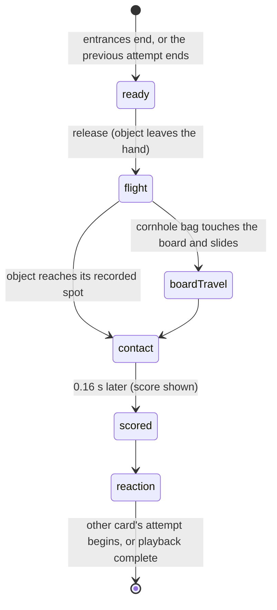

# The four sports

## Summary

Watch has four sports: **Cornhole**, **Football**, **Beer pong** and **Basketball**. In every one, two cards take turns at identical equipment in two side-by-side lanes. Each card has the same number of *attempts*, and the higher total wins. This document describes what a viewer sees in each sport: the attempts and their units, the rules and scoring, what the court, its nameplates and the *narration* say, how card traits and strategy show up, the heat-check round, the extra-pair tie rule, and what is special about each sport's stage.

Nothing here is decided during playback. The whole recording, every landing spot and every score, exists from the moment the contest is locked ([contests and recordings](../foundations/contests-and-recordings.md)). Playback, its controls and the result panel belong to [playback controls](playback-controls.md) and [result and replay](result-and-replay.md).

## The simple case

The viewer picks **03 Beer pong** in the lobby and starts an exhibition, Dan's card against Doug's. After the entrances, Dan's card stands in the near lane at the lower left with a rack of six yellow cups at the far end of its table. Doug's card stands in the far lane, higher up and drawn smaller, with six orange cups. The nameplates in the stage's top corners show Dan and Doug, each with a score of 0 and six pips.

Dan's card lines up, and the narration says "Dan lines up the next throw." The ball leaves the hand ("Dan sends it."), arcs down the table and drops into a cup. That cup vanishes from Dan's rack. A moment later Dan's nameplate shows 1 and loses a pip, and the narration reads "In the cup. That one leaves the rack." Dan's card celebrates, and then Doug's card takes its turn. After six shots each, the narration names the winning user and card, and the result panel appears.

## The four sports at a glance

| | Cornhole | Football | Beer pong | Basketball |
|---|---|---|---|---|
| Attempts each | 4 bags | 5 throws | 6 shots | 5 shots |
| Scoreboard count | "n/4 bags" | "n/5 throws" | "n/6 shots" | "n/5 shots" |
| Nameplate on the court | **N BAGS LEFT** | **N THROWS LEFT** | **N SHOTS LEFT** | **N SHOTS LEFT** |
| Equipment in each lane | A board with a hole | A target wall with rings painted **3**, **2** and **1** | A table with a six-cup rack: yellow cups for the first card, orange for the second | A hoop with a backboard |
| Scoring | Hole 3, bag resting on the board 1, anything else 0 | Inner ring 3, middle 2, outer 1, outside 0 | 1 per cup made | 1 per make |
| The throw | Underhand swing | Overhand throw | Short toss from chest height | Jump shot; the card leaves the floor |
| Release to contact | About 1.25 s | About 0.8 s | About 1.25 s | About 1.4 s |
| Specialty card | Dan | Neither built-in card | Doug | Neither built-in card |
| Lobby estimate | **~31 SEC** | **~32 SEC** | **~44 SEC** | **~38 SEC** |

Each attempt takes about 2 to 4.5 seconds from the start of the card's turn to the end of its reaction. A contest with no extra pairs runs from about half a minute (cornhole, football) to about three quarters of a minute (beer pong).

**House rules** shows the selected sport's three rules; the rest of that dialog belongs to [House rules](../club/house-rules.md). The rules read:
- **Cornhole:** "Quick arcade preset: four alternating throws each. Gross scoring, without cancellation." "Hole = 3, bag resting on the board = 1, floor = 0. Most board shots can push earlier bags, a cut kicks one aside, a roll curls around them, and an airmail or collect bag that drops in can carry bags into the hole with it." "Separate identical boards. Board contacts and displacements are recorded before playback. Starting order is locked."
- **Football:** "Five alternating throws each at identical target walls." "Concentric targets score 3, 2, or 1. Outside the outer circle = 0. A boundary belongs to its inner, higher-value zone." "The ball spirals to its recorded impact. There are no catches or bonus points."
- **Beer pong:** "Six alternating direct shots each, with a separate six-cup water rack. One point per cup made." "Made cups leave that player’s rack. The controller targets only remaining cups." "Direct shots only. A center crossing inside the cup opening scores; bounce shots and rim-outs score zero."
- **Basketball:** "Five alternating shots from identical marked positions. Every make is one point." "A descending ball clearing the inner hoop opening scores. Rim-outs, backboard misses, and airballs score zero." "The hoop and shooting distance are the same for both competitors."

## The court

The camera looks across the court from the side. The card listed **THROWS FIRST** plays in the near lane, lower on the screen. The card listed **THROWS SECOND** plays in the far lane, higher up, a little to the right and drawn smaller for depth. Both throw from left to right at their own equipment. Nothing crosses between lanes: each card's bags, balls and cups belong to that card alone.

**How the characters are drawn.**
- **Cornhole, Dan and Doug:** drawn in profile, facing the boards, on side-view rigs. The bag stays in the hand through the underhand swing and leaves it at the release.
- **Every other case:** drawn as a front-view cut-out puppet facing the camera, throwing across the court. This covers football, beer pong and basketball for every card, and any installed card in cornhole.

A cornhole contest between Dan's card and an installed card therefore shows one character in profile and one facing the camera. Watch never turns a character between the two views.

**The nameplates and sign.** The court draws its own labels; the page's own scoreboard is hidden, and only screen readers get it ([the stage](../foundations/stage.md#scaling)). A nameplate in each top corner (first card gold on the left, second teal on the right) shows the card's first name, its score, one pip per remaining attempt, and a status line such as "3 BAGS LEFT · BAG FLIGHT". A hanging sign in the middle shows the sport's name and the phase, such as "ROUND 2 · PAUSED". Both disappear for a moment while a ball or bag passes behind them.

## The interaction, event by event

The action narrated here is one attempt as the viewer sees it: ready, release, flight, contact, score, reaction.

### Starting

An attempt starts the instant the previous one ends, or when the entrances end for the first attempt. There is no gap between attempts. At that instant:
- **The nameplate** of the card now throwing brightens. The page's hidden scoreboard marks the same card for screen readers.
- **The status line** reads **READY**, then **ANTICIPATION** and **THROW** as the card winds up.
- **The narration** reads "{first name} lines up the next throw.", or "…next shot." in basketball.

Half the time or more, the card first performs a ritual from its personality, such as Dan's stare at the target or Doug's chest tap or hat adjustment. Doug does so more often than Dan. A ritual makes the wind-up longer.

### Backing out at once

The viewer cannot stop an attempt or change it. Pausing freezes the card mid-wind-up, and resuming continues from the same frame. **Skip to result** jumps past this and every later attempt. Leaving, reloading and resuming all return to the same moment of the same attempt ([playback controls](playback-controls.md)).

### Committing

The attempt commits, from the viewer's point of view, at the release: the bag or ball leaves the hand. The landing spot was fixed when the contest was locked; the release is only the moment the viewer can start to see it coming. At the release:
- a short release tone plays if Watch sound is on
- the status line reads **RELEASE**, then **BAG FLIGHT** in cornhole or **BALL FLIGHT** otherwise
- the narration reads "{first name} sends it.", or in cornhole names the shot: "Dan sends a blocker.", "Doug sends a flat hole-runner." (see [cornhole](#cornhole))

### While in flight

The object flies the arc stored in the recording:
- **Cornhole:** a bag that lands on the board touches down about 0.28 s before it stops, and slides. The status reads **BOARD TRAVEL** and the narration "{first name} watches the bag travel across the board." An airmail or high arc drops straight in without sliding.
- **Football:** the ball spirals into the wall.
- **Beer pong:** the ball drops toward one of the thrower's remaining cups.
- **Basketball:** the ball rises and descends on the hoop. Near contact, the front of the net is drawn over it.

At contact the status reads **LANDING**. The narration reads "{first name} waits for the bag to settle." in cornhole, and "{first name} watches the result." otherwise. This line lasts only 0.16 s at 1×. Unless effects are calmed, a ring bursts at the contact point, yellow if the attempt scored and orange if not. The camera also punches in slightly toward it; see [presentation settings](#modifiers).

### Scoring and reaction

The score appears 0.16 s after contact. At that moment:
- **The nameplate** shows the card's new total and loses a pip. The page's hidden scoreboard's count goes up by one ("2/4 bags").
- **The narration** shows the attempt's commentary (see [narration](#narration)).
- **The sound.** With Watch sound on, a bright two-note tone plays if the attempt added points, and a low tone if not.

The card then reacts: a celebration if the attempt added points, a disappointed gesture if not. The status reads **RESULT**, then **RESET**. When the reaction ends, the other card's attempt starts. After the last attempt, playback is complete.

**The finale.** The winner celebrates and a victory fanfare plays. The loser reacts. In a draw both cards react and there is no fanfare.

**Attempt history** lists an attempt from the moment of contact, 0.16 s before the nameplate shows its score. Each entry shows what it hit: "hole", "board", "miss", "zone3", "zone2", "zone1", "cup", "rim out", "make", "backboard" or "airball". It also shows the commentary and the points, signed: "+3", "+1", "+0", or "−1" for a cornhole bag that lowered its thrower's score.

## What each sport shows

### Cornhole

**Gross scoring, with moving bags.** A card's score is always the total of its own bags as they lie right now: 3 for each in the hole, 1 for each resting on the board. Nothing cancels, and the opponent's bags are on a separate board. The difference from the simple sum is that a later bag can move the same card's earlier bags:
- **A push.** A bag that lands on the board or in the hole can push up to two earlier board bags lying in its path. They slide forward a short way. A pushed bag can drop into the hole (1 becomes 3), stay on the board, or go off the back of the board (1 becomes 0).
- **A collect.** An airmail, or Dan's collect bag, that drops into the hole can carry earlier board bags lying near the hole in with it.
- **A kick.** A cut shot pushes like the others, but also knocks the bag a little to the side.
- **No contact.** Blockers, soft-touch bags, high arcs and roll bags never move other bags. A roll bag goes around them.

So a single bag can change the score by more than 3, or by less than its own value. When bags move, the commentary replaces the usual line: "{card name} moves the bags already on the board. Net +1." or "{card name} collects another bag into the hole. Net +5." "Net" is the change in the card's total. Pushed bags slide to their new spot over about a third of a second around the moment of contact, and a bag that leaves the board or drops in fades out.

**What stays on the board.** A bag resting on the board stays drawn until the recording is unloaded. A bag in the hole drops through and disappears. A bag that misses tumbles a little and fades out.

**Which shots each card throws.** The shot for each bag comes from the card's own habits, not from the viewer or the strategy:
- **Dan** mostly throws blockers and roll bags, then soft-touch bags and standard bags, and occasionally an airmail, a high arc or a collect.
- **Doug** mostly throws flat hole-runners and slides, then fast bags, and occasionally an airmail, a roll bag, a cut shot or a push shot.
- **An installed card** mostly throws standard bags and flat hole-runners, with the odd airmail, roll bag or slide, unless its pack brings habits of its own.

The narration names each shot on release: "a flat hole-runner", "an airmail", "a roll bag", "a slide", "a blocker", "a push shot", "a cut shot", "a high arc", "a soft-touch bag" or "a fast bag". A standard bag or a collect is called "the bag".

**Extras.** A bag dropping into the hole gets a second, bigger camera punch. For Dan and Doug it also gets a star burst, which follows their side-view throw. A bag that lands on the board raises a small dust puff. With Watch sound on, every bag's landing plays a low thud, whether it lands on the board or not.

### Football

The ball strikes the wall, drops away and fades within a second. The wall's rings are painted **3**, **2** and **1**. A ball exactly on a boundary scores the higher ring. There are no catches. The commentary names the ring that was hit (see [narration](#narration)).

### Beer pong

Each card aims only at cups still in its own rack. A made cup is removed from the rack the instant the ball reaches it, and the ball sinks where the cup stood. A ball that catches the rim bounces out as a rim-out, scoring nothing. Every shot is direct; there are no bounce shots. A card that makes all six cups ends with an empty rack.

### Basketball

Every shot is a jump shot from the same spot, and a painted ellipse marks the shooting area. A make drops through the net. A rim-out comes off the rim. A backboard miss is long and bounces back off the glass. An airball is short or wide and touches nothing.

> Technical note: the recording scores each landing spot in court units (`contactScore` in `lib/arena/simulation.ts`, lines 21–27). Cornhole: the hole is within 0.19 of its centre, the board 8 to 9.9 along the lane and within 0.52 across it. Football: rings at 0.25, 0.58 and 1.05 from the centre, each boundary inclusive. Beer pong: within 0.09 of a cup's centre is in, up to 0.16 a rim-out. Basketball: within 0.20 of the rim's centre is a make, up to 0.44 a rim-out, anything else long is a backboard miss and anything else an airball. Cornhole pushes and collects are in `resolveBoard` (`lib/arena/engine/events/cornhole/CornholeBoard.ts`).

## Narration

| Moment | Narration line |
|---|---|
| Entrances | "The cards are opening. Make some room." |
| Ready | "{first name} lines up the next throw." Basketball: "…next shot." |
| Release and flight | Cornhole: "{first name} sends {shot}." Other sports: "{first name} sends it." |
| Cornhole bag sliding on the board | "{first name} watches the bag travel across the board." |
| Contact, for 0.16 s | Cornhole: "{first name} waits for the bag to settle." Other sports: "{first name} watches the result." |
| Score, reaction | The attempt's commentary, below |
| Complete | "{user} takes it with {card's full name}’s card.", for example "Doug takes it with Dan Weidensaul’s card.", or "Honors shared. The rivalry continues." |

| Result | Commentary |
|---|---|
| Hole | "{card name}. Straight through the heart of it." |
| Board | "{card name} leaves one on the wood. It counts." |
| Miss, any sport | "A little ambitious. {card name} resets." |
| Football 3, 2, 1 | "Bullseye. Three points. The wall felt that.", "A clean spiral into the two-point zone.", "Outer ring. One on the board." |
| Cup | "In the cup. That one leaves the rack." |
| Rim-out | "It had a look… and changed its mind." |
| Make | "Nothing but net. One more." |
| Backboard | "Off the glass and away." |
| Airball | "The rim remains completely unbothered." |

The last scheduled attempt of the contest adds "Final scheduled attempt." before its line. Screen readers hear the narration as a polite live region ([accessibility](../cross-cutting/accessibility.md)).

## Traits, strategy, heat check and ties

**Card traits and strategy** never appear on the stage. They show only in where the attempts land:
- **Accuracy and consistency** tighten each card's grouping.
- **Specialty** tightens it in the card's own sport and loosens it slightly in the others: Dan's is cornhole, Doug's beer pong.
- **Composure** matters in the last scheduled round and in every extra pair. Doug's 84 steadies him; Dan's 60 loosens him a little.
- **Strategy.** Your card plays **Steady · tighter grouping** or **Bold · wider swings**, about a third wider. The opponent's card always plays Steady.
- **Rarity** gives no advantage.

The card's personality sets its entrance, rituals, reactions and tempo, so the same sport runs at a different pace with different cards.

**The heat check** (exhibition only) applies to round three, the third attempt of each card. The setup option is **Heat check · cosmetic round label**. Throughout both of those attempts, the bottom bar's right side reads **HEAT CHECK / COSMETIC**, except while paused, when it reads **PAUSED**. Round three counts as a bigger moment, so the cards lean toward showier rituals and reactions. No other stage effect is drawn, and no score changes. House rules says: "Heat check is a cosmetic round label on round three, for exhibitions only. It never adds points, and rarity gives no power bonus."

**The tie rule.** With **Finish as a draw**, a tie after the scheduled attempts ends as **HONORS SHARED.** With **Up to 3 extra equal pairs**, the contest adds one more attempt for each card, in the same order, while it stays tied, up to three pairs. The bottom bar keeps counting (**ROUND 5** in cornhole), cornhole's extra bags join the same boards, and beer pong continues on the cups left. The nameplates' pips and "N BAGS LEFT", and the hidden scoreboard's "n/N", count only the regulation attempts until the first extra pair begins. Then both cards' totals grow by one for each extra pair that has started, so the count never gives away a coming tie. A contest still tied after three extra pairs ends as a draw. The result then adds "/ Unresolved draw after three extra pairs". House rules says: "Default ties are draws. With **Up to 3 extra equal pairs**, a tie is followed by at most three extra pairs of attempts; both players always receive an attempt. A remaining tie is recorded as a draw."

## Modifiers

| Modifier | Set at the start | Changed while committed |
| --- | --- | --- |
| Input device | Not applicable: nothing on the court responds to input. The page's buttons work by mouse, touch or keyboard ([playback controls](playback-controls.md)). | Not applicable. |
| Event and action combinations | The sport sets the attempts, units, equipment, scoring, throw and narration wording. **Heat check** is exhibition-only. **Up to 3 extra equal pairs** can lengthen any sport. | Not applicable: a recording's sport and options are fixed at lock. |
| Contest kind | Exhibitions and counted entries play every sport by the same rules. A counted entry's order and seed come from the schedule, and its opponent card is Doug. A replay shows exactly the same attempts. Play practice has no football, beer pong or basketball, and Play cornhole has different rules ([the cornhole throw](../play/cornhole.md)). | Not applicable. |
| Character card | Traits shape the landings; personality shapes timing and acting; in cornhole the card sets the shot mix. Dan and Doug are drawn in profile in cornhole; installed cards face the camera in every sport. | Not applicable. |
| Presentation settings | **Reduced motion** or **Lower graphics quality** removes the camera punch and shake and the contact bursts, dust puffs and star bursts. **Reduced motion** also removes the entrance dust and plays calmer clips ([the stage](../foundations/stage.md)). The **clean spectator view** hides the narration; the nameplates and sign stay, because the stage draws them. Watch sound starts off. | Each applies at once; **Lower graphics quality** rebuilds the stage and continues from the same moment. |
| Screen size and orientation | The court scales as a whole, so every sport looks the same at any size. The page's scoreboard stays hidden at every width. | The court rescales; the attempt carries on. |
| Saved state | No effect on how a sport is shown. A resumed contest reopens mid-attempt with the bags, cups and scores exactly as they were. | No effect. |

## Cancel and interrupt

| Event | Before committing | While committed |
| --- | --- | --- |
| Escape or click outside | No effect on the attempt; Escape only closes a dialog. | No effect on the attempt. |
| Pause or resume | The card freezes mid-wind-up. The bottom bar reads **PAUSED**, in the heat-check round too, and the sign reads "ROUND n · PAUSED". Resuming continues the same wind-up. | The object hangs in the air, or the bag stops mid-slide. Any sound stops. Resuming continues the same flight; the landing never changes. |
| Repeated or rapid input | Speed changes only change how fast the wind-up plays. | At **2×** the 0.16 s contact line lasts 0.08 s; at **0.5×** every beat is twice as long. |
| A panel opens on top | The attempt continues behind the dialog. | The same. **Attempt history** lists it once it has made contact. |
| Navigating away | Switching tab pauses mid-wind-up. On return the stage rebuilds and shows the same frame. | The same, mid-flight. On a first viewing, the logo leaves the contest waiting to resume at that second; a replay is not kept. Another recording leaves a first viewing waiting at its last written second. |
| Forced finish | **Skip entrances** jumps to the first attempt's ready. **Skip to result** jumps past every remaining attempt and the finale. | **Skip to result** shows the final scores, boards and racks at once. |
| Focus leaves the game | Hiding the browser tab stops the wind-up until it is visible again. Window blur has no effect. | The same, mid-flight. |
| Reload, close, or back/forward cache | On a first viewing, the position is written. **Resume contest** reopens paused at that moment, mid-wind-up. A replay is not kept. | The same. The bags on the board and the missing cups are rebuilt from the recording. |
| Settings or saved data change underneath | Toggling **Reduced motion** calms effects at once. **Reset demo** unloads the recording. | The same. |
| Graphics or storage failure | A lost graphics context pauses mid-attempt; **Reload the arena** rebuilds the stage at the same second, still paused. If the cornhole side-view art fails its check, the cornhole stage does not open and the error box shows the reason, with **Reload the arena**. | The same, mid-flight. |
| Input device changes | Not applicable. | Not applicable. |

## Interactions with other systems

**Points and the ledger.** A sport's score never becomes club points directly. Only the win, draw or loss does. House rules says "Sports scores stay separate." The schedule has one counted pairing per sport for each pair of users ([points and entries](../club/points-and-entries.md)).

**Saved data and recovery.** The recording stores every attempt, including each cornhole bag's final position and each beer-pong rack. A resumed or replayed contest therefore rebuilds the court exactly ([resume a contest](resume-a-contest.md)).

**Watch and Play separation.** Only cornhole exists in both, and the two differ. Play puts every player's bags on one board, so a bag can knock an opponent's into the hole; Watch gives each card its own board. Play has four player-chosen shots and a charge meter; Watch has neither. Football, beer pong and basketball are Watch-only.

**Devices and players.** No interaction. Exactly two cards compete, and no device drives them.

**Sound.** With Watch sound on, each card's entrance plays a low two-note chord, each release plays a tone and each cornhole bag thuds on the board. Each score plays a bright or low tone, and a decided contest ends with a fanfare. Football, beer pong and basketball contacts make no sound of their own ([sound](../cross-cutting/sound.md)).

**Reduced motion and graphics quality.** Either one removes the camera moves and contact effects in every sport. Scores, timing and outcomes are unchanged ([the stage](../foundations/stage.md)).

**Accessibility.** The narration and the commentary say what each attempt hit. The scoreboard is text. The positions of the bags on a board, and which cups are left in a rack, are shown only on the court ([accessibility](../cross-cutting/accessibility.md)).

**Installed characters.** An installed card competes with its pack's accuracy, consistency, composure and specialty. It is drawn facing the camera in every sport, and in cornhole it throws the standard mix of shots. The narration uses its name ([Install character](../collection/install-character.md)).

**Multiple tabs.** No interaction beyond this browser's save.

**Agent tools.** `configure_arena_event` selects one of the four sports in the lobby. `read_arena` reports the sport by its code name, where beer pong is `pong`, together with the revealed score ([agent tools](../cross-cutting/agent-tools.md)).

## Edge cases

- **Extra pairs appear when they begin.** A cornhole contest that will need one extra pair shows four pips and "0/4 bags" until the first card's fifth bag begins. Then both cards gain a pip and the totals read out of 5, at the same moment, so the second card's nameplate goes from 0 to 1 bag left before its turn.
- **"Final scheduled attempt."** marks the second card's last scheduled attempt even when extra pairs follow. When that bag moves other bags, the push or collect line replaces the whole commentary, prefix included.
- **A cornhole bag can lower its thrower's score.** Pushing an earlier bag off the back of the board can make the net change 0 or negative. The commentary then reads, for example, "Net -1.", and **Attempt history** shows "−1".
- **"another bag"** is used even when an airmail collects two.
- **Beer pong's narration says throw.** The page and the nameplates count shots, for example "6 SHOTS EACH" and **6 SHOTS LEFT**, but the narration says "lines up the next throw."
- **An empty rack in extra pairs.** If both cards make all six cups and tie 6–6, every extra ball is a miss, and the contest ends as an unresolved draw.
- **Pausing in the heat-check round** shows **PAUSED** in the bottom bar, as in any other round. **HEAT CHECK / COSMETIC** returns on resume.
- **Heat check changes timing, not scores.** The same seed with and without the heat check gives the same attempts and scores. The acting from round three on, and so the contest's length, can differ.
- **"Reset. Next throw."** appears only in a gap between attempts. Recordings leave none, so it is not normally seen.
- **An imported asset mapping** for Dan or Doug does not change how they look in cornhole, where the side-view rig is drawn instead ([asset mapping](../collection/asset-mapping.md)).

## Open questions and verification

- Read from `lib/arena/model.ts` (`EVENTS`), `simulation.ts` (`contactScore`, `simulate`), `CornholeBoard.ts`, `match-timeline.ts`, `MatchNarration.ts`, `ArenaScene.ts`, `ArenaHud.ts`, `Equipment.ts`, `ImpactEffects.ts`, `CameraEffects.ts`, `BattleDirector.ts`, `Game.tsx` and `Panels.tsx`. Durations, draw rates and the heat-check timing difference were checked by running the simulation in a disposable bundle. Nothing has been checked on the production page. `tests/engine-tests.mjs`, `tests/sport-mechanics-tests.mjs` and `tests/browser/presentation.spec.ts` run against the engine or the Lab.
- Fixed: the scoreboard and nameplate totals count extra pairs only once they begin (B-31).
- Fixed: attempt history signs negative scores as "−1" instead of "+-1" (B-36).
- Fixed: beer pong's page unit is shots, matching the nameplates (B-36). The narration's "next throw" is unchanged.
- Fixed: House rules now says most board shots push, a cut kicks a bag aside, a roll curls around them, and an airmail or collect bag that drops in can carry bags into the hole with it, matching the recording (`CornholeBoard.ts`, lines 91–108) (B-36).
- Fixed: the setup option is now **Heat check · cosmetic round label**, which matches what is drawn: the bottom-bar label and livelier acting (B-36).
- Fixed: pausing in the heat-check round shows **PAUSED** (B-35).
- **The vanishing cup.** A made cup appears to disappear the instant the ball arrives, before the ball has sunk. This has not been watched at normal speed.
- **The mapping and the side-view rig.** Whether an imported mapping for Dan or Doug is really invisible in cornhole is read from the rig choice by card, and has not been tried.

Verified against Will-You-Be-My-Hero-Arena commit `364e3c1`
