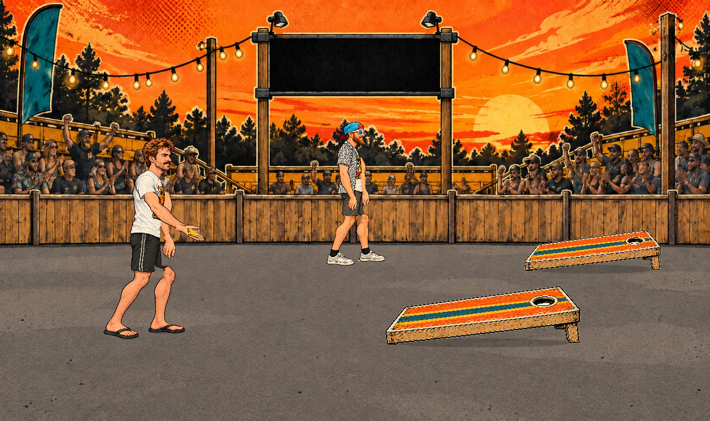
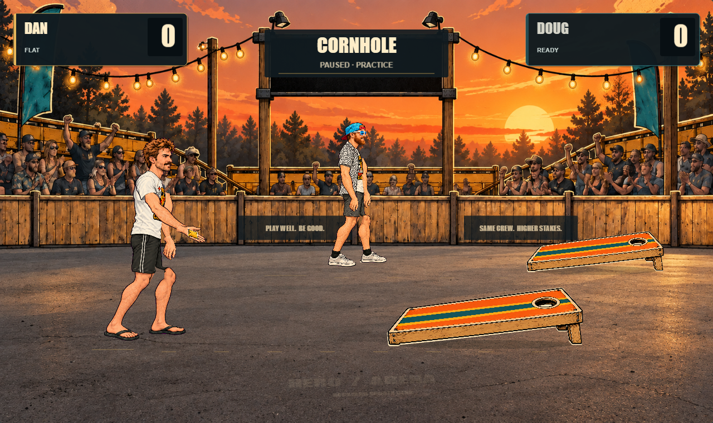
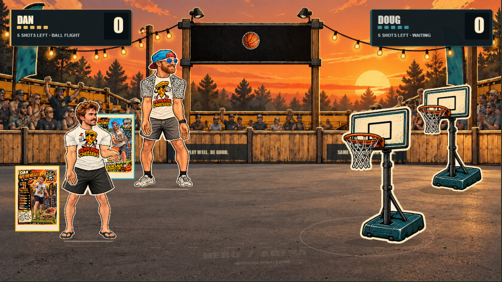
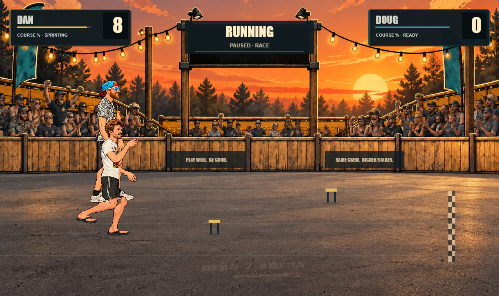
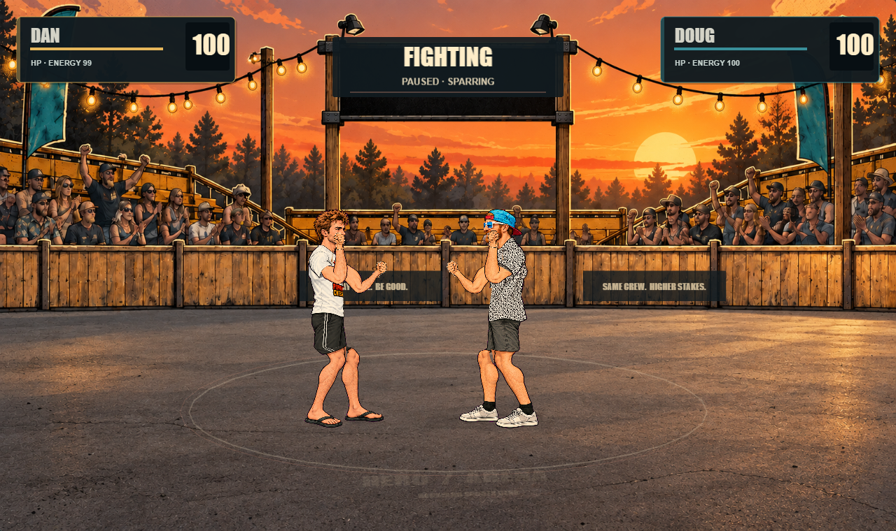

# Arena presentation polish — 15 September 2026

The reference image guided lighting, visual hierarchy and staging. This pass preserves the existing characters, artwork identity, rigs, movement, physics, event outcomes and selection flow.

## Open and review

- [Player application](http://localhost:3001/): choose **Watch**, select an event and use **Set up showdown**. **Play** retains the existing direct-control events.
- [Current LoongBones court](http://127.0.0.1:3010/human-motion/?event=cornhole&actor=dan&take=primaryAction&focus=arena): press **Play** to review the existing motion against the polished environment. Select Running, Basketball or Fighting in the workshop for the other proof events.
- [Recorded cornhole](http://127.0.0.1:3010/?scenario=cornhole-recorded&checkpoint=release): deterministic release checkpoint.

These are local previews. No publication or production rig migration was performed. Watch/Play retain their existing rigs; the Human Motion Lab retains its separately authored LoongBones performance pack and existing editor-verification boundaries.

The [MP4 review](../../../../Arena-Presentation-Review.mp4) contains actual cornhole, running, basketball and fighting footage. Only the paused recorder preroll is removed; motion is not interpolated or generated. Every encoded frame was decoded for verification.

## What changed

- A derived sunset background keeps the camera, barrier, crowd layout, string lights and central sign registered. Quieter distant contrast, warm directional floor light and restrained wear improve depth.
- A cleaner cornhole board finish retains the orange/gold/teal striping. The generated image was not geometrically identical: its source dimensions and measured hole center are explicitly mapped into the original board coordinates. Scoring geometry is unchanged; the two registered holes match to less than 0.001 world pixels in the browser test.
- `ArenaTheme`, `ArenaHud` and `ArenaEnvironment` provide shared typography, palette, panels, contextual action feedback, sparse court markings and signage. The floor logo remains deliberately faint.
- The HUD displays authoritative scores, remaining attempts, current phase and relevant health/energy or course progress. Four-player Play uses compact paired rows. Charging meters exist only during the corresponding action state.
- Projected projectile bounds temporarily clear overlapping HUD zones. The basketball apex exposed this issue during pixel review; a regression test now checks that the header clears the ball and returns afterward. Close-up and neutral character inspection hide the presentation HUD.
- The Human Motion Lab uses small layered contact shadows that attenuate as the character leaves the ground. Existing warm character tint and linework are preserved.
- Player navigation, side panels and workshop controls use the same restrained visual tokens. DOM score/meter text remains accessible while the shared canvas HUD provides the visual presentation. Desktop and portrait-phone checks cover layout and interaction; landscape gives more space for fine in-court labels.
- The development server ignores temporary QA/build folders. Its previous watcher crashed with Windows `EBUSY` while reports were being written; these files are not application source.

## Actual renderer screenshots

Before / after use the same Dan cornhole take at 1.1 seconds, camera, viewport and runtime.

## Validation and regression review

| Check | Result |
|---|---|
| TypeScript | Passed |
| Simulation suite | 170,688 checks; 2,000 seeded contests passed |
| Input, recorded events, lifecycle, motion contact and presentation browser suite | 27 passed; opt-in pixel test skipped in this run |
| Final presentation tests including projectile/HUD occlusion | 4 passed |
| Reviewed pixel baseline comparison | Passed after four intentional event-image updates; both character inspection baselines unchanged |
| Player screens | Desktop 1440×1080 and phone 390×844 Play/Watch; no horizontal overflow, one canvas, no page errors |
| Four-player Play | All four scores visible; separate accessible score records retained |
| Production build and smoke | Passed; Play and Watch functional, practice save unchanged, Lab globals absent from production |
| Before/after state comparison | All ten captures preserve event, character, projectile and input state |
| Close camera / motion | Dan and Doug close views; continuous four-event capture and decoded frame review |

The full historical browser suite was not rerun. This pass ran the suites covering the shared presentation, all existing recorded sports, input cleanup, runtime lifecycle and current contact/gait behavior. No animation curves, rigs, contacts, scoring policy, simulation or controller decisions were retuned.

The first pixel comparison correctly failed because the four event frames changed. Actual/diff images were inspected before baseline replacement; the basketball occlusion was fixed before accepting its new image. Old baselines remain in the ignored QA evidence folder.

## Performance

No rendering engine, shader stack or animation library was added. The background retains its 1672×941 resolution; character mesh/triangle counts are unchanged. The HUD avoids regenerating text textures when visible content is unchanged. Scene cleanup destroys its containers and generated text textures.

The initial before and after real-time samples were roughly 59–60 FPS. Two later four-event runs measured roughly 42–52 FPS. A same-session ABBA diagnostic, alternating the real presentation with a browser-only suppression of its HUD/decor, then measured 59.97 / 59.97 / 59.89 / 60.08 FPS. That controlled comparison did not reproduce a presentation-dependent slowdown; the cause of the slower runs is not established. They remain in the evidence, and no universal 60 FPS or phone/GPU performance claim is made.

The ABBA diagnostic uses the same mechanics, character rig, new background, viewport and warm-up, with V8 profiling in both modes. Its control is a render-layer ablation, not a recreation of the old application. Raw timing, CPU-profile summaries, counters and comparison conditions are in `work/qa/presentation-pass/`.

## Maintainer references

- Shared data/presentation: `lib/arena/engine/presentation/`
- Player/workshop interface stylesheet: `public/assets/arena-interface.css`
- Exact asset hashes, dimensions, reviewed baseline changes and state comparisons: [evidence.json](evidence.json)
- Image-generation prompts: [asset-prompts.json](asset-prompts.json)
- Capture scripts: `scripts/review-presentation*.mjs`
- Targeted tests: `tests/browser/presentation.spec.ts`
- Performance diagnostic: `scripts/profile-presentation-cost.mjs`
- Raw artifacts and test results: `work/qa/presentation-pass/`

Keep original environment/equipment files intact. Asset appearance registration belongs beside the presentation asset data; do not move the actual target/hole to compensate for generated imagery. HUD state must continue to come from revealed recordings or the live event view. Presentation cues never award points or advance gameplay.
